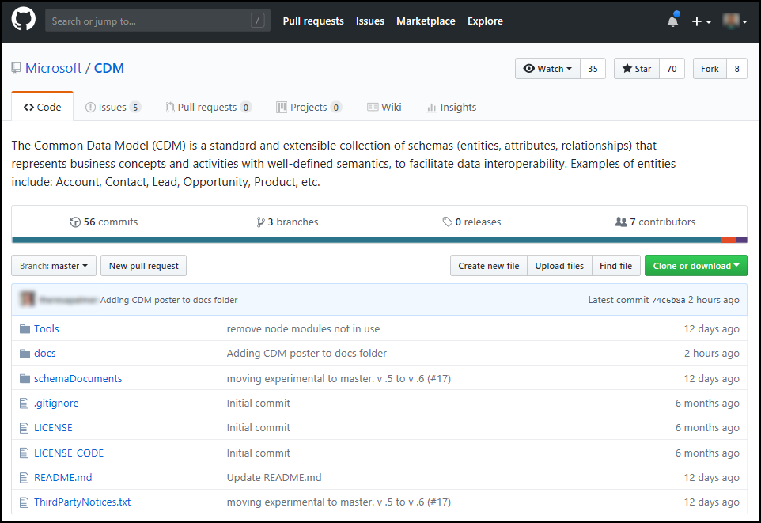

# Development using the Common Data Model

The **Common Data Model (CDM)** is a standardized collection of data elements
(called *entities*) that represent commonly used concepts and activities across
business and application domains. You can use no- or low-code development
options available with the CDM to get your organization’s data into a CDM
store, and thereby streamline how you build applications, share data, and get
ready-made insights from your data. CDM is also extensible, so you can create
custom entities that reflect the unique needs of your organization.

When your data is in the CDM, you can quickly build applications and
integrate data inside your organization and with partners. Additionally,
ready-made apps and insights based on the CDM are available to quickly
expand upon the use and insights of your data.

A corresponding service called **Common Data Service (CDS) for Apps** stores
data that conforms to and is based on data that is in the CDM. CDS for Apps
enables you to leverage and act upon your CDM-conforming data with prepackaged
Microsoft solutions, apps, and your own custom solutions.

The following image shows how applications build on the CDM and the CDS
for Apps enables you to expand upon and leverage your data.

## The Common Data Model and CDS for Apps development options

You can get data into the CDM from a variety of sources, using any of the
development tools available. For low- or no-code solutions, you can use the
CDS for Apps and map data into entities using a graphical step-by-step
process. Or you can use API-based approach based on the CDM GitHub repository.

There are development features and advantages to using the CDM and the CDS
for Apps that are common to both approaches. In the next section, we look at
development features that are common to either approach.

Then in the two subsequent sections, we investigate using low- or no-code
development first, then discuss using the GitHub repo.

## Common development features 

Whether using a low-code approach or using the GitHub repository, the following
features of using the CDM apply:

-   **Definition of standard entities**: Your data is defined in ways that is
    standard and well-known, opening opportunities to extend its use and
    interoperation, and leverage offerings based on that well-known schema of
    entities.

-   **Data integration**: You can use Power Query to import and visually
    transform your existing data, whether online or on-premises, and see your
    data and analytics from a holistic perspective.

-   **Extensibility**: You can extend entities, or create your own, without
    breaking interoperability with other apps or offerings.

-   **Dependability**: Since the common entities are well known, you can build
    reusable components bound to entities, and know that their definitions and
    formats will be robust over time.

-   **Entity consistency across deployments**: You can connect to different
    solutions that adhere to the CDM and know that interoperability will just
    work, such as connecting a calendar appointment in Microsoft Outlook with a
    sales opportunity in your custom application.

Now let’s look at the two primary development approaches, starting with the
graphical and step-by-step approach offered in the low- or no-code development
environment.

## Low- or no-code development solutions for CDM and CDS for Apps

You can bring your data into the CDM format using low- or no-code solutions.
To do this, you use the CDS for Apps and map your data to new entities,
using the online steps based on Power Query functionality that’s built into
the CDS for Apps and made available through PowerApps.

Some of the advantages of the low- or no-code approach are the following:

-   **Leverage packaged business applications** – many Microsoft Dynamics
    solutions, and many third-party applications, are built on top of (or at
    least leverage) the CDS for Apps. When your data is in
    the CDM, you can take advantage of those packaged applications.

-   **Gain access to customized solutions** – an ecosystem of extensions and
    complete applications, created by developers who understand and work with
    data in the CDM format – exists. See [introduction to
    solutions](https://docs.microsoft.com/powerapps/developer/common-data-service/introduction-solutions)
    for more information.

To get started, you can map your data to entities, as shown in the **Map
Entities** screen in the following image.

Once your data is in the CDM, using the CDS for Apps to get it there, you can
use services that automate your business processes (again, in a graphical
environment) by using **Microsoft Flow**. To see Flow in action, take a look at
[create a flow that uses the Common Data
Service for Apps](https://docs.microsoft.com/flow/common-data-model-intro).

For more information, and the steps you can take to map your data into CDM
entities using the CDS for Apps, see [Add data to an entity in the Common Data
Service for Apps by using Power
Query](https://docs.microsoft.com/powerapps/maker/common-data-service/data-platform-cds-newentity-pq).
For information about CDS for Apps, see [What is Common Data Service for
Apps](https://docs.microsoft.com/powerapps/maker/common-data-service/data-platform-intro).

## Using the Common Data Model GitHub repository

The CDM public **GitHub repository** is an open-source collection of entity
definitions and standards.

You can use the GitHub repository to contribute to the effort, and to get the
standardized definitions of entities for use in developing your own solutions to
getting your data into the Common Data Model schema format.

For more information, visit the CDM GitHub
repository: [https://github.com/Microsoft/CDM](https://github.com/Microsoft/CDM)

## Next steps

Whether you use a low- or no-code approach to getting your data into the CDM, or
use the CDM GitHub repository, you’ll have more opportunity to leverage your
existing data and gain access to services and solutions that will amplify what
your data can do for your organization.

The following links provide additional information, based on your development
approach:

**No- or low-code development**:

-   [What is the Common Data Service (CDS) for
    Apps?](https://docs.microsoft.com/powerapps/maker/common-data-service/data-platform-intro)

-   [Add data to an entity in the CDS for Apps by using Power
    Query](https://docs.microsoft.com/powerapps/maker/common-data-service/data-platform-cds-newentity-pq)

-   [Introduction to
    solutions](https://docs.microsoft.com/powerapps/developer/common-data-service/introduction-solutions)

-   [Build a model-driven
    app](https://docs.microsoft.com/powerapps/maker/model-driven-apps/model-driven-app-overview)

-   [Build a canvas
    app](https://docs.microsoft.com/powerapps/maker/canvas-apps/getting-started)

-   [Create a flow that uses CDS for Apps](https://docs.microsoft.com/flow/common-data-model-intro)

**The Common Data Model GitHub repository**:

-   [https://github.com/Microsoft/CDM](https://github.com/Microsoft/CDM)

