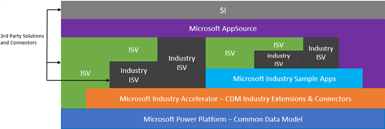

# Industry Accelerators

The Common Data Model originated from Microsoft Dynamics, as you can see from the current and growing set of entities around Sales, Service, Marketing and more. However the benefit of a common schema is generally applicable to applications in a variety of industries. We’re working closely with a set of prioritized industries to make the CDM more relevant to them, through Industry Accelerators. 

The [Industry Accelerators](https://community.dynamics.com/365/b/dynamics365isvsuccess/archive/2018/08/01/dynamics-365-brings-industry-focus-through-the-microsoft-power-platform-and-solution-accelerators) are foundational components within the Microsoft Power platform and Dynamics 365 that enable ISVs and other solution providers to quickly build industry vertical solutions. The accelerators extend the Common Data Model (CDM) to include new entities to support a data schema for concepts within the specific industries. We are focused on delivering accelerators for the following industries (but not limited too):
-	Automotive (Manufacturing)
-	EDU (Higher Ed / K-12)
-	Retail
-	Financial Services (Credit Union, Banking, Wealth Management)
-	Nonprofit
-	Health
-	And others

## ISV Opportunity View
The Microsoft Power Platform and the Dynamics 365 Industry Accelerators combine to create a unique opportunity for ISV’s to provide solutions for different scenarios and levels of build out. Below is a view of the opportunities for ISV’s who build on top of the platform and the accelerators. 

As you move up the stack there are multiple opportunities on how ISV’s can deliver industry focused apps and solutions. This can exist whether you are building directly on Power Apps (CDS) or Customer Engagement. As you can see, each level enables the next levels opportunities to extend further. The accelerators provide opportunities to rapidly build vertical industry focused apps as well as enabling SI’s who can help scale and support these new apps and solutions.

## The Dynamics 365 Health Accelerator

The [Dynamics 365 Health Accelerator](https://appsource.microsoft.com/en-us/product/dynamics-365/msemr.healthcarecommondatamodel?tab=Overview) is the first of such accelerators and is based on the FHIR HL7 3.0 specification. The Health Accelerator is a collaborative effort including but not limited to, the Dynamics 365 CDS, ISV Success, CDM, Connector and Analytic teams, the Microsoft Health Vertical, Marketing, OCP and industry ISVs, SIs and Partners.
The initial release of the Health Accelerator (announced in July 2018 at Ignite) provides:
-	Extending the Common Data Model to include concepts for Health, including entity definitions & relationships
-	OOB Customer Engagement Forms such as Patient, Practitioner, Related person and more, which can be leveraged or enhanced
-	OOB UCI Application to provide a sampling of what is possible
-	Support for building Power App Canvas and Model Driven Applications
-	Support to extend the model (new entities, forms, relationships) as need to meet your business needs
-	Support for Analytics
-	Installable AppSource solution for CDS 2.0
In future releases we will be looking at enabling AI scenarios and providing a baseline for doing AI on Dynamics 365 Accelerators.

Get more details on the Health Accelerator [here](https://community.dynamics.com/365/b/healthaccelerator/archive/2018/07/19/dynamics-365-health-accelerator-solution-first-look). 

## More Coming Soon…
We continue to release new and updated accelerators for the industries identified above. Please check back for the latest releases!

## Interested in Participating?
For those who are interested in chatting directly, please sign up [here](https://experienceisv.microsoftcrmportals.com/engage/). We would love to hear from you and listen to your feedback, suggestions and challenges.
