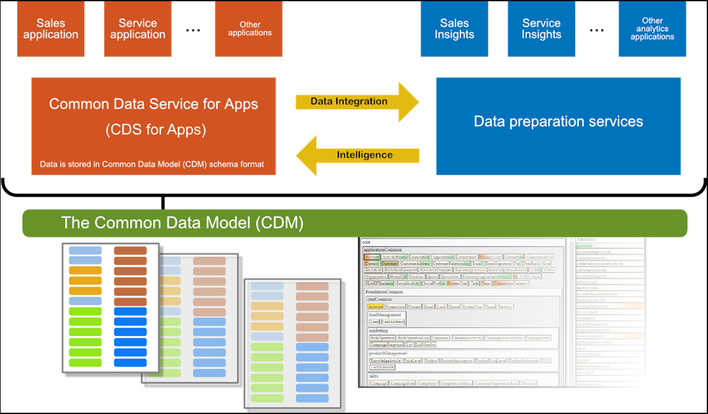

# Common Data Model Overview

The Common Data Model (CDM) provides a library of entities that represent commonly used concepts and activities across a variety of business and application domains. Out-of-the-box, CDM offers well-defined, modular, and extensible business entities such as Account, Business Unit, Case, Contact, Lead, Opportunity, and Product, as well as interactions with vendors, workers, and customers, such as activities, cases, and service level agreements. 

With CDM at the center of the Common Data Service for Apps and the Common Data Service for Analytics, packaged applications and analytical solutions can work with well-defined entity shapes and share data, irrespective where data is originally coming from or mastered. At the same time, bespoke line of business apps and customized analytical solutions can leverage the same entities and share data, and thereby support the specific needs of your business requirements. The Common Data Model simplifies the challenges of data management and data semantics.

The Common Data Model is fully extensible - you can add fields to any of the entities that come with the CDM, or create your own custom entities. The CDM standard defines a common language for business entities covering customer relationship management (CRM), marketing, product services, and will expand to enterprise resource planning (ERP), finance & operations, and additional areas over time. The goal of CDM is to enable data interoperability spanning multiple channels, service implementations, and vendors.

The Common Data Model and Common Data Service provide a rich and productive development platform through the following features:

- **Common data model** The common data model is a library of entities that represent the most commonly used entities across business and productivity applications. This can be found at: [github.com/Microsoft/CDM](https://github.com/Microsoft/CDM)
- **Data import** You can quickly and easily import data from your existing systems using a built-in browser-based Power Query experience for seamlessly and visually transforming and combining data from cloud and on-premises sources; including out-of-box and extensible data integration templates as accelerators.
- **Extensibility** You can extend the entities without breaking data sharing with other apps.
- **Robustness**  Because you can depend on common entities, you can build reusable components that are bound to the entities. The Common Data Model includes a design for extensibility and versioning that protects your development investment.
- **Unification** Your solutions can connect information from productivity platforms with data from business applications. For example, you can connect a calendar appointment or a Microsoft Outlook task with a sales opportunity. 

The Common Data Service for Apps provides several key capabilities over the Common Data Model including:

- **Packaged applications**: Dynamics 365 apps like the Marketing, Sales, Service, Talent, Finance and Operations apps to transform your business.
- **Customize applications and build native extensions for you needs**: Customizers and developers distribute application solutions so that organizations can use the Common Data Service for Apps to install and uninstall the business functionality defined by the solution.
<!-- - **Build model-driven apps and canvas apps with PowerApp**s: For information about creating apps with the Common Data Service and PowerApps, see [Overview of building a model-driven app](../model-driven-app-overview.md). Link will be broken until Matt P merges his PR -->
- **Automate business processes with Flow**: For information about creating a flow that uses the Common Data Service, see [Create a flow that uses the Common Data Service](/flow/common-data-model-intro).
- **Security**: The Common Data Service manages access to data in the database and conforms to the security models of the enterprise. For more information, see [Security concepts](/dynamics365/customer-engagement/admin/security-concepts).
- <!-- TODO: Need a better link here if there isn't a corresponding topic in the PA site -->
