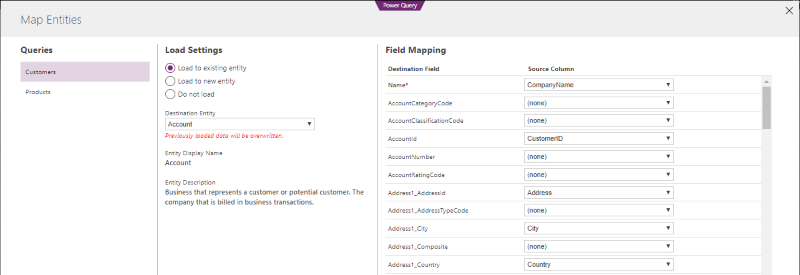

# Common Data Model overview

The **Common Data Model** (CDM) is an open-sourced definition of standard entities that represent commonly used concepts and activities across a variety of business and application domains. The Common Data Model offers *well-defined, modular, and extensible* business entities such as Account, Business Unit, Case, Contact, Lead, Opportunity, and Product, as well as interactions and relationships between vendors, workers, and customers, such as activities and service level agreements. 

Microsoft’s [Common Data Service for Apps](../maker/common-data-service/data-platform-intro.md) and the Common Data Service for Analytics <!-- TODO add link when available  --> implement the Common Data Model. These services hold data that conforms to the Common Data Model definition. By building on top of these services, packaged applications and analytical solutions can work with well-defined entity shapes and share data, irrespective of where data is originally coming from or mastered. Custom line-of-business apps and analytical solutions can leverage the same entities for data sharing, and thereby support your specific needs and business requirements. 

Microsoft and our partners are committed to building our applications on top of the Common Data Service and storing your business data in CDM form. There is a *large and growing collection of solutions that work together efficiently when data is stored in CDM form*, which means you can quickly implement new business processes and gain insights into your business operations without friction or complexity. The following diagram shows Applications on top of Common Data Services leverage Common Data Model entities.

The Common Data Model simplifies the challenges of data management by unifying data in a known form with *structural and semantic consistency across applications and deployments*. It helps integrate and *disambiguate data* collected from business processes, digital interactions, product telemetry, people interactions, and so on. 

Data stored in the Common Data Service for Apps *integrates easily and automatically* with the Common Data Service for Analytics for customers who use both services. You can start from enterprise and transactional data you already own (such as leads, campaign information, previous customer purchases) and combine with data from other sources (such as weblogs or product telemetry) to get a unified picture.

The Common Data Model is also *extensible* - you can add fields to any of the customizable entities that come with the CDM or you can create your own custom entities. The CDM standard defines a common language for business entities covering the full range of business processes across sales, services, marketing, operations, finance, talent and commerce and for the customer, people and product entities at the core of a company’s business processes. The Common Data Model facilitates data interoperability spanning multiple channels, service implementations, and vendors.

The Common Data Model and Common Data Service provide a rich and productive development platform through the following features:

- **Definition of standard entities** – The Common Data Model provides a definition of entities that represent the most commonly used entities across business and productivity applications. The public CDM GitHub repository [(https://github.com/Microsoft/CDM)](https://github.com/Microsoft/CDM) will be continuously enhanced with core entities spanning the entire business process landscape, additional vertical industry data models, and cross-spanning sources such as surveys, search engines, and product telemetry.
- **Data integration** – Use Power Query as built-in web experience to import and visually transform data from your existing systems, and to combine data from online and on-premises sources with no-code or low-code. Your Excel and Power BI data transformation skills apply seamlessly. See [Add data to an entity in the Common Data Service by using Power Query](../maker/common-data-service/data-platform-cds-newentity-pq.md).
    
    When you import data into the Common Data Service, you can map it to standard Common Data Model entities or create and map to new entities. Out-of-the-box data integration and mapping templates simplify connecting to common data sources such as Salesforce. These mapping templates are fully customizable and extensible. The following screenshot shows importing external data and mapping it to standard entities in Power Query. 
    
     

- **Extensibility** – You can extend the entities without breaking data sharing with other apps.
- **Dependability** – Because you can depend on common entities, you can build reusable components that are bound to the entities. The Common Data Model supports extensibility and versioning that protects your development investment.
- **Entity consistency across deployments** – Your solutions can connect information from productivity platforms with data from business applications. For example, you can connect a calendar appointment or a Microsoft Outlook task with a sales opportunity. 

The [Common Data Service for Apps](../maker/common-data-service/data-platform-intro.md) implements the Common Data Model, permitting business application development to:

- **Leverage packaged business applications** – Dynamics 365 for Marketing, Sales, Service, Talent, Finance and Operations applications, as well as third-party applications leverage and/or are built on top of the Common Data Service for Apps.
- **Customize applications and build native extensions for your needs** - Customizers and developers distribute application solutions with a well-defined application life cycle. Solutions are how applications and extensions are distributed. See [Introduction to solutions](../developer/common-data-service/introduction-solutions.md).
- **Build no code/low code, model-driven and WYSIWYG canvas apps with PowerApps** - Use the same shared entities created/used by the packaged applications or by other third-party applications and create additional stand-alone apps. See: 
    - [Build a model-driven app](../maker/model-driven-apps/model-driven-app-overview.md)
    - [Build a canvas app](../maker/canvas-apps/getting-started.md) 
- **Automate business processes with Flow** - Use a business process flow to define a set of stages and steps to achieve a desired outcome. See [Create a flow that uses the Common Data Service](/flow/common-data-model-intro)
 
The upcoming public preview of the **Common Data Service for Analytics** <!-- TODO add link when available  --> also implements the Common Data Model, supporting data analytics of business data in a standardized form, including:

- **Packaged and customized analytical solutions based on standard data entities** – analytical applications such as Sales Insights, which tracks historical sales performance, provide consistent insights regardless of where the data was originally mastered; because the data integration experience maps data from other sources (Salesforce.com, for example) to Common Data Model entity shapes. This simplifies your analytical solution to focus on the data semantics of well-defined entities such as Leads, and Opportunities.
- **No-code/low-code Power Query data integration** – Use the built-in experience to create, populate, transform, and enrich entities. 
- **Bring your own Azure storage** – Take advantage of the Azure data stack to make data available to the Common Data Service for Analytics. The entities are stored in the same common data model format, recognized by analytical solutions.

