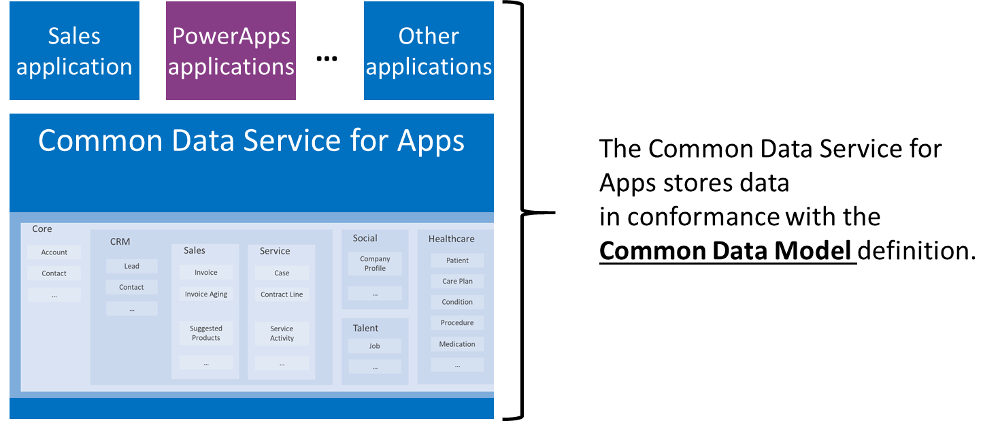
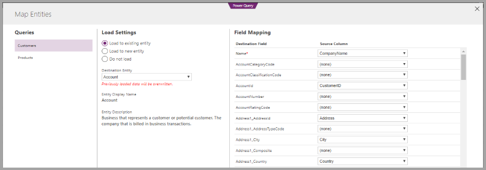

# How to use the Common Data Model

With the **Common Data Model (CDM)**, you can put your data into formats that
represent commonly used concepts and activities, and are broadly used and
understood – so that you can query that data, reuse it, and interoperate with
other businesses and applications that also use its format. Similar to knowing
the size and shape of an AA battery so all your remote controls can use them,
CDM defines the size and shape of a *Contact* (for example), so your application
developers and business partners know how to that data and can build your apps
(or interoperate) with agility and confidence. And since CDM is an
open-source definition of standard entities, the community of interested
developers can readily understand and participate in schema definitions.

Today, CDM is used within the Common Data Service (CDS) for Apps,
which supports Dynamics and PowerApps, and the data preparation capabilities in
Power BI to create schematized files in Azure Data Lake.

You can use the CDM and CDS for Apps in the following ways:

-   **Securely store and manage your data in CDM format**: You can use the CDS
    for Apps to securely store and manage your data in the standardized CDM
    format. By doing so, you can then access and use that data in Microsoft apps
    and services such as Dynamics, Power Apps, Flow, or Power BI, or your own
    custom applications.

-   **Create custom CDM entities**: The CDM is extensible, so you can create
    any entities not already in CDM that are specific to your organization, and
    populate those entities with your existing data using **Power Query**. This
    lets you take advantage of CDM, and also tailor it to your business.

-   **Create your own repositories of data**: You can build repositories of
    data that adhere to the **Common Data Model (CDM)** schema, and connect to
    those data sources using Microsoft data connectors. This lets you build
    custom line-of-business applications that use or share your CDM data,
    regardless of where the data originated or is stored.

-   **Quickly derive and distribute insights using Power BI**: You can use
    advanced data preparation services in Power BI that access your CDM data
    stores (such as data you’ve put into CDS for Apps) to create reports and dashboards,
    and then create report-generating apps that automatically pull your CDM data
    into customized insights for individuals and groups in your organization.

-   **Produce customized, but organization-wide reports in Power BI**: You can
    use apps that automatically generate customized reports that you can place
    into Power BI workspaces for users in your organization, and beyond.

As Microsoft continues to extend the CDM, in concert
with many partners and subject matter experts, new industries such as the health
care industry will be able to benefit from the CDM and the platforms that
support it.

## Data Integration and Power Query Online

Both platforms that currently support CDM also offer data integration
experiences through Power Query Online that allow users to bring in data
from a variety of sources, transform if necessary and then map to standard CDM
entities or create custom entities. Power Query Online leverages the same
visual, self-service data prep experience as Power Query within Excel and
Power BI Desktop, so existing users can ramp up quickly.

## Common Data Service for Apps

CDS for Apps allows you to jumpstart apps using the CDM
with business logic, security and integration built-in. The platform allows you
to:

-   **Leverage packaged business applications**: Many Microsoft Dynamics
    solutions, and many third-party applications, are built on top of (or at
    least leverage) the CDS for Apps. When your data is in
    the CDM, you can take advantage of those packaged applications.

-   **Gain access to customized solutions**: An ecosystem of extensions and
    complete applications, created by developers who understand and work with
    data in the CDM format exists. See [introduction
    to
    solutions](https://docs.microsoft.com/powerapps/developer/common-data-service/introduction-solutions)
    for more information.

Whatever your intent, the CDM puts your data into a
common format so you can use, share, and analyze it more easily.

**Resources for CDS for Apps**

-   [What is CDS for
    Apps?](https://docs.microsoft.com/powerapps/maker/common-data-service/data-platform-intro)

-   [Add data to an entity in CDS for Apps by using Power
    Query](https://docs.microsoft.com/powerapps/maker/common-data-service/data-platform-cds-newentity-pq)

-   [Introduction to
    solutions](https://docs.microsoft.com/powerapps/developer/common-data-service/introduction-solutions)

-   [Build a model-driven
    app](https://docs.microsoft.com/powerapps/maker/model-driven-apps/model-driven-app-overview)

-   [Build a canvas
    app](https://docs.microsoft.com/powerapps/maker/canvas-apps/getting-started)

-   [Create a flow that uses CDS for Apps](https://docs.microsoft.com/flow/common-data-model-intro)

