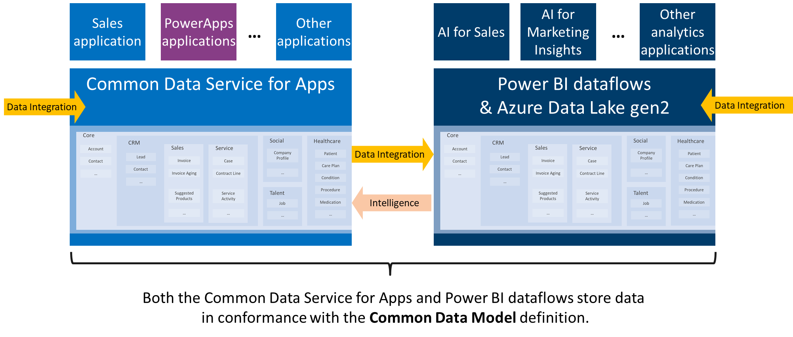

# How to use the Common Data Model

With the Common Data Model (CDM), you can put your data into formats that represent concepts and activities that are commonly used and well understood. That way, you can query that data, reuse it, and interoperate with other businesses and apps that use the same format. This strategy matches that of, for example, manufacturers who produce AA batteries that fit in most remote controls. The CDM defines the size and shape of, for example, a **Contact** so that your app developers and business partners can parse that data and build your apps (or interoperate) with agility and confidence. The CDM is an open-source definition of standard entities, so the community of interested developers can readily understand and participate in schema definitions.

Today, the CDM is used within Common Data Service (CDS) for Apps, which supports Dynamics and PowerApps, and the data-preparation capabilities in Power BI to create schematized files in Azure Data Lake.

You can use the CDM and CDS for Apps in these ways:

- **Securely store and manage your data in the CDM format**: You can use CDS for Apps to securely store and manage your data in the standardized format of the CDM. By doing so, you can then access and use that data in Microsoft apps and services such as Dynamics, PowerApps, Microsoft Flow, Power BI, or your own custom apps.

- **Create custom entities in the CDM**: The CDM is extensible, so you can create entities that are specific to your organization and populate them with your existing data using **Power Query**. With this approach, you can take advantage of the CDM and tailor it to your business.

- **Create your own repositories of data**: You can build repositories of data that adhere to the schema of the CDM and connect to those data sources using Microsoft data connectors. This lets you build custom line-of-business apps that use or share your data in the CDM, regardless of where the data originated or is stored.

- **Quickly derive and distribute insights using Power BI**: You can use advanced data-preparation services in Power BI that access your data stores in the CDM (such as data that you’ve put into CDS for Apps) to create reports and dashboards. Then you can create report-generating apps that automatically pull your data from the CDM into customized insights for individuals and groups in your organization.

- **Produce customized, organization-wide reports in Power BI**: You can use apps that automatically generate customized reports that you can place into Power BI workspaces for users in your organization and beyond.

Microsoft continues to extend the CDM in concert with many partners and subject-matter experts so that more industries, such as health
care, can benefit from the CDM and the platforms that support it.

## Data integration and Power Query Online

Both platforms that currently support CDM also offer data-integration experiences through Power Query Online that allow users to bring in data from a variety of sources, transform it if necessary, and then map it to standard entities in the CDM or create custom entities. Power Query Online leverages the same visual, self-service data-prep experience as Power Query within Excel and Power BI Desktop, so existing users can ramp up quickly.

## Common Data Service for Apps

By using CDS for Apps, you can jumpstart apps using the CDM with business logic, security, and integration already built in. The platform provides these benefits:

- **Leverage packaged business applications**: Many Microsoft Dynamics solutions and third-party apps are built on top of (or at least leverage) CDS for Apps. When your data is in the CDM, you can take advantage of those packaged applications.

- **Gain access to customized solutions**: Developers who understand and work with data in the CDM format have created an ecosystem of extensions and complete apps. For more information, see [introduction to solutions](https://docs.microsoft.com/powerapps/developer/common-data-service/introduction-solutions).

Whatever your intent, the CDM puts your data into a common format so that you can use, share, and analyze it more easily.

**Resources for CDS for Apps**

- [What is CDS for Apps?](../maker/common-data-service/data-platform-intro.md)
- [Add data to an entity in CDS for Apps by using Power Query](../maker/common-data-service/data-platform-cds-newentity-pq.md)
- [Introduction to solutions](../developer/common-data-service/introduction-solutions.md)
- [Build a model-driven app](../maker/model-driven-apps/model-driven-app-overview.md)
- [Build a canvas app](../maker/canvas-apps/getting-started.md)
- [Create a flow that uses CDS for Apps](https://docs.microsoft.com/flow/common-data-model-intro)
