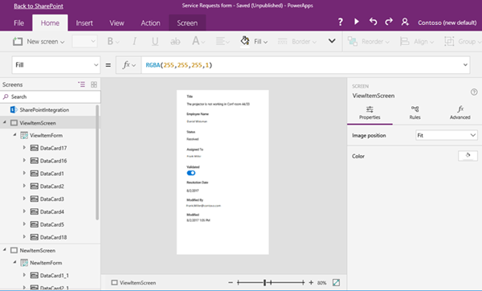
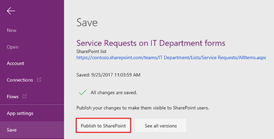
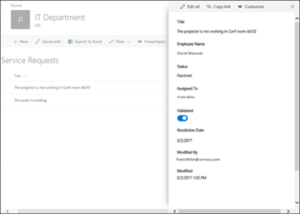

# Customize a SharePoint list form using PowerApps

You can now easily customize any SharePoint list form in PowerApps. Much of what you were doing with InfoPath to customize SharePoint list forms you can now do inline in a browser with PowerApps. Plus, PowerApps gives you the ability to do so much more!

PowerApps is directly integrated with SharePoint - there's no need to download another app to your computer. And with PowerApps, you can create richly customized forms without needing to write any code. Once published, the forms are embedded within the SharePoint list and are available to all users of the list.

And because PowerApps is seamlessly integrated into SharePoint, there's no need to manage forms from two places: permissions are inherited from and managed through SharePoint. Best of all, having PowerApps integrated with SharePoint gives you access to many powerful features, such as analytics reports, easy point-and-click rules for conditional formatting, and connections to other data sources.

Ready to start customizing? Let's get started!

## Create a custom list form app in PowerApps

> [!NOTE]
> The **Customize forms** option will be unavailable, or may not work correctly, if the SharePoint list contains data types that PowerApps doesn't support.

Within your SharePoint list, click or tap **PowerApps** on the command bar, and then click or tap **Customize forms**. This takes you to PowerApps Studio for web in a browser, where PowerApps generates a single-screen form app, as shown in the following example.

To return to your SharePoint list at any time, click or tap **Back to SharePoint** in the upper-left corner of PowerApps Studio for web.

## Customize the list form

PowerApps offers many ways to customize your form. Here are some examples:

* [Change the size and orientation](set-aspect-ratio-portrait-landscape.md)
* [Format the text](controls/properties-text.md)
* [Add images](add-images-pictures-audio-video.md) or [charts](use-line-pie-bar-chart.md)
* [Add custom data validation](functions/function-validate.md)
* [Add rules](working-with-rules.md)
* [Create additional views](https://powerapps.microsoft.com/blog/separate-custom-forms/)

To illustrate, let's say your form has an **AccountID** field that you don't want visible.

Hiding the field is easy in PowerApps - in the form customization options, just clear the **AccountID** checkbox.

For step-by-step instructions on how to hide fields and make other form changes, see [Customize forms in PowerApps](customize-forms-sharepoint.md). For a complete list of resources, see [Microsoft PowerApps docs](https://docs.microsoft.com/powerapps/).

## Save and publish the list form back to SharePoint

1. When you're done, click or tap **File**, and then click or tap **Save**. This saves your changes to the PowerApps form app.

1. To publish your form back to SharePoint so that others can use it, click or tap **Publish to SharePoint**. You don't need to worry about sharing the form - the form inherits permissions from the SharePoint list.

      

## View your list form in SharePoint

1. To see your customized form, click or tap **Back to SharePoint**, and then click or tap any item in the SharePoint list. The form opens inline on the right-hand side of the browser window.

    

1. If you want to [further customize your form](sharepoint-form-integration.md), click or tap **Customize**, and then make your changes. When you're done, be sure to save your changes.

    

    You can customize and save as many times as you want, but your changes will not be visible in SharePoint until you click or tap **Publish to SharePoint**.

## Toggle between using the default SharePoint form and the custom form

1. From your list in SharePoint, click or tap **Settings**, click or tap **List settings**, and then click or tap **Form settings**.

1. On the **Form Settings** page, click or tap one of the following, and then click or tap **OK**.

    * **Use the default SharePoint form** - SharePoint will use the default SharePoint form for your list.

    * **Use a custom form created in PowerApps** - SharePoint will use the form that you customized in PowerApps. (Alternatively, you can re-publish the form from the **Save** page in PowerApps Studio for web.)

    You can toggle back and forth between options, as needed.

    

## Delete the custom list form

1. From your list in SharePoint, click or tap **Settings**, click or tap **List settings**, and then click or tap **Form settings**.

1. On the **Form Settings** page, click or tap **Use the default SharePoint form**, and then under the **Use a custom form created in PowerApps** option, click or tap **Delete custom form**. This will delete the custom form that you created in PowerApps and your form will revert to a default SharePoint form.

    

## Top questions about list form customization

### Customizing forms versus creating apps

**Q:** How does a customized list form differ from a standalone app that I create from SharePoint or PowerApps?

**A:** The list form app that you create from SharePoint is a special type of PowerApps app that can only be used within a SharePoint list. These list form apps don't appear in your app list in PowerApps Studio for web or PowerApps Mobile, and you can't run them outside of the SharePoint list.

**Q:** When should I create a customized list form and when should I create a standalone app?

**A:** If you want your users to access the form using SharePoint, and you want to customize how they create, view, or edit list items, we suggest you create a customized list form from within SharePoint. If you want to create a fully customized experience for your users that they can use independent of the SharePoint site, we suggest you create a standalone app.

**Q:** Can I customize a list form and create a standalone app for the same list?

**A:** Yes. Standalone apps and customized list forms are independent of each other; you can customize and manage them individually.

**Q:** Are the customization features for customizing a list form the same as those for customizing a standalone app?

**A:** Yes. You can [add and configure controls](add-configure-controls.md), [connect to available data sources](add-data-connection.md), or [add your own data sources](register-custom-api.md), just like you can with standalone apps.

**Q:** Can I create customized list forms in an environment other than the default environment in my organization?

**A:** No. Currently you can create customized list forms only in your organization's default PowerApps environment; you cannot create customized list forms in, or migrate them to, another environment.

### Managing your custom list form

**Q:** How do I get a direct link to my list form that I can share with others?

**A:** Open the form in the SharePoint list, and then click or tap **Copy link**.

**Q:** Can I update my list form without making my changes visible to others?

**A:** Yes. You can make changes to your form and save as many times as you want, but your changes will not be visible to others until you click or tap **[Publish to SharePoint](customize-list-form.md#save-and-publish-the-list-form-back-to-sharepoint)**.

**Q:** If I customize a list form and make a mistake, can I revert to a previous version?

**A:** Yes. If you make changes to your form and save those changes, and then realize you made a mistake, you can revert to a previous version of your form using PowerApps:

1. Within your SharePoint list, click or tap **PowerApps** on the command bar, and then click or tap **Customize forms**.

1. In PowerApps Studio for web, click or tap **File**, and then on the **Save** page, click or tap **See all versions**. The **Versions** page opens in a new browser tab.

    > [!NOTE]
    > If you don't see the **See all versions** button, click or tap **Save**. The button should appear.

1. Without closing the **Versions** page or the browser tab, go back to the **Save** page in the other browser tab, click or tap the arrow at the top of the left navigation pane, and then click or tap **Back to SharePoint** to unlock your form and exit PowerApps Studio for web.

1. Go back to the **Versions** page in the other browser tab, locate the version that you want to restore, and then click **Restore**.

    > [!NOTE]
    > If you get an error message saying the restore failed because the form is locked by another user, wait until the user unlocks the form, and then try again.

**Q:** Can I move my custom list form from one list to another?

**A:** No. This functionality is not currently supported.

### Administering custom list forms

**Q:** How do I share my custom list form with others?

**A:** You don't need to share the form - the form inherits permissions from the SharePoint list. When you're done customizing it, just [publish it back to SharePoint](customize-list-form.md#save-and-publish-the-list-form-back-to-sharepoint) so that others can use it.

**Q:** Who can customize list forms?

**A:** Anyone with SharePoint permissions to manage, design, or edit the associated list.

**Q:** Do I need a PowerApps license to create or use custom list forms?

**A:** If you have any [Office 365 plan that includes PowerApps](pricing-billing-skus.md#licenses), you can create or use custom list forms.

**Q:** What happens when guest users access a list that has a custom form?

**A:** Guest users get an error message if they try to access a list form that's been customized using PowerApps.

**Q:** As an administrator, how do I get a list of all customized forms in my organization?

**A:** If you're a tenant administrator for PowerApps, or have environment administrator permissions on the default PowerApps environment of your organization, do the following:

1. Go to the [PowerApps admin center](https://admin.powerapps.com) and select the default environment for your organization from the list of environments.

1. At the top of the default environment page, click or tap **Resources**.

1. From the list of apps, look for apps with a **SharePoint Form** app type - these are the customized forms.

    
