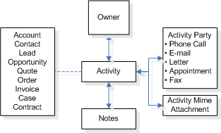

# Activity entities

In Common Data Service for Apps, activities are tasks that you or your teams perform when they contact customers, for example, sending letters or making telephone calls. You  can create activities for yourselves, can assign them to someone else, or can share them with other users or teams. An activity is any action which can be entered  on a calendar  and has time dimensions (start time, stop time, due date, and duration) that help determine when the action occurred or is to occur. Activities has some basic properties that help determine what action the activity represents, for example, subject and description. An activity state can be opened, canceled, or completed. The completed status of an activity will have several substatus values associated with it to clarify the way that the activity was completed.  
  
 Activities involve one or more participants, called activity parties in CDS for Apps. For a meeting activity, the participants are those contacts or users attending the meeting. For a telephone call or fax activity, the parties are the caller and the person who is called. The following diagram shows the entity relationships for activities.  
  
   
  
 To support the communication needs of the modern-day business, such as instant messaging (IM) and SMS, you can create custom activities in CDS for Apps.  
  
 **Other activity entities**  
  
-   The scheduling activities enables you to schedule your services and resources, and thus define work schedules. The scheduling activity entities are `Appointment`, `ServiceAppointment`, and `RecurringAppointmentMaster`. For more information, see [Schedule and Appointment Entities](/dynamics365/customer-engagement/developer/schedule-appointment-entities).  
  
-   The marketing activity, `CampaignResponse`, enables you to capture responses from the customers for a marketing campaign, while the `CampaignActivity` entity represents a step in a campaign. For more information, see [Campaign Entities](/dynamics365/customer-engagement/developer/campaign-entities).  
  
-   The sales force automation entities `OpportunityClose`, `OrderClose`, and `QuoteClose` activities capture information about each of these events. For more information, see [Sales Entities (Lead, Opportunity, Competitor, Quote, Order, Invoice)](/dynamics365/customer-engagement/developer/sales-entities-lead-opportunity-competitor-quote-order-invoice).  
  
-   The customer service entity `IncidentResolution` activity captures information about the resolution of a case. For more information, see [Incident (Case) Entities](/dynamics365/customer-engagement/developer/incident-case-entities).  
  
## In This Section  
 [Custom Activities in Dynamics 365](custom-activities.md)  
  
 [Activity Pointer (Activity) Entity](activitypointer-activity-entity.md)  
  
 [Activity Party Entity](activityparty-entity.md)  
  
 [Task, Fax, Phone Call, and Letter Activity Entities](task-fax-phone-call-letter-activity-entities.md)  
  
 [E-mail Activity Entities](email-activity-entities.md)  
  
 [Sample Code for Activity Entities](/dynamics365/customer-engagement/developer/sample-code-activity-entities)  
  
## Related Sections  
 [Model Your Business Data with Dynamics 365 Customer Engagement](/dynamics365/customer-engagement/developer/model-business-data)  
  
 [Server-side Synchronization Entities](server-side-synchronization-entities.md)  
  
 [Customize Entity Metadata](customize-entity-metadata.md)
