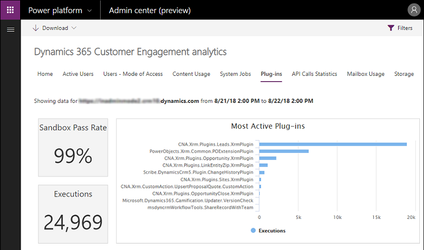

# Analyze plug-in performance

In addition to using a debugger and profiler to learn how your plug-in is performing at the code level, you can obtain metrics as to the overall performance of your registered plug-ins in an organization through [Common Data Service analytics](/power-platform/admin/analytics-common-data-service).

Through the [Plug-in](/power-platform/admin/analytics-common-data-service#plug-ins) dashboard you can view metrics such as average execution time, failures, most active plug-ins, and more.

## See also

[Use plug-ins to extend business processes](plug-ins.md)  
[Tutorial: Debug a plug-in](tutorial-debug-plug-in.md)  
[Debug Plug-ins](debug-plug-in.md)