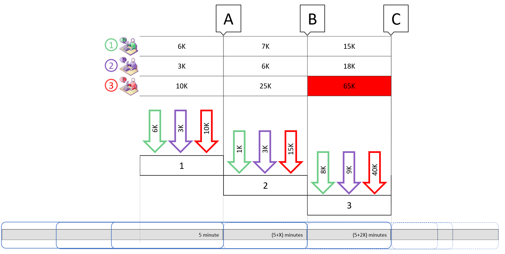

# API Limits

Beginning March 19, 2018 we will limit the number of API requests made by each user, per organization instance, within a five minute interval. When this limit is exceeded, an exception will be thrown by the platform.

The limit will help ensure that users running applications that make extraordinarily large demands on servers will not affect other users. The limit will not affect normal users of the platform. Only applications that perform a very large number of API requests will be affected. Based on telemetry data analysis, this limit is well within the bounds of most applications that perform a large number of API requests. The limit will help provide a level of protection from random and unexpected surges in request volumes that threaten the availability and performance characteristics of the Common Data Service for Apps platform.

If your application has the potential to exceed the limit, please consider the guidance given in the [What should I do if my application exceeds the limit?](#what-should-i-do-if-my-application-exceeds-the-limit) section below.

## What is the limit?

Each user will be allowed up to 60,000 API requests, per organization instance, within five minute sliding interval.

## What happens when the limit is exceeded?

When the limit is exceeded, any requests will return error responses.

If you use the .NET SDK assemblies, the platform will respond with a `FaultException<OrganizationServiceFault>` WCF Fault with the error code `-2147015902` and the message `Number of requests exceeded the limit of 60000, measured over time window of 300 seconds.`

If you use HTTP requests, the response will include these properties:<br />
`StatusCode` : `429`<br />
`Message` : `Number of requests exceeded the limit of 60000, measured over time window of 300 seconds.`

All requests will return these error responses until the volume of API requests falls below the limit. If you get these responses, your application should stop sending API requests until the volume of requests is below the limit.

## How is this limit calculated?

Within an organization instance, API requests made by each of your licensed users (including the licensed identity used for running automation) will be measured against this limit. The platform will measure the number of API requests made in five minutes, which keeps sliding by a definite period. During each measurement interval, at the end of five minutes, the number of API requests by the user is counted. In the figure below, three users are making API call requests over a six-minute period.  



|Interval|Description|
|--|--|
|A|At the end of five minutes, the total number of API requests for user 1 is 6K, user 2 is 3K, and user 3 is 10K.|
|B|At 5+X minutes, X being a constant slice of time (say, a few seconds), which is the sliding interval constant, the platform measures the total for each of these users who are still active. According to the diagram above, this would be user 1 = 7K, user 2 is 6K and user 3 is 25K. All the cumulative numbers are still below the 60,000 limit, so no change in behavior is expected for these users.|
|C|As time passes and reaches 5+2X, user 3 makes about 40K API requests, while user 1 and user 2 make 8K and 9K calls, respectively. This results in user 3 reaching 65K API requests within five minutes, which causes 5K (65K-60K=5K) of his requests to be denied.|

> [!NOTE]
> Requests that perform multiple API requests like <xref:Microsoft.Xrm.Sdk.Messages.ExecuteMultipleRequest> or <xref:Microsoft.Xrm.Sdk.Messages.ExecuteTransactionRequest> using the .NET SDK assemblies, or `$batch` using the Web API, count as a single request to calculate this limit. However, these API requests must follow the [Run-time limitations](org-service/execute-multiple-requests.md#limitations) for these types of operations.

## What should I do if my application exceeds the limit?

When your application exceeds the limit, the error response from the server specifies the amount of time you should wait before sending more requests. The response object is slightly different if you are using SDK assemblies or HTTP requests.

For a discussion of best practices, see [Azure Architecture Best Practices Transient fault handling](/azure/architecture/best-practices/transient-faults)

[The Polly Project](http://www.thepollyproject.org/) is a library which includes capabilities for dealing with transient faults using execution policies.

### HTTP requests

If you are using HTTP requests, you can look for the `Retry-After` HTTP header included in the error response. This will contain a value in seconds indicating how long you should wait before making a follow-up request. More information [MDN web docs Retry-After](https://developer.mozilla.org/docs/Web/HTTP/Headers/Retry-After)

### SDK assemblies

If you are using the SDK assemblies, you can look for the `Retry-After` delay in the <xref:Microsoft.Xrm.Sdk.OrganizationServiceFault>.<xref:Microsoft.Xrm.Sdk.BaseServiceFault.ErrorDetails> property, using the key `"Retry-After"`. The value returned is a [TimeSpan](/dotnet/api/system.timespan) object.

### .NET SDK Assembly Example

The following example uses the [Retry class](#retry-class) described below to retrieve one account using the <xref:Microsoft.Xrm.Sdk.IOrganizationService>.<xref:Microsoft.Xrm.Sdk.IOrganizationService.RetrieveMultiple*> method. If the request fails because an API limit has been exceeded, the `Retry` class will wait according to a delay specified by the server and try again.

```csharp
var qe = new QueryExpression("account") { TopCount = 1 };
EntityCollection result = Retry.Do(() => service.RetrieveMultiple(qe));
```

#### Retry class

The `Retry` class demonstrates how to retry requests that fail with transient errors based on known <xref:Microsoft.Xrm.Sdk.OrganizationServiceFault> error codes. The `Retry` class waits before retrying. If the fault specifies a retry delay, wait according to the delay specified by the server. Else use exponential backoff to calculate the delay based on the number of retry attempts made.

```csharp
using System;
using System.ServiceModel;
using System.Threading;

public class Retry
{
    private const int RateLimitExceededErrorCode = -2147015902;

    public static TResult Do<TResult>(Func<TResult> func, int maxRetries = 3)
    {
        int retryCount = 0;

        while (true)
        {
            try
            {
                return func();
            }
            catch (FaultException<Microsoft.Xrm.Sdk.OrganizationServiceFault> ex) 
                when (IsTransientError(ex))
            {
                if (++retryCount >= maxRetries)
                {
                    throw;
                }

                if (ex.Detail.ErrorCode == RateLimitExceededErrorCode)
                {
                    // Use Retry-After delay when specified
                    delay = (TimeSpan)ex.Detail.ErrorDetails["Retry-After"];
                }
                else
                {
                    // else use exponential backoff delay
                    delay = TimeSpan.FromSeconds(Math.Pow(2, retryCount));
                }
                
                Thread.Sleep(delay);
            }
        }
    }

    private static bool IsTransientError(FaultException<Microsoft.Xrm.Sdk.OrganizationServiceFault> ex)
    {
        // You can add more transient fault codes to retry here
        if (ex.Detail.ErrorCode == RateLimitExceededErrorCode)
        {
            return true;
        }

        return false;
    }
}

```


### See also

[Use the Dynamics 365 Organization service](/dynamics365/customer-engagement/developer/use-microsoft-dynamics-365-organization-service)<br />
[Use the Dynamics 365 Customer Engagement Web API](/dynamics365/customer-engagement/developer/use-microsoft-dynamics-365-web-api)<br />
[Execute batch operations using the Web API](webapi/execute-batch-operations-using-web-api.md)<br />
[Use ExecuteMultiple to improve performance for bulk data load](org-service/execute-multiple-requests.md)