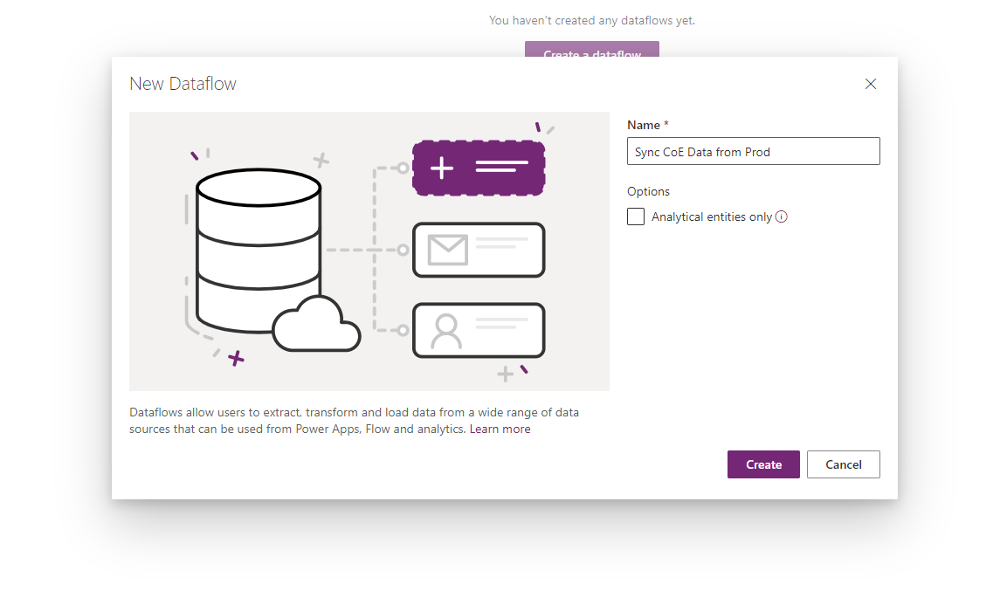
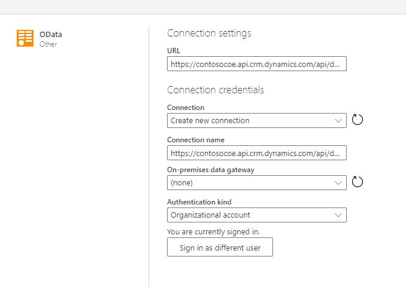
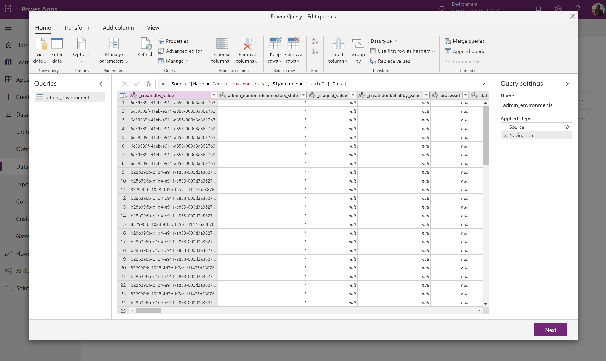
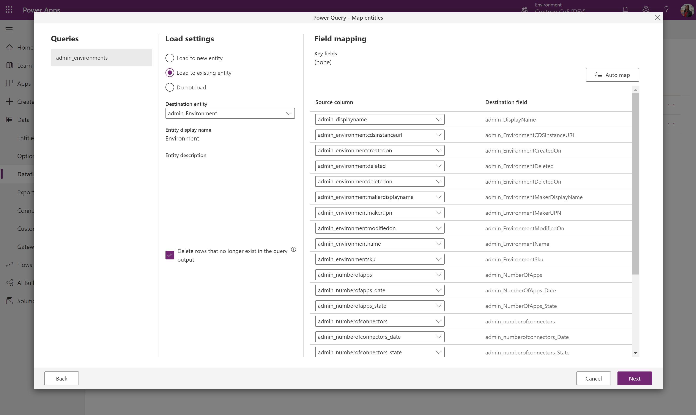
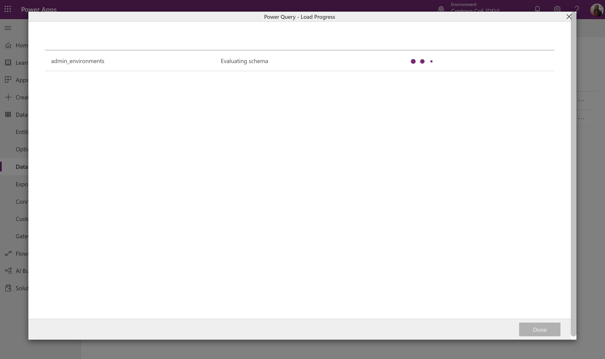

# How to migrate data between Common Data Service instances using the Power Platform dataflows OData connector

Since the Common Data Service (CDS) web API works with any technology that supports OData and OAuth, there are many choices for moving data in and out of CDS. Power Platform dataflows provide a native OData connector and is designed to support migration and synchronization of large datasets in CDS. In this article, we will walk through how to migrate data between CDS instances using the dataflows OData connector. 

## Scenarios
 - A one-time cross-environment or cross tenant migration is needed (e.g., geo-migration)

 - A developer needs to update an app that is being used in production. Test data is needed in their dev environment to easily build out changes. 

## Pre-requisites
1. System customizer (or greater) security role permission on both source and target environments.

1. Premium Power Apps, Power Automate, or Dynamics 365 Online license (per app or per user)

1. Two environments with Common Data Service instances provisioned

## Steps
1. Plan out the dataflow(s)
1. Get the OData endpoint
1. Create a new OData dataflow
1. Select and transform data with the Power Query experience
1. Configure destination environment settings
1. Run the dataflow(s)

### Plan out the dataflow(s)
1.	Identify the source and target environments.

    - The **source environment** is where the data will come from.
(In this example, we will be using the Contoso PROD environment).

    - The **target environment** is where the data will be copied to
(In this example, we will be using the Contoso DEV environment).

1. If you are migrating data, make sure the entities are already defined in the target environment. Ideally both environments should have the same entities defined with the same solution.

1. When importing relationships, multiple dataflows are needed
    - One (parent/independent) to many (children/dependent) entities require separate dataflows. Configure the parent dataflows to run before any child entities, since the data in the parent needs to be loaded first to correctly map to the fields in the corresponding child entities.

> [!NOTE]
> The words to describe a Common Data Service 'instance' and 'environment' are used interchangeably in this article. Each environment in the Power Platform can have 0 or 1 CDS instance(s). Read [documentation on environments](https://docs.microsoft.com/en-us/power-platform/admin/create-database) for more on this topic.

### Get the OData endpoint 
Since Common Data Service provides an OData endpoint that does not require any additional configuration to authenticate with the dataflows connector, it is a relatively easy process to connect to the source instance. This article will walk through how to set up a new dataflow specifically with the OData connector. The generic steps for connecting to all data sources supported by dataflows are in the [dataflows documentation](https://docs.microsoft.com/en-us/powerapps/maker/common-data-service/create-and-use-dataflows).

From the **source** environment [developer resources](https://docs.microsoft.com/en-us/powerapps/developer/common-data-service/view-download-developer-resources), get the OData endpoint (aka Service Root URL) for that instance:

1. Go to the Power Apps [maker portal](https://make.powerapps.com)

1. Make sure you are in the desired **"source"** environment

1. Select the gear icon > **Advanced Settings** (this will open a new tab)

1. In the top ribbon expand the **Settings** menu, then navigate to 
**Customizations** > **Customizations**

1. Select **Developer resources**

1. Copy the **Service Root URL** (this is the OData URL endpoint) and save it (e.g., paste it to notepad)

    
 
### Create a new OData dataflow
In the **target** environment, create a new dataflow with the OData connector.

1. Go to the Power Apps [maker portal](https://make.powerapps.com).

1. Make sure you are in the desired **target** environment.

1. In the left navigation, expand the **Data** menu, then click **Dataflows**.

1. Create a **[+ New dataflow]**, provide it a descriptive name (e.g., "Sync CoE data from Prod"). 

1. For our purposes, we do not want to move the data to a data lake, so leave the checklist for options blank. 

1. Select **Create**.

1. Select the OData connector, and make sure the field values are correct:

    | Field | Description |
    |--|--|
    | URL | Provide the Service Root URL in the URL field of the connection settings |
    | Connection | Create new connection. This will be automatically chosen if you have not made an OData connection in dataflows before. |
    | Connection name | Optionally re-name the connection name, but a value is automatically populated |  |
    | On-premise data gateway | None. An On-premise data gateway is not needed for connections to this cloud service. |
    | Authentication kind | Organizational account. You will need to click the Sign in button below to open the prompt that authenticates the account associated with the connection. |

    

    > [!IMPORTANT] 
    > Disable pop-up and cookies blocker in your browser in order to configure the AAD authentication. This is orthogonal to the fact that you are using the CDS OData endpoint or any other OAuth-based authentication data source. 
    
1. Once all the values are correct, select **Next** in the bottom right.

### Select and transform data with the Power Query experience
The next steps uses the Power Query experience, which selects the tables and allows transformation of data.

First, select the entities that will be transferred. Here you can browse all entities in the source CDS instance and preview some of the data in each entity.

1. Select one or multiple entities as needed, then select **Next**.

    > [!NOTE]
    > When importing relationships, remember that the parent entity dataflows need to be imported before the child ones. The data for the child dataflow will require data to be in the parent entity for it to correctly map, otherwise it might throw an error.
 
1. In the Power Query - Edit queries window, you can transform the query before import.

    - If you are only migrating data, there should not be a need to modify anything here. 

    - Reducing the number of unnecessary columns will improve the dataflow performance for larger data sets.

    > [!TIP]
    > You can go back to choose more tables in the **Get data** ribbon option for the same OData connector.

### Configure destination environment settings
This section describes how to define the target instance settings.

#### Map entities. 
For each entity chosen, select the behavior for importing that entity in these settings.

- **Load to existing Entity (recommended)**

    - The dataflow will sync data from the source environment's entity to the target environment, and the same entity schema is already defined in the target environment.

    - Ideally, use the same solution in both target and source environments to make data transfer seamless. Another advantage to having a pre-defined entity is more control over which solution the entity is defined in and the prefix.
    
    - Choose the "Delete rows that no longer exist in the query output". This ensures that the relationships will map correctly because it maintains the values for the lookups.
    
    - If the schema is identical in the source and target tables, you can click on the Auto map button to quickly map the fields.
    
    - Requires a key configuration in the target environment (as the unique identifier fields is not available to modify).

- **Load to new entity (not recommended)**

    - Ideally there should be an entity pre-defined in the target environment from the same solution import as the source environment. However, there are cases where this might not be feasible, so there is this option to choose if there is no existing entity to load to. 

    - It will create it in the target environment's default solution.

- There is an option to 'Do not load', but do not include entities in the dataflow that are not being loaded. You can select **Back** from this menu to return to the power query menu and remove the entities that are not needed.
 
#### Refresh settings
Configure manual refresh since this is a one-time migration. 

### Run the dataflow(s)

An initial dataflow load will initiate once you save the settings. 

You can manually initiate a dataflow in three dots menu (...) in the dataflows list. Make sure to run dependent dataflows after the parent flows have completed.

 

## Tips

- Try one entity out first to walk through the steps, then build out all the dataflows.

- If there are many entities that contain larger amounts of data, consider configuring multiple seperate dataflows for individual entities.

- One to many relationships will require seperate dataflows for each entity. Configure and run the parent (aka 'one', or independenty) entity dataflow before the child (aka 'many', or dependent) entity.

- If there are errors with the dataflow refresh, you can view the refresh history in the three dots menu (...) and download each refresh log.

## Limitations

1. Many to many relationship data imports are not supported.

1. Parent dataflows must be manually configured to run before child dataflows.---
title: Migrate data between Common Data Service instances with dataflow OData connector
author: demora
description: Description for the document
no-loc: [Title, Document]
---

# How to migrate data between Common Data Service instances using the Power Platform dataflows OData connector

Since the Common Data Service (CDS) web API works with any technology that supports OData and OAuth, there are many choices for moving data in and out of CDS. Power Platform dataflows provide a native OData connector and is designed to support migration and synchronization of large datasets in CDS. In this article, we will walk through how to migrate data between CDS instances using the dataflows OData connector. 

## Scenarios
 - A one-time cross-environment or cross tenant migration is needed (e.g., geo-migration)

 - A developer needs to update an app that is being used in production. Test data is needed in their dev environment to easily build out changes. 

## Pre-requisites
1. System customizer (or greater) security role permission on both source and target environments.

1. Premium Power Apps, Power Automate, or Dynamics 365 Online license (per app or per user)

1. Two environments with Common Data Service instances provisioned

## Steps
1. Plan out the dataflow(s)
1. Get the OData endpoint
1. Create a new OData dataflow
1. Select and transform data with the Power Query experience
1. Configure destination environment settings
1. Run the dataflow(s)

### Plan out the dataflow(s)
1.	Identify the source and target environments.

    - The **source environment** is where the data will come from.
(In this example, we will be using the Contoso PROD environment).

    - The **target environment** is where the data will be copied to
(In this example, we will be using the Contoso DEV environment).

1. If you are migrating data, make sure the entities are already defined in the target environment. Ideally both environments should have the same entities defined with the same solution.

1. When importing relationships, multiple dataflows are needed
    - One (parent/independent) to many (children/dependent) entities require separate dataflows. Configure the parent dataflows to run before any child entities, since the data in the parent needs to be loaded first to correctly map to the fields in the corresponding child entities.

> [!NOTE]
> The words to describe a Common Data Service 'instance' and 'environment' are used interchangeably in this article. Each environment in the Power Platform can have 0 or 1 CDS instance(s). Read [documentation on environments](https://docs.microsoft.com/en-us/power-platform/admin/create-database) for more on this topic.

### Get the OData endpoint 
Since Common Data Service provides an OData endpoint that does not require any additional configuration to authenticate with the dataflows connector, it is a relatively easy process to connect to the source instance. This article will walk through how to set up a new dataflow specifically with the OData connector. The generic steps for connecting to all data sources supported by dataflows are in the [dataflows documentation](https://docs.microsoft.com/en-us/powerapps/maker/common-data-service/create-and-use-dataflows).

From the **source** environment [developer resources](https://docs.microsoft.com/en-us/powerapps/developer/common-data-service/view-download-developer-resources), get the OData endpoint (aka Service Root URL) for that instance:

1. Go to the Power Apps [maker portal](https://make.powerapps.com)

1. Make sure you are in the desired **"source"** environment

1. Select the gear icon > **Advanced Settings** (this will open a new tab)

1. In the top ribbon expand the **Settings** menu, then navigate to 
**Customizations** > **Customizations**

1. Select **Developer resources**

1. Copy the **Service Root URL** (this is the OData URL endpoint) and save it (e.g., paste it to notepad)

    
 
### Create a new OData dataflow
In the **target** environment, create a new dataflow with the OData connector.

1. Go to the Power Apps [maker portal](https://make.powerapps.com).

1. Make sure you are in the desired **target** environment.

1. In the left navigation, expand the **Data** menu, then click **Dataflows**.

1. Create a **[+ New dataflow]**, provide it a descriptive name (e.g., "Sync CoE data from Prod"). 

1. For our purposes, we do not want to move the data to a data lake, so leave the checklist for options blank. 

1. Select **Create**.

1. Select the OData connector, and make sure the field values are correct:

    | Field | Description |
    |--|--|
    | URL | Provide the Service Root URL in the URL field of the connection settings |
    | Connection | Create new connection. This will be automatically chosen if you have not made an OData connection in dataflows before. |
    | Connection name | Optionally re-name the connection name, but a value is automatically populated |  |
    | On-premise data gateway | None. An On-premise data gateway is not needed for connections to this cloud service. |
    | Authentication kind | Organizational account. You will need to click the Sign in button below to open the prompt that authenticates the account associated with the connection. |

    

    > [!IMPORTANT] 
    > Disable pop-up and cookies blocker in your browser in order to configure the AAD authentication. This is orthogonal to the fact that you are using the CDS OData endpoint or any other OAuth-based authentication data source. 
    
1. Once all the values are correct, select **Next** in the bottom right.

### Select and transform data with the Power Query experience
The next steps uses the Power Query experience, which selects the tables and allows transformation of data.

First, select the entities that will be transferred. Here you can browse all entities in the source CDS instance and preview some of the data in each entity.

1. Select one or multiple entities as needed, then select **Next**.

    > [!NOTE]
    > When importing relationships, remember that the parent entity dataflows need to be imported before the child ones. The data for the child dataflow will require data to be in the parent entity for it to correctly map, otherwise it might throw an error.
 
1. In the Power Query - Edit queries window, you can transform the query before import.

    - If you are only migrating data, there should not be a need to modify anything here. 

    - Reducing the number of unnecessary columns will improve the dataflow performance for larger data sets.

    > [!TIP]
    > You can go back to choose more tables in the **Get data** ribbon option for the same OData connector.

### Configure destination environment settings
This section describes how to define the target instance settings.

#### Map entities. 
For each entity chosen, select the behavior for importing that entity in these settings.

- **Load to existing Entity (recommended)**

    - The dataflow will sync data from the source environment's entity to the target environment, and the same entity schema is already defined in the target environment.

    - Ideally, use the same solution in both target and source environments to make data transfer seamless. Another advantage to having a pre-defined entity is more control over which solution the entity is defined in and the prefix.
    
    - Choose the "Delete rows that no longer exist in the query output". This ensures that the relationships will map correctly because it maintains the values for the lookups.
    
    - If the schema is identical in the source and target tables, you can click on the Auto map button to quickly map the fields.
    
    - Requires a key configuration in the target environment (as the unique identifier fields is not available to modify).

- **Load to new entity (not recommended)**

    - Ideally there should be an entity pre-defined in the target environment from the same solution import as the source environment. However, there are cases where this might not be feasible, so there is this option to choose if there is no existing entity to load to. 

    - It will create it in the target environment's default solution.

- There is an option to 'Do not load', but do not include entities in the dataflow that are not being loaded. You can select **Back** from this menu to return to the power query menu and remove the entities that are not needed.
 
#### Refresh settings
Configure manual refresh since this is a one-time migration. 

### Run the dataflow(s)

An initial dataflow load will initiate once you save the settings. 

You can manually initiate a dataflow in three dots menu (...) in the dataflows list. Make sure to run dependent dataflows after the parent flows have completed.

 

## Tips

- Try one entity out first to walk through the steps, then build out all the dataflows.

- If there are many entities that contain larger amounts of data, consider configuring multiple seperate dataflows for individual entities.

- One to many relationships will require seperate dataflows for each entity. Configure and run the parent (aka 'one', or independenty) entity dataflow before the child (aka 'many', or dependent) entity.

- If there are errors with the dataflow refresh, you can view the refresh history in the three dots menu (...) and download each refresh log.

## Limitations

1. Many to many relationship data imports are not supported.

1. Parent dataflows must be manually configured to run before child dataflows.
