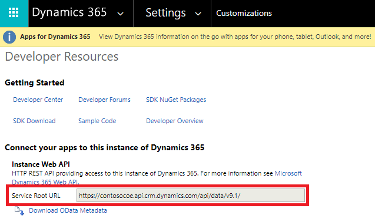
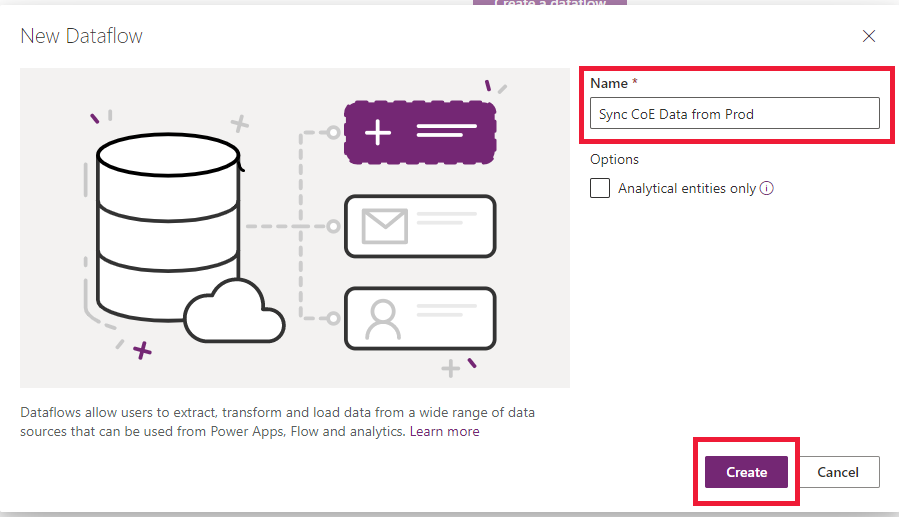
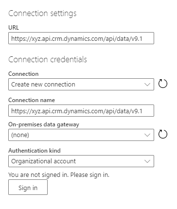
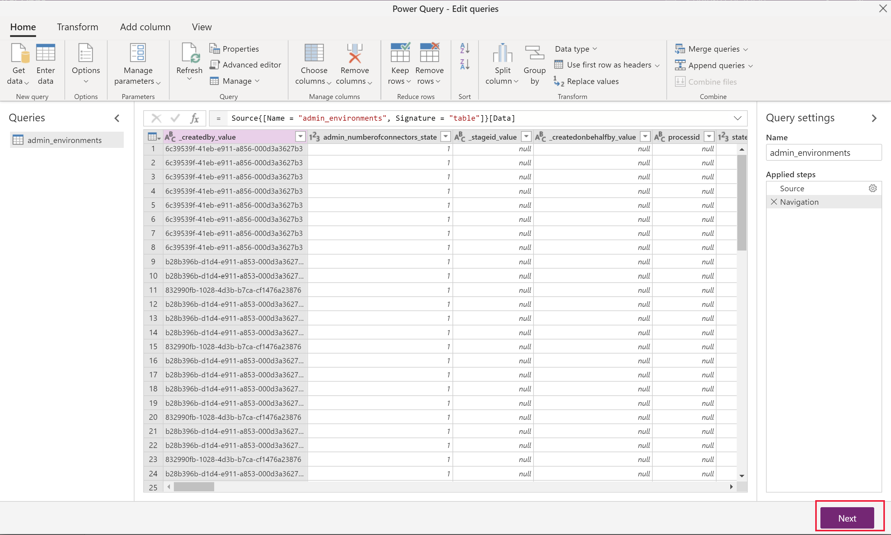
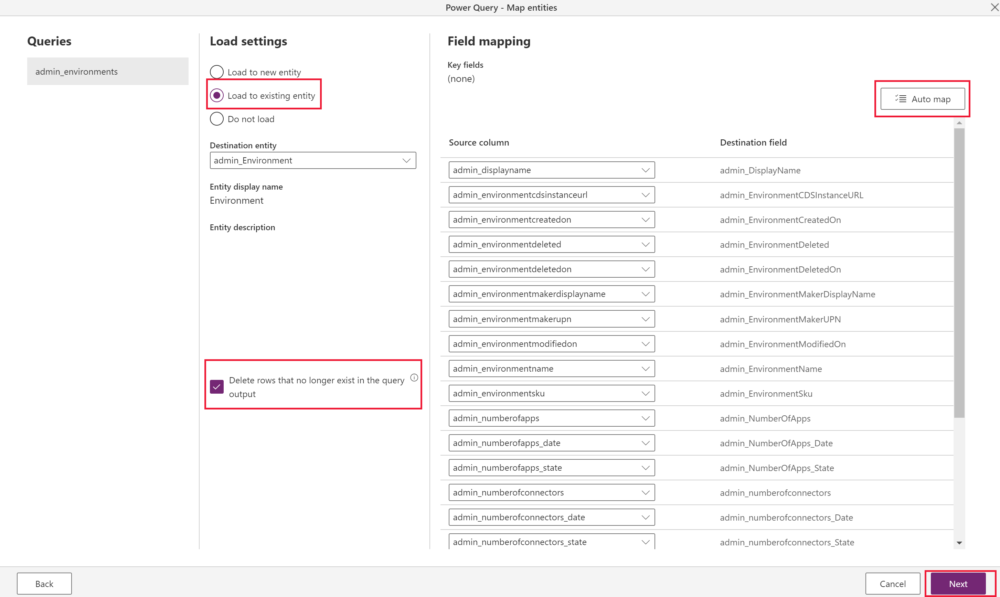
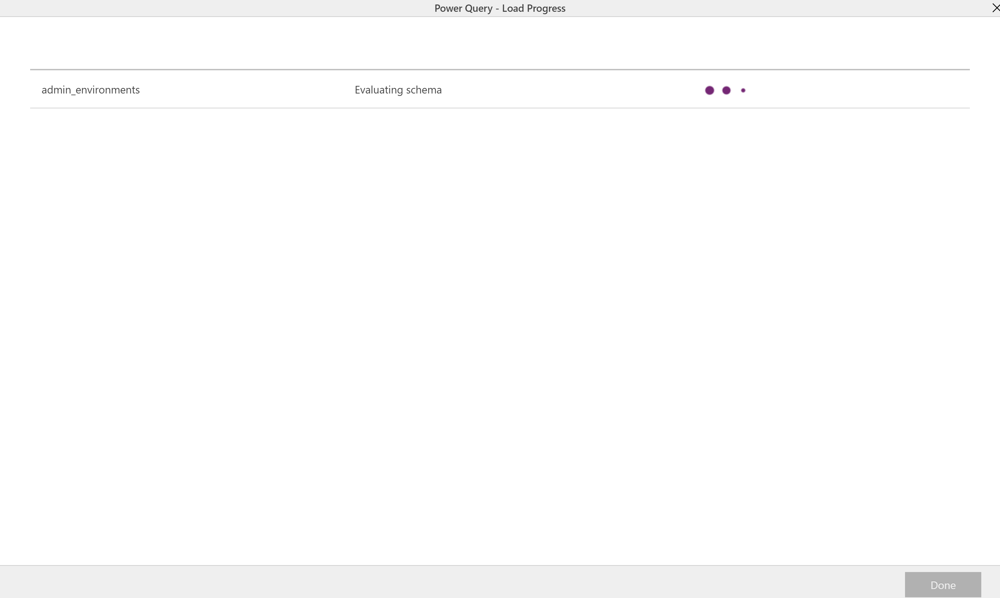
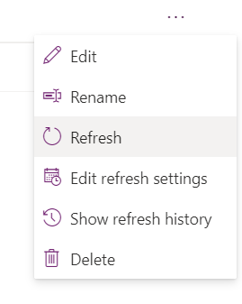

# Migrate data between Common Data Service environments using the dataflows OData connector

Common Data Service [Web API](/powerapps/developer/common-data-service/webapi/overview) works with any technology that supports OData and OAuth. There are many options available to move data in and out of Common Data Service. OData connector is one of the dataflows, which is designed to support migration and synchronization of large datasets in Common Data Service. 

In this article, we walk you through how to migrate data between Common Data Service environments using the dataflows OData connector. 

## Prerequisites

- System Administrator or System Customizer security role permission on both source and the target environments.

- Power Apps, Power Automate, or Common Data Service license (per app or per user).

- Two Common Data Service [environments with database](/power-platform/admin/create-environment#create-an-environment-with-a-database).

## Scenarios

 - A one-time cross-environment or cross-tenant migration is needed (for example, geo-migration)

 - Developer needs to update an app that is being used in production. Test data is needed in their development environment to easily build out changes. 

## Step 1: Plan out the dataflow

1. Identify the source and target environments.

    - The **source environment** is where the data is migrated from. 

    - The **target environment** is where the data is migrated to. 

1. Ensure that the entities are already defined in the target environment. Ideally both environments should have the same entities defined with the same solution.

1. When importing relationships, multiple dataflows are required.

    One (parent/independent) to many (children/dependent) entities require separate dataflows. Configure the parent dataflow to run before any child entities, since the data in the parent needs to be loaded first to correctly map to the fields in the corresponding child entities.

## Step 2: Get the OData endpoint 

Common Data Service provides an OData endpoint that does not require any additional configuration to authenticate with the dataflows connector. It is relatively easy process to connect to the source environment. 

This article will walk through how to set up a new dataflow with the OData connector. See, [Creating dataflows](https://docs.microsoft.com/powerapps/maker/common-data-service/create-and-use-dataflows) article for connecting to all data sources supported by dataflows.

From the **source** environment, get the [OData endpoint](https://docs.microsoft.com/powerapps/developer/common-data-service/view-download-developer-resources) (aka Service Root URL) for that environment:

1. Sign into [Power Apps](https://make.powerapps.com).

1. Select the required source environment from the top-right corner.

1. Select the Settings (gear) icon in the top-right corner, and select **Advanced Settings**.

1. On the **Settings** page, select the drop-down arrow next to ****Settings**, and select **Customizations**.

1. On the **Customizations** page, select **Developer Resources**.

1. Copy the **Service Root URL** to notepad.

    > [!div class="mx-imgBorder"]
    > 
 
## Step 3: Create a new OData dataflow

In the **target** environment, create a new dataflow with the OData connector.

1. Sign into [Power Apps](https://make.powerapps.com).

1. Select the required target environment from the top-right corner.

1. In the left navigation pane, expand the **Data** menu, and select **Dataflows**.

1. Select **New dataflow** to create a new dataflow. Provide a meaningful name for the dataflow. Select **Create**.
   > [!div class="mx-imgBorder"]
   > 

1. Select the **OData** connector.

    > [!div class="mx-imgBorder"]
    > 

1. In the Connection Settings dialog box, type the field values:

    > [!div class="mx-imgBorder"]
    > 

    | Field | Description |
    |--|--|
    | URL | Provide the Service Root URL in the URL field of the connection settings |
    | Connection | Create new connection. This will be automatically chosen if you have not made an OData connection in dataflows before. |
    | Connection name | Optionally, rename the connection name, but a value is automatically populated |  |
    | On-premise data gateway | None. An on-premises data gateway is not needed for connections to this cloud service. |
    | Authentication kind | Organizational account. Select the Sign in button to open the login dialog that authenticates the account associated with the connection. |    

    > [!IMPORTANT] 
    > Disable pop-up and cookies blocker in your browser in order to configure the Azure AD authentication. This is orthogonal to the fact that you are using the Common Data Service OData endpoint or any other OAuth based authentication data source. 
    
1. Select **Next** in the bottom right.

## Step 4: Select and transform data with the Power Query 

Use Power Query to select the tables and also transform data as per your requirement.

First, select the entities that need to be transferred. You can browse all entities in the source environment and preview some of the data in each entity.

> [!div class="mx-imgBorder"]
> 

1. Select one or multiple entities as needed, then select **Transform data**.

    > [!NOTE]
    > When importing relationships, remember that the parent entity dataflow need to be imported before the child ones. The data for the child dataflow will require data to be in the parent entity for it to correctly map, otherwise it might throw an error.
 
1. In the **Power Query - Edit queries** window, you can transform the query before import.

    - If you are only migrating data, there should not be a need to modify anything here. 

    - Reducing the number of unnecessary columns will improve the dataflow performance for larger data sets.

    > [!TIP]
    > You can go back to choose more tables in the **Get data** ribbon option for the same OData connector.

1. Select **Next** in the bottom right.

## Step 5: Configure target environment settings

This section describes how to define the target environment settings.

### Step 5.1: Map entities 

For each entity chosen, select the behavior for importing that entity in these settings and select **Next**.

> [!div class="mx-imgBorder"]
> 

- **Load to existing Entity (recommended)**

    - The dataflow syncs data from the source environment's entity to the target environment, and the same entity schema is already defined in the target environment.

    - Ideally, use the same solution in both target and source environments to make data transfer seamless. Another advantage to having a pre-defined entity is more control over which solution the entity is defined in and the prefix.
    
    - Choose the **Delete rows that no longer exist in the query output**. This ensures that the relationships will map correctly because it maintains the values for the lookups.
    
    - If the schema is identical in both source and target tables, you can select the **Auto map** button to quickly map the fields.
    
    - Requires a key configuration in the target environment (as the unique identifier fields is not available to modify).

- **Load to new entity (not recommended)**

    - Ideally there should be an entity pre-defined in the target environment from the same solution import as the source environment. However, there are cases where this might not be feasible, so there is this option to choose if there is no existing entity to load to. 

    - It creates a new custom entity in the target environment's default solution.

- There is an option to **Do not load**, but do not include entities in the dataflow that are not being loaded. You can select **Back** from this menu to return to the Power Query menu and remove the entities that are not needed.

### Step 5.2: Refresh settings

Select **Refresh manually** since this is a one-time migration ad select **Create**. 

## Step 6: Run the dataflow

The initial dataflow load initiates when you select the **Create** button. 

> [!div class="mx-imgBorder"]
> 

You can manually initiate a dataflow by selecting **(...)** in the dataflows list. Make sure to run dependent dataflows after the parent flows have completed.

> [!div class="mx-imgBorder"]
>  

## Tips

- Try out one entity first to walk through the steps, then build out all the dataflows.

- If there are more entities that contain larger amounts of data, consider configuring multiple separate dataflows for individual entities.

- One to many relationships will require separate dataflows for each entity. Configure and run the parent (aka one, or independently) entity dataflow before the child (aka many, or dependent) entity.

- If there are errors with the dataflow refresh, you can view the refresh history in the **(...)** menu in the dataflows list and download each refresh log.

## Limitations

- Many to many relationship data imports are not supported.

- Parent dataflows must be manually configured to run before child dataflows.
