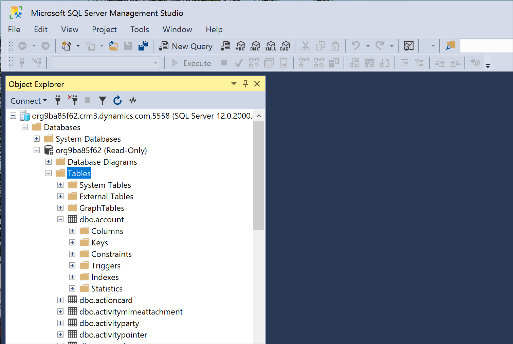
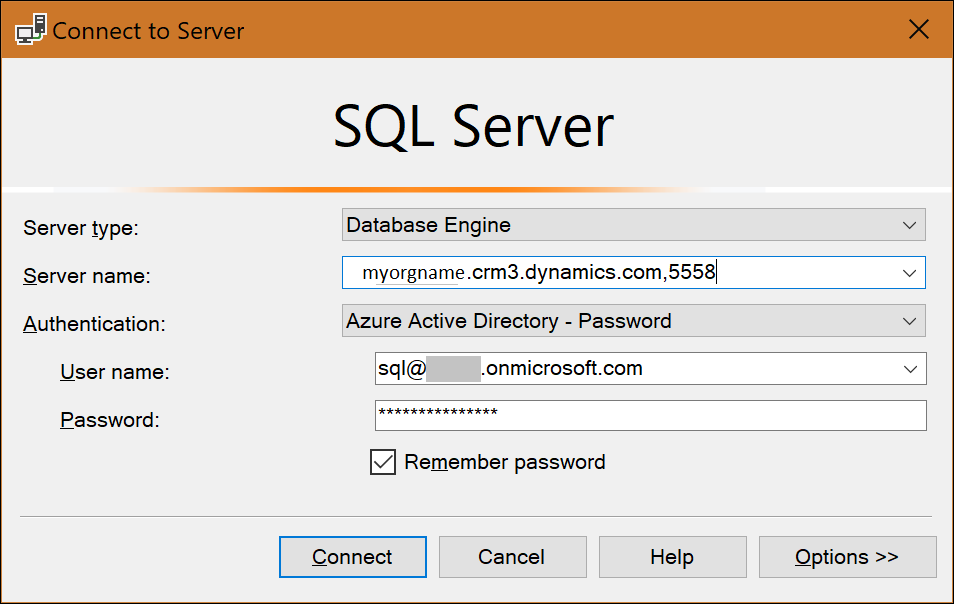
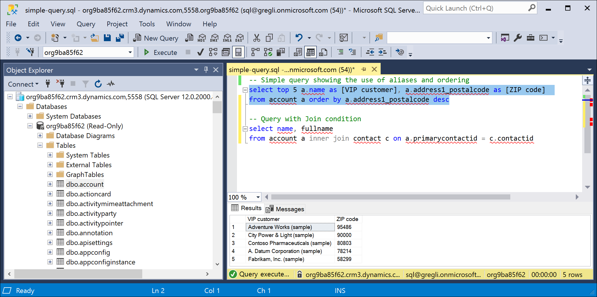
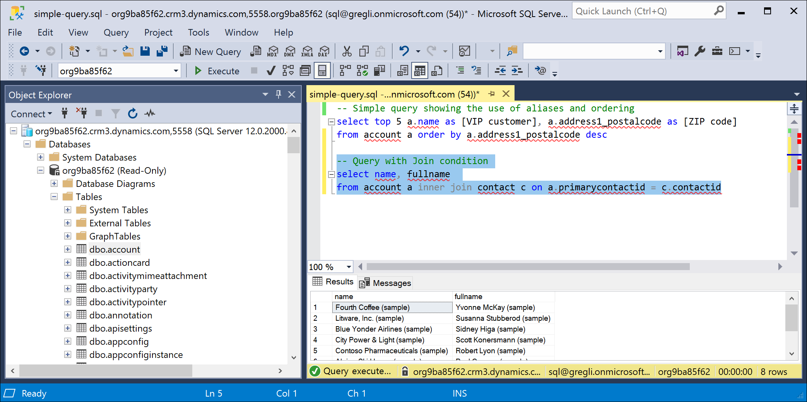

# Use SQL to query data (Preview)

[!INCLUDE[cc-beta-prerelease-disclaimer](../../includes/cc-beta-prerelease-disclaimer.md)]

A SQL data connection is available on the Common Data Service endpoint. The SQL connection provides read-only access to the entity data of the target Common Data Service environment. This allows you to write and execute SQL queries against the entity data table. Table columns provide the attribute data of the entity. No custom views of the data have been provided.

> [!IMPORTANT]
> - This is a preview feature, and isn't available in all regions.
> - [!INCLUDE[cc_preview_features_definition](../../includes/cc-preview-features-definition.md)]
> - Instructions to enable the feature can be found here: [View entity data in Power BI Desktop](/powerapps/maker/common-data-service/view-entity-data-power-bi).

## Applications support

You can use the **Analyze in Power BI** option (**Data** > **Entities** > **Analyze in Power BI**) in Power Apps (https://make.powerapps.com) to use the SQL connection feature to analyze data in Power BI Desktop. More information: [View entity data in Power BI Desktop](/powerapps/maker/common-data-service/view-entity-data-power-bi)

> [!NOTE]
> To verify if your target environment has the Common Data Service SQL connection feature enabled, do the following:
> 1. Sign into Power Apps, on the left navigation pane expand **Data**, and then select **Entities**.
> 2. On the command bar, you should see a button **Analyze in Power BI**. If you do not see this button, your environment does not yet have the feature.

You can also use [SQL Server Management Studio](/sql/ssms/download-sql-server-management-studio-ssms) (SSMS) version 18.4 or later with the Common Data Service endpoint SQL connection. Examples of using SSMS with the SQL data connection are provided below.



## Security and authentication

The Common Data Service endpoint SQL connection uses the Common Data Service security model for data access. Data can be obtained for all entities to which a user has access to in Common Data Service.

Only Azure Active Directory authentication is supported. SQL authentication and Windows authentication are not supported. Below is an example of how to logon to the SQL connection in SSMS. Notice the server name is the organization address URL followed by a comma and the port value of 5558.



## Example entity data queries

Below are a couple of example queries composed in SSMS. The first image shows a simple query using aliases and result ordering.

```tsql
select top 5 a.name as [VIP customer], a.address1_postalcode as [ZIP code] from account a order by a.address1_postalcode desc
```



This next query shows a JOIN.

```tsql
select name, fullname from account a inner join contact c on a.primarycontactid = c.contactid
```



## Supported operations and data types

The list of supported SQL operations includes:

- Batch operations
- SELECT
- Aggregation functions (i.e., Count() and Max() functions)
- UNIONs and JOINs
- Filtering

Any operation that attempts to modify data (i.e., INSERT, UPDATE) will not work as this is a read-only SQL data connection. Common Data Service option sets are represented as \<OptionSet\>Name and \<OptionSet\>Label in a result set.

The following Common Data Service datatypes are not supported with the SQL connection: binary, image,
ntext, sql_variant, varbinary, virtual, HierarchyId, managedproperty, file, xml, partylist, timestamp.

### See also

[Use FetchXML to construct a query](use-fetchxml-construct-query.md)
