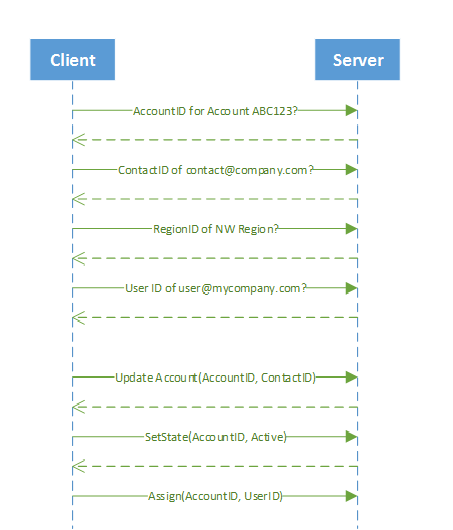
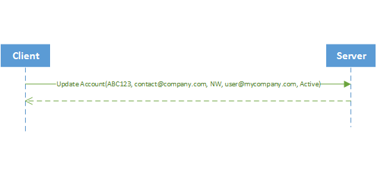

# Data Synchronization

Sometimes you’ll need to synchronize and integrate Common Data Service for Apps data with data that is stored in other systems. The common data integration patterns include taking data from an external system and pushing it into CDS for Apps, taking data from CDS for Apps and synchronizing it to some external data store, or updating CDS for Apps with external data. You can now use several new capabilities to make it easier to write code to achieve these scenarios.  

 These new features can be used separately as needed in any situation, but together they address common issues related to synchronizing and integrating data with external data. The following table introduces these new features.  

|            Feature            |                                                                                                                                                                                                                                                                                                                                                                                                                                                                                                                                                                                                                                                                                                                                                                                                                                                                                                                                                                                                                                                                                                                                                          Description                                                                                                                                                                                                                                                                                                                                                                                                                                                                                                                                                                                                                                                                                                                                                                                                                                                                                                                                                                                                                                                                                                                                                          |
|-------------------------------|-------------------------------------------------------------------------------------------------------------------------------------------------------------------------------------------------------------------------------------------------------------------------------------------------------------------------------------------------------------------------------------------------------------------------------------------------------------------------------------------------------------------------------------------------------------------------------------------------------------------------------------------------------------------------------------------------------------------------------------------------------------------------------------------------------------------------------------------------------------------------------------------------------------------------------------------------------------------------------------------------------------------------------------------------------------------------------------------------------------------------------------------------------------------------------------------------------------------------------------------------------------------------------------------------------------------------------------------------------------------------------------------------------------------------------------------------------------------------------------------------------------------------------------------------------------------------------------------------------------------------------------------------------------------------------------------------------------------------------------------------------------------------------------------------------------------------------------------------------------------------------------------------------------------------------------------------------------------------------------------------------------------------------------------------------------------------------------------------------------------------------------------------------------------------------------------------------------------------------------------------------------------------------------------------------------------------------|
| Removing specialized messages |                                                                                                                                                                                                                                                                                                                                                                                                                                                                                                                                                                                                                                                                                                                                       CDS for Apps has a number of specialized messages for specific operations that update records. These messages are deprecated in this release and you should now simply use `Update` to perform the same operations. The deprecated messages are:   -   Assign -   SetParentSystemUser -   SetParentTeam -   SetParentBusinessUnit -   SetBusinessEquipment -   SetBusinessUnit -   SetState   Simply updating the record is much simpler than using these messages and should streamline your development for data integration and synchronization scenarios. More information: [Perform specialized operations using Update](/dynamics365/customer-engagement/developer/org-service/perform-specialized-operations-using-update)                                                                                                                                                                                                                                                                                                                                                                                                                                                                                                                                                                                                                                                                                                                                        |
|        Alternate Keys         | In enterprise deployments of CDS for Apps, it’s common for data from external enterprise systems to be loaded into CDS for Apps so that it can be presented to users. These external systems often can’t be extended to store the CDS for Apps record identifiers, known as GUIDs, required for system synchronization. A common solution is to add a custom attribute to an entity in CDS for Apps that can be used to store the identifier of the related record in the external system.   When you build data load processes that update records in CDS for Apps and assign references to related records in CDS for Apps, you first have to make an extra CDS for Apps web service call to retrieve the target CDS for Apps record based on this external identifier. This lookup can be slow if an appropriate index is not in place for the custom attribute, and in CDS for Apps scenarios, each of these lookups requires a costly round-trip across the Internet. These extra round trips can increase by an order of magnitude the time it takes to update each CDS for Apps record and can reduce overall throughput drastically.   Now, web service operations can target a CDS for Apps record using one or more alternate keys instead of a GUID. In addition, entity references to related records can be specified using one or more alternate keys. Because alternate keys are indexed, lookup operations show increased performance as compared to adding a custom attribute as an identifier. If something goes wrong, the system will throw an error and roll back all the changes. More information: [Define alternate keys for an entity](define-alternate-keys-entity.md) |
|        Change tracking        |                                                                                                                                                                                                                                                                                                                                                                                                                                                                                                                                                                                                                                                                                                                                                                                                                                                                         When organizations need to maintain CDS for Apps data in external storage there is now a way to keep that data synchronized in a performant way by detecting what data has changed since the data was initially extracted or last synchronized. The <xref:Microsoft.Xrm.Sdk.Messages.RetrieveEntityChangesRequest> message is used to retrieve the changes for an entity. See [Use change tracking to synchronize data with external systems](use-change-tracking-synchronize-data-external-systems.md) for more information.                                                                                                                                                                                                                                                                                                                                                                                                                                                                                                                                                                                                                                                                                                                                                                                                                                                                          |
|            Upsert             |                                                                                                                                                                                                                                                                                                                                                                                                                                                                                                                                                                                                                                                                                                                                                                                                                                                 When loading data into CDS for Apps from an external system, you may not know if a record already exists in CDS for Apps and should be updated, or whether you must create a new record. Use the new <xref:Microsoft.Xrm.Sdk.Messages.UpsertRequest> message to update the record if it exists, or create a new record if it doesn’t exist, in one API call. More information: [Update Dynamics 365 with external data using Upsert](use-upsert-insert-update-record.md)                                                                                                                                                                                                                                                                                                                                                                                                                                                                                                                                                                                                                                                                                                                                                                                                                                                  |

 The following table compares the complexity of synchronizing with and without these new features.  

|                                                       Before                                                        |                                                                                                                                                                                                                                                                                                                     Description                                                                                                                                                                                                                                                                                                                      |
|---------------------------------------------------------------------------------------------------------------------|------------------------------------------------------------------------------------------------------------------------------------------------------------------------------------------------------------------------------------------------------------------------------------------------------------------------------------------------------------------------------------------------------------------------------------------------------------------------------------------------------------------------------------------------------------------------------------------------------------------------------------------------------|
|  | For each record:   1.  Query CDS for Apps to see if the account exists. If it exists, get its account ID (for example, ABC123) 2.  Query the contacts to verify that the contact exists. If it exists, get the email ID of the contact (for example, contact@company.com). 3.  Query to get or set the region ID (for example, NW). 4.  Query to get the user ID to set the owner (for example, user@mycompany.com) 5.  Update the account. 6.  Set the state of the account by calling the `SetState` API. 7.  Assign the owner by calling the `Assign` API. |

 Now, with the new features, it just takes one call to the server to perform the same operations as previously shown.  

|                                                After                                                 |                                                                                                   Description                                                                                                   |
|------------------------------------------------------------------------------------------------------|-----------------------------------------------------------------------------------------------------------------------------------------------------------------------------------------------------------------|
|  | Just one call to verify that there is an account with the unique ID ABC123, set the primary contact to contact@company.com, set the region to NW, set the owner to user@mycompany.com and the status to active. |

## In This Section  
 [Define alternate keys for an entity](define-alternate-keys-entity.md) 
 [Using alternate keys](use-alternate-key-create-record.md) 
 [Use change tracking to synchronize data with external systems](use-change-tracking-synchronize-data-external-systems.md) 
 [Update Dynamics 365 with external data using Upsert](use-upsert-insert-update-record.md) 
 [Sample: Insert or update a record using Upsert](/dynamics365/customer-engagement/developer/sample-insert-update-record-upsert) 
 [Sample: Synchronize data with external systems using change tracking](/dynamics365/customer-engagement/developer/sample-synchronize-data-external-systems-using-change-tracking)  

## Related Sections  
 [Perform specialized operations using Update](/dynamics365/customer-engagement/developer/org-service/perform-specialized-operations-using-update)  
 [Developers guide to customization for Dynamics 365](/dynamics365/customer-engagement/developer/customize-dev/customize-applications)  