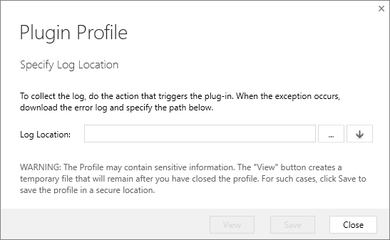
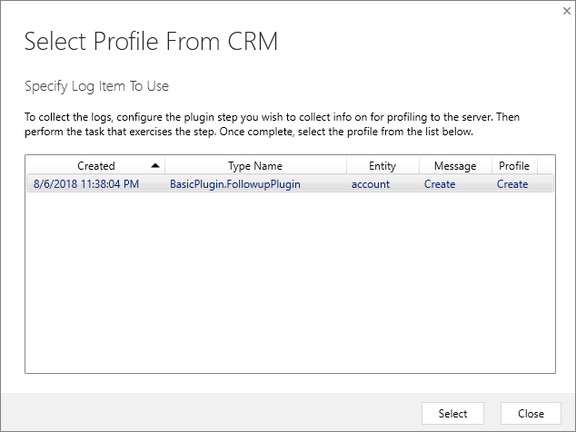
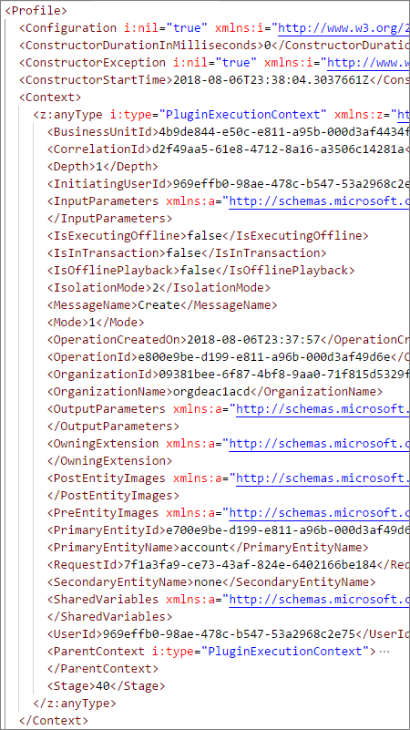

# Debug Plug-ins

The process of writing, registering, and debugging a plug-in is:

1. Create a .NET Framework Class library project in Visual Studio
1. Add the `Microsoft.CrmSdk.CoreAssemblies` NuGet package to the project
1. Implement the <xref:Microsoft.Xrm.Sdk.IPlugin> interface on classes that will be registered as steps.
1. Add your code to the <xref:Microsoft.Xrm.Sdk.IPlugin.Execute*> method required by the interface
    1. Get references to services you need
    1. Add your business logic
1. Sign & build the assembly
1. Test the assembly
    1. Register the assembly in a test environment
    1. Add your registered assembly and steps to an unmanaged solution
    1. **Test the behavior of the assembly**
    1. **Verify expected trace logs are written**
    1. **Debug the assembly as needed**

Content in this topic coverts the steps **in bold** above and supports the following tutorials:

- [Tutorial: Write a plug-in](tutorial-write-plug-in.md)
- [Tutorial: Debug a plug-in](tutorial-debug-plug-in.md)
- [Tutorial: Update a plug-in](tutorial-update-plug-in.md)

## Test your assembly

The simplest way to test your assembly may simply be to manually perform the operation using the app. But you should also be aware that events that cause plug-ins to execute can be initiated in multiple ways, such as an entity created from a workflow, or from the web services.

The attribute values or other execution context information may be different depending on how the action is performed. When writing your plug-in, make sure you practice defensive programming practices and don't assume that every value you expect will always be there.

You may want to write a program that will automate performing the operations that will cause your plug-in to fire and include a number of possible variations.

If you want to use a test automation framework, you will find that the community has created some tools for this. One example is [Fake Xrm Easy](https://dynamicsvalue.com/home)

> [!NOTE]
> Microsoft does not provide support for tools created by the community. If you have any issues with a community tool, please contact the publisher.

## Use Tracing

As described in [Use the tracing service](write-plug-in.md#use-the-tracing-service), you can write messages to the [PluginTraceLog Entity](reference/entities/plugintracelog.md) within the code of your plug-in by using the <xref:Microsoft.Xrm.Sdk.ITracingService>.<xref:Microsoft.Xrm.Sdk.ITracingService.Trace*> method.

Before you will be able to use this service, you must enable tracing in your CDS for Apps environment. The process is described in  [View trace logs](tutorial-write-plug-in.md#view-trace-logs).

> [!NOTE]
> Trace logging takes up organization storage space especially when many traces and exceptions are generated. You should only turn trace logging on for debugging and troubleshooting, and turn it off after your investigation is completed.

While debugging, you can easily query the trace logs for a given plug-in class using the Web API in your browser. If your assembly is named `BasicPlugin.FollowUpPlugin`, you can use this query in your browser address field:

`GET <your org uri>/api/data/v9.0/plugintracelogs?$select=messageblock&$filter=typename eq 'BasicPlugin.FollowUpPlugin'`

The JSON results will be returned to your browser like so:


```json
{
    "@odata.context": "<your org uri>/api/data/v9.0/$metadata#plugintracelogs(messageblock)",
    "value": [{
        "messageblock": "FollowupPlugin: Creating the task activity.",
        "plugintracelogid": "f0c221d1-7f84-4f89-acdb-bbf8f7ce9f6c"
    }]
}
```

> [!TIP]
> This works best if you install a browser plug-in that will format the returned JSON. Or you may want to use Postman. More information: [Use Postman with Web API](/dynamics365/customer-engagement/developer/webapi/use-postman-web-api)
> 
> You may prefer to use the [XrmToolbox Plugin Trace Viewer](https://www.xrmtoolbox.com/plugins/Cinteros.XrmToolBox.PluginTraceViewer/). This community tool is not supported by Microsoft. If you have questions pertaining to this tool, contact the publisher.

Tracing messages can also be found in the log file that can be downloaded when a synchronous plug-in or custom workflow assembly throws an error that results in an error dialog that is displayed to the user. The user can select the **Download Log File** button to view the log containing details of the exception and the trace output.

For asynchronous registered plug-ins and workflow assemblies that return an exception, the tracing information is shown in the details area of the **System Job** form in the web application.

> [!NOTE]
> If your custom code executes within a database transaction, and an exception occurs that causes a transaction rollback, all entity data changes by your code will be undone. However, the `PluginTraceLog` entity records will remain after the rollback completes.

## Use Plug-in profiler

Plug-in profiler is a solution that you can install on your environment that enables you to capture the execution context of a plug-in and then use that data to re-play the event within Visual Studio while debugging.

You can find instructions to install and use Plug-in profiler in the [Tutorial: Debug a plug-in](tutorial-debug-plug-in.md). See [Install plug-in profiler](tutorial-debug-plug-in.md#install-plug-in-profiler) and [Debug your plug-in](tutorial-debug-plug-in.md#debug-your-plug-in)

### View Plug-in Profile data

After you have installed the Plug-in profiler and captured some profiles, you can view the event context and replay data that is used when you debug. Viewing this data can help you understand the execution context data that your plug-in can use.

You can view this data using the Plug-in Registration tool by selecting the **View Plug-in Profile** command. This will open the Plugin Profile dialog



Select the  icon and in the **Select Profile from CRM** dialog, specify the log item to use.



And then select **View** in the **Plugin Profile** dialog.

This will download an open an XML file with the profile information. The `Context` element represents the execution context passed to the plug-in.




<!-- 
TODO Pri 2

We documented these previously at https://docs.microsoft.com/en-us/dynamics365/customer-engagement/developer/analyze-plugin-performance#run-the-plug-in-profiler-standalone

This content simply elaborates on the parameters displayed with /?

However, 
1. I understand the parameters may be out of date
2. We need to provide a use case scenario for this
    - Why would someone do this?
    - What are useful parameters in a scenario that doesn't use the developer toolkit?

### Run Plug-in Profiler from a command window

The profiler can be executed from a Command Prompt window independent of the Plug-in Registration tool. 

1. Open a Command Prompt window and set the working directory to the folder where you downloaded the Plug-in registration tool.
1. Type the command `PluginProfiler.Debugger.exe` passing in the parameters below

|parameter|short-cut|description|
|--|--|--|
|`/nologo`||Suppresses the banner.|
|`/url:`*&lt;url&gt;*||A url or path to the organization service endpoint to use when calling an IOrganizationService instance (not required for replay operations).|
|`/file:`*&lt;filename&gt;*|`/f:`|The path to the debugging log file. |
|`/assembly:`*&lt;path&gt;*|`/a:`|Path to the plug-in assembly to be executed. |
|`/type:`*&lt;typename&gt;*|`/t:`|Plug-in type that should be instantiated with this profile.|
|`/username:`*&lt;username&gt;*|`/u:`|Username of an administrator to use when connecting to the server.|
|`/password:`*&lt;password&gt;*|`/p:`|Password of an administrator to use when connecting to the server. |
|`/domain:`*&lt;domain&gt;*|`/d:`|Domain of an administrator to use when connecting to the server. |
|`/operation:`*&lt;operation type&gt;*|`/o:`|Type of operation being executed: `Replay`, `Debug`, `Enable`, or `Remove`.|
|`/isolation:`*&lt;mode&gt;*|`/i:`|Isolation Mode: `None` or `Sandbox`.|
|`/id:`*&lt;id&gt;*||Id of the profiled operation or operation to be profiled.*|
|`/name:`*&lt;name&gt;*|`/n:`|Name of the profiled operation or operation to be profiled.*|
|`/profiledoperation:`*&lt;type&gt;*|`/po:`| Type of operation to be profiled `Plugin` or `WorkflowActivity`.*|
|`/workflowstep:`*&lt;step name&gt;*|`/wfs:`|One or more ids for the custom activity steps in the workflow.*|
|`/key:`*&lt;path&gt;*||File name to the key that should be used when building an instrumented assembly (Only required when enabling/disabling profiling for workflows).|
|`/persist`||Indicates that the profile should be persisted.*|
|`/persistkey:`*&lt;key&gt;*|`/x:`|Session key to be used when serializing the profile to an entity.*|
|`/maxiterations:`*&lt;number&gt;*|`/max:`|Number of times the plug-in should be profiled before profiling is disabled.*|
|`/excludesecure`||Indicates that secure information should be excluded when generating profile.*|
|`/help`|`/?`|Show this usage message.|
|`/connectionname:`*&lt;name&gt;*|`/connname:`|App name to use the connection profile from.|
|`/connectionprofilename:`*&lt;name&gt;*|`/connprofile:`|Profile Name to use.|
|`/secureconfiguration:`*&lt;config&gt;*|`/sconfig:`|Secure Configuration.|
|`/unsecureconfiguration:`*&lt;config&gt;*|`/uconfig:`|Unsecure Configuration.|
|`/debugprofileid:`*&lt;id&gt;*||ID of the Debugging Profile from CRM to load|

*Only required when enabling/disabling profiling 

-->


