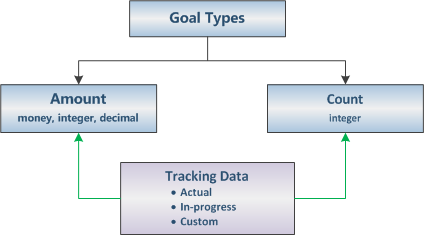

# Define goal metric and rollup fields

To specify the goal metric type, participating entities, and whether you track actuals, custom or in-progress data, use the goal metric entity (`Metric`) and the rollup field (`RollupField`) entity. The goal metric and the rollup fields have a parental relationship in which all operations on the parent record are propagated to the child records. For more information about parental relationship and cascading rules, see [Entity Relationship Behavior](/dynamics365/customer-engagement/developer/entity-relationship-behavior).  
  
> [!IMPORTANT]
>  All goals in the hierarchy must be based on the same goal metric and time period. If you create a child goal that is based on a different goal metric, an exception is thrown. If you specify a different time period for a child goal, the system will ignore the specified time period and use the parent goal time period. You can associate a goal with a new metric, if the goal does not have a parent goal or a child goal. Otherwise, an exception is thrown when you update the goal record.  

   

## Create Goal Metric  
 There are two goal metric types: Amount and Count. The Amount metric type is expressed as a money value, an integer, or a decimal number. The Count metric type is an integer. For example, you can use the Amount (money) goal metric to track the revenues from all active opportunities or sales orders. An integer type can be used to track sales calls made by a salesperson. A decimal number can represent a product sold by weight, such as grain or sugar.  
  
 To specify the goal metric type and whether you are tracking data against target or stretch target, use the goal metric entity (`Metric`). To select Amount or Count, use the `Metric.IsAmount` attribute. Use the `Metric.AmountDataType` attribute to specify the Amount data type. 
 The possible values for this attribute are defined in the `metric_goaltype` global option set. To specify whether the goal tracks data against target or stretch target, use the `Metric.IsStretchTracked` attribute. To associate a goal with a metric, use the `Goal.MetricId` attribute.  
  
 Each goal can track actual, in-progress, and custom data as shown in the following diagram.  
  
   
  
 To track actual, in-progress, and custom data, you use the goal entity attributes, referred to as rollup fields. For example, if an opportunity is closed as “Won”, an amount of revenue generated from this opportunity can be rolled into the actual money amount rollup field. Or, if an opportunity is “Open”, the opportunity’s estimated revenue can be added to the in-progress money amount rollup field. The following table lists the relationship between the goal metric type and the rollup fields available for each type.  
  
|Goal metric type|Available rollup fields|  
|----------------------|-----------------------------|  
|Amount (money)|`Goal.ActualMoney`   `Goal.InProgressMoney`   `Goal.CustomRollupFieldMoney`|  
|Amount (integer) or Count|`Goal.ActualInteger`   `Goal.InProgressInteger`   `Goal.CustomRollupFieldInteger`|  
|Amount (decimal)|`Goal.ActualDecimal`   `Goal.InProgressDecimal`   `Goal.CustomRollupFieldDecimal`|  
  
 Other examples of rollup data are `Lead.EstimatedAmount` and `OpportunityClose.ActualRevenue` that can be rolled into the `Goal.InProgressMoney` and the `Goal.ActualMoney` rollup fields. The custom rollup fields are extra fields that you can use for integer, decimal, and money values.  
  
   
## Specify Rollup Fields  
 To specify other important rollup information, use the rollup field entity.  
  
|Attribute|Rollup information|  
|---------------|------------------------|  
|`RollupField.GoalAttribute`|A goal rollup field, such as `Goal.ActualMoney`, `Goal.CustomRollupFieldMoney` or `Goal.InProgressMoney`.|  
|`RollupField.SourceEntity`|A source entity from where data is being rolled up, such as lead, opportunity, or sales order.|  
|`RollupField.SourceAttribute`|An entity attribute from where data is being rolled up, such as `Opportunity.ActualValue` or `Lead.EstimatedValue`. A source attribute and a goal rollup field must be of the same type, such as money or integer; otherwise, an exception is thrown when you create a rollup field record.|  
|`RollupField.DateAttribute`|The date that is validated against the goal time period, such as `Opportunity.ActualCloseDate` or `Lead.EstimatedCloseDate`. A record participates in the goal rollup, if the specified date falls between the start date and the end date for the goal. For example, if an opportunity is closed between the start and end dates for the goal, revenue generated from this opportunity is added to the goal’s total revenue; otherwise, it is not included.|  
|`RollupField.SourceState`|The state of the source record such as “Won” or” Lost” opportunity.|  
|`RollupField.SourceStatus`|The status reason for the state of the source record, such as “Won” for won opportunities, or “Canceled” or “Out-sold” for the lost opportunities.|  
|`RollupField.IsStateParentEntityAttribute`|Indicates whether state or status belong to the parent entity. For example, for the opportunity product that does not have its own state, you can use state and status of the parent opportunity record.|  
  
 For each goal metric, you can create up to three rollup field records. Each record can specify actual, in-progress, or custom amount or count. You can use the same source entity or difference source entities for all rollup field records. For example, in a goal metric that specifies the Money type, you can use an opportunity entity as a source entity and `Opportunity.ActualValue` as a source attribute. This lets you track the actual money amounts in all opportunities that are closed as “Won”. The `Opportunity.EstimatedValue` can be used to track the revenue that is expected after the opportunity is closed.  
  
### See also  
 [Goal Management Entities](goal-management-entities.md)   
 [Add Complex Goal Criteria](add-complex-goal-criteria.md)
