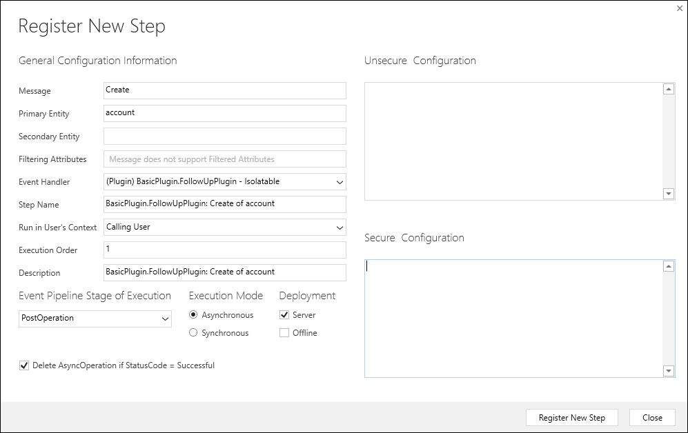

# Event Framework

<!-- Re-write from
https://docs.microsoft.com/en-us/dynamics365/customer-engagement/developer/introduction-event-framework
https://docs.microsoft.com/en-us/dynamics365/customer-engagement/developer/event-execution-pipeline

See notes at https://microsoft-my.sharepoint.com/:w:/p/jdaly/EfmTW7DQXNREuqj1s7tBtIIB4VZmvasZ1Nsbl4F5zlD1ZQ?e=FNlBmr 

Make sure to call out the changes due to the legacy update messages. That information was moved.

See 
https://docs.microsoft.com/en-us/dynamics365/customer-engagement/developer/org-service/perform-specialized-operations-using-update#impact-of-this-change-on-plug-ins

https://docs.microsoft.com/en-us/dynamics365/customer-engagement/developer/org-service/perform-specialized-operations-using-update#impact-of-this-change-on-workflows

-->

The capability to extend the default behavior of Common Data Service for apps depends on detecting when events occur on the server. The *Event Framework* provides the capability to register custom code to be run in response to specific events. 

All capabilities to extend the default behavior of the platform depend on the event framework. When you configure a workflow to respond to an event using the workflow designer without writing code, that event is provided by the event framework. 

As a developer, you will use the *Plug-in registration tool* to configure plug-ins, Azure integrations, virtual entity data providers, and Web Hooks to respond to events that are provided by the event framework. When events occur and an extension is registered to respond to them, contextual information about the data involved in the operation is passed to the extension. Depending on how the registration for the event is configured, the extension can modify the data passed into it, intiate some automated process to be applied immediately, or define that an action is added to a queue to be be performed later.

To leverage the event framework for your custom extensions you must understand:

 - What events are available
 - How the event is processed
 - What kind of data is available to your extension when the event occurs
 - What time and resource constraints apply
 - How to monitor performance

## Available events

As described in [Use messages with the Organization service](org-service/use-messages.md), data operations in the CDS for Apps platform are based on messages and every message has a name. There are `Create`, `Retrieve`, `RetrieveMultiple`, `Update`, `Delete`, `Associate` and `Disassociate` messages that cover the basic data operations that happen with entities. There are also specialized messages for more complex operations. Custom actions add new messages.

When you use the Plug-in registration tool to associate an extension with a particular message, you will register it as a *step*. The screenshot below is the **Register New Step** dialog used when registering a plug-in.

A step provides the information about which message the extensions should respond to as well as a number of other configuration choices. Use the **Message** field to choose the message your extension will respond to.

Generally, you can expect to find a message for most of the **Request* classes in the <xref:Microsoft.Crm.Sdk.Messages> or <xref:Microsoft.Xrm.Sdk.Messages> namespaces, but you will also find messages for any custom actions that have been created in the organization. Any operations involving entity metadata are not available.

Data about messages is stored in the [SdkMessage](reference/entities/sdkmessage.md) and [SdkMessageFilter](reference/entities/sdkmessagefilter.md) entities. The Plug-in registration tool will filter this information to only show valid messages.

> [!CAUTION]
> The `Execute` message is available, but you should not register extensions for it since it is called by every operation.

## Event execution pipeline

When you register a step using the Plug-in registration tool you must also choose the **Event Pipeline Stage of Execution**.  Each message is processed in a series of 4 stages as described in the following table:

|Name|Description|
|--|--|
|**PreValidation** Stage: 10|[!INCLUDE [cc-prevalidation-description](../../includes/cc-prevalidation-description.md)]|
|**PreOperation** Stage: 20|Occurs before the main system operation and within the database transaction.  If you want to change any values for an entity included in the message, you should do it here.  Avoid cancelling an operation here. Canceling will trigger a rollback of the transaction and have significant performance impact.|
|**MainOperation** Stage: 30|For internal use only.|
|**PostOperation** Stage: 40|Occurs after the main system operation and within the database transaction.  Use this stage to modify any properties of the message before it is returned to the caller.  Avoid applying changes to an entity included in the message because this will trigger a new Update event.|

The stage you should choose depends on the purpose of the extension. You don't need to apply all your business logic within a single step. You can apply multiple steps so that your logic about whether to allow a operation to proceed can be in the **PreValidation** stage and your logic to make modifications to the message properties can occur in the **PostOperation** stage.

> [!IMPORTANT]
> An exception thrown by your code at any stage will cause the entire transaction to be rolled back. You should be careful to ensure that any possible exception cases are handled by your code. If you want to cancel the operation, you should detect this in the **PreValidation** stage and only throw a <xref:Microsoft.Xrm.Sdk.InvalidPluginExecutionException> containing an appropriate message describing why the operation was cancelled.

Multiple extensions can be registered for the same message and stage. Within the step registration the **Execution Order** value determines the order in which multiple extensions should be processed for a given stage.

Information about registered steps is stored in the [SdkMessageProcessingStep Entity](reference/entities/sdkmessageprocessingstep.md).

<!-- Move the following out to a separate topic? START -->

### Behavior of specialized update operations

There are several deprecated specialized messages that perform update operations. In earlier versions it was required to use these messages, but now the same operations should be performed using <xref:Microsoft.Xrm.Sdk.IOrganizationService>.<xref:Microsoft.Xrm.Sdk.IOrganizationService.Update*> or <xref:Microsoft.Xrm.Sdk.Messages.UpdateRequest> class with <xref:Microsoft.Xrm.Sdk.IOrganizationService>.<xref:Microsoft.Xrm.Sdk.IOrganizationService.Execute*>

[!INCLUDE [cc-legacy-update-messages](includes/cc-legacy-update-messages.md)]

More information: [Legacy update messages](org-service/entity-operations-update-delete.md#legacy-update-messages) 

This change introduced some special behaviors that should be noted for plug-ins and workflows. 

#### For Plug-ins

When update requests are processed that include both owner fields plus other standard fields for business owned entities, plug-ins registered for the **Update** message in **PreOperation** and/or **PostOperation** stages execute once for all non-owner fields, and then once for the owner fields. Examples of owner fields would be `businessunit` and `manager` (for a [SystemUser Entity](reference/entities/systemuser.md)). Examples of business owned entities include [SystemUser](reference/entities/systemuser.md), [BusinessUnit](reference/entities/businessunit.md),[Equipment](/dynamics365/customer-engagement/developer/entities/equipment) and [Team](reference/entities/team.md).

When update requests are processed that include both state/status fields plus other standard fields, plug-ins registered for the **Update** message in **PreOperation** and/or **PostOperation** stages execute once for all non-state/status fields, and then once for the state/status fields.

In order for plug-in code to receive the full data changes of the update, you must register the plug-in in the **PreOperation** and then store relevant information in <xref:Microsoft.Xrm.Sdk.IExecutionContext.SharedVariables> in the plug-in context for later plug-ins (in the pipeline) to consume.

#### For Workflows

When update requests are processed that include both owner fields plus other standard fields, workflows registered for the **Update** message execute once for all non-owner fields, and then once for the owner fields. Workflows registered for the **Assign** message by users continue to be triggered by updates to owner fields.

When update requests are processed that include both state/status fields plus other standard fields, workflows registered for the **Update** message execute once for all non-state/status fields, and then once for the state/status fields. Workflows registered for the **Change Status** step continue to be triggered by updates to state/status fields.

<!-- Move the following out to a separate topic? END -->

## Event context

If your extension is a Plug-in, it will recieve a parameter that implements the <xref:Microsoft.Xrm.Sdk.IPluginExecutionContext> interface. This class provides some information about the <xref:Microsoft.Xrm.Sdk.IPluginExecutionContext.Stage> that the plugin is registered for as well as information about the <xref:Microsoft.Xrm.Sdk.IPluginExecutionContext.ParentContext> which provides information about any operation within another Plug-in that triggered the current operation.

If your extension is an a Web hook or an Azure Service bus endpoint, the data that will be posted to the registered endpoint will be in form of a <xref:Microsoft.Xrm.Sdk.RemoteExecutionContext> which implements both <xref:Microsoft.Xrm.Sdk.IPluginExecutionContext> and <xref:Microsoft.Xrm.Sdk.IExecutionContext>

### Information about the operation

The properties of the <xref:Microsoft.Xrm.Sdk.IExecutionContext> interface are the ones which provide most of the details about the operation that occurred.

Two of the key properties about the event are found in the <xref:Microsoft.Xrm.Sdk.IExecutionContext.InputParameters> and <xref:Microsoft.Xrm.Sdk.IExecutionContext.OutputParameters> properties. These <xref:Microsoft.Xrm.Sdk.ParameterCollection> values contain the data of the operation.

All the properties of the <xref:Microsoft.Xrm.Sdk.IPluginExecutionContext> are read-only, but your extension can modify the contents of properties that are collections.

In the **PreValidation** and **PreOperation** stages, the <xref:Microsoft.Xrm.Sdk.IExecutionContext.InputParameters> property contains the parameters for the  <xref:Microsoft.Xrm.Sdk.OrganizationRequest> class.

In the **PostOperation** stage the <xref:Microsoft.Xrm.Sdk.IExecutionContext.OutputParameters> contain the parameters for the <xref:Microsoft.Xrm.Sdk.OrganizationResponse> class that will be returned by the operation.

### Shared variables

The <xref:Microsoft.Xrm.Sdk.IExecutionContext.SharedVariables> property allows for including data that can be passed from a plug-in to a step that occurrs later in the execution pipeline. Because this is a <xref:Microsoft.Xrm.Sdk.ParameterCollection> value, plug-ins can add, read, or modifiy properties to share data with subsequent steps

### Entity Images

When you register a step for a plug-in that includes an entity as one of the parameters, you have the option to specify that a copy of the entity data be included as *snapshot* or image using the <xref:Microsoft.Xrm.Sdk.IExecutionContext.PreEntityImages> and/or <xref:Microsoft.Xrm.Sdk.IExecutionContext.PostEntityImages> properties.

This data provides a comparison point for entity data as it flows through the event pipeline. Using these images provides much better performance than including code in a plug-in to retrieve an entity just to compare the attribute values

## Time and resource constraints

There is a 2-minute time limit for message operations to complete. There are also limitations on the amount of CPU and memory resources that can be used by extensions. If the limits are exceeded an exception is thrown and the operation will be cancelled.

If the time limit is exceeded, an <xref:System.TimeoutException> will be thrown. If any custom extension exceeds threshold CPU, memory, or handle limits or is otherwise unresponsive, that process will be killed by the platform. At that point any current extension in that process will fail with exceptions. However, the next time that the extension is executed it will run normally.

## Monitor Performance

Run-time information about plug-ins and custom workflow extensions is captured and store in the [PluginTypeStatistic Entity](reference/entities/plugintypestatistic.md). These records are populated within 30 minutes to one hour after the custom code executes. This entity provides the following data points:

|**Attribute**|**Description**|
|--|--|
|AverageExecuteTimeInMilliseconds|The average execution time (in milliseconds) for the plug-in type. |
|CrashContributionPercent|The plug-in type percentage contribution to crashes. |
|CrashCount|Number of times the plug-in type has crashed. |
|CrashPercent|Percentage of crashes for the plug-in type. |
|ExecuteCount|Number of times the plug-in type has been executed. |
|FailureCount |Number of times the plug-in type has failed. |
|FailurePercent|Percentage of failures for the plug-in type. |
|PluginTypeIdName|Unique identifier of the user who last modified the plug-in type statistic. |
|TerminateCpuContributionPercent |The plug-in type percentage contribution to Worker process termination due to excessive CPU usage. |
|TerminateHandlesContributionPercent |The plug-in type percentage contribution to Worker process termination due to excessive handle usage. |
|TerminateMemoryContributionPercent|The plug-in type percentage contribution to Worker process termination due to excessive memory usage. |
|TerminateOtherContributionPercent|The plug-in type percentage contribution to Worker process termination due to unknown reasons. |

This data is also available for you to browse using the [Organization Insights Plug-ins dashboard](/dynamics365/customer-engagement/admin/use-organization-insights-solution-view-instance-metrics#plug-ins), along with many other useful reports.

