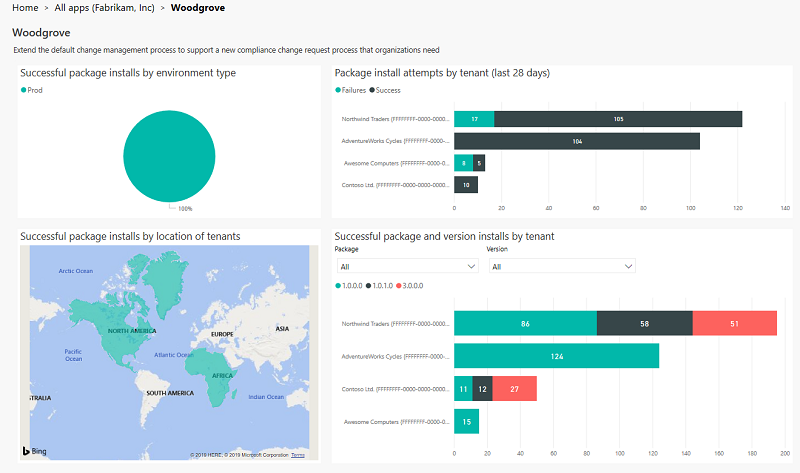
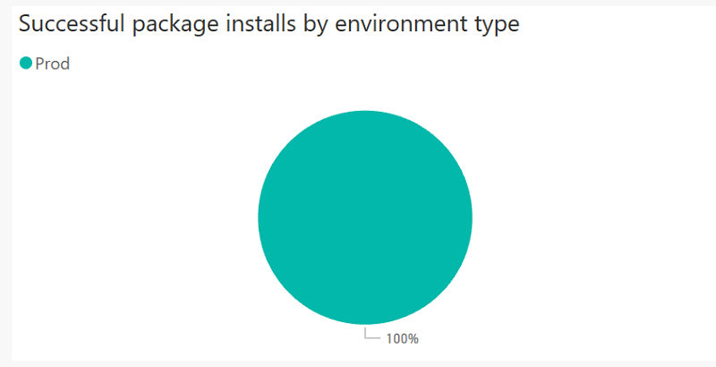
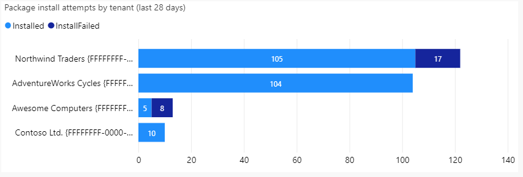
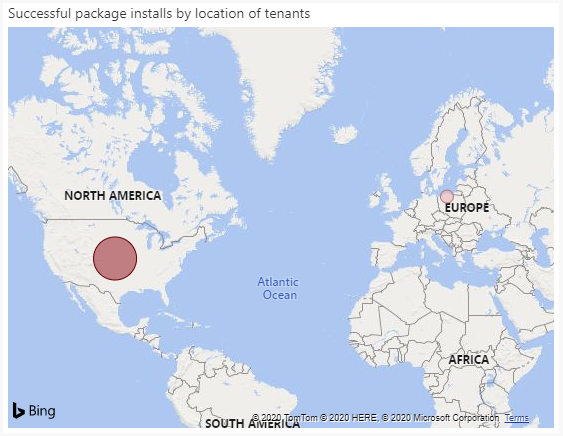
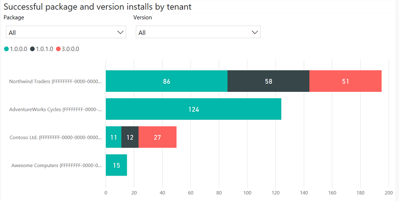

# The App page

[!INCLUDE [cc-beta-prerelease-disclaimer](../../includes/cc-beta-prerelease-disclaimer.md)]

After the user selects an app, the user is navigated to the app's detail page which provides a view to analyze the install history across tenants for that particular app. The app description is from [AppSource](https://appsource.microsoft.com/).

The app detail page contains the following graphs and metrics.

## Successful package installs by environment type

The pie chart shown below illustrates the ratio of production vs. sandbox package installs of the selected app across the install base.

When hovering over the graph, the following information is shown:

1. Organization type – production or sandbox
2. Number of package installs for the organization type

## Package install attempts by tenant (last 28 days)

The bar chart shown below illustrates the number of successful vs. failed package installations of the selected app by tenant over the last 28 days.

When hovering over any item of the graph, the following information is shown:

1. Tenant name and tenant ID
2. Status of package installation (success vs failures) in the tenant
3. Count of package install attempts in the tenant

## Successful package installs by location of tenants

The map shown below illustrates the geographical distribution of the app by tenant location.

When hovering over any region of the graph, the following information is shown:

1. Location
2. Package install count in the selected location

## Successful package and version installs by tenant

The column chart shown below displays the package unique names where versions of the selected app are displayed in a drop-down menu. All packages are selected by default, and all installed versions of all package (by tenant) are displayed on the graph. The user can select one or more packages and versions for further slicing and dicing. When the user selects a package, the versions drop-down is updated to have the corresponding versions of the selected package.

When hovering over any item of the graph, the following information is shown:

1. Tenant name and tenant ID
2. Package version
3. Package install count of the version in the selected tenant

### See also

[Introduction to ISV Studio for the Power Platform](isv-app-management.md)  
[Home page](isv-app-management-homepage.md)  
[Tenant page](isv-app-management-tenantpage.md)
[AppSource checker](isv-app-management-appsource-checker.md)
[Connector certification portal](https://docs.microsoft.com/connectors/custom-connectors/submit-certification)
