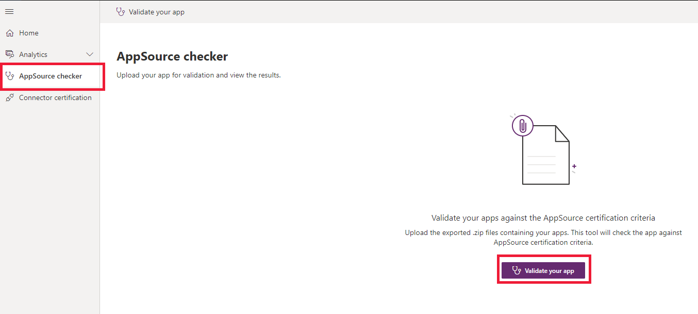
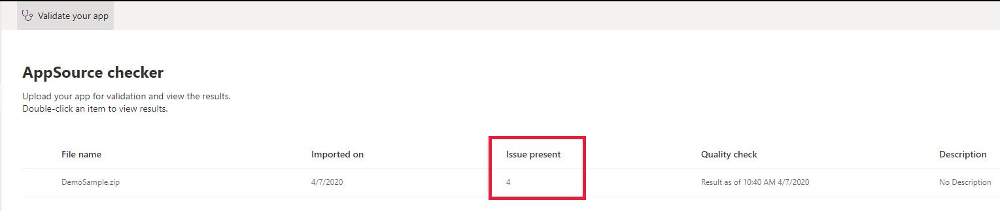

# AppSource checker

[!INCLUDE [cc-beta-prerelease-disclaimer](../../includes/cc-beta-prerelease-disclaimer.md)]

AppSource checker allows an ISV to check the certification criteria of their app prior to [AppSource](https://appsource.microsoft.com/) submission. The checker will let you know if your solution file has errors that need to be corrected or if AppSource certification criteria have not been met. 

In ISV Studio, an ISV can either upload a full [package](/powerapps/developer/common-data-service/package-deployer/create-packages-package-deployer) or solution(s) and be notified of any issues that need to be remediated. To do that:

1. In ISV Studio, select **AppSource checker** tab in the left and then select **Validate your app**.

    > [!div class="mx-imgBorder"]
    > 

2. Click on **Browse** to upload a solution file from your local machine and select **Run Check** to validate.
   
   > [!div class="mx-imgBorder"]
   > 
 
   > [!NOTE]
   > If a user has previously uploaded a solution for validation then you will see a history of submissions instead of the screenshot above.

3. Once the solution checker completes validating, a summary of results will be displayed along with the number of issues present (if any). Double-click on the solution file to see the issues in detail.

   > [!div class="mx-imgBorder"]
   > 

4. If the submission has no errors, you will see the following message:
 
   > [!div class="mx-imgBorder"]
   > 
   
5. An ISV can download the validation report for their app and include it with their AppSource submission. 

## See Also

[Home page](isv-app-management-homepage.md) 
[App page](isv-app-management-apppage.md) 
[Tenant page](isv-app-management-tenantpage.md) 
[Connector Certification](isv-app-management-certification.md)

