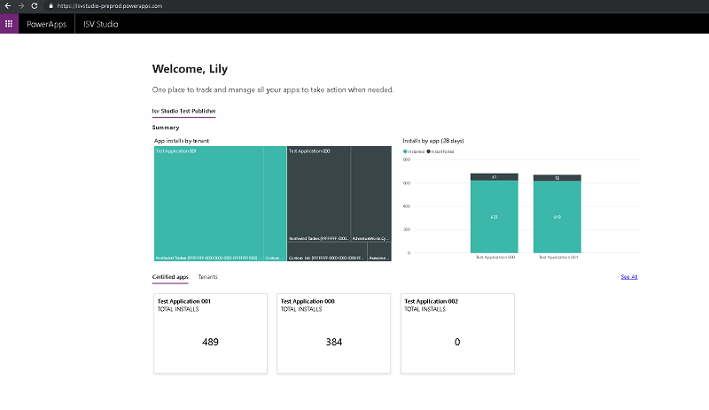
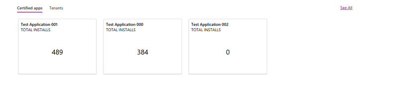
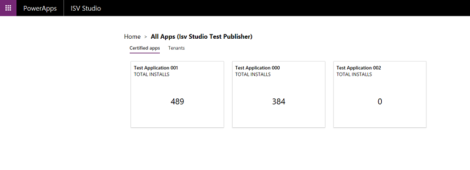

# The Home page

[!INCLUDE [cc-beta-prerelease-disclaimer](../../../../includes/cc-beta-prerelease-disclaimer.md)]

After a user logs into ISV Studio, they are presented with the landing page
known as the *Home* page. A welcome message is displayed which defines the
objective of this page.

If an ISV has multiple publishers, the list of publishers is displayed in a
pivot chart with the first publisher selected by default. All the metrics on
this page are specific to the selected publisher. The user can toggle to a
different publisher name to see the corresponding metrics for that publisher.

The Home page summary section has the following metrics:

## App installs by tenant

Published apps and the tenants that they are
installed in are displayed in descending order based on the number of installs.

## Installs by app (28d)

Published apps, and the number of successful vs.
failed installations across all production environments, over the last 28 days
is displayed here.

.png)

## Other viewing options

Below the summary section, the user can either select an app below the
**Published apps** section or select a tenant from the **Tenants** section to
further drill down into app or tenant metrics.

The user can also select **See all** to show all the apps.

### See also

[Introduction to ISV Studio for the Power Platform](isv-app-managment.md) 
[App and Tenant page features](isv-app-management-other-pages.md)
