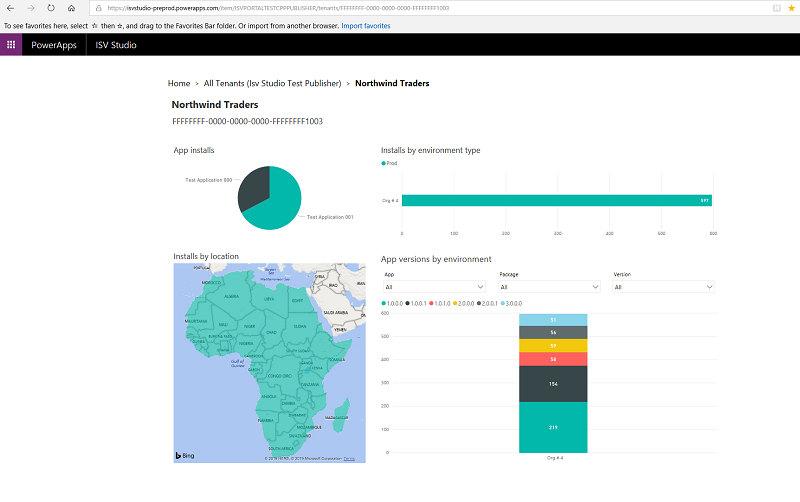
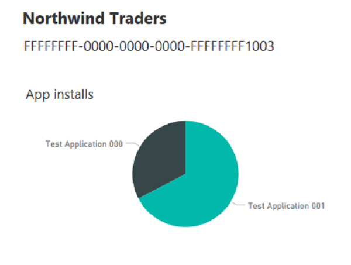
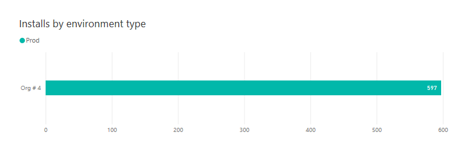
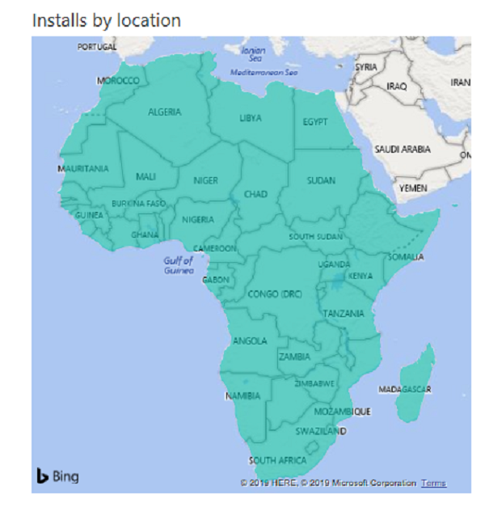
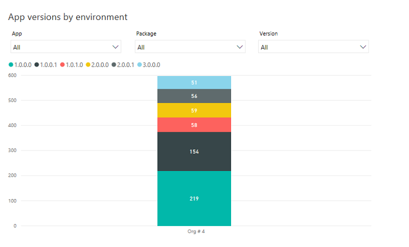

# The App and Tenant pages

The following sections in this topic describe the App and Tenant page features.

[!INCLUDE [cc-beta-prerelease-disclaimer](../../includes/cc-beta-prerelease-disclaimer.md)]

## The App page

Once the user selects an app, the user is navigated to the app’s detail page
which provides a view to analyze the app’s installs across tenants.

The app detail page contains the metrics described in the following sections of this topic.

### Environment ratio

The production vs. sandbox installations of the app across tenants.

### Installs by tenant (28 days)

The number of successful vs. failed installations of the selected app (by tenant) over the last 28 days is displayed here.

.png)

### Installs by location

The geographical distribution of the app by data region is displayed here.

### Installed package versions by tenant

Displays the package unique names where versions of the selected app are displayed in a drop- down menu. The
    first package is selected by default, and all installed versions of the
    package (by tenant) are displayed on the graph. The user can select only one
    package at a time but can multi-select the versions. When the user selects a
    package, the versions drop down is updated to have the corresponding
    versions of the selected package.

## The Tenant page

The Tenant page contains the metrics described in the following sections of this topic.

### App installs by environment

The ISV app distribution across all environments of the selected tenant.

### Installs by environment type

Productions vs. sandbox installations of the ISV apps in the selected tenant.

### Installs by location

The geographical distribution of the tenant based on installs is displayed here.

### App versions by environment

App names, package unique names, and versions of the selected tenant are displayed in drop-down menus. The first
    app package is selected by default, where all the installed versions of the
    selected package (by organization) is displayed on the graph. The user can
    select only one app and package at a time but can multi-select the package
    versions. When the user selects an app, the package drop-down is updated to
    display the corresponding packages of the selected app. When the user
    selects a package, the versions drop-down is updated to display the
    corresponding versions of the selected package.

### See also

[Introduction to ISV Studio for the Power Platform](isv-app-management.md)  
[Home page features](isv-app-management-homepage.md)
