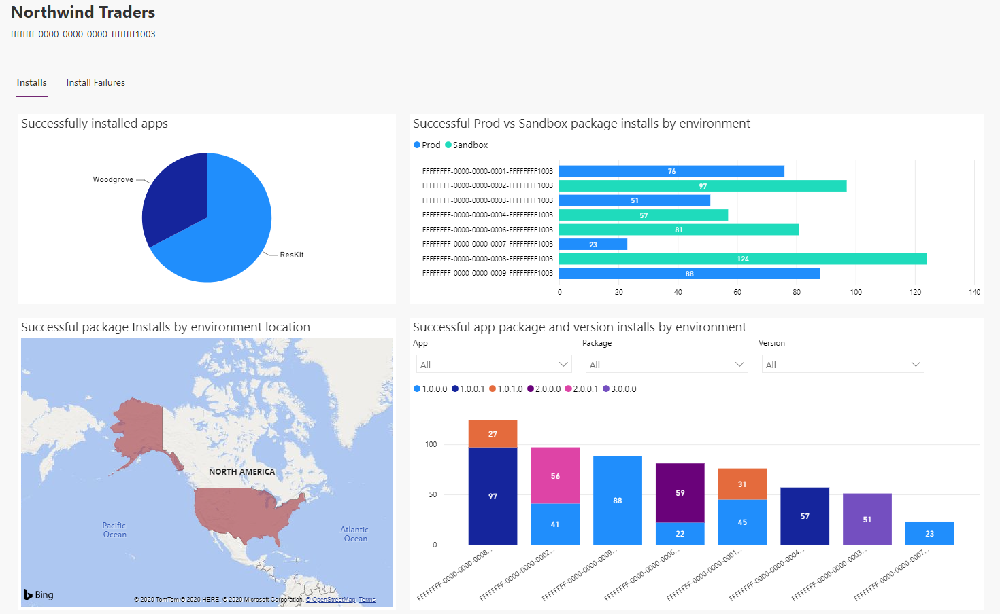
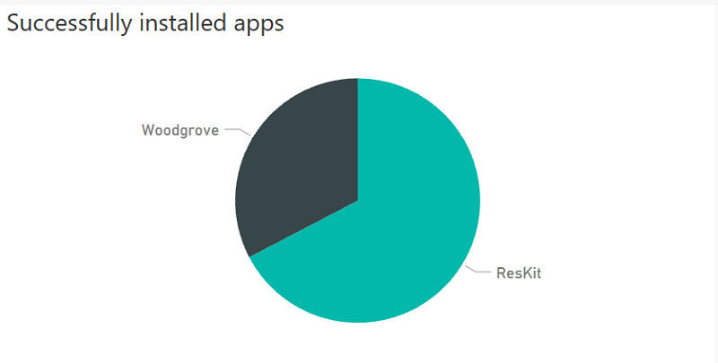
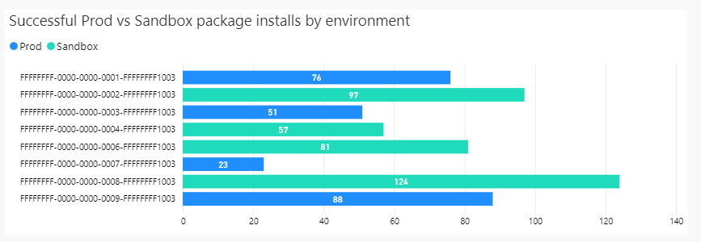
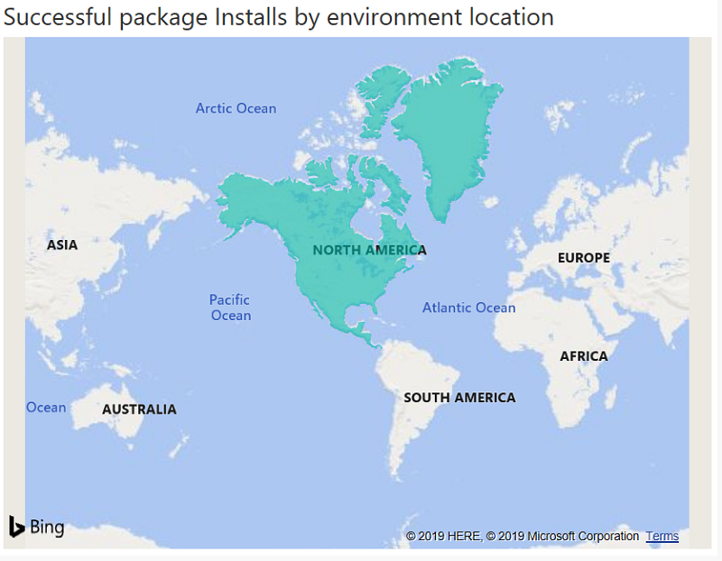
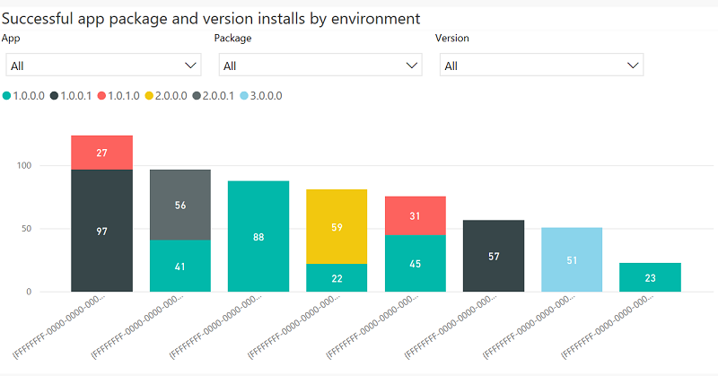

# The Tenant page

[!INCLUDE [cc-beta-prerelease-disclaimer](../../includes/cc-beta-prerelease-disclaimer.md)]

To view the install history of a tenant, the ISV can switch to **Top tenants** view on the home page and select a tenant.

The Tenant page contains the following graphs and metrics:

## Successfully installed apps

The pie chart shown below visualizes the ISV app distribution across all environments in the selected tenant.

When hovering over the items of the graph, the following information is shown:

1. App name
2. Package install count of the app in the selected tenant

## Successful production vs. sandbox package installs by environment

The bar chart shown below visualizes the productions vs. sandbox installations of the ISV apps in the selected tenant. Due to privacy reasons, the environment name cannot be shown at this time.

When hovering over any item of the graph, the following information is shown:

1. Environment ID
2. Environment type (production or sandbox)
3. Package install count in the environment

## Successful package Installs by environment location

The map shown below illustrates the geographical distribution of the ISV package installs by environment location.

When hovering over any location of the graph, the following information is shown:

1. Location
2. Package install count in the selected location

## Successful app package and version installs by environment

The column chart shown below visualizes the app names, package unique names, and versions of the selected tenant in drop-down menus. All apps are selected by default and an ISV can further drill down by selecting one or multiple apps, packages, and versions. When the user selects an app, the **Package** drop-down is updated to display the corresponding packages of the selected app. When the user selects a package, the **Versions** drop-down is updated to display the corresponding versions of the selected package.

When hovering over any item of the graph, the following information is shown:

1. Environment ID
2. Package version
3. Package install count of the version in the environment

### See also

[Introduction to ISV Studio for the Power Platform](isv-app-management.md)  
[Home page](isv-app-management-homepage.md)  
[App page](isv-app-management-apppage.md)
[AppSource checker](isv-app-management-appsource-checker.md)
[Connector Certification](https://docs.microsoft.com/connectors/custom-connectors/submit-certification)
