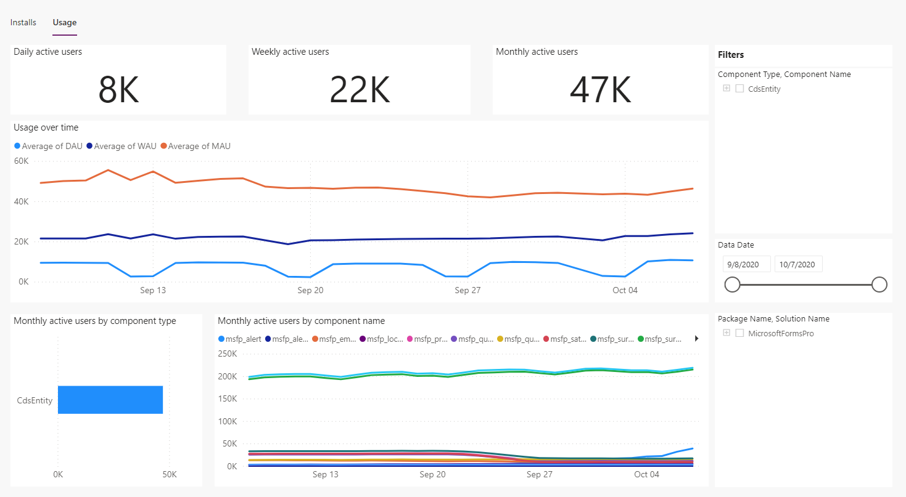
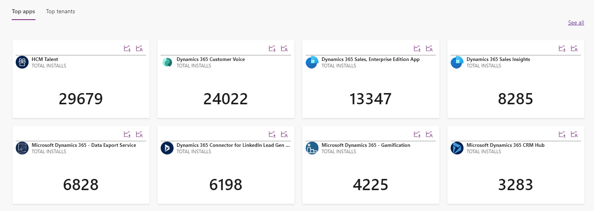
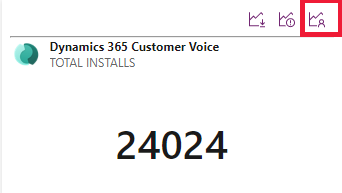

# App usage analytics

[!INCLUDE [cc-beta-prerelease-disclaimer](../../includes/cc-beta-prerelease-disclaimer.md)]

ISVs need data like active users, number of times the solution installed or other means of data to measure the success of their application. App usage analytics feature allows ISVs to monitor the usage of their apps by giving them the visibility into monthly, daily, and weekly usage data of their apps. 

> [!NOTE]
> A tenant or customer needs to update their apps for an ISV to start seeing the usage data.

App usage feature allows ISVs to filter the usage data by **Component Type**, **Data Date**, **Package Name**, and **Solution Name**. An app can have multiple packages and an individual package can have multiple solutions. Each solution can have multiple components. App usage is measured based on how many times the components of the application are used in a month, week, or day. 

> [!NOTE]
> An app must be deployed via [AppSource](https://appsource.microsoft.com) in order to see this data.   

> [!div class="mx-imgBorder"]
> 

Some of the components of a solution can have shared ownership by multiple ISVs. For shared components, only the publisher who created the component gets the usage credit. For example, ISV1 created a form and ISV2 extends the form by adding a widget to it. Every time the form is used, ISV1 gets the usage credit and ISV2 gets the usage credit whenever the widget is used. If a user visited the form only to access the widget, ISV1 also gets the usage credit.

For components that are not shared, only the publisher who created gets the usage credit. 
    
## View the app usage dashboard

To view the app usage data:

1. Sign in to [ISV studio](https://aka.ms/ISVStudio/).
1. On the **Home** page, you can see a list of published applications. Select the desired application for which you want to see the usage details. 
1. Scroll-down to the page to view all the apps. Select the app and select the **Usage** tab.

   > [!div class="mx-imgBorder"]
   > 

1. You can also see the app usage details by directly selecting the app usage icon from the list of apps as shown in the screenshot:

   > [!div class="mx-imgBorder"]
   > 

## Overview of the usage dashboard

The usage dashboard shows the following metrics:

- **Monthly active users**: Tracks the information about the number of unique users who used the app within the last month.
- **Daily active users**: Tracks the information about the number of daily unique users who used the app within the last 24 hours.
- **Weekly active users**: Tracks the information about the number of daily unique users who used the app within the last 7 hours.
- **Usage over time**: Tracks the information about the number of monthly, weekly, and daily active users over time.
- **Monthly active users by component type**: Tracks the information about the number of monthly active users filtered by component type.
- **Monthly active users by component name**: Tracks the information about the number of monthly active users filtered by component name.

If ISV is looking at the metrics at a solution level, all the components are rolled up to the solution level. Similarly, all the solution metrics are rolled up to package and all package metrics are rolled up to an app.

### Filtering the usage dashboard

ISVs can filter the usage dashboard using the filters available. For example, an ISV can filter to see the metrics at app, package, solution, and component level. If ISVs want to see the metrics at solution level, ISVs can select all the components of the solution in the filter.  

### See also

[Home page](isv-app-management-homepage.md)  
[App page](isv-app-management-apppage.md)  
[Tenant page](isv-app-management-tenantpage.md) 
[AppSource checker](isv-app-management-appsource-checker.md) 
[Connector Certification](isv-app-management-certification.md)
