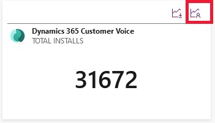

# ISV app usage analytics

[!INCLUDE [cc-beta-prerelease-disclaimer](../../includes/cc-beta-prerelease-disclaimer.md)]

ISVs need data to measure the success or gain insights of their application. App usage analytics feature allows ISVs to monitor the usage of their apps by giving them visibility into the monthly, daily, and weekly usage data of their apps.

App usage feature allows ISVs to filter the usage data by component type, date, package name, solution name, and package version. An app can have multiple packages and an individual package can have multiple solutions. Each solution has multiple components.

> [!NOTE]
> For any app that is not deployed via [AppSource](https://appsource.microsoft.com), it needs to be tracked at the solution level.   

> [!div class="mx-imgBorder"]
> 

## View the app usage report

To view the app usage data:

1. Sign in to [ISV studio](https://aka.ms/ISVStudio/).
1. On the **Home** page, you can see a list of published app packages. Select the desired package for which you want to see the usage details. 
1. Scroll-down to the page to view all the apps. Select the app and select the **Usage** tab.
1. You can also see the app usage details by directly selecting the app usage icon from the list of apps as shown  screenshot:

   > [!div class="mx-imgBorder"]
   > 

## Overview of the usage report

The usage report shows the following metrics:

- **Monthly active users**: Tracks the information about the number of unique users who used the app within the last month.
- **Daily active users**: Tracks the information about the number of daily unique users who used the app within the last 24 hours.
- **Weekly active users**: Tracks the information about the number of daily unique users who used the app within the last 7 hours.
- **Usage by tenant**: Tracks the information about the number of installs in a tenant.
- **Usage by solution**: Tracks the information about the number of times the solution is installed.
- **Entity usage**:

If the ISV is looking at the metrics at a solution level, all the components are rolled up to the solution level. Similarly, all the solution metrics are rolled up to package and all package metrics are rolled up to an app. 

### Filtering the usage report

ISVs can filter the usage report using the filtering option available. For example, an ISV can filter to see the metrics at app, package, solution, and component level. If ISVs want to see the metrics at solution level, ISVs can select all the components of the solution in the filter.  

ISV can filter the usage report by the following: 

- Tenant 
- Geo location 
- Package version 
- Time range – up to 90 days 
- App contents - It is the composition of the app in a hierarchy view so it is easy to understand all the packages, solutions, and components that are part of the app. That way the ISV can select one or more packages or versions and slice and dice the information. 