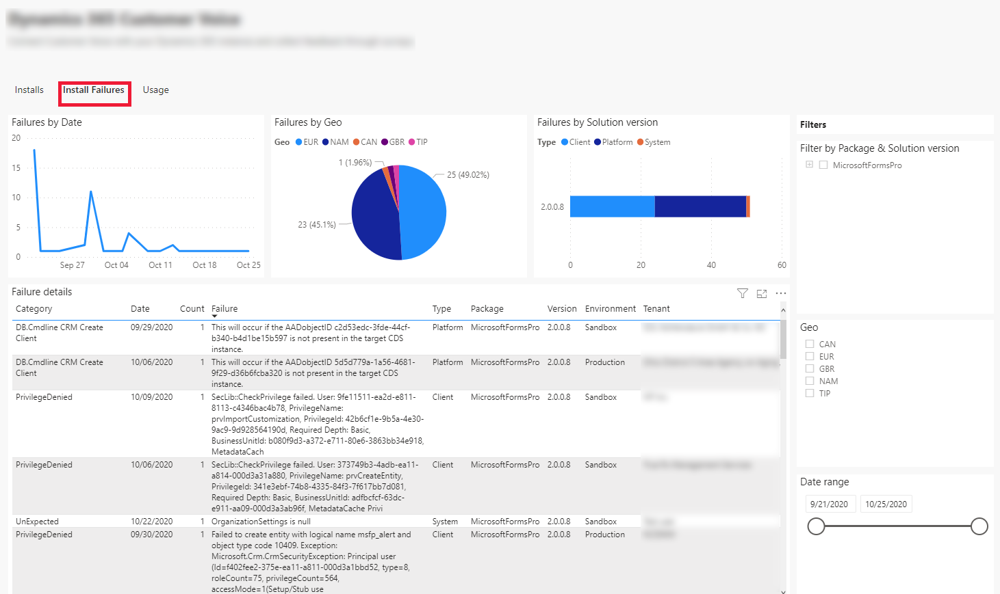
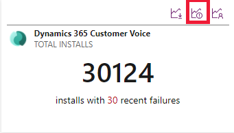
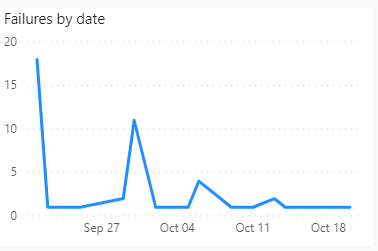
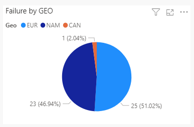
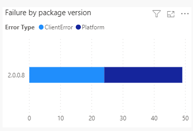
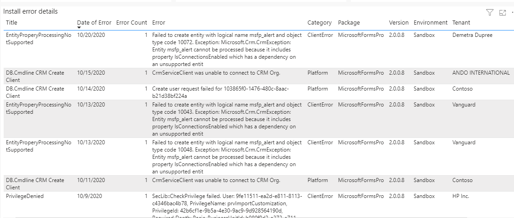

# App install failure analytics

[!INCLUDE[cc-data-platform-banner](../../includes/cc-data-platform-banner.md)]

[!INCLUDE [cc-beta-prerelease-disclaimer](../../includes/cc-beta-prerelease-disclaimer.md)]

The install failure analytics feature gives the ability to see the  app installation failure data for ISVs. The install failure features makes it easy for ISVs to quickly resolve the customer app install failure issues by providing the detailed error logs thus reducing the time for the customers to get the issues resolved.

> [!NOTE]
> The install failure dashboard shows the failure data from the last 28 days only.

ISVs can see the details on the app installation failure by date, GEO, and by package version. The install failure dashboard also shows the install error details. 

> [!div class="mx-imgBorder"]
> 
 
## View the install failure dashboard

To view the install failure data:

1. Sign in to [ISV studio](https://aka.ms/ISVStudio/).
1. On the **Home** page, you can see a list of published applications. Select the desired application for which you want to see the install failure details. 
1. Scroll-down to the page to view all the apps. Select the app and select the **Install Failures** tab.
1. You can also see the install failure details by directly selecting the install failure icon from the list of apps as shown in the screenshot:

   > [!div class="mx-imgBorder"]
   > 

The install failures tab contains the following graphs and metrics.

### Failure by date

The line chart shown below illustrates the number of app installation failures occurred by date. When hovering over the graph, the following information is shown:

 1. Count of isError. 
 1. Date of error.

> [!div class="mx-imgBorder"]
> 

### Failure by GEO

The pie chart shown below illustrates the number app installation failures by GEO. When hovering over the graph, the following information is shown:

1. Geo 
1. Error count

> [!div class="mx-imgBorder"]
> 

### Failure by package version

The bar chart shown below illustrates the number of app installation failures occurred by package version. When hovering over the graph, the following information is shown:

1. Package Version
1. Error Category
1. Error Count

> [!div class="mx-imgBorder"]
> 

### Install error details

Tracks the information about the app install failure error in detail. The following details are shown in the install error details tab:

1. Title
1. Date of Error
1. Error Count
1. Error
1. Category
1. Package
1. Version
1. Environment
1. Tenant

> [!div class="mx-imgBorder"]
> 

### Filtering the install failure dashboard

ISVs can filter the install failures dashboard using the filters available. For example, an ISV can filter to see the metrics at **App Hierarchy**, **GEO**, and **Date range** level.   

### See also

[App usage analytics](isv-app-usage-analytics.md) 
[Home page](isv-app-management-homepage.md)  
[App page](isv-app-management-apppage.md)  
[Tenant page](isv-app-management-tenantpage.md) 
[AppSource checker](isv-app-management-appsource-checker.md) 
[Connector Certification](isv-app-management-certification.md)
