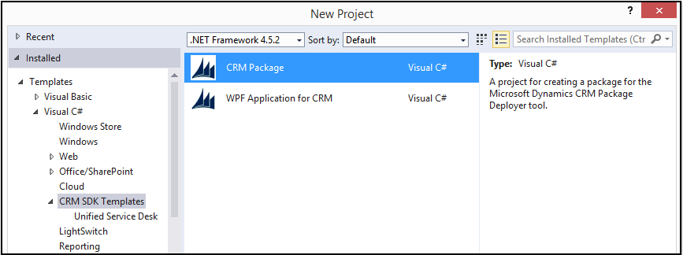

# Create packages for the  Dynamics 365 Package Deployer

Package Deployer lets administrators deploy packages on Common Data Service for Apps instances. A *package* can consist of any or all of the following:  

- One or more CDS for Apps solution files.  
- Flat files or exported configuration data file from the Configuration Migration tool. For more information about the tool, see  [Move configuration data across instances and organizations with the Configuration Migration tool](/dynamics365/customer-engagement/admin/manage-configuration-data).  
- Custom code that can run before, while, or after the package is deployed to the CDS for Apps instance.  
- HTML content specific to the package that can display at the beginning and end of the deployment process. This can be useful to provide a description of the solutions and files that are deployed in the package.  

CDS for Apps provides you with a Visual Studio template for creating these packages that can be used with the Package Deployer tool to deploy them to a CDS for Apps instance.

<a name="Prereq"></a>
 
## Prerequisites  

- Ensure that you have all the solutions and files ready that you want to include in the package.  
- Microsoft .NET Framework 4.5.2
- Visual Studio 2012, Visual Studio 2013, or Visual Studio 2015
- NuGet Package Manager for [Visual Studio 2012](http://visualstudiogallery.msdn.microsoft.com/27077b70-9dad-4c64-adcf-c7cf6bc9970c), [Visual Studio 2013](http://visualstudiogallery.msdn.microsoft.com/4ec1526c-4a8c-4a84-b702-b21a8f5293ca), or [Visual Studio 2015](https://visualstudiogallery.msdn.microsoft.com/5d345edc-2e2d-4a9c-b73b-d53956dc458d)
    - In Visual Studio 2017, NuGet and the NuGet Package Manager are automatically installed when you select any .NET-related workloads.
- Microsoft Dynamics CRM SDK Templates for Visual Studio that contains the package template. You can get it by downloading the [Microsoft Dynamics CRM SDK Templates](http://go.microsoft.com/fwlink/p/?LinkId=400925) and double-click the `CRMSDKTemplates.vsix` file to install the template in Visual Studio.  


<a name="HowTo"></a>
   
## Create a package  

 Perform the following five steps to create a package:  

- [Step 1: Create a project using the template](create-packages-package-deployer.md#Step1)  
- [Step 2: Add your files to the project](create-packages-package-deployer.md#Step2)  
- [Step 3: Update the HTML files](create-packages-package-deployer.md#Step3)  
- [Step 4: Specify the configuration values for the package](create-packages-package-deployer.md#Step4)  
- [Step 5: Define custom code for your package](create-packages-package-deployer.md#Step5)  

<a name="Step1"></a>  
 
#### Step 1: Create a project using the template  

1. Start Visual Studio, and create a new project.  
2. In the **New Project** dialog box: 

   1. From the list of installed templates, expand **Visual C#**, and select **Dynamics 365 SDK Templates**.  
   2. Ensure that **.NET Framework 4.5.2** is selected.  
   3. Select **Dynamics 365 Package**.  
   4. Specify the name and location of the project, and click **OK**.  

    

<a name="Step2"></a>   

#### Step 2: Add your files to the project  

1.  In the **Solutions Explorer** pane, add your solutions and files under the **PkgFolder** folder.  
2.  For each file that you add under the **PkgFolder** folder, in the **Properties** pane, set the **Copy to Output Directory** value to **Copy Always**.  This ensures that your file is available in the generated package.  

<a name="Step3"></a>  
 
#### Step 3: Update the HTML files: English and other languages  

1.  In the Solution Explorer pane, expand **PkgFolder** > **Content** > **en-us**. You’ll find two folders called `EndHTML` and `WelcomeHTML`. These folders contain the  HTML and associated files that enable you to display information at the end and beginning of the package deployment process. Edit the files in the HTML folder of these folders to add information for your package.  

2.  You can also add the HTML files in your package in other languages so that the content in the HTML appears in the language based on the locale settings of the user’s computer. To do so:  

    1.  Create a copy of the **en-us** folder under **PkgFolder** > **Content**.  
    2.  Rename the copied folder to the appropriate language. For example, for the Spanish language, rename it to **es-ES**.  
    3.  Modify the content of the HTML files to add Spanish content.  

<a name="Step4"></a>   

#### Step 4: Specify the configuration values for the package  

1. Define the package configuration by adding information about your package in the **ImportConfig.xml** file available in the **PkgFolder**. Double-click the file to open it for editing. The following list provides information about each parameter and node in the config file.  

    `installsampledata`  
    `True` or `false`. If `true`, installs sample data to CDS for Apps instance. This is the same sample data that you can install from **Settings** > **Data Management** area in CDS for Apps.  

    `waitforsampledatatoinstall`  
   **True** or **false**. If **true**, and if **installsampledata** is also set to **true**, waits for sample data to install before deploying the package.  

   > [!NOTE]
   >  Ensure that you set **installsampledata** to **true** if you are setting `waitforsampledatatoinstall` to **true**.  

    `agentdesktopzipfile`  
    File name of the zip file to unpack. If you specify a .zip file name here, it adds a screen during the package deployment process that prompts you to select a location where you want to unpack the contents of the file.  

    This is commonly used for creating packages for Unified Service Desk for Dynamics 365. For information about Unified Service Desk, see [Administration Guide for Unified Service Desk 3.0](/dynamics365/customer-engagement/unified-service-desk/administration-guide-unified-service-desk-3).  

    `agentdesktopexename`  
    Name of the .exe or .msi file in the zip file or a URL to be invoked at the end of the deployment process.  

    This is commonly used for creating packages for Unified Service Desk.  

    `crmmigdataimportfile`  
    File name of the default configuration data file (.zip) exported using the Configuration Migration tool.  

   - You can also import a localized version of the configuration data file based on the locale ID (LCID) specified using new runtime settings while running the package deployer. Use the `<cmtdatafile>` node (explained later) to specify the localized versions of the configuration data file in a package and then use the  `OverrideConfigurationDataFileLanguage` method (explained later) to specify the logic for importing the configuration data file based on the locale ID specified using the runtime settings. You cannot import more than one configuration data file using a package at a time.  

   - For CDS for Apps (on-premises), if your configuration data file contains user information, and both the source and target CDS for Apps instances are on the same Active Directory Domain, user information will be imported to the target CDS for Apps instance. To import user information to a CDS for Apps (on-premises) instance on a different domain, you must include the user map file (.xml) generated using the Configuration Migration tool in your project, and specify it along with the configuration data file using the `usermapfilename` attribute in the `<cmtdatafile>` node explained later. User information cannot be imported to CDS for Apps instances.  
     `<solutions>` node  
     Contains an array of `<configsolutionfile>` nodes that describe the solutions to import. The order of the solutions under this node indicates the order in which the solutions will be imported on the target CDS for Apps instance.  

     `<configsolutionfile>` node  
     Use this node under the `<solutions>` node to specify the individual solutions and the following information for each solution to be imported:  

   - `solutionpackagefilename`: Specify the .zip file name of your solution. Required.  

   - `overwriteunmanagedcustomizations`: Specify whether to overwrite any unmanaged customizations when importing a solution that already exists in the target Dynamics 365 instance. This is optional, and if you do not specify this attribute, by default the unmanaged customizations in the existing solution are maintained on the target Dynamics 365 instance.  

   - `publishworkflowsandactivateplugins`: Specify whether to publish workflows and activate plug-ins in the target Dynamics 365 instance after the solution is imported. This is optional, and if you do not specify not specify this attribute, by default the workflows are published and plug-ins are activated after the solution is imported on the target Dynamics 365 instance.  

     You can add multiple solution file names in a package by adding as many `<configsolutionfile>` nodes. For example, if you want three solution files to be imported, add them like this:  

   ```xml  

   <solutions>  
   <configsolutionfile solutionpackagefilename="SampleSolutionOne_1_0_managed.zip"  
   overwriteunmanagedcustomizations="false"  
   publishworkflowsandactivateplugins="true"/>  
   <configsolutionfile solutionpackagefilename="SampleSolutionTwo_1_0_managed.zip"  
   overwriteunmanagedcustomizations="false"  
   publishworkflowsandactivateplugins="true"/>  
   <configsolutionfile solutionpackagefilename="SampleSolutionThree_1_0_managed.zip" />  
   </solutions>  

   ```  

    `<filestoimportnode>` node  
    Contains an array of `<configimportfile>` and `<zipimportdetails>` nodes that are used to describe individual files and zip files respectively to be imported.  

    `<configimportfile>` node  
    Use this node under the `<configimportfile>` node to describe a file to be imported to CDS for Apps. You can add multiple files in a package by adding as many `<configimportfile>` nodes.  

   ```xml  

   <filestoimport>  
   <configimportfile filename="File.csv"  
   filetype="CSV"  
   associatedmap="FileMap"  
   importtoentity="FileEntity"  
   datadelimiter=""  
   fielddelimiter="comma"  
   enableduplicatedetection="true"  
   isfirstrowheader="true"  
   isrecordownerateam="false"  
   owneruser=""  
   waitforimporttocomplete="true" />  
   <configimportfile filename="File.zip"  
   filetype="ZIP"  
   associatedmap="FileMapName"  
   importtoentity="FileEntity"  
   datadelimiter=""  
   fielddelimiter="comma"  
   enableduplicatedetection="true"  
   isfirstrowheader="true"  
   isrecordownerateam="false"  
   owneruser=""  
   waitforimporttocomplete="true"/>  

   </filestoimport>  

   ```  

    This has the following attributes:  

   |Attribute|Description|
   |--|-|
   |`filename`| Name of the file that contains the import data. If the file is a .zip file, a `<zipimportdetails>` node must be present with a     `<zipimportdetail>` node for each file in the .zip file. |
   |`filetype`|This can be csv, xml, or zip.          |
   |`associatedmap`|Name of the CDS for Apps import data map to use with this file. If blank, attempts to use the system determined import data map name for this file.|
   |`importtoentity`| Can be the name of the exe in the zip file, a URL, or an .msi file to provide a link to invoke at the end of the process.|
   |`datadelimiter`| Name of the data delimiter used in the import file. Valid values are singlequote or doublequotes.|
   |`fielddelimiter`|Name of the field delimiter used in the import file. Valid values are comma or colon, or singlequote.|
   |`enableduplicatedetection`|Indicates whether to enable duplicate detections rules on data import. Valid values are **true** or **false**.|
   |`isfirstrowheader`|Used to denote that the first row of the import file contains the field names. Valid values are `true` or `false`. |
   |`isrecordownerateam`|Indicates whether the owner of the record on import should be a team. Valid values are `true` or `false`.|
   |`owneruser`|Indicates the user ID that should own the records. The default value is the currently logged in user.  |
   |`waitforimporttocomplete`|If `true`, the system waits for the import to complete before proceeding. If `false`, it queues the jobs and moves on.|

    `<zipimportdetails>` node  
    This node contains an array of `<zipimportdetail>` nodes that describe the files included in a zip file that is used to import to Dynamics 365.  

    `<zipimportdetail>` node  
    Use this node under the `<zipimportdetails>` node to provide information about an individual file in a .zip file that is specified in the `<configimportfile>` node.  

   ```xml  
   <filestoimport>  
   ...  
   ...  
   <zipimportdetails>  
   <zipimportdetail filename="subfile1.csv" filetype="csv" importtoentity="account" />  
   <zipimportdetail filename="subfile2.csv" filetype="csv" importtoentity="contact" />  
   </zipimportdetails>  
   </filestoimport>  

   ```  

    This has the following attributes:  

   |Attribute|Description|  
   |---------------|-----------------|  
   |`filename`|Name of the file that contains the import data.|  
   |`filetype`|This can be csv or xml.|  
   |`importtoentity`|Can be the name of the exe in the zip file, a url, or an .msi file to provide a link to invoke at the end of the process.|  

    `<filesmapstoimport>` node  
    This node contains an array of `<configmapimportfile>` nodes to import. The order of the map files in this node indicates the order in which they are imported. For information about data maps, see [Create data maps for import](../create-data-maps-for-import.md).  

    `<configimportmapfile>` node  
    Use this node under the `<filesmapstoimport>` node to provide information about an individual map file to import in CDS for Apps.  

   ```xml  
   <filesmapstoimport>  
   <configimportmapfile filename="FileMap.xml" />  
   </filesmapstoimport>  
   ```  

    `<cmtdatafiles>` node  
    This node contains an array of `<cmtdatafile>` nodes that containslocalized version of the configuration data file to be imported.  

    `<cmtdatafile>` node  
    Use this node under the `<cmtdatafiles>` node to specify the localized configuration data files along with locale ID (required) and user information map file (optional). For example:  

   ```xml  
   <cmtdatafiles>  
   <cmtdatafile filename="data_1033.zip" lcid="1033" usermapfilename="UserMap.xml" />  
   <cmtdatafile filename="data_1041.zip" lcid="1041" usermapfilename="" />  
   </cmtdatafiles>  
   ```  

    You can define your custom logic in the `OverrideConfigurationDataFileLanguage` method (explained later) to import  a localized configuration data file instead of the default one (specified in crmmigdataimportfile) based on the locale ID (LCID) value specified using the runtime settings (explained later).  

2. Click **Save All**.  

    The following represents the contents of a sample `ImportConfig.xml` file.  

   ```xml  
   <?xml version="1.0" encoding="utf-16"?>  
   <configdatastorage xmlns:xsi="http://www.w3.org/2001/XMLSchema-instance"  
   xmlns:xsd="http://www.w3.org/2001/XMLSchema"  
   installsampledata="true"  
   waitforsampledatatoinstall="true"  
   agentdesktopzipfile=""  
   agentdesktopexename=""  
   crmmigdataimportfile="data_1033.zip">  
   <solutions>  
   <configsolutionfile solutionpackagefilename="SampleSolutionOne_1_0_managed.zip"  
   overwriteunmanagedcustomizations="false"  
   publishworkflowsandactivateplugins="true"/>  
   <configsolutionfile solutionpackagefilename="SampleSolutionTwo_1_0_managed.zip"  
   overwriteunmanagedcustomizations="false"  
   publishworkflowsandactivateplugins="true"/>  
   <configsolutionfile solutionpackagefilename="SampleSolutionThree_1_0_managed.zip" />  
   </solutions>  
   <filestoimport>  
   <configimportfile filename="SampleOption.csv"  
   filetype="CSV"  
   associatedmap="SampleOption"  
   importtoentity="sample_option"  
   datadelimiter=""  
   fielddelimiter="comma"  
   enableduplicatedetection="true"  
   isfirstrowheader="true"  
   isrecordownerateam="false"  
   owneruser=""  
   waitforimporttocomplete="false"/>  
   <configimportfile filename="File.zip"  
   filetype="ZIP"  
   associatedmap="FileMapName"  
   importtoentity="FileEntity"  
   datadelimiter=""  
   fielddelimiter="comma"  
   enableduplicatedetection="true"  
   isfirstrowheader="true"  
   isrecordownerateam="false"  
   owneruser=""  
   waitforimporttocomplete="true"/>  
   <zipimportdetails>  
   <zipimportdetail filename="subfile1.csv"  
   filetype="csv"  
   importtoentity="account" />  
   <zipimportdetail filename="subfile2.csv"  
   filetype="csv"  
   importtoentity="contact" />  
   </zipimportdetails>  
   </filestoimport>  
   <filesmapstoimport>  
   <configimportmapfile filename="SampleOption.xml" />  
   </filesmapstoimport>  
   <cmtdatafiles>  
   <cmtdatafile filename="data_1033.zip"  
   lcid="1033"  
   usermapfilename="UserMap.xml" />  
   <cmtdatafile filename="data_1041.zip"  
   lcid="1041"  
   usermapfilename="" />  
   </cmtdatafiles>  
   </configdatastorage>  

   ```  

<a name="Step5"></a>  
 
#### Step 5: Define custom code for your package  

1. In the Solution Explorer pane, double-click the **PackageTemplate.cs** file at the root to edit it.  

2. In the PackageTemplate.cs file, you can:  

   1. Enter custom code to execute when the package is initialized in the override method definition of `InitializeCustomExtension`.  

       This method can be used to let users use the runtime parameters while running a package. As a developer, you can add support for any runtime parameter to your package by using the <xref:Microsoft.Xrm.Tooling.PackageDeployment.CrmPackageExtentionBase.IImportExtensions2.RuntimeSettings> property as long as you have code to process it based on the user input.  

       For example, the following sample code enables a runtime parameter called `SkipChecks` for the package that has two possible values: true or false. The sample code checks if the user has specified any runtime parameters while running Package Deployer (either by using the command line or PowerShell), and then accordingly processes the information. If no runtime parameter is specified by the user while running the package, the value of the <xref:Microsoft.Xrm.Tooling.PackageDeployment.CrmPackageExtentionBase.IImportExtensions2.RuntimeSettings> property will be null.  

      ```csharp  
      public override void InitializeCustomExtension()  
      {  
      // Do nothing.  

      // Validate the state of the runtime settings object.  
      if (RuntimeSettings != null)  
      {  
      PackageLog.Log(string.Format("Runtime Settings populated.  Count = {0}", RuntimeSettings.Count));  
      foreach (var setting in RuntimeSettings)  
      {  
      PackageLog.Log(string.Format("Key={0} | Value={1}", setting.Key, setting.Value.ToString()));  
      }  

      // Check to see if skip checks is present.  
      if ( RuntimeSettings.ContainsKey("SkipChecks") )  
      {  
      bool bSkipChecks = false;  
      if (bool.TryParse((string)RuntimeSettings["SkipChecks"], out bSkipChecks))  
      OverrideDataImportSafetyChecks = bSkipChecks;  
      }  
      }  
      else  
      PackageLog.Log("Runtime Settings not populated");  
      }  
      ```  

       This lets the administrator use the command line or the [Import-CrmPackage](/powershell/module/microsoft.xrm.tooling.packagedeployment/import-crmpackage) cmdlet to specify whether to skip the safety checks while running the Package Deployer tool to import the package. More information: [Deploy packages using CRM Package Deployer and Windows PowerShell](/dynamics365/customer-engagement/admin/deploy-packages-using-package-deployer-windows-powershell)  

   2. Enter custom code to execute before the solutions are imported in  the override method definition of `PreSolutionImport` to specify whether to maintain or overwrite customizations while updating the specified solution in a target CDS for Apps instance, and whether to automatically activate plug-ins and workflows.  

   3. Use the override method definition of `RunSolutionUpgradeMigrationStep` to perform data transformation or upgrade between two versions of a solution This method is called only if the solution you are importing is already present in the target CDS for Apps instance.  

       This function expects the following parameters:  


      |    Parameter    |            Description             |
      |-----------------|------------------------------------|
      | `solutionName`  |        Name of the solution        |
      |  `oldVersion`   | Version number of the old solution |
      |  `newVersion`   | Version number of the new solution |
      | `oldSolutionId` |     GUID of the old solution.      |
      | `newSolutionId` |     GUID of the new solution.      |


   4. Enter custom code to execute before the solution import completes in the override definition of the `BeforeImportStage` method. The sample data and some flat files for solutions specified in the `ImportConfig.xml` file are imported before the solution import completes.  

   5. Override the currently-selected language for configuration data import using the override method definition of `OverrideConfigurationDataFileLanguage`. If the specified locale ID (LCID) of the specified language is not found in the list of available languages in the package, the default data file is imported.  

       You specify the available languages for the configuration data in the `<cmtdatafiles>` node in the `ImportConfig.xml` file. The default configuration data import file is specified in the `crmmigdataimportfile` attribute in the `ImportConfig.xml` file.  

       Skipping data checks (<xref:Microsoft.Xrm.Tooling.PackageDeployment.CrmPackageExtentionBase.IImportExtensions2.OverrideDataImportSafetyChecks> = true) can be effective here if you are sure that the target CDS for Apps instance does not contain any data.  

   6. Enter custom code to execute after the import completes in the override definition of `AfterPrimaryImport`>method. The remaining flat files that were not imported earlier, before the solution import started, are imported now.  

   7. Change the default name of your package folder from PkgFolder to the package name that you want. To do so, rename the `PkgFolder`>folder in the **Solution Explorer** pane, and then edit the return value under the `GetImportPackageDataFolderName` property.  

      ```csharp  
      public override string GetImportPackageDataFolderName  
      {  
      get  
      {  
      // WARNING this value directly correlates to the folder name in the Solution Explorer where the ImportConfig.xml and sub content is located.  
      // Changing this name requires that you also change the correlating name in the Solution Explorer  
      return "PkgFolder";  
      }  
      }  
      ```  

   8. Change the package name by editing the return value under the `GetNameOfImport` property.  

      ```csharp  
      public override string GetNameOfImport(bool plural)  
      {  
      return "Package Short Name";  
      }  
      ```  

       This is the name of your package that will appear on the package selection page in the CRM Package Deployer wizard.  

   9. Change the package description by editing the return value under the `GetImportPackageDescriptionText` property.  

       ```csharp  

       public override string GetImportPackageDescriptionText  
       {  
       get { return "Package Description"; }  
       }  

       ```  

        This is the package description that will appear alongside the package name on the on the package selection page in the Package Deployer wizard.  

   10. Change the package long name by editing the return value under the `GetLongNameOfImport` property.  

       ```csharp  

       public override string GetLongNameOfImport  
       {  
       get { return "Package Long Name"; }  
       }  

       ```  

        The package long name appears on the next page after you have selected the package to install.  

3. Additionally, the following function and variables are available to the package:  


   |Name|Type|Description|
   |--|--|--|
   |<xref:Microsoft.Xrm.Tooling.PackageDeployment.CrmPackageExtentionBase.ImportExtension.CreateProgressItem(System.String)> |Function|Used to create a new progress item in the user interface (UI). |
   |<xref:Microsoft.Xrm.Tooling.PackageDeployment.CrmPackageExtentionBase.ImportExtension.RaiseUpdateEvent(System.String,Microsoft.Xrm.Tooling.PackageDeployment.CrmPackageExtentionBase.ProgressPanelItemStatus)> |Function| Used to update the progress created by the call to <xref:Microsoft.Xrm.Tooling.PackageDeployment.CrmPackageExtentionBase.ImportExtension.CreateProgressItem(System.String)>.<br /><br /> <xref:Microsoft.Xrm.Tooling.PackageDeployment.CrmPackageExtentionBase.ProgressPanelItemStatus> is an enum with the following values:<br /><br /> Working = 0<br />Complete = 1<br />Failed = 2<br />Warning = 3<br />Unknown = 4 |
   |<xref:Microsoft.Xrm.Tooling.PackageDeployment.CrmPackageExtentionBase.ImportExtension.RaiseFailEvent(System.String,System.Exception)>|Function|Used to fail the current status import with an exception message.|
   |<xref:Microsoft.Xrm.Tooling.PackageDeployment.CrmPackageExtentionBase.ImportExtension.IsRoleAssoicatedWithTeam(System.Guid,System.Guid)>|Function|Used to determine if a role is associated with a specified team.|
   |<xref:Microsoft.Xrm.Tooling.PackageDeployment.CrmPackageExtentionBase.ImportExtension.IsWorkflowActive(System.Guid)>|Function|Used to determine if a specified workflow is active. |
   |<xref:Microsoft.Xrm.Tooling.PackageDeployment.CrmPackageExtentionBase.ImportExtension.PackageLog>| Class Pointer|This is a pointer to the initialized logging interface for the package. This interface is used by a package to log messages and exceptions to the package log file.|
   |<xref:Microsoft.Xrm.Tooling.PackageDeployment.CrmPackageExtentionBase.ImportExtension.RootControlDispatcher>|Property|This is a dispatcher interface used to allow your control to render its own UI during package deployment. Use this interface to wrap any UI elements or commands. It is important to check this variable for null values before using it as it may or may not be set to a value.  |
   |<xref:Microsoft.Xrm.Tooling.PackageDeployment.CrmPackageExtentionBase.ImportExtension.CrmSvc>|Property |This is a pointer to <xref:Microsoft.Xrm.Tooling.Connector.CrmServiceClient> class that allows for a package to address Dynamics 365 from within the package. Use this to execute SDK methods and other actions in the overridden methods.|
   |<xref:Microsoft.Xrm.Tooling.PackageDeployment.CrmPackageExtentionBase.IImportExtensions2.DataImportBypass> |Property|Use this to specify whether CRM Package Deployer skips all data import operations such as importing CDS for Apps sample data, flat file data, and data exported from the Configuration Migration tool. Specify true or false. Default is `false`.|
   | <xref:Microsoft.Xrm.Tooling.PackageDeployment.CrmPackageExtentionBase.IImportExtensions2.OverrideDataImportSafetyChecks> |Property|Use this to specify whether CRM Package Deployer will bypass some of its safety checks, which helps in improving the import performance. Specify `true` or `false`. Default is `false`.<br /><br /> You should set this to `true` only if the target CDS for Apps instance does not contain any data.|


4. Save your project, and then build it (**Build** > **Build Solution**) to create the package. Your package is the following files under the *\<Project>*\Bin\Debug folder  

   - **\<PackageName> folder**: The folder name is the same as the one you changed for your package folder name in step 2.g of this section (Step 5: Define custom code for your package). This folder contains  all solutions,  configuration data, flat files, and the contents for your package.  

   - **\<PackageName>.dll**: The assembly contains the custom code for your package. By default, the name of the assembly is the same as your Visual Studio project name.  

     The next step is to deploy your package.  

<a name="UsethePackage"></a> 
  
## Deploy a package  

 After you create a package, you can deploy it on the CDS for Apps instance by using either the Package Deployer tool or Windows PowerShell. 

 The package deployer tool is distributed as part of the [Microsoft.CrmSdk.XrmTooling.PackageDeployment.WPF](https://www.nuget.org/packages/Microsoft.CrmSdk.XrmTooling.PackageDeployment) NuGet package.To download the package deployer tool, see [Download tools from NuGet](../download-tools-nuget.md).

 For detailed information, see [Deploy packages using CRM Package Deployer or Windows PowerShell](/dynamics365/customer-engagement/admin/deploy-packages-using-package-deployer-windows-powershell).  

<a name="BestPractices"></a>   

## Best practices for creating and deploying packages  

 While creating packages, developers must ensure that the package assemblies are signed.  

 While deploying the packages, CDS for Apps administrators must:  

    - Insist on a signed package assembly so that you can track an assembly back to its source.  
    - Test the package on a pre-production instance (preferably a mirror image of the production instance) before running it on a production instance.  
    - Back up the production instance before deploying the package.  


