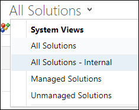
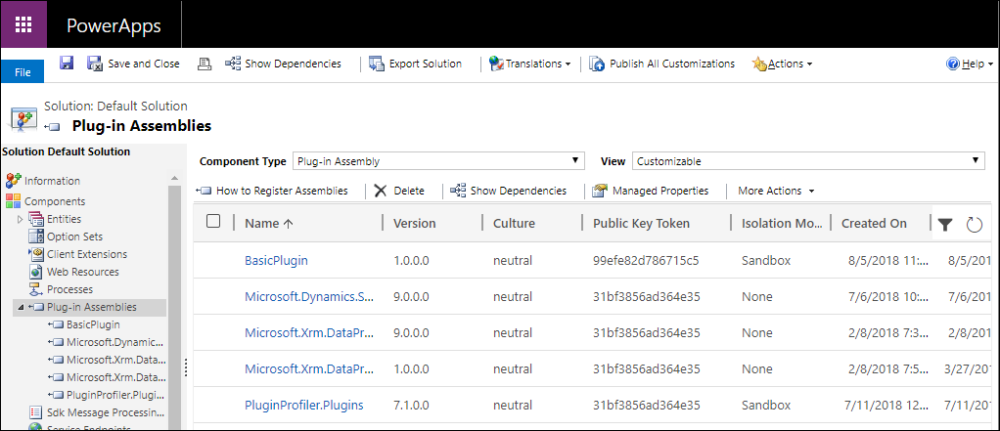
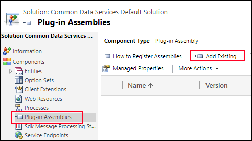
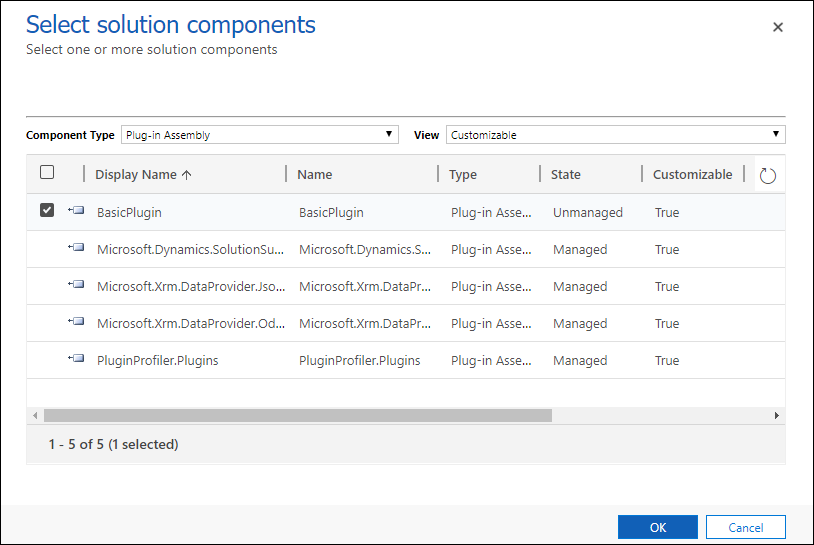
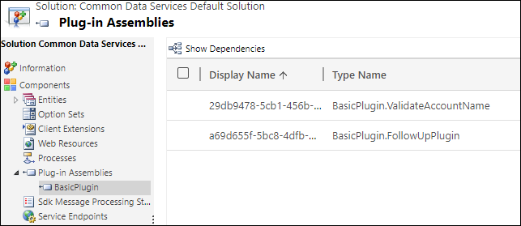

# Register a plug-in


The process of writing, registering, and debugging a plug-in is:

1. Create a .NET Framework Class library project in Visual Studio
1. Add the `Microsoft.CrmSdk.CoreAssemblies` NuGet package to the project
1. Implement the <xref:Microsoft.Xrm.Sdk.IPlugin> interface on classes that will be registered as steps.
1. Add your code to the <xref:Microsoft.Xrm.Sdk.IPlugin.Execute*> method required by the interface
    1. Get references to services you need
    1. Add your business logic
1. Sign & build the assembly
1. Test the assembly
    1. **Register the assembly in a test environment**
    1. Test the behavior of the assembly
    1. Verify expected trace logs are written
    1. Debug the assembly as needed

<!-- TODO I think we need something about adding the plug-in to a solution -->

Content in this topic describes the steps **in bold** above and supports the following tutorials:

- [Tutorial: Write a plug-in](tutorial-write-plug-in.md)
- [Tutorial: Debug a plug-in](tutorial-debug-plug-in.md)
- [Tutorial: Update a plug-in](tutorial-update-plug-in.md)

## Plugin registration tool (PRT)

You will use the Plugin Registration Tool (PRT) to register your plug-in assemblies and steps.

PRT is one of the tools available for download from NuGet. Follow the instructions in [Download tools from NuGet](download-tools-nuget.md). That topic includes instructions to use a PowerShell script to download the latest tools from NuGet.

After you download the PRT, use the [Connect using the Plug-in Registration tool](tutorial-write-plug-in.md#connect-using-the-plug-in-registration-tool) steps in the [Tutorial: Write a plug-in](tutorial-write-plug-in.md) to connect to your CDS for Apps environment.

## Register an assembly

Registering an assembly is the the process of uploading the assembly to the CDS for Apps database. See the instructions found at [Register your assembly](tutorial-write-plug-in.md#register-your-assembly) in the [Tutorial: Write a plug-in](tutorial-write-plug-in.md)

> [!NOTE]
> You will find options related to the *isolation mode* and *location* for the assembly. These refer to options that apply to on-premise deployments. CDS for Apps is not available for on-premises deployments, so you will always accept the default options of **SandBox** and **Database** for these options.

When an assembly is uploaded it is stored in the `PluginAssembly` entity. Most of the properties are set using reflection of the imported entity. The base64 encoded bytes of the assembly is stored in the `Content` attribute. While viewing the **Properties** of the assembly in the PRT, you can only edit the **Description** attribute value.

### View registered assemblies

You can view information about registered assemblies in the application solution explorer without using the PRT.

[!INCLUDE [cc_navigate-solution-from-powerapps-portal](../../includes/cc_navigate-solution-from-powerapps-portal.md)]

> [!NOTE]
> Each assembly you add using PRT will be added to the system **Default Solution**, (not to be confused with the **Common Data Serices Default Solution**). To view the **Default Solution**, select All solutions under Solutions and then change the view to **All Solutions - Internal**.



There you can find all the assemblies that are registered for this environment.



### Query registered assemblies with code

To view information about registered assemblies without the PRT or the application, use the following Web API query in your browser:

```
[org uri]]/api/data/v9.0/pluginassemblies
?$filter=ishidden/Value eq false
&$select=
createdon,
culture,
customizationlevel,
description,
isolationmode,
major,
minor,
modifiedon,
name,
pluginassemblyid,
publickeytoken,
version
```

Or use following FetchXml to retrieve it in a program you write:

```xml
<fetch>
  <entity name='pluginassembly' >
    <attribute name='createdon' />
    <attribute name='culture' />
    <attribute name='customizationlevel' />
    <attribute name='description' />
    <attribute name='isolationmode' />
    <attribute name='major' />
    <attribute name='minor' />
    <attribute name='modifiedon' />
    <attribute name='name' />
    <attribute name='pluginassemblyid' />
    <attribute name='publickeytoken' />
    <attribute name='version' />
    <filter type='and' >
      <filter>
        <condition attribute='ishidden' operator='eq' value='false' />
      </filter>
    </filter>
  </entity>
</fetch>
```
More information: [Use FetchXML with FetchExpression](org-service/entity-operations-query-data.md#use-fetchxml-with-fetchexpression)

## Add your assembly to a solution

As described in [View registered assemblies](#view-registered-assemblies), the assembly registration you created was added to the system **Default Solution**. You should add your assembly to an unmanaged solution so you can distribute it to other organizations.

Within the managed solution you are using, use solution explorer to navigate to **Plug-in Assemblies**. In the list menu, select **Add Existing**.



Then add your assembly as a component to the solution.



When you select the plug-in assembly you added, you can view the plug-in classes it includes.



> [!NOTE]
> Any existing or subsequent step registrations are not added to the unmanaged solution that includes the plug-in assemblies. You must add each registered step to the solution separately.

## Register plug-in step

When an assembly is loaded or updated, any classes that implement <xref:Microsoft.Xrm.Sdk.IPlugin> will be available in the PRT. Use the instructions in [Register a new step](tutorial-write-plug-in.md#register-a-new-step) in the [Tutorial: Write a plug-in](tutorial-write-plug-in.md) to create a new step registration.

When you register a step, there are many options available to you which depend on the stage of the event pipeline and the nature of the operation you will register your code to respond to.

### General Configuration Information Fields

|Field|Description|
|--|--|
|**Message**|PRT will auto-complete available message names in the system. More information: [Use messages with the Organization service](org-service/use-messages.md)|
|**Primary Entity**|PRT will auto-complete valid entities that apply to the selected message. These messages have a `Target` parameter that accepts and <xref:Microsoft.Xrm.Sdk.Entity> or <xref:Microsoft.Xrm.Sdk.EntityReference> type. If valid entities apply, you should set this when you want to limit the number of times the plug-in is called. <br />If you leave it blank for core entity messages like `Create`, `Update`, `Delete`, `Retrieve`, and `RetrieveMultiple` or any message that can be applied with the message the plug-in will be invoked for all the entities that support this message.|
|**Secondary Entity**|This field remains for backward compatibility for long deprecated messages that accepted an array of <xref:Microsoft.Xrm.Sdk.EntityReference> as the `Target` parameter. This field is typically not used anymore.|
|**Filtering Attributes**|For `Create` and `Update` messages that have a **Primary Entity** set, filtering attributes limits the execution of the plug-in to cases where the selected attributes are included. This is a best practice for performance. |
|**Event Handler**|This value will be populated based on the name of the assembly and the plug-in class. |
|**Step Name**|The name of the step. A value is pre-populated based on the configuration of the step, but this value can be overridden.|
|**Run in User's Context**|Provides options for applying impersonation for the step. The default value is **Calling User**. If the calling user doesn't have privileges to perform operations in the step, you may need to set this to a user who has these privileges. More information: [Impersonation](plug-ins.md#impersonation) |
|**Execution Order**|Multiple steps can be registered for the same stage of the same message. The number in this field determines the order in which they will be applied from lowest to highest. Edit this to control the order in which plug-ins are applied in the stage.|
|**Description**|A description for step. This value is prepopulated but can be overwritten.|

> [!NOTE]
> There are certain cases where plug-ins registed for the `Update` event can be called twice. More information: [Behavior of specialized update operations](special-update-operation-behavior.md)


### Event Pipeline Stage of execution

Choose the stage in the event pipeline that best suites the purpose for your plug-in.

|Option|Description|
|--|--|
|**PreValidation**|[!INCLUDE [cc-prevalidation-description](../../includes/cc-prevalidation-description.md)]|
|**PreOperation**|[!INCLUDE [cc-preoperation-description](../../includes/cc-preoperation-description.md)]|
|**PostOperation**|[!INCLUDE [cc-postoperation-description](../../includes/cc-postoperation-description.md)]|

More information: [Event execution pipeline](event-framework.md#event-execution-pipeline)

### Execution Mode

There are two modes of execution asynchronous, and synchronous.

|Option|Description|
|--|--|
|**Asynchronous**|The execution context and the definition of the business logic to apply is moved to system job which will execute after the operation completes.|
|**Synchronous**|Plug-ins execute immediately according to the stage of execution and execution order. While they are running, the entire operation will wait until they complete.|

Asynchronous plug-ins can only be registered for the **PostOperation** stage. For more information about how system jobs work, see [Asynchronous service](asynchronous-service.md)

### Deployment

|Option|Description|
|--|--|
|**Server**|The plug-in will run on the CDS for apps server.|
|**Offline**|The plug-in will run within the Dynamics 365 for Outlook client when the user is in offline mode.|

<!-- TODO Add link to where more information about offline-plugins will be documented -->

## Set configuration data

The **Unsecure Configuration** and **Secure Configuration** fields allow you to specify configuration data to pass to the plug-in for a specific step.

You can write your plug-in to accept string values in the constructor to use this data to control how the plug-in should work for the step. More information: [Pass configuration data to your plug-in](write-plug-in.md#pass-configuration-data-to-your-plug-in)

## Define entity images

## Update an assembly

## Unregister an assembly