# Removing dependencies

Dependencies are records created automatically by the solutions framework to prevent actions that if executed unchecked, could cause problems. As components are changed and extended, dependencies are created to indicate for example that a Field is required for a Form to function.
If you ever try to execute an action that will result in the deletion of that Field, that will cause the Form to stop working.

Dependencies exist to prevent required components from being deleted while one or more dependent components still have a reference to it.

> The word `delete` the context of this document should be understood as the complete removal of the component from the system.

In this article, we'll discuss how to handle these dependencies and the strategies that can be used to remove no longer needed dependencies.

First, it’s important to make clear that dependencies only prevent operations that would cause a required component to be deleted and the actions that can delete a component are different depending on its state:

- **Unmanaged**: Components in this state are represented by a single layer in the Active solution. Any Delete call made to it, results into complete removal of the component.

 - **Managed**: Deletion of managed components depends on multiple factors: number of layers, relative position of the layer is being uninstalled and their publishers. For example when a component is deleted, consider the scenarios below and what is expected when you uninstall:

     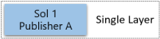

    - Sol 1 - Causes a component deletion since it's the only layer for the component.

    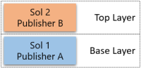

    - Sol 2 - Does not cause a component deletion, only that layer will be removed.
    - Sol 1 - Causes a component deletion since the action happens in the base layer. In fact, Sol 1 cannot be uninstalled in this case, because there is a solution from a different publisher extending the component.

    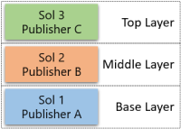
    
     - Sol 3 - Does not cause a component deletion, only that layer will be removed.
     - Sol 2 - Does not cause a component deletion, only that layer will be removed.
     - Sol 1 - Does not cause a component deletion. In this case there is another solution from the same publisher (Sol 3). The platform removes the layer from Sol 1 and replaces it with the layer from Sol 3.

    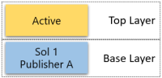

      - Active - Does not cause a component deletion, only that layer will be removed. Observe that you cannot uninstall the Active solution, but you can remove components using the `Remove Active Customization` feature.
      - Sol 1 - Causes a component deletion. The action happens in the base layer. Unlike scenario 2, you can uninstall Sol 1. The Active solution is not considered an extension and both rows will be removed.

## Dependency dialog

The dependency dialog is where you can list the dependencies for the selected solution. It can be invoked by:

- By clicking the button `Show Dependencies` in the solutions page.
- By trying to uninstall a solution and the platform detects that dependencies exist.

For example:

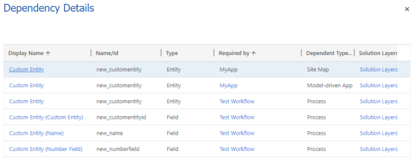

It has 6 columns:

- Display name: Friendly name of the required component. Each component may show slightly different data to make the identification easier. In the example you can see that the Entity has only its name, while the Field has its name and the name of parent Entity.
- Name/Id: Internal name of the required component.
- Type: The type of the required component.
- Required by: Friendly name of the component that requires it, in other words, the dependent component. If the component has a customization page, it turns into a link that opens that page. 
- Dependent Type: Type of the dependent component.
- Solution Layers: Link  where you can see more details about the components involved in the dependency.

> The `required` component is the one that you want to delete. The `dependent` is the one that has references to the that you want to the `required`.

> To remove a dependency you need to make changes that affect the `dependent` component, not the `required`.

## Diagnosing dependencies

Let's consider the following scenario. The org below has two solutions: "Solution - Workflow" and "Solution - Custom Entity".

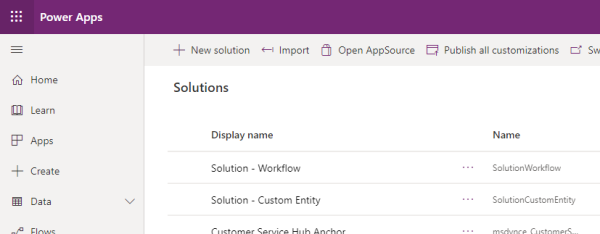

The owner of the org decided that they no longer require "Solution - Custom Entity", tried to delete it and was presented with the following dialog: 

Without going in detail, we can conclude that the uninstall of the solution is trying to delete an entity called "Custom Entity" and three fields "Custom Entity", "Name" and "Number Field" and all 4 components have dependencies.

> The solution may be deleting more components but since they don't have dependencies, they don't appear on the list. 

The next step is to check the Solution Layers (link on the rightmost column) for each dependency. That will help define what is the action required to remove the dependency.

Entity (Custom Entity) and Process (Test Workflow):

 and Site Map (My App)")

Based on the data displayed, you can see the dependent component belongs to a solution called SolutionWorkflow. To remove this dependency, we can either:

- Update the definition of the workflow in SolutionWorkflow removing any references to the entity or its sub-components. Then **Update** or **Upgrade** the solution.
- Uninstall the SolutionWorkflow solution.
- Remove the workflow from a new version of the SolutionWorkflow solution and perform an **Upgrade**.

Since any one dependent component can stop the removal of the solution, we recommend that you check all the dependencies and make all the required changes in a single operation.

Entity (Custom Entity) and Model-driven app (My App):

 and Site Map (My App)")

Based on the data displayed, you can see the dependent component belongs to a solution called Active. This indicates that the dependency was created by importing an unmanaged solution or through an unmanaged customization executed through the UI or API.

To remove this dependency, you can either:

- Edit the definition of the Model-driven App to remove any reference to the entity or its sub-components. Since Model-driven Apps support publishing, you must publish your changes.
- Delete the Model-driven App

> Uninstalling an unmanaged solution is not an option to remove this dependency, because unmanaged solutions are just means to group components.

## Actions to remove a managed dependency

Managed dependencies are the ones where the dependent component is associated to a managed solution. To resolve this kind of the dependency, you need to act on the solution where the component was added to. That action can be different depending on what you're trying to do:

- If you're trying to uninstall a solution: 

      1- In the target org, inspect the Solution Layers link to find what is the topmost solution on the list of the dependent component.
      2- In the source org, prepare a new version of that solution that either: doesn't contain the dependent component or has an updated version of the dependent component that doesn't contain references to the required component. Your goal is to remove any reference to the required components in the new version of the solution.
      3- Export the new version of the solution.
      4- In the target org, **Upgrade** that solution.
      5- Retry the uninstall

- If you're trying to upgrade a solution: In this case you must confirm that deleting the required component is an intentional action (remember that dependencies are enforced only on components that are being deleted).

  If it was not intentional, fixing the new version of the solution by adding the component back is the correct approach. To do that you have to:

      1- In the target org, uninstall the staged solution (the solution that ends in _Upgrade).
      2- In the source org, add the required component(s) back to the solution.
      3- Export the new version
      4- Retry the Upgrade

  If the deletion is intentional, then you need to remove the dependency and the possible steps are the same ones outlined in the previous bullet.

### Layers and dependencies

The dependent components can be layered so you may need to change more than one solution to completely remove a dependency.

The dependency framework only calculates dependencies between the topmost layers for the required and dependent components. That means you need to work your way from the top to the bottom of the solutions of the dependent component.

Consider the following scenario:

 and Site Map (My App)")

You try to uninstall "Solution - Custom Entity" and the operation is blocked by dependencies:

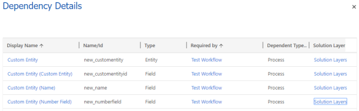

You start diagnosing the dependency by clicking on "Solution Layers" on the Attribute (new_numberfield) and the Workflow (Test Workflow). You see the following screen:

 and Workflow (Test Workflow)")

Since dependencies are created only between the topmost layers of each component, the first step is to deal with the dependency between the Attribute (new_numberfield) in SolutionCustomEntity and the Workflow (Test Workflow) in SolutionWorkflow3.

To remove the dependency you decided to uninstall SolutionWorkflow3. You did so, but when you tried to uninstall the solution once more, you're presented by the same dialog:

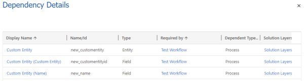

But the Attribute (new_numberfield) is no longer listed, even if it had more layers.

## Actions to remove an unmanaged dependency

To remove unmanaged dependencies, you need to act directly on the components, not in the solutions they belong to.

For example, if you want to remove the dependencies between an Attribute and a Form, you must edit it in the Form Editor and remove the Attribute from the From. The dependency will be removed after you Save and Publish.

> 
> You can also delete the dependent component. That action deletes all dependencies along with the component.

To see the dependencies of a component, you need to locate it in the customizations page and click the "Show dependencies" button.

For example, a Field:

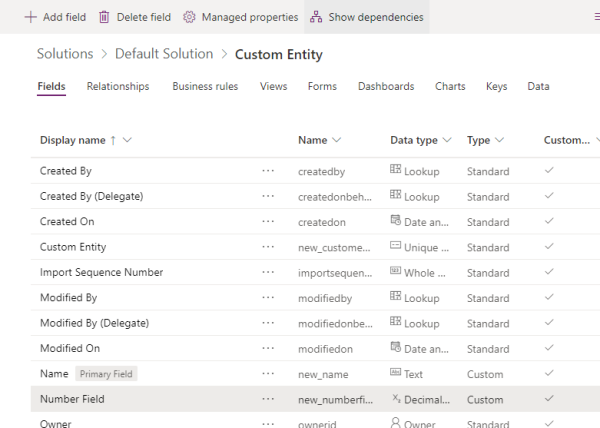

The dialog has two distinct parts:

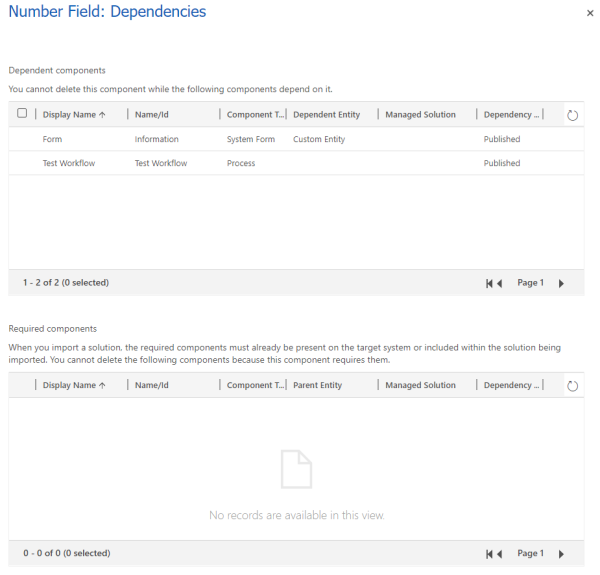

  - Dependent components: List of components that depend on the selected Field. In other words, components that will have this Field as the required component.
  - Required components: List of components that this Field require in order to work. In other words, components that will have this Field as the dependent component.

The most common scenarios:
(Required and Dependent)

## Field and Workflow

To remove dependencies between Fields (Attributes) and Workflows (Processes) you need to locate the workflow in the Customizations page.

With the workflow open, you need to find the reference to the component you no longer wish the workflow no longer would depend on. In this example you can see the Field (Number Field) being referenced in a Step:

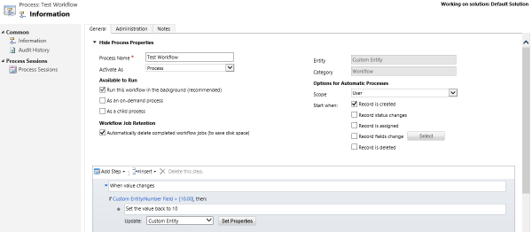

Delete (or change the Step) then save the workflow.

## Field and View

To remove dependencies between Fields (Attributes) and Views (Saved Queries) you need to locate the view in the Customizations page.

In the field editor find the reference to the component you no longer wish the view no longer would depend on. In this example you see the Field (Number Field) being used as a select column and a filter.

Remove both, save and publish the view.

## Entity and Model-Driven Apps

To remove dependencies between Entities and Model-Driven Apps (App Module) you need to locate the App in the Apps list.

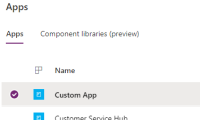

In the editor find the reference to the component you no longer wish the app no longer would depend on. In this example you see the Entity (Custom Entity) in the Entity View.

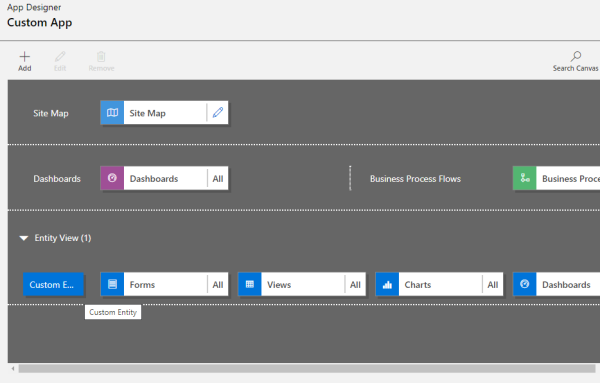

Also inspect the Site Map associated with the app, because it's likely that you will find references there:

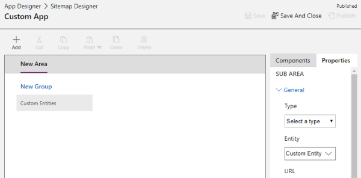

Remove all references, save and publish both, the App and the Site Map.

 

> 
> Final note: After being edited, components can then be added to managed solutions and transported to other orgs, to remove managed dependencies.

 
  
### See also  
 [Package and Distribute Extensions with Dynamics 365 Solutions](/dynamics365/customer-engagement/developer/package-distribute-extensions-use-solutions)   
 [Introduction to Solutions](introduction-solutions.md)   
 [Plan For Solution Development](/dynamics365/customer-engagement/developer/plan-solution-development)   
 [Create, Export, or Import an Unmanaged Solution](create-export-import-unmanaged-solution.md)   
 [Create, install, and update a managed solution](create-install-update-managed-solution.md)   
 [Create, Install, and Update a Managed Solution](create-install-update-managed-solution.md)   
 [Uninstall or Delete a solution](uninstall-delete-solution.md)   
 [Solution entities](/dynamics365/customer-engagement/developer/solution-entities)