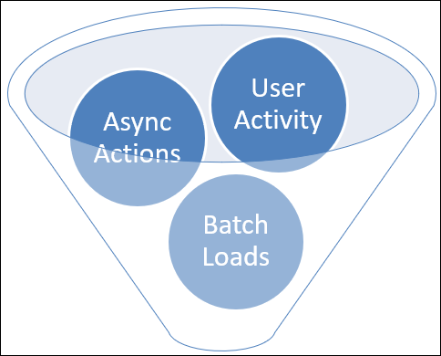
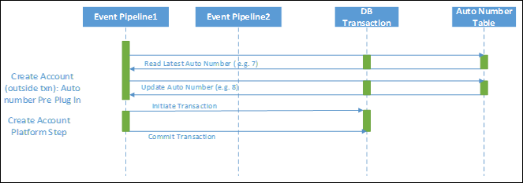
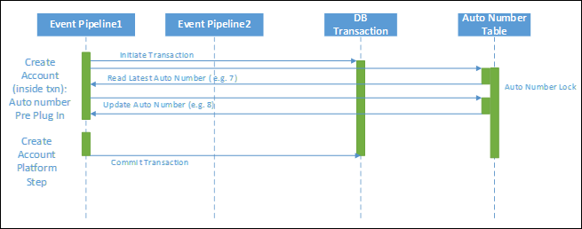
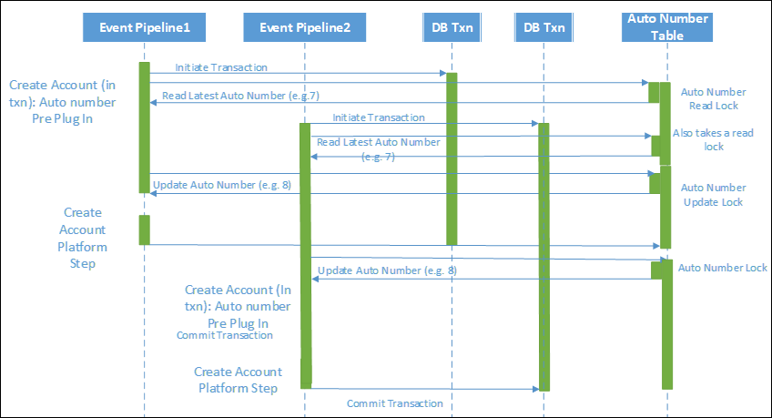
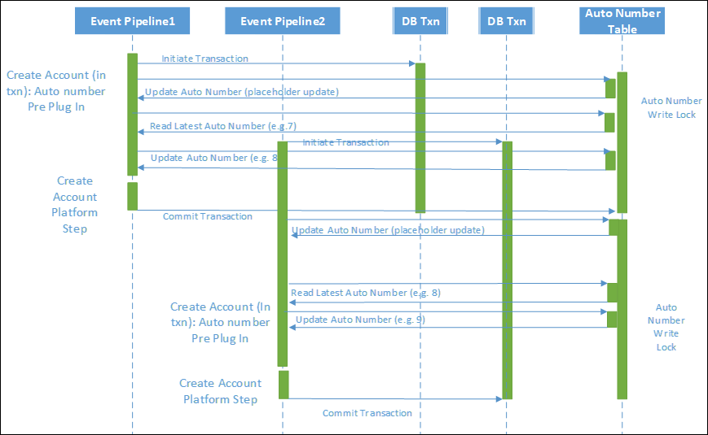
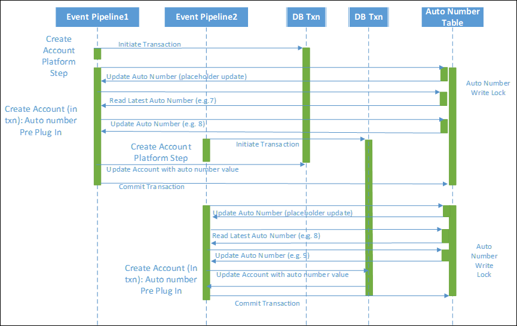
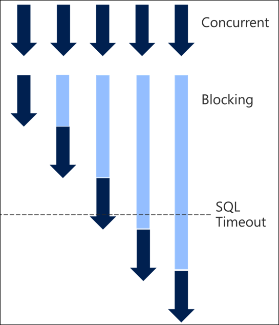
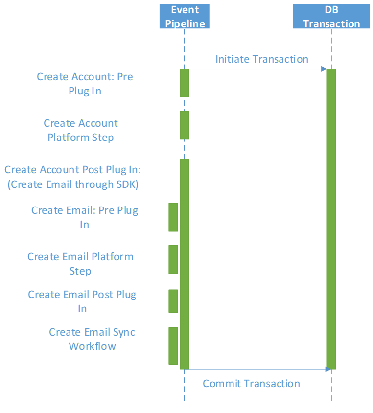
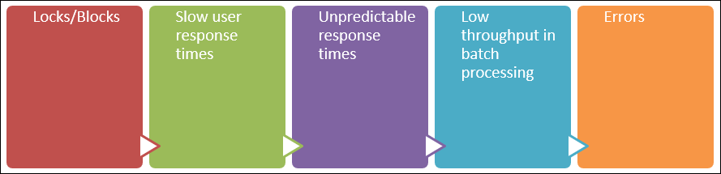

# Scalable Customization Design: Concurrency issues

> [!NOTE]
> This is the third in a series of topics about scalable customization design. To start at the begining, see [Scalable Customization Design in Common Data Service for Apps](overview.md).
> The previous topic [Scalable Customization Design: Database transactions](database-transactions.md) described how database transactions are applied and the effect they have on different types of customizations.

When you have concurrent requests, the chance of collisions on locks becomes higher. The longer the transactions take, the longer the locks are held. The chances are even higher of collision and the overall impact would be greater on end users. 

You also need to be aware of the multiple ways that activity can be driven onto the application, each of which is taking locks that could cause conflict with other actions within the system. In these cases, locking is preventing inconsistencies of data occurring when overlapping actions occur on the same data. 

Some key areas to consider design for, and check for if you do see problems, are:

- **User driven activity**: Directly through the user interface.
- **Async actions**: Activity that occurs later as a result of other actions. When this activity will be processed isn’t known at the time the initiating action is triggered.
- **Batch activities**: Either driven from within Common Data Service for Apps (CDS for Apps) (such as bulk delete jobs or server side synchronization processing), or driven from external sources such as integration from another system.

## Async operations in parallel

A common misconception is that async workflows or plug-ins are processed serially from a queue and there wouldn’t be conflict between them. This isn’t accurate, since CDS for Apps processes multiple asynchronous activities in parallel both within each async service instance and across async service instances spread over different servers to increase throughput. Each async service actually retrieves jobs to be performed in batches of approximately 20 per service based on configuration and load.

If you initiate multiple asynchronous activities from the same event on the same record, they’re likely to process in parallel. As they fired on the same record, a common pattern is updates back to the same parent record; therefore the conflict opportunity is high. 

When a triggering event occurs, such as the creation of an account, asynchronous logic in CDS for Apps may create entries in the [AsyncOperation (System Job) Entity](../reference/entities/asyncoperation.md) for each process or action to be taken. The Async Service monitors this table, picks up waiting requests in batches, and then processes them. Because the workflows are triggered at the same time, they are highly likely to be picked up in the same batch and processed at the same time. 

<!-- Consider making this example a separate topic -->
## Why it’s important to understand transactions: Auto numbering example

One scenario that illustrates the common misunderstanding of how transactions are handled within Dynamics CRM is implementing an automatic numbering scheme.

In this scenario the requirement is typically to:

- Generate a unique number following a particular pattern.
- Allow for many concurrent requests to create the related type of records; for example, accounts that need a unique reference.
- Allow for sequential numbering of the unique numbers.
- Ensure that the number generation is consistent, but scalable, and does not error out under load. It also needs to ensure that duplicate numbers cannot be generated.
- Generate the number on the creation of the relevant record.

The typical approach involves variations of the following:

- Store the last used number in an auto number index data store; for example, a custom entity with a row per data type.
- Retrieve the last used number and increment that number.
- Record the new number against the newly generated record.
- Store the new number back as being the last used number in the auto number index store.

The following sections describe different approaches that can be taken within Dynamics CRM and highlight the implications, showcasing both the importance and benefit of understanding the way transactions are utilized. 

### Approach 1: Out of a transaction

The simplest approach is to realize that any use of a commonly required resource would introduce the potential for blocking. Since this has an impact on scalability you may decide you want to avoid a platform transaction when generating an auto number.
Let’s consider the scenario for auto numbering generation outside of the pipeline transaction in a pre-validation plug-in.

When you run this in isolation it works fine. It doesn’t, however, actually protect against concurrency errors. As the following diagram shows, if two requests in parallel both request the latest number and then both increment and update the value, you’ll end up with duplicate numbers. Because there is no locking held against the retrieved number, it is possible for a race condition to occur and both threads to end up with the same value. 

In many cases, even though multiple requests may be occurring, due to the limited window for overlapping this could work fine, but it is relying on luck rather than good design to prevent the duplication.

### Approach 2: In a plug-in transaction

If you do the auto numbering from a plug-in registered within the transaction (txn), surely this works….right?

In the same circumstances of overlapping requests trying to generate numbers at the same time, it would be possible for both requests to be granted a shared read lock on the auto numbering table. Unfortunately, at the point the application tries to upgrade this to an exclusive lock, this would not be possible as there would be another shared read lock preventing this.

Depending on how the queries are being generated, the exact behavior can vary, but relying on those conditions and not being certain of the outcome where the uniqueness is essential isn’t ideal. Even if this does not generate a failure, the shared read ability could allow a duplicate number to be generated if the isolation modes aren’t correct. As the following diagram shows, both records end up with the same auto number value of 8.

### Approach 3: Pre-lock in a plug-in transaction

Understanding the way the transactions work leads to being able to generate a safe way to do this. 

In this approach, from the start of the transaction, a placeholder update is performed on the auto numbering record to some field (for example, UpdateInProgress) used purely for the purpose of maintaining consistency. It does this by writing an update indicating an update is about to start. This process then requests and takes an exclusive write lock on that row in the auto numbering table, blocking other processes from starting the auto numbering approach. 

This then allows you to safely increment and write back the updated auto number without any other process being able to interfere. 

It does have the implication that this will serialize not only the auto numbering updates but also the account creation requests as both these steps occur in the same platform transaction. If the creation of accounts are quick actions then that may be a perfectly good approach and it ensures that account creation and auto numbering are performed consistently; if one fails they both fail and roll back.
 
In fact, where the other actions within the transaction are quick, this is the most consistent and efficient approach for implementing auto numbering in customizations. 

If however, you also introduce other synchronous plug-ins or workflows that each take extended amounts of time to complete, serialization can become a real scalability challenge, as the auto numbering process not only blocks itself but blocks waiting for the other activities to complete. 

Normally, generation of the auto number would be done in a pre-event plug-in. You include the number in the input parameters to the create step and avoid a second update in the post processing to record the generated auto number against the account.

With the scalability implications in mind, if there is other complex processing in the account creation process, an alternative would be to move the auto number generation to a post create process, which still ensures a consistent update process. The benefit would be that it reduces the length of time within the transaction that the auto number record lock is held as the lock is only taken towards the end of the process. If the auto numbering table is the most highly contested resource and this approach is taken for all processes accessing it, this reduces the amount of contention overall.

The tradeoff here would be the need to perform an additional update to account, while reducing the overall length of time blocking waiting for the auto numbering record.

## Serialization and Timeouts

A high degree of serialization is typically what turns blocking into timeouts and poor throughput. When you have many concurrent requests, once they serialize and take a long time to process, each request in turn takes longer and longer until you start hitting timeouts and therefore errors. 

The plug-in timeout starts from when it is initiated. A SQL timeout is calculated on the database request, so if a query blocks waiting for a long time, it can time out.

## Chain of actions

As well as understanding the specific queries in the directly triggered activities, it is also necessary to consider where a chain of related events may occur.
 
Each message request made in a plug-in or as a step in a synchronous workflow not only triggers the direct action but may also cause other synchronous plug-ins and workflows to fire. Each of these synchronous activities will occur in the same transaction, extending the life of that transaction and any locks held possibly much longer than may be realized.

The overall effect may be much greater than initially realized. This can often happen unintentionally where multiple people are building up the implementation, or it evolves over time. 

## Running into platform constraints

This is where the platform constraints can come in. And in reality this sort of behavior is exactly what the constraints are there to protect the broader system from.

Whenever this level of delay of processing occurs, it will have unintended consequences in other areas of the system and on other users. It’s therefore important to prevent this kind of activity from interfering with system performance.

While the easy way to avoid the errors may be to relax the platform constraints, this is not addressing the more fundamental impact on the overall scalability and performance of the system. This needs to be addressed by fixing and preventing the behavior triggering the constraints in the first place. 

## Impact on usage

What often also has an impact on usage is a cascading series of implications of this behavior.

The initial issue is locks and therefore blocking in the system. This leads to slow user response times, which is then amplified as unpredictable and unreliable user response times, often in a particular area of the system.

In the extreme case or under heavier than normal load, this can then show through in any background batch processing with poor throughput. Eventually it can all escalate into errors occurring in the system.

It is common that when investigating SQL timeout errors, users are also reporting poor and unpredictable response times, and the connection had not been made between these as related issues. 

## Summary

This topic continued the discussion of database transactions from [Scalable Customization Design: Database transactions](database-transactions.md). This topic introduced the effect that concurrant activity may have on the system which can amplify the impact of design choices or allow independently developed business processes to introduce unexpected side-effects. 

## Next steps

[Scalable Customization Design: Transaction design patterns](transaction-design-patterns.md)