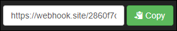
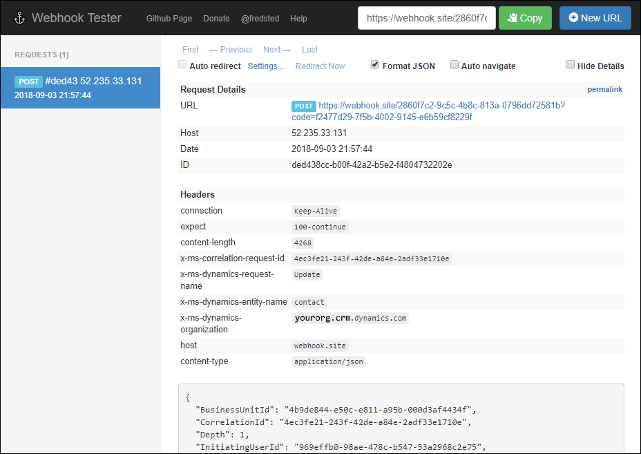

# Test webhook registration with request logging site 

Before you create or configure a service to consume web hooks, you should test what kind of data the service will receive so that you can know what kind of data you will need to process. For this purpose, you can use one of several request logging sites. For the purpose of this example, we will use [Webhook Tester](https://webhook.site) to configure a target for the webhook requests. Use the following steps:

1. Go to [https://webhook.site](https://webhook.site). In the top right-hand corner you will see a green **Copy** button.
    
1. Use the **Copy** button to copy the URL. Keep this page open.
1. Use the plugin registration tool to register a new webhook as described in [Register a web hook](register-web-hook.md). 
    1. Use the URL you copied in step 2 as the **Endpoint URL**. 
    1. Set a name and any authentication properties you want. Webhook Tester will not evaluate these values in the way that an actual site that will process the data should, but you can see how they will be passed through.
1. Use the plugin registration tool to register a step using the webhook you created in step 4 as described in [Register a step for a webhook](register-web-hook.md#register-a-step-for-a-webhook). 
    1. Make sure to use an event that you can easily perform by editing data in the CDS for Apps application, such as updating a contact entity.
1. Use the CDS for Apps app to perform the operation to trigger the event.
1. After you trigger the event, return to the Webhook Tester page from step 2. You should see that the page has been updated to show the data passed in the request:

    

    > [!TIP]
    > Use the **Format JSON** option to make the JSON returned in the body of the request easier to read.

## Next steps

[Use webhooks to create external handlers for server events](use-webhooks.md)

### See also
[Register a webhook](register-web-hook.md)