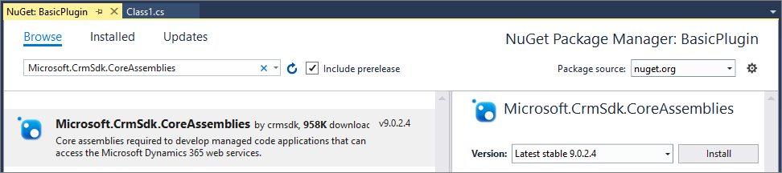

# Tutorial: Write a plug-in

This tutorial is the first in a series that will show you how to work with plug-ins. This tutorial is a pre-requisite for the following tutorials:

- [Tutorial: Debug a plug-in](tutorial-debug-plug-in.md)
- [Tutorial: Update a plug-in](tutorial-update-plug-in.md)

## Goal
Create an asynchronous plug-in registered on the Create message of the account entity. The plug-in will create a task activity that will remind the creator of the account to follow up one week later.

> [!NOTE]
> This goal can be easily achieved using a workflow without writing code. We are using this simple example so that we can focus on the process of creating and deploying a plug-in.

## Prerequisites

- Administrator level access to a Common Data Service for Apps environment
- A model-driven app that includes the account and task entities.
- Visual Studio 2017
- Knowledge of the Visual C# programming language
- Download the Plug-in Registration tool.
    - Information about downloading the Plug-in registration tool is at : [Download tools from NuGet](download-tools-nuget.md). That topic includes instructions to use a PowerShell script to download the latest tools from NuGet.

## Create a plug-in project

You need to use Visual Studio to write a plug-in. Use these steps to write a basic plug-in.

### Create a Visual Studio Project for the Plug-in

1. Open Visual Studio 2017 and open a new **Class Library (.NET Framework)** project using **.NET Framework 4.5.2**
    

    The name used for the project will be the name of the assembly. This tutorial uses the name `BasicPlugin`.
1. In **Solution Explorer**, right-click the project and select **Manage NuGet Packages…** from the context menu.
    
1. Select **Browse** and search for `Microsoft.CrmSdk.CoreAssemblies` and install the latest version.
    
1. You must select **I Accept** in the **License Acceptance** dialog.
1. In **Solution Explorer**, right-click the `Class1.cs` file and choose **Rename** in the context menu.
    
1. Rename the `Class1.cs` file to `FollowupPlugin.cs`.
1. When prompted, allow Visual Studio to re-name the class to match the file name
    

### Edit the Class file to enable a plug-in

## Add business logic

## Build plug-in

## Sign plug-in

## Register plug-in

## Test plug-in

## View trace logs

## Next steps