# Tutorial: Write a plug-in

This tutorial is the first in a series that will show you how to work with plug-ins. This tutorial is a pre-requisite for the following tutorials:

- [Tutorial: Debug a plug-in](tutorial-debug-plug-in.md)
- [Tutorial: Update a plug-in](tutorial-update-plug-in.md)

## Goal
Create an asynchronous plug-in registered on the Create message of the account entity. The plug-in will create a task activity that will remind the creator of the account to follow up one week later.

> [!NOTE]
> This goal can be easily achieved using a workflow without writing code. We are using this simple example so that we can focus on the process of creating and deploying a plug-in.

## Prerequisites

- Administrator level access to a Common Data Service for Apps environment
- A model-driven app that includes the account and task entities.
- Visual Studio 2017
- Knowledge of the Visual C# programming language
- Download the Plug-in Registration tool.
    - Information about downloading the Plug-in registration tool is at : [Download tools from NuGet](download-tools-nuget.md). That topic includes instructions to use a PowerShell script to download the latest tools from NuGet.

## Create a plug-in project

You need to use Visual Studio to write a plug-in. Use these steps to write a basic plug-in.

### Create a Visual Studio Project for the Plug-in

1. Open Visual Studio 2017 and open a new **Class Library (.NET Framework)** project using **.NET Framework 4.5.2**

    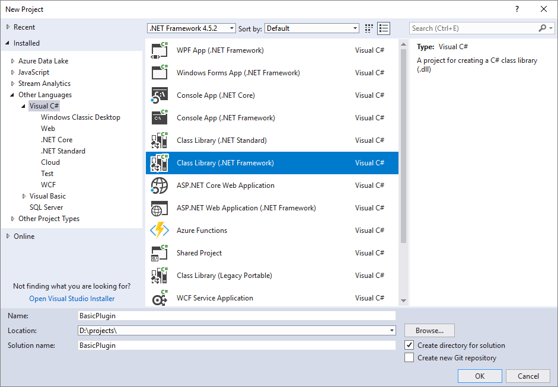

    The name used for the project will be the name of the assembly. This tutorial uses the name `BasicPlugin`.
1. In **Solution Explorer**, right-click the project and select **Manage NuGet Packages…** from the context menu.

    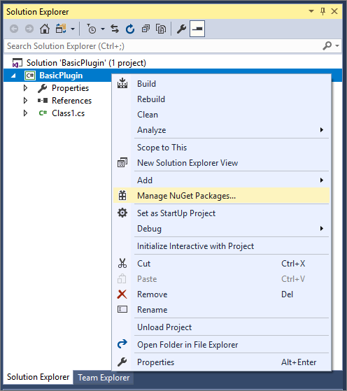

1. Select **Browse** and search for `Microsoft.CrmSdk.CoreAssemblies` and install the latest version.

    

1. You must select **I Accept** in the **License Acceptance** dialog.
1. In **Solution Explorer**, right-click the `Class1.cs` file and choose **Rename** in the context menu.

    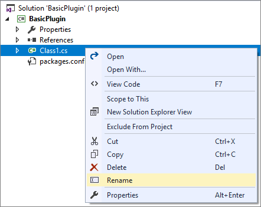

1. Rename the `Class1.cs` file to `FollowupPlugin.cs`.
1. When prompted, allow Visual Studio to re-name the class to match the file name.

    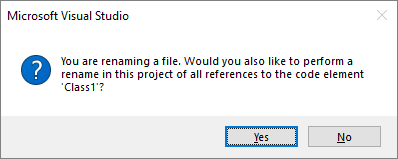

### Edit the Class file to enable a plug-in

1. Add the following `using` statements to the top of the `FollowupPlugin.cs` file:


```csharp
using System.ServiceModel;  
using Microsoft.Xrm.Sdk;
```

1. Implement the <xref:Microsoft.Xrm.Sdk.IPlugin> Interface by editing the class.

    > [!NOTE]
    > If you just type  `: IPlugin` after the class name, Visual Studio will auto-suggest implementing a stub for the **Execute** Method.


    ```csharp
    public class FollowupPlugin : IPlugin
    {
        public void Execute(IServiceProvider serviceProvider)
        {
            throw new NotImplementedException();
        }
    }
    ```

1. Replace the contents of the `Execute` method with the following code:


    ```csharp
    // Obtain the tracing service
    ITracingService tracingService =
    (ITracingService)serviceProvider.GetService(typeof(ITracingService));

    // Obtain the execution context from the service provider.  
    IPluginExecutionContext context = (IPluginExecutionContext)
        serviceProvider.GetService(typeof(IPluginExecutionContext));

    // The InputParameters collection contains all the data passed in the message request.  
    if (context.InputParameters.Contains("Target") &&
        context.InputParameters["Target"] is Entity)
    {
        // Obtain the target entity from the input parameters.  
        Entity entity = (Entity)context.InputParameters["Target"];

        // Obtain the organization service reference which you will need for  
        // web service calls.  
        IOrganizationServiceFactory serviceFactory =
            (IOrganizationServiceFactory)serviceProvider.GetService(typeof(IOrganizationServiceFactory));
        IOrganizationService service = serviceFactory.CreateOrganizationService(context.UserId);

        try
        {
            // Plug-in business logic goes here.  
        }

        catch (FaultException<OrganizationServiceFault> ex)
        {
            throw new InvalidPluginExecutionException("An error occurred in FollowUpPlugin.", ex);
        }

        catch (Exception ex)
        {
            tracingService.Trace("FollowUpPlugin: {0}", ex.ToString());
            throw;
        }
    }
    ```

### About the code

- The <xref:Microsoft.Xrm.Sdk.ITracingService> enables writing to the tracing log.  You can see an example in the final catch block. More information: [Tracing](plug-ins.md#tracing)
- The <xref:Microsoft.Xrm.Sdk.IPluginExecutionContext> provides access to the context for the event that executed the plugin.  More information: [Context information available to your code](plug-ins.md#context-information-available-to-your-code).
- The code verifies that the context <xref:Microsoft.Xrm.Sdk.IExecutionContext.InputParameters> includes the expected parameters for the <xref:Microsoft.Xrm.Sdk.Messages.CreateRequest> that this plug-in will be registered for. If the <xref:Microsoft.Xrm.Sdk.Messages.CreateRequest.Target> property is present, the <xref:Microsoft.Xrm.Sdk.Entity> that was passed to the request will be available.
- The <xref:Microsoft.Xrm.Sdk.IOrganizationServiceFactory> interface provides access to a service variable that implements the <xref:Microsoft.Xrm.Sdk.IOrganizationService> interface which provides the methods you will use to interact with the service to create the task.


## Add business logic

The plug-in will create a task activity that will remind the creator of the account to follow up one week later.

Add the following code to the try block. Replace the comment: `// Plug-in business logic goes here`. with the following:


```csharp
// Create a task activity to follow up with the account customer in 7 days. 
Entity followup = new Entity("task");

followup["subject"] = "Send e-mail to the new customer.";
followup["description"] =
    "Follow up with the customer. Check if there are any new issues that need resolution.";
followup["scheduledstart"] = DateTime.Now.AddDays(7);
followup["scheduledend"] = DateTime.Now.AddDays(7);
followup["category"] = context.PrimaryEntityName;

// Refer to the account in the task activity.
if (context.OutputParameters.Contains("id"))
{
    Guid regardingobjectid = new Guid(context.OutputParameters["id"].ToString());
    string regardingobjectidType = "account";

    followup["regardingobjectid"] =
    new EntityReference(regardingobjectidType, regardingobjectid);
}

// Create the task in Microsoft Dynamics CRM.
tracingService.Trace("FollowupPlugin: Creating the task activity.");
service.Create(followup);
```

### About the code

- This code uses the late-bound style to create a task and associate it with the account being created. More information: [Create entities using the Organization Service](org-service/entity-operations-create.md)
- Early bound classes can be used, but this requires generating the classes for the entities and including the file defining those classes with the assembly project. This is mostly a personal preference, so those steps have been left out of this tutorial for brevity. More information: [Late-bound and Early-bound programming using the Organization service](org-service/early-bound-programming.md)
- The <xref:Microsoft.Xrm.Sdk.Entity.Id> of the account being created is found in the context <xref:Microsoft.Xrm.Sdk.IExecutionContext.OutputParameters> and set as the `regardingobjectid` lookup attribute for the task.

## Build plug-in

In Visual Studio, press **F6** to build the assembly. Verify that it compiles without error.

## Sign plug-in

1. In **Solution Explorer**, right click the **BasicPlugin** project and in the context menu select **Properties**.

    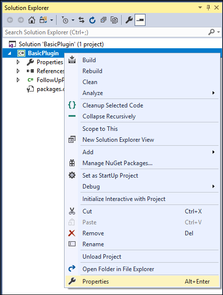

1. In the project properties, select the **Signing** tab and select the **Sign the assembly** checkbox.

    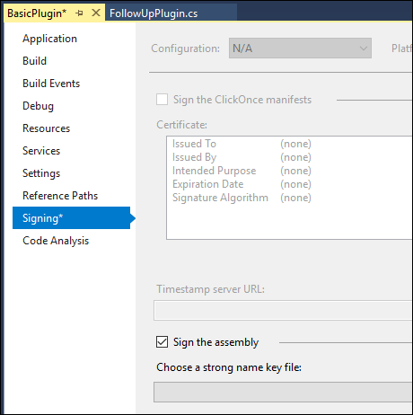

1. In the **Choose a strong name key file**: dropdown, select **<New…>**. 
1. In the **Create Strong Name Key**dialog, enter a **key file name** and deselect the **Protect my key file with a password** checkbox.
1. Click **OK** to close the **Create Strong Name Key** dialog.
1. In the project properties **Build** tab, verify that the **Configuration** is set to **Debug**.
1. Press **F6** to build the plug-in again.
1. Using windows explorer, find the built plug-in at:` \bin\Debug\BasicPlugin.dll`.

> [!NOTE]
> Build the assembly using **Debug** configuration because you will use the Plug-in profiler to debug it in a later tutorial.   Before you include a plug-in with your solution, you should build it using the release configuration.

## Register plug-in

To register a plug-in, you will need the plug-in registration tool

### Connect using the Plug-in Registration tool

1. After you have downloaded the Plug-in registration tool, click the `PluginRegistration.exe` to open it.
1. Click **Create new Connection** to connect to your instance.
1. Make sure **Office 365** is selected. If you are connecting using a Microsoft account other than one you are currently using, click **Show Advanced**.

    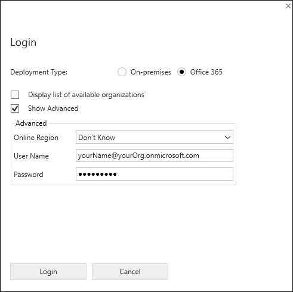

1. Enter your credentials and click **Login**.
1. If your Microsoft Account provides access to multiple environments, you will need to choose an environment.
1. After you are connected, you will see any existing registered plug-ins & custom workflow activities

    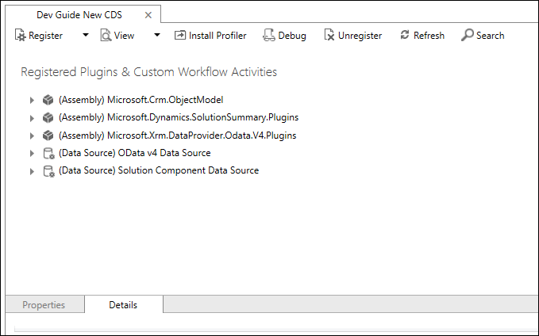

### Register your assembly

1. In the **Register** drop-down, select **New Assembly**.

    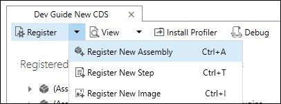

1. In the **Register New Assembly** dialog, select the ellipses (**…**) button and browse to the assembly you built in the previous step.

    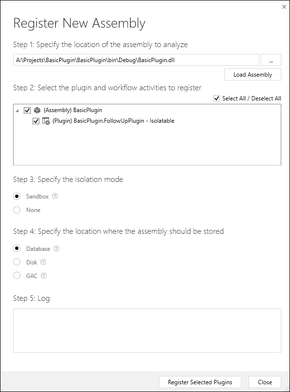

1. Verify that the **isolation mode** is **sandbox** and the **location** to store the assembly is **Database**.

    > [!NOTE]
    > Other options for **isolation mode** and **location** apply to on-premises deployments.

1. Click **Register Selected Plug-ins**.
1. You will see a **Registered Plug-ins** confirmation dialog.

    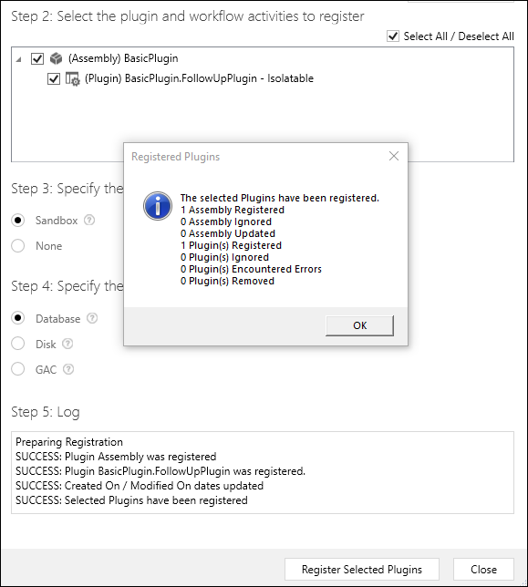

1. Click **OK** to close the dialog and close the **Register New Assembly** dialog. 
1. You should now see the **(Assembly) BasicPlugin** assembly which you can expand to view the **(Plugin) BasicPlugin.FollowUpPlugin** plugin.

    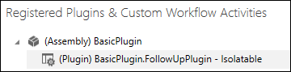


### Register a new step

1. Right-click the **(Plugin) BasicPlugin.FollowUpPlugin** and select **Register New Step**.

    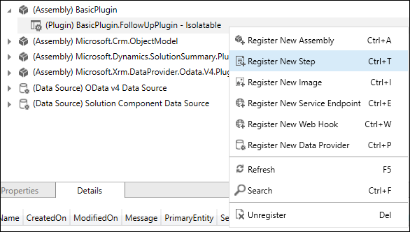

1. In the **Register New Step** dialog, set the following fields:

    |Setting|Value|
    |--|--|
    |Message|Create|
    |Primary Entity|account|
    |Event Pipeline Stage of Execution|PostOperation|
    |Execution Mode|Asynchronous|

    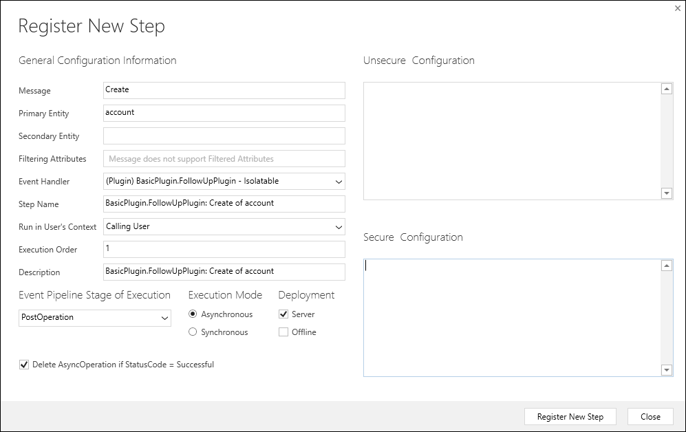

1. Click **Register New Step** to complete the registration and close the **Register New Step** dialog.
1. You can now see the registered step.

    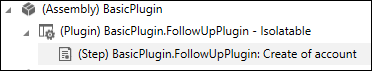


## Test plug-in

1. Open a model-driven app and create an account entity.
1. Within a short time, open the account and you can verify the creation of the task.

    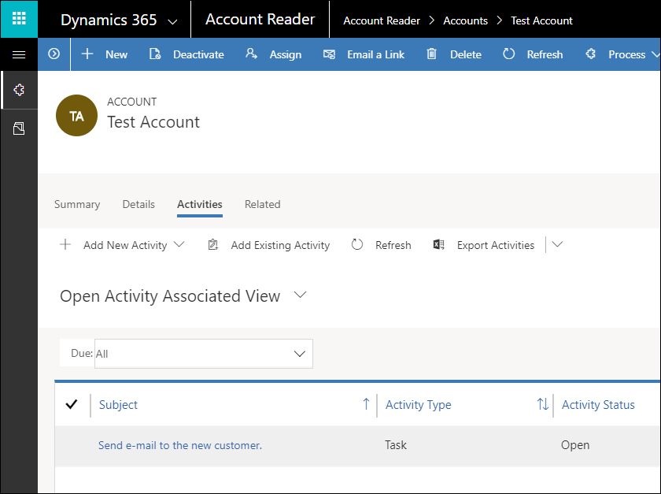


## View trace logs

The sample code wrote a message to the trace log. The steps below describe how to view the logs.

By default, plug-in trace logs are not enabled. 

> [!TIP]
> IF you prefer to change this setting in code:
> This setting is in the [Organization Entity PluginTraceLogSetting attribute](reference/entities/organization.md#BKMK_PluginTraceLogSetting).
> 
> The valid values are:
> 
> |Value|Label|
> |--|--|
> |0|Off|
> |1|Exception|
> |2|All|

Use the following steps to enable them in a model-driven app.

1. Open the Dynamics 365 - custom  app.

    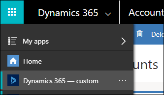

1. Navigate to **Settings** > **System** > **Administration**.

    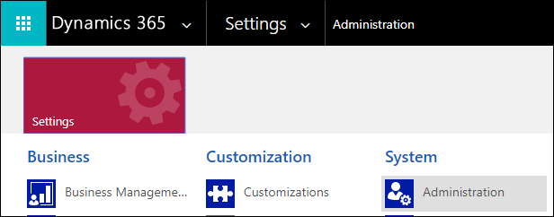

1. In **Administration**, select **System Settings**.
1. In the **System Settings** dialog, in the customization tab, set **Enable logging to plug-in trace log** to **All**.

    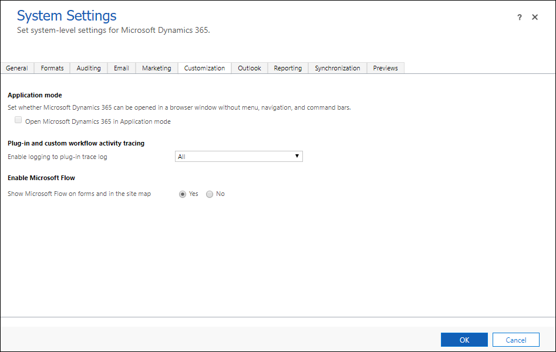

    > [!NOTE]
    > You should disable logging after you are finished testing your plug-in, or at least set it to **Exception** rather than **All**.

1. Click **OK** to close the **System Settings** dialog.
1. Repeat the steps to test your plug-in by creating a new account.
1. In the **Dynamics 365 -- custom app**, navigate to **Settings** > **Customization** > **Plug-In Trace Log**.
1. You should find that a new Plug-in Trace Log record has been created.

    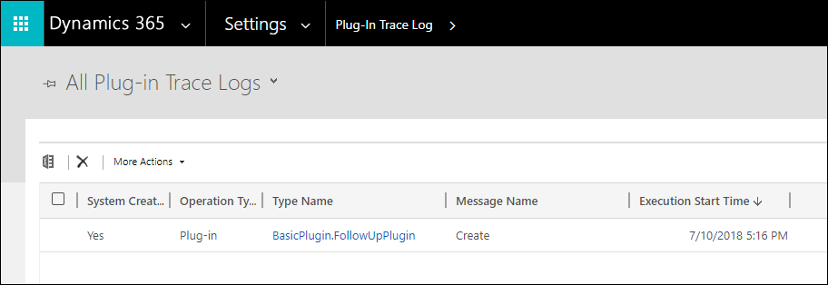

1. If you open the record you might expect that it would include the information you set in your trace, but it does not. It only verifies that the trace occurred.
1. To see the details, it is easier to query this data using the Web API in your browser using the following query with the <xref href="Microsoft.Dynamics.CRM.plugintracelog?text=plugintracelog EntityType" />, using the `typename` property to filter results in the `messageblock` property based on the name of the plug-in class:

    `GET <your org uri>/api/data/v9.0/plugintracelogs?$select=messageblock&$filter=typename eq 'BasicPlugin.FollowUpPlugin'`

1. You can expect to see the following returned with the Web API query:

    ```json
    {
        "@odata.context": "<your org uri>/api/data/v9.0/$metadata#plugintracelogs(messageblock)",
        "value": [{
            "messageblock": "FollowupPlugin: Creating the task activity.",
            "plugintracelogid": "f0c221d1-7f84-4f89-acdb-bbf8f7ce9f6c"
        }]
    }
    ```

## Next steps

In this tutorial you have created a simple plug-in and registered it. Complete [Tutorial: Debug a plug-in](tutorial-debug-plug-in.md) to learn how to debug this plug-in.