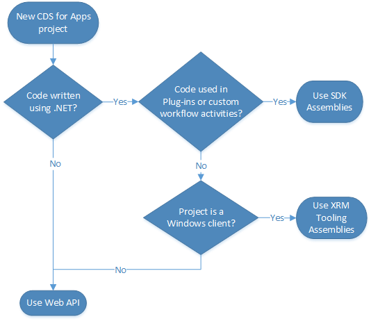

<!-- OLD: https://docs.microsoft.com/en-us/dynamics365/customer-engagement/developer/use-microsoft-dynamics-365-web-services -->
# Use Common Data Service for Apps web services

Common Data Service for Apps provides two web services you can use to interact with data, and two discovery services that you can use to find available instances for users.

Choose the one which best matches the requirement and your skills. 

## Web API

The Web API is an OData v4 RESTful endpoint. Use this for any programming language that supports HTTP requests and authentication using OAuth 2.0.

More information: [Use the Common Data Service for Apps Web API](webapi/overview.md) 

## Organization service

Use the .NET Framework SDK assemblies for projects that involve writing plug-ins or workflow extensions. 

More information: [Use the Common Data Service for Apps Organization Service](org-service/overview.md)

Use the Xrm.Tooling assemblies if you are creating a Windows client application. More information: [Build Windows client applications using the XRM tools](xrm-tooling/build-windows-client-applications-xrm-tools.md)

## Discovery services

Each Common Data Service for Apps user may be able to access multiple CDS for Apps instances. Discovery services let you write code to provide users a list of instances they can connect to based on the Microsoft account they use. Each instance includes a URL that you can then use to connect to the instance they choose. 

A Discovery service is accessed through either the Web API or the Organization Service. More information: [Discovery Service](discovery-service.md) 

### See also

[Common Data Service for Apps Developer Overview](overview.md)

