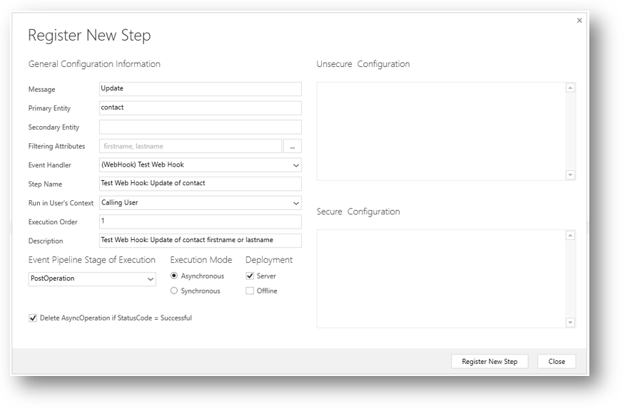

# Use webhooks to create external handlers for server events

With Common Data Service for Apps, you can send data about events that occur on the server to a web application using webhooks. Webhooks is a lightweight HTTP pattern for connecting Web APIs and services with a publish/subscribe model. Webhook senders notify receivers about events by making requests to receiver endpoints with some information about the events.

Webhooks enable developers and ISV’s to integrate Customer Engagement data with their own custom code hosted on external services. By using the webhook model, you can secure your endpoint by using authentication header or query string parameter keys. This is simpler than the SAS authentication model that you may currently use for Azure Service Bus integration.

When deciding between the webhook model and the Azure Service Bus integration, here are some items to keep in mind:

- Azure Service Bus works for high scale processing, and provides a full queueing mechanism if CDS for Apps is pushing many events.
- Webhooks can only scale to the point at which your hosted web service can handle the messages.
- Webhooks enables synchronous and asynchronous steps. Azure Service Bus only allows for asynchronous steps.
- Webhooks send POST requests with JSON payload and can be consumed by any programming language or web application hosted anywhere.
- Both webhooks and Azure Service Bus can be invoked from a plugin or custom workflow activity.


## Get Started

There are three parts to using web hooks:

- Creating or configuring a service to consume webhook requests.
- Registering webhook step on the CDS for Apps service, or
- Invoking a webhook from a plug-in or custom workflow activity. 

This topic will start by explaining how to register a webhook and how to test the registration using a request logging site. This information will help inform you about the requirements in creating and configuring a service designed to consume webhook requests which is explained in [Create or Configure a service to consume webhook requests](#create-or-configure).

## Register a webhook

Use the Plug-in Registration tool to register a webhook. To get the Plug-in registration tool, see [Download tools from NuGet](download-tools-nuget.md). 

In the Plug-in Registration tool there is a new **Register New Web Hook** option to select.


When you register a webhook you must provide three items of information:


|Item  |Description  |
|---------|---------|
|**Name**|A unique name describing the web hook.|
|**Endpoint URL**|The URL to post execution context information to.|
|**Authentication**|One of three authentication options. For any type of authentication, you must provide the keys that will identify the request as legitimate.|

### Authentication options

The correct webhook registration authentication option and values to use depend on what the endpoint expects.  The owner of the endpoint must tell you what to use. To use webhooks with CDS for Apps, the endpoint must allow one of the three authentication options described below:


|Type  |Description  |
|---------|---------|
|**HttpHeader**|Includes one or more key values pairs in the header of the http request.<br />Example: <br />`Key1: Value1`<br />`Key2: Value2`|
|**WebhookKey**|Includes a query string using `code` as the key and a value required by the endpoint. When registering the web hook using the Plug-in Registration tool, only enter the value.<br />Example: <br />`?code=00000000-0000-0000-0000-000000000001`|
|**HttpQueryString**|Includes one or more key value pairs as query string parameters.<br />Example: <br />`?Key1=Value1&Key2=Value2`|

> [!NOTE]
> The **WebhookKey** option is useful with [Azure Functions](https://azure.microsoft.com/services/functions/) because the authentication query string is expected to have a key name of `code`.

Any request to the endpoint configured should fail when the authentication options passed in the request do not match. This is the responsibility of the endpoint.

<a name="query-webhook-registrations"></a>

### Query webhook Registrations

Webhook registrations are stored in the [ServiceEndpoint Entity](reference/entities/serviceendpoint.md) and have a [Contract](reference/entities/serviceendpoint.md#BKMK_Contract) value of `8`.

You can find details about the registered webhooks by querying the **ServiceEndpoint** entity.

**Web API:**

`GET [organization URI]/api/data/v9.0/serviceendpoints?$filter=contract eq 8&$select= serviceendpointid,name,authtype,url`

**FetchXml:**

```xml
<fetch>
  <entity name="serviceendpoint" >
    <attribute name="serviceendpointid" />
    <attribute name="name" />
    <attribute name="authtype" />
    <attribute name="url" />
    <filter>
      <condition attribute="contract" operator="eq" value="8" />
    </filter>
  </entity>
</fetch> 
```
Details about the authentication values set are in the [AuthValue](reference/entities/serviceendpoint.md#BKMK_AuthValue) property and cannot be retrieved.

## Register a step for a webhook

Registering a step for a webhook is like registering a step for a plugin. The main difference is that you cannot specify any configuration information. 

Just like a plugin, you specify the message, and information about entities when appropriate. You can also specify where in the event pipeline to execute the web hook, the execution mode and whether to delete any **AsyncOperation** when the operation succeeds. 



Information about the **Step Name**, and **Description** will be auto-populated based on the options you choose, but you can change them. If you do not set some **Filtering Attributes** for a message that supports them, you will be prompted to do so as a performance best practices.

### Execution mode and debugging your web hook registration

Your choice in registering the webhook changes the experience you will have when debugging if things don’t work.

#### Asynchronous mode
When you use asynchronous execution mode an asyncoperation job will be created to capture the success or failure of the operation. Choosing to delete the asyncoperation when it succeeds will save you database space. 

Any errors that occur will be recorded in System Jobs. In the web application you can go to **Settings > System > System Jobs** to review the status of any web hooks. There will be a **Status Reason** value of **Failed**. Open the failed system job entity to find details that describe why the job failed.

#### Synchronous mode

When you choose to use a synchronous execution mode any failure will be reported back to the user of the application with an **Endpoint unavailable** error dialog informing the user that the webhook service endpoint may be configured incorrectly or is not available. The dialog will allow you to download a log file to get details on any errors.

> [!NOTE]
> You should use synchronous mode when it is important that the operation triggered by the webhook occur immediately or if you want the entire transaction to fail unless the webhook payload is recieved by the service. A simple webhook step registration provides limited options to manage failure, but you can also invoke webhooks using plugins workflow activities if you require more control. More information: [Invoke a webhook from a plugin or workflow activity](#invoke-a-webhook-from-a-plugin-or-workflow-activity).


#### Possible causes for failure

Webhooks are relatively simple. The service will send the request and evaluate the response. The system cannot parse any data returned with the body of the response, it will only look at the response `StatusCode` value.

The timeout is 60 seconds. Generally, if no response is returned before the timeout period or if the response `StatusCode` value is not within the `2xx` range to indicate success it will fail. The exception is when the error returned is in the following table:

|`StatusCode`|Description|
|-|-|
|`502`|Bad Gateway|
|`503`|Service Unavailable|
|`504`|Gateway Timeout|

These errors indicate a networking issue that might be resolved with another attempt. The webhook service will make one more attempt only when these error codes are returned.

See [Query failed asynchronous jobs for a given step](#query-failed-asynchronous-jobs-for-a-given-step) for information about how to retrieve data about failed asynchronous jobs.

### Query steps registered for a webhook

Data for registered webhooks is in the [SdkMessageProcessingStep Entity](reference/entities/sdkmessageprocessingstep.md).

You can query the steps registered for a specific webhook when you know the serviceendpointid for the webhook. See [Query webhook registrations](#query-webhook-registrations) for a query to get the id for a registered web hook.

**Web API:**

You can use this Web API Query where *&lt;id&gt;* is the [ServiceEndpointId](reference/entities/serviceendpoint.md#BKMK_ServiceEndpointId) of the webhook:

```http
GET [organization URI]/api/data/v9.0/serviceendpoints(@id)/serviceendpoint_sdkmessageprocessingstep?$select=sdkmessageprocessingstepid,name,description,asyncautodelete,filteringattributes,mode,stage?@id=<id>
```

For more information about the registered step, you can use this Web API query where *&lt;stepid&gt;* is the [SdkMessageProcessingStepId](reference/entities/sdkmessageprocessingstep.md#BKMK_SdkMessageProcessingStepId) for the step:

```http
GET [organization URI]/api/data/v9.0/sdkmessageprocessingsteps(@id)?$select=name,description,filteringattributes,asyncautodelete,mode,stage&$expand=plugintypeid($select=friendlyname),eventhandler_serviceendpoint($select=name),sdkmessagefilterid($select=primaryobjecttypecode),sdkmessageid($select=name)?@id=<stepid>
```

**FetchXML:**

You can use this FetchXML to get the same information in one query where *&lt;serviceendpointid&gt;* is the id of the webhook:

```xml
<fetch>
  <entity name="sdkmessageprocessingstep" >
    <attribute name="name" />
    <attribute name="filteringattributes" />
    <attribute name="stage" />
    <attribute name="asyncautodeletename" />
    <attribute name="description" />
    <attribute name="mode" />
    <link-entity name="serviceendpoint" from="serviceendpointid" to="eventhandler" link-type="inner" alias="endpnt" >
      <attribute name="name" />
      <filter>
        <condition attribute="serviceendpointid" operator="eq" value="<serviceendpointid>" />
      </filter>
    </link-entity>
    <link-entity name="sdkmessagefilter" from="sdkmessagefilterid" to="sdkmessagefilterid" link-type="inner" alias="fltr" >
      <attribute name="primaryobjecttypecode" />
    </link-entity>
    <link-entity name="sdkmessage" from="sdkmessageid" to="sdkmessageid" link-type="inner" alias="msg" >
      <attribute name="name" />
    </link-entity>
  </entity>
</fetch>
```

<a name="query-failed-asynchronous-jobs-for-a-given-step"></a>

### Query failed asynchronous jobs for a given step
When you know the **sdkmessageprocessingstepid** of a given step, you can query the [AsynchronousOperations Entity](reference/entities/asyncoperation.md) for any errors. You can use the [OwningExtensionId](reference/entities/asyncoperation.md#BKMK_OwningExtensionId) value to filter the results to a specific registered step. The following examples use *&lt;stepid&gt;* for the **sdkmessageprocessingstepid** of the step.

**Web API:**

`GET [organization URI]/api/data/v9.0/asyncoperations?$orderby=completedon desc&$filter=statuscode eq 31 and _owningextensionid_value eq @stepid&$select=name,friendlymessage,errorcode,message,completedon?@stepid=<stepid>`

**FetchXML:**

```xml
<fetch>
  <entity name="asyncoperation" >
    <attribute name="name" />
        <attribute name="friendlymessage" />
    <attribute name="errorcode" />
    <attribute name="message" />
    <attribute name="completedon" />     
    <filter>
      <condition attribute="owningextensionid" operator="eq" value="<stepid>" />
    </filter>
    <order attribute="completedon" descending="true" />
  </entity>
</fetch>
```

## Test your registration with a request logging site

Before you move on to create or configure a service to consume web hooks, you should test what kind of data the service will receive so that you can know what kind of data you will need to process. For this purpose, you can use one of several request logging sites. For the purpose of this example, we will use [RequestBin](https://requestb.in/) to configure a target for the webhook requests. Use the following steps:

1. Go to [https://requestb.in/](https://requestb.in/) and click **Create a RequestBin**.
2. The next page will provide a Bin URL like : `https://requestb.in/<random string>`. Copy this URL.
3. Refresh the page and the page URL will change to `https://requestb.in/<random string>?inspect` and will show that no requests have been made to the URL.
4. Use the plugin registration tool to register a new webhook as described under [Register a webhook](#register-a-webhook). Use the URL you copied in step 2 as the **Endpoint URL**. Set a name and any authentication properties you want. Request Bin will not evaluate these values in the way that an actual site that will process the data should, but you can see how they will be passed through.
5. Use the plugin registration tool to register a step using the webhook you created in step 4 as described in [Register a step for a webhook](#register-a-step-for-a-webhook). Make sure to use an event that you can easily perform by editing data in the CDS for Apps application, such as updating a contact entity.
6. Use the CDS for Apps app to perform the operation to trigger the event.
7. After you trigger the event, return to the `https://requestb.in/<random string>?inspect` page from step 3 and refresh the page. You should discover a page similar to the following:

    

> [!NOTE]
> The results viewed on this site do not necessarily represent the capitalization of the values sent. Http headers are case-insensitive and the RequestBin site appears to apply some formatting rules to make the values easier to read. However, values sent by CDS for Apps are all lower-case regardless of what is displayed here. More information: [Header Data](#header-data)

This example shows the data that is passed in the webhook request for the update of a contact where the webhook is registered to pass **HttpHeader** authentication key value pairs:


|Key|Value|
|---------|---------|
|`X-Test1`|`test1`|
|`X-Test2`|`test2`|


You will find execution context data as a JSON string in the **RAW BODY** section at the bottom of the entry. This is the data that the web service processing the webhook request will need to evaluate. More information: [Request Body](#request-body)

<a name="create-or-configure"></a>

## Create or Configure a service to consume webhook requests

Webhooks is simply a pattern that can be applied using a wide range of technologies. There are no required frameworks, platforms, or programming languages you must use. Use the skills and knowledge you have to deliver the appropriate solution. [Azure Functions](https://azure.microsoft.com/services/functions/) provide an excellent way to deliver a solution using webhooks, but it is not a requirement. This section will not provide guidance towards a specific solution but will instead describe the data that will be passed to your service that will enable your service to add value.

As demonstrated in [Test your registration with a request logging site](#test-your-registration-with-a-request-logging-site), you can register a test webhook step and use the request logging site to capture the specific kinds of data that your application can process. 

### Data passed to the service

There are three types of data in the request: Query String, Header Data, and Request Body.

#### Query String

The only kind of data that will be passed as a query string may be the authentication values passed if the web hook is configured to use the **WebhookKey** or **HttpQueryString** options as described in [Authentication options](#authentication-options). 

#### Header Data

If you choose the **HttpHeader** authentication option, you will need to use the key/value pairs that your service will require.

Other data you can expect to find passed to your service is in the table below:


|Key|Value Description|
|---------|---------|
|`x-request-id`|A unique identifier for the request|
|`x-ms-dynamics-organization`|The name of the tenant sending the request|
|`x-ms-dynamics-entity-name`|The logical name of the entity passed in the execution context data.|
|`x-ms-dynamics-request-name`|The name of the Event that the webhook step was registered for.|
|`x-ms-correlation-request-id`|Unique identifier for tracking any type of extension. This property is used by the platform for infinite loop prevention. In most cases, this property can be ignored. This value may be used when working with technical support because it can be used to query telemetry to understand what occurred during the entire operation.
|`x-ms-dynamics-msg-size-exceeded`|Sent only when the HTTP payload size exceeds the 256KB.|


#### Request Body

The body will contain string that represents the JSON value of an instance of the <xref:Microsoft.Xrm.Sdk.RemoteExecutionContext> class. This is the same data that is passed to Azure service bus integrations. 

The service you create must parse this data to extract the relevant items of information for your service to provide its function. How you choose to parse this data depends on the technology you are using and your preferences.

The following is an example of the serialized JSON data passed for a step registered with the following properties:


|Property|Description|
|---------|---------|
|**Message**|Update|
|**Primary Entity**|contact|
|**Secondary Entity**|none|
|**Filtering Attributes**|firstname,lastname|
|**Run in User’s Context**|Calling User|
|**Execution Order**|1|
|**Event Pipeline Stage of Execution**|PostOperation|
|**Execution Mode**|Asynchronous|

In this example, the contact's first name was changed from 'Jim' to 'James'.

```json
{
    "BusinessUnitId": "e2b9dd85-e89e-e711-8122-000d3aa2331c",
    "CorrelationId": "b374239d-4233-41a9-8b17-a86cb4f737b5",
    "Depth": 1,
    "InitiatingUserId": "75c2dd85-e89e-e711-8122-000d3aa2331c",
    "InputParameters": [{
        "key": "Target",
        "value": {
            "__type": "Entity:http:\/\/schemas.microsoft.com\/xrm\/2011\/Contracts",
            "Attributes": [{
                "key": "firstname",
                "value": "James"
            }, {
                "key": "contactid",
                "value": "6d81597f-0f9f-e711-8122-000d3aa2331c"
            }, {
                "key": "fullname",
                "value": "James Glynn (sample)"
            }, {
                "key": "yomifullname",
                "value": "James Glynn (sample)"
            }, {
                "key": "modifiedon",
                "value": "\/Date(1506384247000)\/"
            }, {
                "key": "modifiedby",
                "value": {
                    "__type": "EntityReference:http:\/\/schemas.microsoft.com\/xrm\/2011\/Contracts",
                    "Id": "75c2dd85-e89e-e711-8122-000d3aa2331c",
                    "KeyAttributes": [],
                    "LogicalName": "systemuser",
                    "Name": null,
                    "RowVersion": null
                }
            }, {
                "key": "modifiedonbehalfby",
                "value": null
            }],
            "EntityState": null,
            "FormattedValues": [],
            "Id": "6d81597f-0f9f-e711-8122-000d3aa2331c",
            "KeyAttributes": [],
            "LogicalName": "contact",
            "RelatedEntities": [],
            "RowVersion": null
        }
    }],
    "IsExecutingOffline": false,
    "IsInTransaction": false,
    "IsOfflinePlayback": false,
    "IsolationMode": 1,
    "MessageName": "Update",
    "Mode": 1,
    "OperationCreatedOn": "\/Date(1506409448000-0700)\/",
    "OperationId": "4af10637-4ea2-e711-8122-000d3aa2331c",
    "OrganizationId": "4ef5b371-e89e-e711-8122-000d3aa2331c",
    "OrganizationName": "OrgName",
    "OutputParameters": [],
    "OwningExtension": {
        "Id": "75417616-4ea2-e711-8122-000d3aa2331c",
        "KeyAttributes": [],
        "LogicalName": "sdkmessageprocessingstep",
        "Name": null,
        "RowVersion": null
    },
    "ParentContext": {
        "BusinessUnitId": "e2b9dd85-e89e-e711-8122-000d3aa2331c",
        "CorrelationId": "b374239d-4233-41a9-8b17-a86cb4f737b5",
        "Depth": 1,
        "InitiatingUserId": "75c2dd85-e89e-e711-8122-000d3aa2331c",
        "InputParameters": [{
            "key": "Target",
            "value": {
                "__type": "Entity:http:\/\/schemas.microsoft.com\/xrm\/2011\/Contracts",
                "Attributes": [{
                    "key": "firstname",
                    "value": "James"
                }, {
                    "key": "contactid",
                    "value": "6d81597f-0f9f-e711-8122-000d3aa2331c"
                }],
                "EntityState": null,
                "FormattedValues": [],
                "Id": "6d81597f-0f9f-e711-8122-000d3aa2331c",
                "KeyAttributes": [],
                "LogicalName": "contact",
                "RelatedEntities": [],
                "RowVersion": null
            }
        }, {
            "key": "SuppressDuplicateDetection",
            "value": false
        }],
        "IsExecutingOffline": false,
        "IsInTransaction": false,
        "IsOfflinePlayback": false,
        "IsolationMode": 1,
        "MessageName": "Update",
        "Mode": 1,
        "OperationCreatedOn": "\/Date(1506409448000-0700)\/",
        "OperationId": "4af10637-4ea2-e711-8122-000d3aa2331c",
        "OrganizationId": "4ef5b371-e89e-e711-8122-000d3aa2331c",
        "OrganizationName": "OneFarm",
        "OutputParameters": [],
        "OwningExtension": {
            "Id": "75417616-4ea2-e711-8122-000d3aa2331c",
            "KeyAttributes": [],
            "LogicalName": "sdkmessageprocessingstep",
            "Name": null,
            "RowVersion": null
        },
        "ParentContext": null,
        "PostEntityImages": [],
        "PreEntityImages": [],
        "PrimaryEntityId": "6d81597f-0f9f-e711-8122-000d3aa2331c",
        "PrimaryEntityName": "contact",
        "RequestId": null,
        "SecondaryEntityName": "none",
        "SharedVariables": [{
            "key": "ChangedEntityTypes",
            "value": [{
                "__type": "KeyValuePairOfstringstring:#System.Collections.Generic",
                "key": "feedback",
                "value": "Update"
            }, {
                "__type": "KeyValuePairOfstringstring:#System.Collections.Generic",
                "key": "contract",
                "value": "Update"
            }, {
                "__type": "KeyValuePairOfstringstring:#System.Collections.Generic",
                "key": "salesorder",
                "value": "Update"
            }, {
                "__type": "KeyValuePairOfstringstring:#System.Collections.Generic",
                "key": "connection",
                "value": "Update"
            }, {
                "__type": "KeyValuePairOfstringstring:#System.Collections.Generic",
                "key": "socialactivity",
                "value": "Update"
            }, {
                "__type": "KeyValuePairOfstringstring:#System.Collections.Generic",
                "key": "postfollow",
                "value": "Update"
            }, {
                "__type": "KeyValuePairOfstringstring:#System.Collections.Generic",
                "key": "incident",
                "value": "Update"
            }, {
                "__type": "KeyValuePairOfstringstring:#System.Collections.Generic",
                "key": "invoice",
                "value": "Update"
            }, {
                "__type": "KeyValuePairOfstringstring:#System.Collections.Generic",
                "key": "entitlement",
                "value": "Update"
            }, {
                "__type": "KeyValuePairOfstringstring:#System.Collections.Generic",
                "key": "lead",
                "value": "Update"
            }, {
                "__type": "KeyValuePairOfstringstring:#System.Collections.Generic",
                "key": "opportunity",
                "value": "Update"
            }, {
                "__type": "KeyValuePairOfstringstring:#System.Collections.Generic",
                "key": "quote",
                "value": "Update"
            }, {
                "__type": "KeyValuePairOfstringstring:#System.Collections.Generic",
                "key": "socialprofile",
                "value": "Update"
            }, {
                "__type": "KeyValuePairOfstringstring:#System.Collections.Generic",
                "key": "contact",
                "value": "Update"
            }]
        }],
        "Stage": 30,
        "UserId": "75c2dd85-e89e-e711-8122-000d3aa2331c"
    },
    "PostEntityImages": [{
        "key": "AsynchronousStepPrimaryName",
        "value": {
            "Attributes": [{
                "key": "fullname",
                "value": "James Glynn (sample)"
            }, {
                "key": "contactid",
                "value": "6d81597f-0f9f-e711-8122-000d3aa2331c"
            }],
            "EntityState": null,
            "FormattedValues": [],
            "Id": "6d81597f-0f9f-e711-8122-000d3aa2331c",
            "KeyAttributes": [],
            "LogicalName": "contact",
            "RelatedEntities": [],
            "RowVersion": null
        }
    }],
    "PreEntityImages": [],
    "PrimaryEntityId": "6d81597f-0f9f-e711-8122-000d3aa2331c",
    "PrimaryEntityName": "contact",
    "RequestId": null,
    "SecondaryEntityName": "none",
    "SharedVariables": [],
    "Stage": 40,
    "UserId": "75c2dd85-e89e-e711-8122-000d3aa2331c"
}
```
> [!IMPORTANT]
> When the size of the entire HTTP payload exceeds 256KB, the `x-ms-dynamics-msg-size-exceeded` header will be included and the following <xref:Microsoft.Xrm.Sdk.RemoteExecutionContext> properties will be removed:
> 
> - <xref:Microsoft.Xrm.Sdk.RemoteExecutionContext.ParentContext>
> - <xref:Microsoft.Xrm.Sdk.RemoteExecutionContext.InputParameters>
> - <xref:Microsoft.Xrm.Sdk.RemoteExecutionContext.PreEntityImages>
> - <xref:Microsoft.Xrm.Sdk.RemoteExecutionContext.PostEntityImages>
> 
>Some operations do not include these properties.

## Invoke a webhook from a plugin or workflow activity
Because a webhook is a kind of service endpoint you can also invoke it without registering a step with a plug-in or workflow activity in the same way you can for an Azure Service Bus endpoint.  You need to provide the [ServiceEndpointId](reference/entities/serviceendpoint.md#BKMK_ServiceEndpointId) to the <xref:Microsoft.Xrm.Sdk.IServiceEndpointNotificationService> interface. See the following Azure Service Bus samples for more information: 
- [Sample: Azure aware custom plug-in](org-service/samples/azure-aware-custom-plugin.md)
- [Sample: Azure aware custom workflow activity](org-service/samples/azure-aware-custom-workflow-activity.md)

### See also
[Extend Customer Engagement on the server](/dynamics365/customer-engagement/developer/extend-dynamics-365-server)<br />
[Write plug-ins to extend business processes](/dynamics365/customer-engagement/developer/write-plugin-extend-business-processes)<br />
[Asynchronous service in CDS for Apps](asynchronous-service.md)<br />
[Azure extensions for CDS for Apps](/dynamics365/customer-engagement/developer/azure-extensions)<br />
[Sample: Azure aware custom plug-in](/org-service/samples/azure-aware-custom-plugin.md)<br />
[Sample: Azure aware custom workflow activity](org-service/samples/azure-aware-custom-workflow-activity.md)<br />
[Azure Functions](https://azure.microsoft.com/services/functions/)<br />
[ServiceEndpoint Entity](reference/entities/serviceendpoint.md)<br />
[SdkMessageProcessingStep Entity](reference/entities/sdkmessageprocessingstep.md)<br />
[AsynchronousOperations Entity](reference/entities/asyncoperation.md)<br />
<xref:Microsoft.Xrm.Sdk.RemoteExecutionContext><br />
<xref:Microsoft.Xrm.Sdk.IServiceEndpointNotificationService><br />
