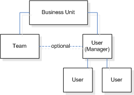

# User and team entities

User and team management is the area of CDS for Apps where you can create and maintain user accounts and profiles.  

 A *user* is any person who works for a business unit who uses CDS for Apps. Each user has a user account. All users must be associated with only one business unit. This association controls which customer data the user will have access to. Included in the user's account is information such as the user's telephone numbers, email address, and a link to the user's manager. Each user has privileges and rights to manage their own personal settings. Each user corresponds to a user in the Azure Active Directory for that organization. When you create a user, you must assign the user to at least one security role. Even if the user is part of a team that has assigned roles, the user should be assigned to a role. For more information about access levels and roles, see [How Role-Based Security Can Be Used to Control Access to Entities In Dynamics 365](/dynamics365/customer-engagement/developer/security-dev/how-role-based-security-control-access-entities).  

 A *team* is a group of users. Teams let users across an organization collaborate and share information. For more information about teams, see [Use Teams to Collaborate and Share Information](use-access-teams-owner-teams-collaborate-share-information.md).  

 Records can be owned by users or teams. Set the <xref:Microsoft.Xrm.Sdk.Metadata.EntityMetadata.OwnershipType> to <xref:Microsoft.Xrm.Sdk.Metadata.OwnershipTypes>.`UserOwned` or <xref:Microsoft.Xrm.Sdk.Metadata.OwnershipTypes>.`TeamOwned` to enable ownership. You can use the <xref:Microsoft.Crm.Sdk.Messages.ReassignObjectsOwnerRequest> message or the <xref:Microsoft.Crm.Sdk.Messages.ReassignObjectsSystemUserRequest> message to do bulk reassignment of all records for an owner.  

 The following illustration shows the entity relationships for users and teams.  

   

## Users  
 In CDS for Apps, users can be disabled but they cannot be deleted. To find the user who is currently logged on or who is impersonated, call the <xref:Microsoft.Crm.Sdk.Messages.WhoAmIRequest> message.  

 The following table provides details about the significant attributes for the system user entity.  

|   Attribute name    |                                                                                                                                                                                                                                                                                                                              Description                                                                                                                                                                                                                                                                                                                              |
|---------------------|-----------------------------------------------------------------------------------------------------------------------------------------------------------------------------------------------------------------------------------------------------------------------------------------------------------------------------------------------------------------------------------------------------------------------------------------------------------------------------------------------------------------------------------------------------------------------------------------------------------------------------------------------------------------------|
|     AccessMode      | Specifies the type of access that this user has to CDS for Apps. This is sometimes referred to as the type of user.   -   Administrative – The user has access to the Settings area but does not have access to the Sales, Marketing, and Service areas. -   Non-Interactive – The user can access the system but only through the Web service. -   Read – The user has read-only access. -   Read-Write – The user has both read and write access. -   Support User – The user was created by the CDS for Apps support team. |
|       CalType       |                                                               Specifies the user’s license type.   -   Administrative – The user has administrative user rights. -   Device Full – The user who is using the device running CDS for Apps has both read and write access. -   Device Limited – The user who is using the device running CDS for Apps has only read access. -   Full – The user has both read and write access. -   Limited – The user has only read access.                                                                |
|     IsDisabled      |                                                                                                                                                                                                                                             Specifies whether the user is disabled. Only licensed users or users who have an access mode of support or non-interactive can be enabled. Support users cannot be disabled.                                                                                                                                                                                                                                              |
|     IsLicensed      |                                                                                                                                                                             Specifies whether the user is licensed. This applies to customers who access CDS for Apps through the Microsoft Online Services Environment. This attribute is read-only, and is updated by the system.                                                                                                                                                                              |
| IsSyncWithDirectory |                                                                                                                                 Specifies whether the user is synchronized with the Office 365 directory. This applies to customers who access CDS for Apps through the Microsoft Online Services Environment. This attribute can only be set on create and is otherwise read-only.                                                                                                                                 |
|       QueueId       |                                                                                                                                                                                                                                                                                                               Specifies the default queue for the user.                                                                                                                                                                                                                                                                                                               |

 Access checks are additive. You can access entities based on the roles assigned to the user plus the roles assigned to the team that a user is a member of. This allows a user to have privileges outside their business unit.  

> [!NOTE]
>  A user's set of privileges is a union of privileges from the user's roles and privileges from all teams’ roles in which the user is a member.  

 Non-interactive users are often used when writing service-to-service code because they do not use up a license. CDS for Apps allows for five free non-interactive users. To disable a non-interactive user, update the user record changing the `accessmode` value to any other value. The user will be disabled automatically.

## Community tools

**User Settings Utility** is a tool that XrmToolbox community developed for CDS for Apps. Please see the [Developer tools](developer-tools.md) topic for community developed tools.

> [!NOTE]
> The community tools are not a product of CDS for Apps and does not extend support to the community tools.
> If you have questions pertaining to the tool, please contact the publisher. More Information: [XrmToolBox](https://www.xrmtoolbox.com).

### See also  
 [Administration and Security Entities](/dynamics365/customer-engagement/developer/administration-security-entities)   
 [Use Teams to Collaborate and Share Information](use-access-teams-owner-teams-collaborate-share-information.md)   
 [Team Entity](reference/entities/team.md)   
 [Specify time zone settings for a user](specify-time-zone-settings-user.md)   
 [TeamTemplate Entity](reference/entities/teamtemplate.md)   
 [SystemUser Entity](reference/entities/systemuser.md)   
 [UserSettings Entity](reference/entities/usersettings.md)   
 [Sample: Disable a User](/dynamics365/customer-engagement/developer/sample-disable-user)   
 [Sample: Share Records Using GrantAccess, ModifyAccess and RevokeAccess Messages](org-service/samples/share-records-using-grantaccess-modifyaccess-revokeaccess-messages.md)   
 [Sample: Share a record using an access team](org-service/samples/share-record-using-access-team.md)   
 [Blog: Service Accounts – Non-Interactive Users](http://go.microsoft.com/fwlink/p/?LinkId=234350)   
 [Privilege and Role Entities](/dynamics365/customer-engagement/developer/privilege-role-entities)
