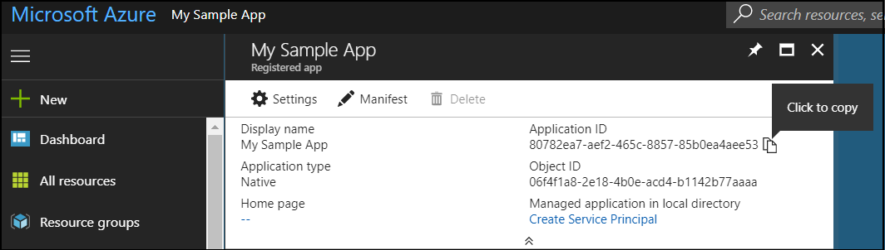
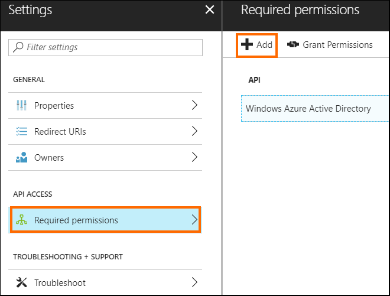
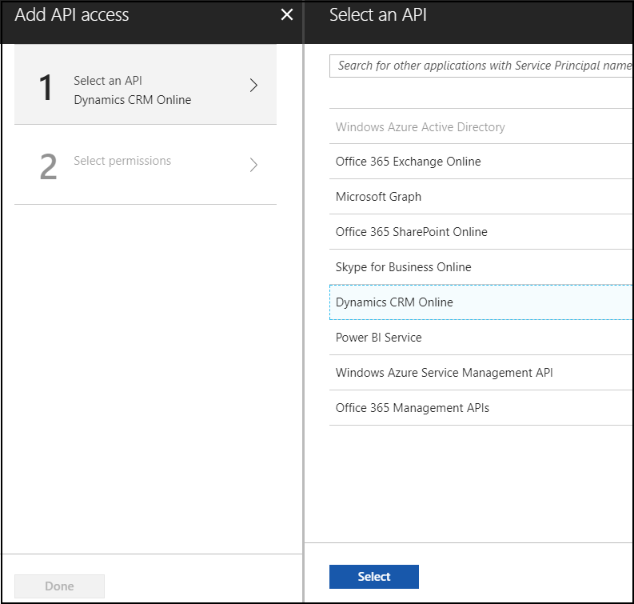
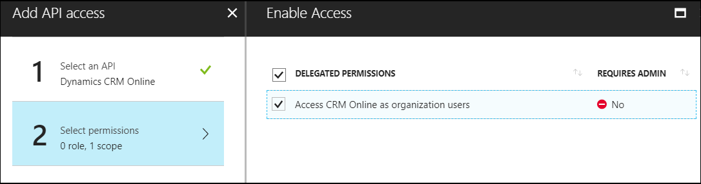

# Walkthrough: Register an app with Azure Active Directory

<!-- https://docs.microsoft.com/en-us/dynamics365/customer-engagement/developer/walkthrough-register-dynamics-365-app-azure-active-directory -->

This walkthrough describes how to register an application with Azure Active Directory, which enables a user with Dynamics 365 (online) user account to connect to their Dynamics 365 Online Common Data Service for Apps instance from external client applications using OAuth authentication.

> [!NOTE]
> The Dynamics 365 (online), version 9.0 release is not available for on-premises deployments.

App registration in Azure Active Directory is typically done by ISVs who want to develop external client applications to read and write data in CDS for Apps. Registering an app in Azure Active Directory provides you with **Application ID** and **Redirect URI** values that ISVs can use in their client application's authentication code. When end users use the ISV's application for the *first time* to connect to their CDS for Apps instance by providing their CDS for Apps credentials, a consent form is presented to the end user. After consenting to use their CDS for Apps account with the ISV's application, end users can connect to CDS for Apps instance from external application. The consent form is not displayed again to other users after the first user who has already consented to use the ISV's app. Apps registered in Azure Active Directory are multi-tenant, which implies that other CDS for Apps users from other tenant can connect to their instance using the ISV's app. 

App registration can also be done by an application developer or individual user who is building a client application to connect to and read/write data in CDS for Apps. Use the **Application ID** and **Redirect URI** values from your registered app in your client application's authentication code to be able to connect to CDS for Apps instance from your client application, and perform the required operations. Note that if the app is registered in the same tenant as your CDS for Apps instance, you won't be presented with a consent form when connecting from your client application to your CDS for Apps instance.

> [!IMPORTANT]
> You can also use Server-to-Server (S2S) authentication to connect to Dynamics 365 CDS for Apps instance using an application user. More information: [Build web applications using Server-to-Server (S2S) authentication](build-web-applications-server-server-s2s-authentication.md).

## Prerequisites  
<!--- **For an on-premises or Internet-facing deployment (IFD)**:  
  
    -   The server must be configured to use claims authentication and have OAuth authentication enabled.  
  
    -   A Microsoft Azure subscription for application registration. A trial account will also work.  
  
- **For a Dynamics 365 (online) deployment**:-->  
  
-   The user who is registering the application must have a Dynamics 365 (online) user account with System Administrator security role and the global administrator role for the Office 365 subscription.  
  
-   An Azure subscription for application registration. A trial account will also work.  
  
 <!--For either deployment type, you must know the redirect URL for your application. Instructions for finding that URL are provided in the section named [Obtain the redirect URI](walkthrough-register-app-active-directory.md#bkmk_redirect).-->  
    

## Create an application registration with Microsoft Azure Active Directory  
  
1.  [Sign in](http://manage.windowsazure.com) to the Azure management portal by using an account with administrator permission. You must use an account in the same Office 365 subscription (tenant) as you intend to register the app with.   You can also access the Azure management portal through the Office 365 [Admin center](https://portal.office.com/adminportal) by expanding the **Admin centers** item in the left navigation pane, and selecting **Azure AD**.  
  
    > [!NOTE]
    > If you don’t have an Azure tenant (account) or you do have one but your Office 365 subscription with Dynamics 365 (online) is not available in your Azure subscription, following the instructions in the topic [Set up Azure Active Directory access for your Developer Site](https://docs.microsoft.com/en-us/office/developer-program/office-365-developer-program) to associate the two accounts.   If you don’t have an account, you can sign up for one by using a credit card. However, the account is free for application registration and your credit card won’t be charged if you only follow the procedures called out in this topic to register one or more apps. More information: [Active Directory Pricing Details](http://azure.microsoft.com/pricing/details/active-directory/)  
  
1. In the Azure management portal, follow the steps as described in the [Adding an application](https://docs.microsoft.com/en-us/azure/active-directory/develop/active-directory-integrating-applications#adding-an-application) section in the Azure Active Directory developers guide to create an app. 
  
1. On creating an app in Azure Active Directory, a unique **Application ID** (previously called **Client ID**) is generated for your application, and the newly registered app appears on the registered apps page. Click the app to open the app information page.

1. On the app information page, hover over **Application ID** (previously called **Client ID**) value, and select the **Click to copy** icon to copy the value as you’ll need to specify this in your application’s authentication code or app.config file where appropriate.

    
  
1. Select **Settings** in the app info page, and use the **Redirect URIs** option on the **Settings** page to copy the redirect URI value for your app. You can also change and add additional URIs if required. For an app of **Web app / API** application type, you will see **Reply URLs** option instead of the **Redirect URIs** option.

## Apply Permissions

1. On the **Settings** page, select **Required permissions** > **Add** to add permissions for the registered app.

    
  
1. On the **Add API access** page:
    - Select **Select an API** > **Dynamics CRM Online**, and then click **Select**.

        
   
    - Select **Select permissions** > **Access CRM Online as organization users**, and then click **Select**.
  
        

    - Select **Done** to add the delegated permission to the registered app.

This completes the registration of your application in Azure Active Directory.

## Additional configuration options

If your application will be a Single Page Application (SPA) that depends on CORS you must configure the app registration to support the implicit flow. 
More information: [Walkthrough: Registering and configuring a SPA application with adal.js](walkthrough-registering-configuring-simplespa-application-adal-js.md)

If your application will support server-to-server connections, see [Use Multi-Tenant Server-to-server authentication](use-multi-tenant-server-server-authentication.md)

  
### See also  
 [Application registration in Azure Active Directory](https://docs.microsoft.com/azure/active-directory/develop/active-directory-integrating-applications)    
 [Authenticate Users with Dynamics 365 Web Services](authentication.md)