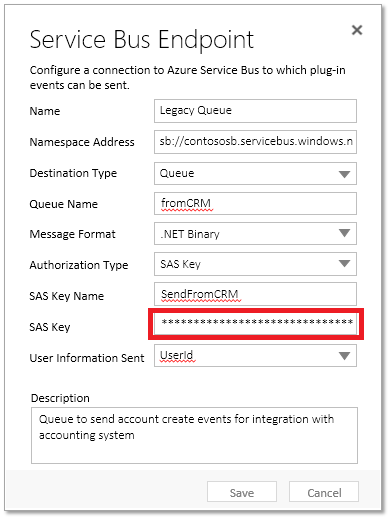

# Tutorial: Update a service endpoint imported from a solution

<!-- https://docs.microsoft.com/en-us/dynamics365/customer-engagement/developer/walkthrough-update-service-endpoint-imported-solution -->

An extra step is required after importing into an organization a solution containing one or more service endpoints configured for SAS authorization. When the solution containing the service endpoints is exported, the exported solution does not contain the SAS Key for each service endpoint. After importing the solution into an organization, you must perform an additional step to provide the SAS Key for each service endpoint.  
  
 Follow these steps to set the SAS Key for each service endpoint after solution import.  
  
### Update the SAS Key  
  
1.  Run the Plug-in Registration Tool, which can be found in the Tools folder of the  Dynamics CRM 2016 Service Pack 1 On-Premises (or later) SDK download. Previous releases of the tool do not support SAS authorization.  
  
2.  Using the tool, sign in to the organization that contains the imported solution.  
  
3.  Select the target service endpoint in the tab view of the organization.  
  
4.  Select **Update**. You should see the following form with the fields already filled in.  
  
   
  
5.  The **SAS Key** field is displayed with a value of "*******".  Replace that value with the correct SAS key value. You can obtain the SAS Key for your Azure messaging entity (queue, topic, etc.) from the Azure [classic portal](http://manage.windowsazure.com).  
  
6.  Select **Save**.  
  
### See also  
[Azure integration for Dynamics 365](azure-integration.md)

 [Service Bus authentication and authorization](https://azure.microsoft.com/en-us/documentation/articles/service-bus-authentication-and-authorization/)
