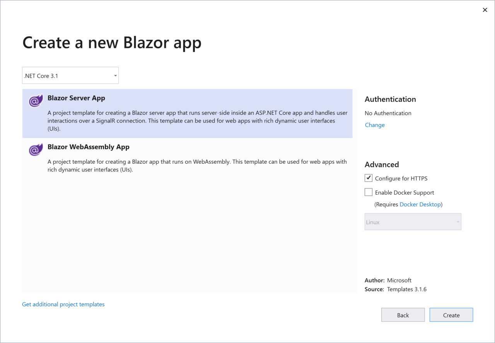
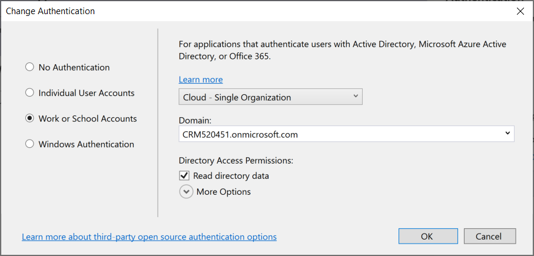
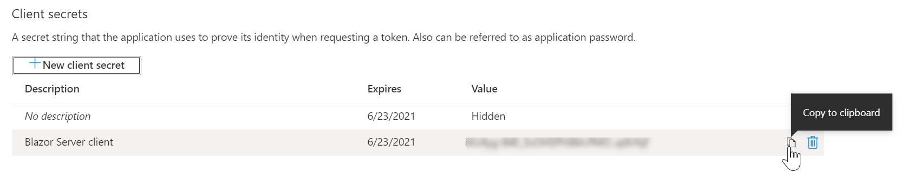
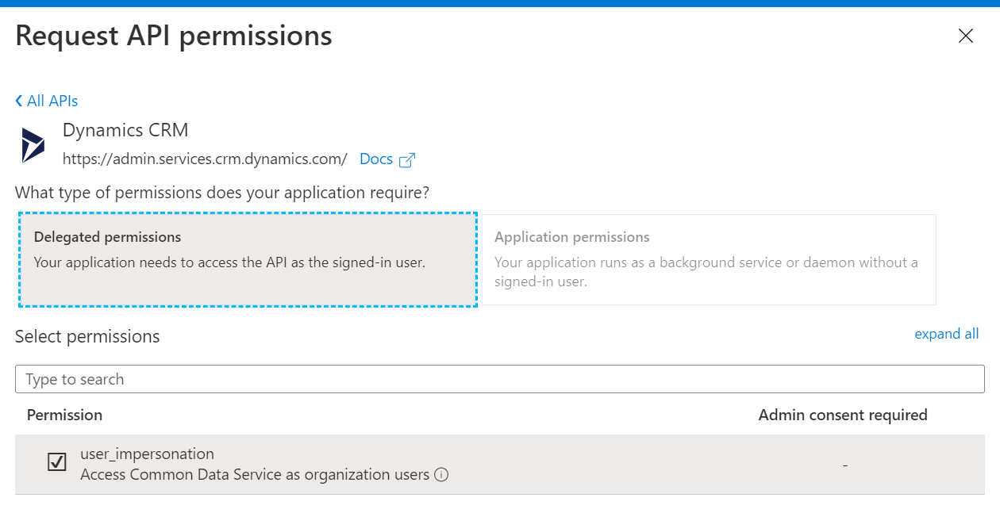
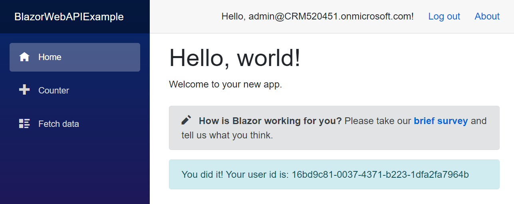

# Quick Start: Blazor Server Web API sample (C#)

In this quick start you will create a simple Blazor Server application to connect to your Common Data Service environment using the Web API.

You will authenticate and use an <xref:System.Net.Http.HttpClient> to send a `GET` request to the <xref href="Microsoft.Dynamics.CRM.WhoAmI?text=WhoAmI Function" /> the response will be a <xref href="Microsoft.Dynamics.CRM.WhoAmIResponse?text=WhoAmIResponse ComplexType" />. You will display the `UserId` property value.

> [!NOTE]
> This is a very simple example to show how to get connected with a minimum of code. The following [Enhanced quick start](enhanced-quick-start.md) will build upon this sample to apply better design patterns.

## Prerequisites

- Visual Studio (2019 16.6.2 recommended)
- Familiarity with the Azure Portal
- Internet connection
- Valid user account for a Common Data Service instance
- Admin access to grant application registrations
- URL to the Common Data Service environment you want to connect with
- Basic understanding of the Visual C# language

> [!NOTE]
> To authenticate you must have an app registered in Azure Active Directory. The registration will happen automatically as part of the template creation, but will require additional updates in the Azure Portal.

## Create Visual Studio project

1. Create a new Blazor Server App using **.NET Core 3.1** - do _not_ click "Create" yet

    

1. Click "Change" under "Authentication" and choose "Work or School Accounts." Choose the appropriate dropdown. Replace `CRM520451` in the example with your organization name.

    

1. Click "Create"

## Configure the Application in Active Directory

By default, the template will create a registered application. To connect to Common Data Services requires additional permissions. Open the Azure Portal and log in with your credentials. Navigate to "Active Directory" and "App Registrations" and choose the entry with the same name as your application.

1. Choose "Authentication" and check "Access tokens" under "Implicit grant" then click "Save".

    

1. Choose "Certificates & secrets" and click "New client secret"

1. Give it a name (for example, "Blazor Server client") and expiration and click "Add"

1. Tap the clipboard next to your secret to copy it

    

1. In your Blazor Server app, open `appsettings.json` and add an entry for "ClientSecret". The Active Directory settings should look like this:
    
    ```json
    {
      "AzureAd": {
        "Instance": "https://login.microsoftonline.com/",
        "Domain": "{org}.onmicrosoft.com",
        "TenantId": "{tenantId}",
        "ClientId": "{clientId}",
        "ClientSecret": "{secret}",
        "CallbackPath": "/signin-oidc"
      }
    }
    ```
    
1. Open API permissions

1. Click "Add a permission" and choose "Dynamics CRM"

1. Choose "Delegated permissions" and check `user_impersonation` then click "Add permissions"

    

1. Click on the newly created permission to highlight it and click "Grant admin consent for organization" (organization will have your organization name).

1. Verify the permissions have green checkboxes in the "status" column

## Prepare the app to use Azure AD tokens

The application requires some extra steps to capture the authentication token and pass it to the Web API request.

1. Right-click on the `Data` folder and add a new class named `TokenProvider`

    ```csharp
    public class TokenProvider
    {
        public string AccessToken { get; set; }
    }
    ```

1. Open `App.razor` and add these statements to the top. Change the namespace to match the name of your application.

    ```razor
    @using BlazorWebAPIExample.Data
    @inject TokenProvider Service
    ```

1. Add a `@code` block to accept a parameter and move the token into the service

    ```csharp
    [Parameter]
    public TokenProvider InitialState { get; set; }

    protected override void OnInitialized()
    {
        Service.AccessToken = InitialState.AccessToken;
        base.OnInitialized();
    }
    ```

1. Open `Pages/_Host.cshtml` and add the following using statements after the namespace declaration:

```razor
@using BlazorCommonDataService.Data
@using Microsoft.AspNetCore.Authentication
```

1. After the `<body>` tag, add the following code and update the app component to acquire and pass the token:

    ```razor
    @{
        var token = new TokenProvider
        {
            AccessToken = await HttpContext.GetTokenAsync("access_token")
        };
    }
    <app>
        <component type="typeof(App)" param-InitialState="token" render-mode="ServerPrerendered" />
    </app>
    ```

1. Obtain the domain for the Common Data Services management API. One way to do this is to open the [Power Platform admin center](https://admin.powerplatform.microsoft.com/environments), navigate to "environments" then choose "open environment." You should see a URL like: `https://{org}.crm.dynamics.com`

1. Add an entry to `appsettings.json` named `CDSAPI` with the URL. Add `/api/data/v.9.0/` to the end, so it looks like this:

    ```json
    { "CDSAPI": "https://{org}.crm.dynamics.com/api/data/v9.0/" }
    ```

1. Add this using statement to `Startup.cs`

    ```csharp
    using Microsoft.AspNetCore.Authentication.OpenIdConnect;
    ```

1. In the `Startup.cs` class, add registrations to retrieve the tokens and configure a client ready to use the token. Place this code between `services.AddAuthentication` and `services.AddControllersWithViews`.

    ```csharp
    services.Configure<OpenIdConnectOptions>(AzureADDefaults.OpenIdScheme,
        opt =>
        {
            var resourceUri = new Uri(Configuration["CDSAPI"]);
            var resource = $"{resourceUri.Scheme}://{resourceUri.Host}/";
            opt.ResponseType = "code";
            opt.SaveTokens = true;
            opt.Scope.Add("user_impersonation");
            opt.Scope.Add(new Uri(Configuration["CDSAPI"]).Host);
            opt.Resource = resource;
        });
    services.AddScoped<TokenProvider>();
    services.AddHttpClient("CDS", client =>
    {
        client.BaseAddress = new Uri(Configuration["CDSAPI"]);
    });
    ```

    The first registration allows requesting the token with the proper scope. The second registers the service that tracks the token, and the third creates a client with the base API address pre-configured.

## Make a call to the Web API

Next, you'll update the `Index.razor` component to call the Web API. 

1. Open `Index.razor` and add these statements to the top:

    ```razor
    @using System.Text.Json
    @using BlazorWebAPIExample.Data;
    @using System.Net.Http.Headers;
    @inject IHttpClientFactory Factory
    @inject TokenProvider TokenProvider
    ```

1. Add this markup after the `SurveyPrompt` component:

    ```razor
    @if (Loading)
    {
        <div class="alert alert-warning">Loading...</div>
    }
    @if (Error)
    {
        <div class="alert alert-danger">@ErrorMessage</div>
    }
    @if (!Loading && !Error)
    {
        <div class="alert alert-info">You did it! Your user id is: @UserId</div>
    }
    ```

1. Finally, add a `@code` block with the following code:

    ```csharp
    public bool Loading;
    public string ErrorMessage;
    public bool Error => !string.IsNullOrWhiteSpace(ErrorMessage);
    public string UserId;

    protected override async Task OnInitializedAsync()
    {
        Loading = true;
        try
        {
            var client = Factory.CreateClient("CDS");
            client.DefaultRequestHeaders.Authorization =
                new AuthenticationHeaderValue("Bearer", TokenProvider.AccessToken);
            var result = await client.GetAsync("WhoAmI");
            result.EnsureSuccessStatusCode();
            UserId = JsonDocument.Parse(await result.Content.ReadAsStringAsync())
                .RootElement.GetProperty("UserId").GetGuid().ToString();
        }
        catch (Exception ex)
        {
            ErrorMessage = ex.Message;
        }
        finally
        {
            Loading = false;
        }
        await base.OnInitializedAsync();
    }
    ```

The application is ready!

## Run the program

Press F5 to run the program. The output should look like this:



**Congratulations!** You have successfully connected to the Web API.

The quick start sample shows a simple approach to create a Visual Studio project without any exception handling or method to refresh the access token. You can expand on the example to perform more complex operations, and wrap the `HttpClient` in a service class to handle the permissions.

The [Enhanced quick start](enhanced-quick-start.md) topic shows how to implement exception handling methods, basic authentication method using connection string, a re-usable method to refresh the access token, and introduces how to build re-usable methods to perform data operations.

## Next steps

Learn how to structure your code for a better design.

> [!div class="nextstepaction"]
> [Enhanced quick start](enhanced-quick-start.md)<br/>
