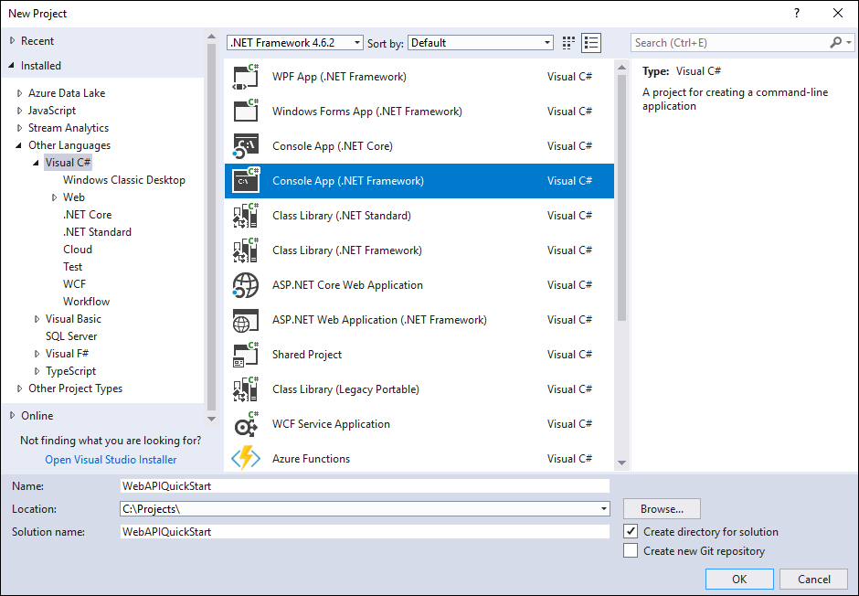
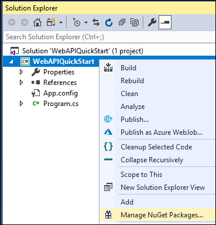
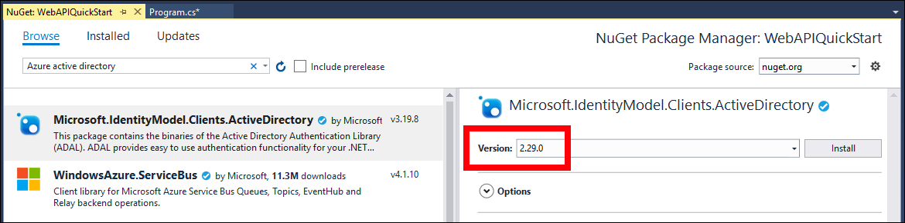
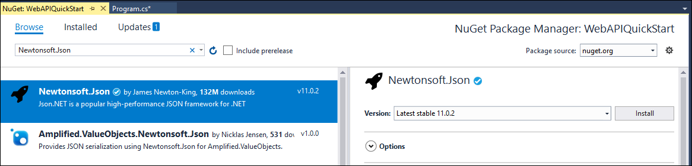

# Quick Start: Web API sample (C#)

In this quick start you will create a simple console application to connect to your Common Data Service for Apps environment using the Web API.

You will authenticate using OAuth2 and use an [HttpClient](/dotnet/api/system.net.http.httpclient) to send a `GET` request to the <xref href="Microsoft.Dynamics.CRM.WhoAmI?text=WhoAmI Function" /> the response will be a <xref href="Microsoft.Dynamics.CRM.WhoAmIResponse?text=WhoAmIResponse ComplexType" />. You will display the `UserId` property value value.

> [!NOTE]
> This quick start example does not include error handling. This is a minimum example of what you need to connect to and use the Web API.

## Prerequisites

 - Visual Studio (2017 recommended)
 - Internet connection
 - Valid user account for a Common Data Service for Apps instance
    - Your username
    - Your password
 - Url to the CDS for Apps environment you want to connect with
 - Basic understanding of the Visual C# language

> [!NOTE]
> To authenticate using OAuth2 you must have an app registered in Azure Active Directory. This quick start example provides app registration clientid value you can use for the purpose of running this sample. For your own applications you must register your apps. More information: [Walkthrough: Register an app with Azure Active Directory](../walkthrough-register-app-azure-active-directory.md)

## Create Visual Studio project

1. Create a new Console App (.NET Framework) project using .NET Framework 4.6.2

    

    > [!NOTE]
    > This screenshot shows the name `WebAPIQuickStart`, but you can choose to name the project and solution whatever you want. 

1. In **Solution Explorer**, right-click the project you created and select **Manage NuGet Packages...** in the context menu.

    

1. Browse for the  `Microsoft.IdentityModel.Clients.ActiveDirectory` NuGet package.
1. Select **Version** 2.29.0 and install it.

    

    > [!IMPORTANT]
    > **Do not install the latest version of this NuGet package.**
    >
    > This sample depends on the capability to pass user credentials without a separate Azure login dialog which is not available in the 3.x version of this library.

    > [!NOTE]
    > You must select **I Accept** in the **Licence Acceptance** dialog.

1. Browse for the `Newtonsoft.Json` NuGet package and install the latest version.

    

## Edit Program.cs

1. Add these using statements to the top of `Program.cs`

    ```csharp
    using Microsoft.IdentityModel.Clients.ActiveDirectory;
    using System.Net.Http.Headers;
    using System.Net.Http;
    using Newtonsoft.Json.Linq;
    ```

1. Replace the `Main` method with the following code:

    ```csharp
    static void Main(string[] args)
    {
        // Set these values:
        // i.e. https://yourorg.crm.dynamics.com
        string url = "<your environment url>";
        // i.e. you@yourorg.onmicrosoft.com
        string userName = "<your user name>";
        // i.e. y0urp455w0rd
        string password = "<your password>";

        // Azure Active Directory registered app clientid for this sample
        string clientId = "51f81489-12ee-4a9e-aaae-a2591f45987d";

        var userCredential = new UserCredential(userName, password);
        string apiVersion = "9.0";
        string webApiUrl = $"{url}/api/data/v{apiVersion}/";

        //Authenticate using IdentityModel.Clients.ActiveDirectory
        var authParameters = AuthenticationParameters.CreateFromResourceUrlAsync(new Uri(webApiUrl)).Result;
        var authContext = new AuthenticationContext(authParameters.Authority, false);
        var authResult = authContext.AcquireToken(url, clientId, userCredential);
        var authHeader = new AuthenticationHeaderValue("Bearer", authResult.AccessToken);

        using (var client = new HttpClient())
        {
            client.BaseAddress = new Uri(webApiUrl);
            client.DefaultRequestHeaders.Authorization = authHeader;

            // Use the WhoAmI function
            var response = client.GetAsync("WhoAmI").Result;

            if (response.IsSuccessStatusCode)
            {
                //Get the response content and parse it.  
                JObject body = JObject.Parse(response.Content.ReadAsStringAsync().Result);
                Guid userId = (Guid)body["UserId"];
                Console.WriteLine("Your UserId is {0}", userId);
            }
            else
            {
                Console.WriteLine("The request failed with a status of '{0}'",
                            response.ReasonPhrase);
            }

            Console.WriteLine("Press any key to exit.");
            Console.ReadLine();
        }       
    }
    ```

1. Edit the following values to add information for your environment:

    ```csharp
    // i.e. https://yourorg.crm.dynamics.com
    string url = "<your environment url>";
    // i.e. you@yourorg.onmicrosoft.com
    string userName = "<your user name>";
    // i.e. y0urp455w0rd
    string password = "<your password>";
    ```

## Run the program

1. Press F5 to run the program. The output should look like this:

    ```
    Your UserId is 969effb0-98ae-478c-b547-53a2968c2e75
    Press any key to exit.
    ```

### Congratulations!

You have successfully connected to the Web API.

<!-- TODO: Include link to next steps topics -->