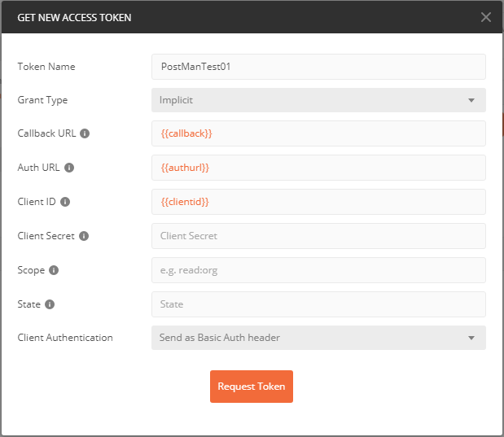
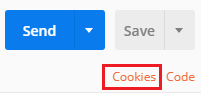
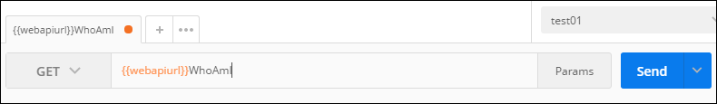

# Set up a Postman environment

You can use Postman to connect to your Common Data Service instance and to compose Web API requests, send them, and view responses. Managing authentication challenges many people. This topic describes how to configure a Postman environment to work for your Common Data Service environments.

You can use a Postman environment to save a set of variables that you use to connect. These values can be accessed within Postman by using this syntax: `{{name}}`. For more information with Postman variables, see [Postman Documentation > Variables](https://www.getpostman.com/docs/v6/postman/environments_and_globals/variables).

## Prerequisites

* Have a Power Apps Common Data Service environment that you can connect to. 
* Download and install the [Postman desktop application](https://www.getpostman.com/apps).

<a name="bkmk_connectcds"></a> 

## Connect with your Common Data Service environment

This environment uses a client ID for an application that is registered for all Common Data Service environments. 
 
You can use the `clientid` and `callback` values supplied in these instructions.  However, when building your own application, you should register your own Azure Active Directory (Azure AD) application.
 
To register your own Azure AD application, see the steps described in [Walkthrough: Register a Common Data Service app with Azure Active Directory](../walkthrough-register-app-azure-active-directory.md).

Use these steps to create a Postman environment that you can use to connect with your Common Data Service instance:

1. Launch the Postman desktop application.
1. Select the **Environment Options** gear icon in the top-right corner. 
1. In the **Manage Environments** dialog box, select the **Add** button to add a new environment.
  
  <br>
  
1. In the dialog box that opens, type a name for the environment. Then add the following key-value pairs into the editing space.<br>

    | Variable name | Value |
    |----|---|
    |`url`|`https://<add your environment name, like 'myorg.crm'>.dynamics.com`|
    |`clientid`|`51f81489-12ee-4a9e-aaae-a2591f45987d`|
    |`version`|`9.0`|
    |`webapiurl`|`{{url}}/api/data/v{{version}}/`|
    |`callback`|`https://callbackurl`|
    |`authurl`|`https://login.microsoftonline.com/common/oauth2/authorize?resource={{url}}`|

    <br>
1. Replace the instance URL placeholder value with the URL of your Common Data Service instance, and select **Add** to save the environment.

1. Close the **Manage environments** dialog box.  

### Generate an access token to use with your environment

To connect using **OAuth 2.0**, you must have an access token. Use the following steps to get a new access token:

1. Make sure the new environment you created is selected.
1. Select the **Authorization** tab.
1. Set the **Type** to **OAuth 2.0**.
1. Verify that you have selected the environment that you created.
1. Select **Get New Access Token**

    <br>
1. Set the following values in the dialog box. Select `Implicit` from the **Grant Type** drop-down menu. You can set the **Token Name** to whatever you like, and leave other keys set to default values.<br>

    <br>

    > [!NOTE]
    > If you are configuring environments in Postman for multiple Common Data Service instances using different user credentials, you might need to delete the cookies cached by Postman. Select the **Cookies** link, which can be found under the **Send** button, and remove the saved cookies from the **Manage Cookies** dialog box.<br><br>
    > Some of these cookies are very persistent. You can delete some of them in groups, but you might have to delete others individually.   You might need to do this twice to ensure that no cookies remain.

1. Select **Request Token**. When you do this, an Azure Active Directory sign-in page appears. Enter your username and password.
1. After the token is generated, scroll to the bottom and select **Use Token**. This closes the **Manage Access Tokens** dialog box. 
1. After you have added a token, you can select which token to apply to requests. On the **Available Tokens** drop-down list, select the token you have just created. The Authorization header gets added to the Web API request.

See [Test your connection](#test-your-connection) for steps to verify your connection.

> [!IMPORTANT]
> If you face issues when clicking the button to **Request Token** and are not able to get a token you may need to use different environment detials. If so, use details like the below when creating a new environment.

1. In the dialog box that opens, type a name for the environment. Then add the following key-value pairs into the editing space. Make sure the `callbackurl` is listed in your Redirect URIs listed in the Authentication section of your Apps page udner App Registrations in the Azure Portal.<br>

    | Variable name | Value |
    |----|---|
    |`url`|`https://<add your environment name, like 'myorg.crm'>.dynamics.com`|
    |`clientid`|`<add your client id>`|
    |`clientsecret`|`<add your client secret>`|
    |`version`|`<your version>`|
    |`webapiurl`|`{{url}}/api/data/v{{version}}/`|
    |`callback`|`https://<use your callback url>`|
    |`authurl`|`https://login.microsoftonline.com/common/oauth2/authorize?resource={{url}}`|
    |`accesstokenurl`|`https://login.windows.net/<your tenant>.onmicrosoft.com/oauth2/token?resource={{url}}`|

Your tenant name can be found by selecting the Azure Active Directory app in the Azure Portal.

Instead of typing this in manually you can also import a JSON file to create a new environment. 
Here's a template you can use below:

```json
{
	"id": "d4f8ebec-579c-49c5-b554-0782c094bed5",
	"name": "Microsoft Common Data Service",
	"values": [
		{
			"key": "callback",
			"value": "https://YOUR_CALL_BACK_URL_FROM_THE_APP_REGISTRAION_IN_THE_AZURE_PORTAL",
			"enabled": true
		},
		{
			"key": "url",
			"value": "https://YOUR_ORG.api.crm.dynamics.com/",
			"enabled": true
		},
		{
			"key": "clientid",
			"value": "YOUR_ID",
			"enabled": true
		},
		{
			"key": "clientsecret",
			"value": "YOUR_SECRET",
			"enabled": true
		},
		{
			"key": "version",
			"value": "YOUR_VERSION like 9.0",
			"enabled": true
		},
		{
			"key": "restapiurl",
			"value": "{{url}}/api/data/v{{version}}",
			"enabled": true
		},
		{
			"key": "authurl",
			"value": "https://login.microsoftonline.com/common/oauth2/authorize?resource={{url}}",
			"enabled": true
		},
		{
			"key": "accesstokenurl",
			"value": "https://login.windows.net/YOUR_TENANT.onmicrosoft.com/oauth2/token?resource={{url}}",
			"enabled": true
		}
	],
	"_postman_variable_scope": "environment",
	"_postman_exported_at": "2020-04-22T17:41:46.718Z",
	"_postman_exported_using": "Postman/7.22.1"
}
```


## Test your connection

Create a new Web API request to test the connection with your Common Data Service instance. Use the <xref href="Microsoft.Dynamics.CRM.WhoAmI?text=WhoAmI function" />:
1. Select `GET` as the HTTP method and add `{{webapiurl}}WhoAmI` in the editing space.
  
2. Select **Send** to send this request.
3. If your request is successful, you see the data from the <xref href="Microsoft.Dynamics.CRM.WhoAmIResponse?text=WhoAmIResponse ComplexType" /> that is returned by the <xref href="Microsoft.Dynamics.CRM.WhoAmI?text=WhoAmI Function" />.

## See also

[Use Postman to perform operations](use-postman-perform-operations.md)<br>
[Walkthrough: Register a Common Data Service app with Azure Active Directory](../walkthrough-register-app-azure-active-directory.md)
