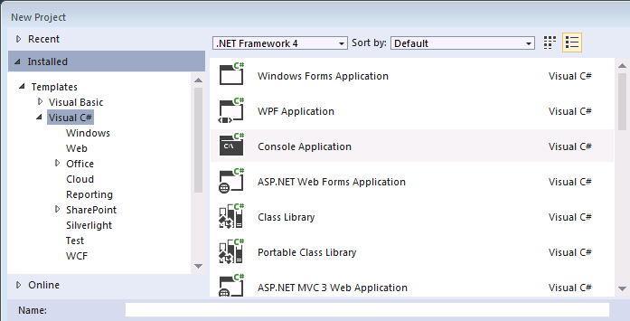
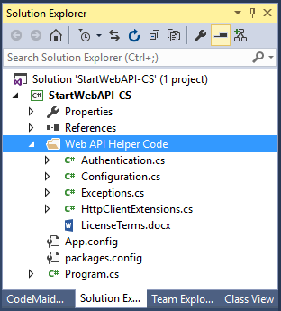
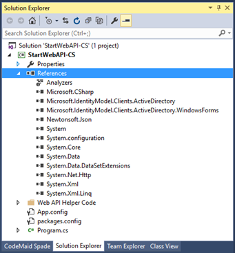

# Start a Common Data Service for Apps Web API project in Visual Studio (C#)

This topic demonstrates how to create a new project in Visual Studio that builds a console application that uses the Common Data Service for Apps  Web API. It illustrates the common references and project resources that most applications, including the SDK C# samples, use to implement Web API-based solutions.  
  
<a name="bkmk_prerequisites"></a> 
  
## Prerequisites  

 The following prerequisites are required to build the console application described in this section.  
  
- Visual Studio 2015 installed on your development computer. Any edition, including [Visual Studio Express](https://www.visualstudio.com/products/visual-studio-express-vs.aspx), should be sufficient to work with the Common Data Service for Apps Web API.
  
-   A NuGet client must be installed: either the command-line utility or the Visual Studio extension. For more information, see [Installing NuGet](https://docs.nuget.org/consume/installing-nuget).  
  
-   An internet connection is required to download the NuGet package containing the Common Data Service for Apps Web API Helper Library, and other dependent packages.
  
<a name="bkmk_createProject"></a>
   
## Create a project  

<!-- TODO: The following procedure demonstrates how to create a console application project in C# that uses the Microsoft .NET Framework. For more information on supported versions of the .NET Framework, see [Supported extensions](../supported-extensions.md).   -->
  
<a name="bkmk_newProject"></a>

### New Project  
  
1.  In Visual Studio, click **New Project**. The **New Project** dialog is displayed.  
2.  In the left navigation pane under **Templates**, select **Visual C#**.  
3.  Above the list of available templates, select **.NET Framework 4.5.2**.  
4.  In the list of templates, select **Console Application**. (Alternately choose the project type suited to your solution.)  All of the Web API C# samples are console applications.  
  
 <!-- TODO:
    -->
  
5.  In the text boxes near the bottom of the form, supply the project name and location, and then select OK. (For this topic, the solution name `StartWebAPI-CS` was used.) The initial solution files will be generated and the solution loaded into Visual Studio.  
  
6.  Under the **Project** menu, open the project’s properties form and verify the target framework is set to **.NET Framework 4.5.2**.  
  
<a name="bkmk_addAllRequiredResources"></a>
   
### Add all required resources to your project  

The following procedures explain how to add all required managed references and packages to your project. Consider this a base set of resources that most managed code applications will need for invoking Web API operations.  
  
#### Add the helper library NuGet package

The Common Data Service for Apps Web API Helper Library contains classes to assist with supplemental operations, such as application configuration, Common Data Service for Apps server authentication, exception handling, and Web communication. For more information, see [Use the Common Data Service for Apps Web API Helper Library (C#)](use-microsoft-dynamics-365-web-api-helper-library-csharp.md).  The use of these classes is optional, although they are used extensively in the Web API samples.  The Common Data Service for Apps Web API Helper Library is distributed in source code form as a NuGet package.  Future updates will be distributed as NuGet package updates.  
  
 If you have installed the NuGet command line utility or are using the Package Manager Console in Visual Studio:  
  
1.  Issue the following command to install the helper library package.  
  
     `Install-Package Microsoft.CrmSdk.WebApi.Samples.HelperCode`  
  
2.  Several messages are displayed about processing dependency packages. If a **License Acceptance** dialog is displayed, read the license terms and click **Accept**.  
  
3.  Skip to step 6 below to confirm the installation of the helper library package.  
  
 If you have installed the NuGet Package Manager extension:  
  
1.  From the **Project** menu, select **Manage NuGet Packages**.  The **NuGet Package Manager** tab is displayed.  
  
2.  In the upper right-hand corner, set the **Package** source drop-down to **Nuget.org**.  
  
3.  In the upper left-hand corner, click on **Browse** then enter “`CDS for Apps HelperCode`” in the search box and press Enter.  
  
 <!-- TODO:
")   -->
  
4.  Click **Install**.  If the **Preview** dialog is displayed, click **OK**.  
  
5.  The **License Acceptance** dialog is displayed. Review the license terms and click **I Accept**.  
  
6.  Navigate to the **Solution Explorer** window. Confirm that a new solution folder named **Web API Helper Code** was added.  
  
 <!-- TODO:
    -->
  
 The Common Data Service for Apps SDK Web API Helper Library package, [Microsoft.CrmSdk.WebApi.Samples.HelperCode](https://www.nuget.org/packages/Microsoft.CrmSdk.WebApi.Samples.HelperCode), depends upon the following other packages, which are automatically downloaded and installed alongside the helper library package:  
  
-   [Newtonsoft.Json](https://www.nuget.org/packages/Newtonsoft.Json) – contains [Json.NET](http://www.newtonsoft.com/json), a popular, MIT-licensed JSON framework for .NET.  
  
-   [Microsoft.IdentityModel.Clients.ActiveDirectory](https://www.nuget.org/packages/Microsoft.IdentityModel.Clients.ActiveDirectory/) – contains the binaries for the Active Directory Authentication Library ([ADAL](https://msdn.microsoft.com/library/azure/mt417579.aspx)), which provides authentication functionality for .NET clients.  
  
> [!WARNING]
>  The Common Data Service for Apps SDK Web API Helper Library package was built against specific versions of these other two supporting packages.  Because of this, you should only directly update the helper library NuGet package.  This operation will update the proper supporting packages if required.  If you separately update one of these supporting packages, a newer version of that package may be incompatible with the helper library.  
  
#### Verify the required assembly references  
  
1.  In **Solution Explorer**, expand the **References** node.  
  
2.  Confirm the at the following references have been added to the project.  
  
 <!-- TODO:
   -->
  
3.  If you have additional functionality that you routinely use in your applications, you can add the associated references to the required assemblies now. For more information, see [How to: Add or Remove References by Using the Add Reference Dialog Box](/visualstudio/ide/how-to-add-or-remove-references-by-using-the-reference-manager).  
  
 Because the Common Data Service for Apps Web API is based on REST principles, it does not require client-side assemblies to access. 
  
#### Add typical using statements  
  
1.  In the **Solution Explorer**, open **Program.cs** for editing.  
  
2.  At the top of the file, add the following `using` statements, which reference namespaces commonly used in Common Data Service for Apps Web API-based solutions.  
  
    ```csharp
    using Microsoft.Crm.Sdk.Samples.HelperCode;  
    using Newtonsoft.Json;  
    using Newtonsoft.Json.Linq;  
    using System.Net.Http;  
    using System.Net.Http.Headers;
    ```  
  
3.  If you added routinely used assemblies or references in the previous sections, you may also want to add corresponding `using` statements for these resources.  
  
4.  Save the file.  
  
<a name="bkmk_addConnectionCode"></a>
 
### Add connection code

This section explains how to add a basic set of settings and instructions to perform these operations.  For more information about the common code used, see [Use the Common Data Service for Apps Web API Helper Library (C#)](use-microsoft-dynamics-365-web-api-helper-library-csharp.md)  
  
#### Edit the application configuration file
  
1.  In **Solution Explorer**, open the **App.config** file for editing.  Add the following two sections to it, after the existing `<startup>` section, then save the file.  
  
    ```xml  
  
    <connectionStrings>  
        <clear />  
  
        <!-- When providing a password, make sure to set the app.config file's security so that only you can read it. -->  
        <add name="default"   connectionString="Url=http://myserver/myorg/; Username=name; Password=password; Domain=domain" />  
        <add name="CrmOnline" connectionString="Url=https://mydomain.crm.dynamics.com/; Username=someone@mydomain.onmicrosoft.com; Password=password" />  
      </connectionStrings>  
  
      <appSettings>  
        <!--For information on how to register an app and obtain the ClientId and RedirectUrl  
            values see https://msdn.microsoft.com/dynamics/crm/mt149065 -->  
        <!--Active Directory application registration. -->  
        <!--These are dummy values and should be replaced with your actual app registration values.-->  
        <add key="ClientId" value="e5cf0024-a66a-4f16-85ce-99ba97a24bb2" />  
        <add key="RedirectUrl" value="http://localhost/SdkSample" />  
  
        <!-- Use an alternate configuration file for connection string and setting values. This optional setting  
        enables use of an app.config file shared among multiple applications. If the specified file does  
        not exist, this setting is ignored.-->  
        <add key="AlternateConfig" value="C:\Temp\crmsample.exe.config"/>  
      </appSettings>  
  
    ```  
  
2.  When developing or deploying a solution, the actual connection and application registration values must be substituted for the example placeholder values.  For more information, see [Helper code: Configuration classes](web-api-helper-code-configuration-classes.md).  
  
<a name="bkmk_addCodeToCallHelperLibrary"></a>

#### Add code to call the helper library
  
1.  Edit the Program.cs file.  
  
2.  Add the following property to the Program class.  This property will be initialized after a successful connection to a Common Data Service for Apps server.  
  
     `private HttpClient httpClient;`  
  
3.  In the `Main` method, add the following statements.  
  
    ```csharp  
  
    Program app = new Program();  
    try  
    {  
        String[] arguments = Environment.GetCommandLineArgs();  
        app.ConnectToCRM(arguments);  
    }  
    catch (System.Exception ex)  
    { ; }  
    finally  
    {  
        if (app.httpClient != null)  
        { app.httpClient.Dispose(); }  
    }  
  
    ```  
  
4.  Next add the `ConnectToCRM` method, which uses the helper library `Configuration` and `Authentication` classes.  The following code demonstrates assigning  values to the [HttpClient](https://msdn.microsoft.com/library/system.net.http.httpclient\(v=vs.118\).aspx) properties so that you can successfully access the release version of the Common Data Service for Apps Web API.  
  
    ```csharp  
  
    private void ConnectToCRM(String[] cmdargs)  
    {  
        Configuration config = null;  
        if (cmdargs.Length > 0)  
            config = new FileConfiguration(cmdargs[0]);  
        else  
            config = new FileConfiguration(null);  
        Authentication auth = new Authentication(config);  
        httpClient = new HttpClient(auth.ClientHandler, true);  
        httpClient.BaseAddress = new Uri(config.ServiceUrl + "api/data/v8.1/");  
        httpClient.Timeout = new TimeSpan(0, 2, 0);  
        httpClient.DefaultRequestHeaders.Add("OData-MaxVersion", "4.0");  
        httpClient.DefaultRequestHeaders.Add("OData-Version", "4.0");  
        httpClient.DefaultRequestHeaders.Accept.Add(  
            new MediaTypeWithQualityHeaderValue("application/json"));  
    }  
  
    ```  
  
<a name="bkmk_addErrorHandlingCode"></a>

### Add error-handling code

 The following changes add code to catch and report exceptions, including Web API errors, to the console.  If you are targeting a different environment, then modify the exception-handling code appropriately for that environment.  
  
1.  In `Main`, add the following statement to the `catch` block.  
  
     `DisplayException(ex);`  
  
2.  Add the corresponding method to the `Program` class.  
  
    ```csharp  
  
    private static void DisplayException(Exception ex)  
    {  
        Console.WriteLine("The application terminated with an error.");  
        Console.WriteLine(ex.Message);  
        while (ex.InnerException != null)  
        {  
            Console.WriteLine("\t* {0}", ex.InnerException.Message);  
            ex = ex.InnerException;  
        }  
    }  
  
    ```  
  
3.  Save all the files in the solution.  
  
<a name="bkmk_nextSteps"></a>

### Next steps

 At this point the solution can be built without errors.  If you edit the application configuration file to supply values for your Common Data Service for Apps, the program should also successfully connect to that server.  The solution represents a skeletal frame that is ready to accept custom code, including calls to the Common Data Service for Apps Web API.  
  
> [!TIP]
>  Before you leave this topic, consider saving your project as a project template. You can then reuse that template for future learning projects and save yourself some time and effort in setting up new projects. To do this, while your project is open in Microsoft Visual Studio, in the **File** menu select **Export template**. Follow the [Export Template Wizard](https://msdn.microsoft.com/library/xkh1wxd8.aspx) instructions to create the template.  
  
### See also

[Get Started with the Web API (C#)](get-started-dynamics-365-web-api-csharp.md)<br />
[Use the Common Data Service for Apps Web API Helper Library (C#)](use-microsoft-dynamics-365-web-api-helper-library-csharp.md)<br />  
[Perform operations using the Web API](perform-operations-web-api.md)
