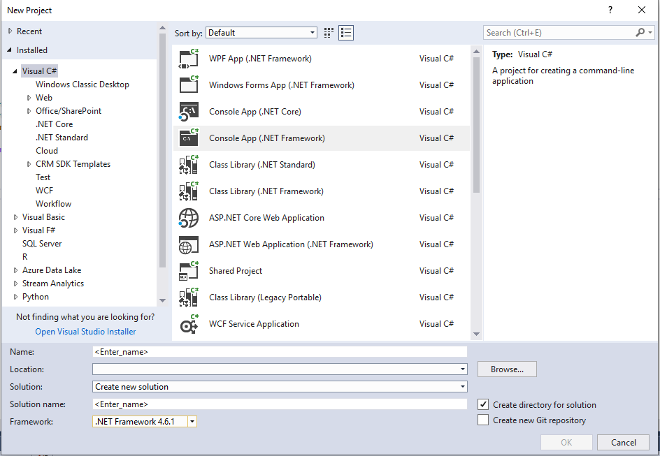

# Start a Common Data Service for Apps Web API project in Visual Studio (C#)

This topic demonstrates how to create a new project in Visual Studio that builds a console application that uses the Common Data Service for Apps Web API. It illustrates the common references and project resources that most applications use to implement Web API-based solutions.  
  
<a name="bkmk_prerequisites"></a>
  
## Prerequisites  

 The following prerequisites are required to build the console application described in this section.  
  
- Visual Studio 2017 installed on your development computer. Any edition, including [Visual Studio Express](https://www.visualstudio.com/products/visual-studio-express-vs.aspx), should be sufficient to work with the Common Data Service for Apps Web API.
  
- A NuGet client must be installed: either the command-line utility or the Visual Studio extension. For more information, see [Installing NuGet](https://docs.nuget.org/consume/installing-nuget).  

<!--  Download the [SampleHelper.cs](https://github.com/Microsoft/PowerApps-Samples/blob/master/cds/webapi/C%23/SampleHelpers.cs) helper class. 
  
<a name="bkmk_createProject"></a>-->
   
## Create a project  

The following procedure demonstrates how to create a console application project in C# that uses the Microsoft .NET Framework. For more information on supported versions of the .NET Framework, see [Supported extensions](../supported-extensions.md). 
  
<a name="bkmk_newProject"></a>

### New Project  
  
1. In Visual Studio 2017, click **New Project**. The **New Project** dialog is displayed.
1. In the left navigation pane under **Installed**, select **Visual C#**.  
1. In the list of templates, select **Console Application (.NET Framework)**. All of the Web API C# samples are console applications.  
  
    
  
1. In the text boxes near the bottom of the form, supply the project name and location, and then select OK. (For this topic, the solution name `SimpleWebAPI-CS` was used.) The initial solution files will be generated and the solution loaded into Visual Studio.
  
1. Under the **Project** menu, open the project’s properties form and verify the target framework is set to **.NET Framework 4.6.2** or higher.

> [!NOTE]
> **Known Issue with Visual Studio 2015**
> 
> When you are running your project/solution in VS 2015 in debug mode, you may not be able to connect. This happens regardless of whether you are using a Target Framework of 4.6.2 or higher. This can occur because the Visual Studio hosting process is compiled against .NET 4.5 which means by default it does not support TLS 1.2. You can disable the Visual Studio hosting process as a work around. 
>
> Right-click on the name of your project in Visual Studio and then click **Properties**. On the **Debug** tab you can uncheck the **Enable the Visual Studio hosting process** option. 
>
> This only impacts the debug experience in VS 2015. This does not impact the binaries or executable that are built. The same issue does not occur in Visual Studio 2017.
  
<a name="bkmk_addAllRequiredResources"></a>
   
### Add all required resources to your project  

The following procedures explain how to add all required managed references and packages to your project. Consider this a base set of resources that most managed code applications will need for invoking Web API operations.  
  
#### Add the helper code

The Web API samples (c#) use the `SampleHelper.cs` file which contains classes to assist with supplemental operations, such as application configuration, Common Data Service for Apps server authentication, exception handling, web communication and `OAuthMessageHandler` class which manages the renewal of the tokens. This file is shared with all the Web API (C#) samples.

Add a new class file to the project and copy paste the helper code from [SampleHelper.cs file](https://github.com/Microsoft/PowerApps-Samples/blob/master/cds/webapi/C%23/SampleHelpers.cs).  
  
- [Newtonsoft.Json](https://www.nuget.org/packages/Newtonsoft.Json) – contains [Json.NET](http://www.newtonsoft.com/json), a popular, MIT-licensed JSON framework for .NET.  
  
- [Microsoft.IdentityModel.Clients.ActiveDirectory](https://www.nuget.org/packages/Microsoft.IdentityModel.Clients.ActiveDirectory/) – contains the binaries for the Active Directory Authentication Library ([ADAL](https://msdn.microsoft.com/library/azure/mt417579.aspx)), which provides authentication functionality for .NET clients.  

> [!IMPORTANT]
> **Do not install the latest version of this NuGet package.**
>
> This sample depends on the capability to pass user credentials without a separate Azure login dialog which is not available in the 3.x version of this library.

#### Verify the required assembly references  
  
1. In **Solution Explorer**, expand the **References** node.
  
2. Confirm the following references have been added to the project.
  
3. If you have additional functionality that you routinely use in your applications, you can add the associated references to the required assemblies now. For more information, see [How to: Add or Remove References by Using the Add Reference Dialog Box](/visualstudio/ide/how-to-add-or-remove-references-by-using-the-reference-manager).  
  
 Because the Common Data Service for Apps Web API is based on REST principles, it does not require client-side assemblies to access.
  
#### Edit the application configuration file

In **Solution Explorer**, open the **App.config** file for editing.  Add the following and then save the file.

```xml  
  
<?xml version="1.0" encoding="utf-8"?>
<configuration>
<connectionStrings>
  <!--Online using Office 365-->
  <add name="Connect" connectionString="Url=https://yourorgname.crm.dynamics.com;Username=yourname@yourorg.onmicrosoft.com;Password=pasword;authtype=Office365; RequireNewInstance=True"/>
</connectionStrings>
<system.diagnostics>
<trace autoflush="true" />
<sources>
   <source name="Microsoft.Xrm.Tooling.Connector.CrmServiceClient" switchName="Microsoft.Xrm.Tooling.Connector.CrmServiceClient" switchType="System.Diagnostics.SourceSwitch">
   <listeners>
      <add name="console" type="System.Diagnostics.ConsoleTraceListener" />
	  <add name="fileListener" />
   </listeners>
</source>
<source name="Microsoft.Xrm.Tooling.CrmConnectControl" switchName="Microsoft.Xrm.Tooling.CrmConnectControl" switchType="System.Diagnostics.SourceSwitch">
   <listeners>
      <add name="console" type="System.Diagnostics.ConsoleTraceListener" />
	  <add name="fileListener" />
   </listeners>
</source>
</sources>
<switches>
 <add name="Microsoft.Xrm.Tooling.Connector.CrmServiceClient" value="Error" />
 <add name="Microsoft.Xrm.Tooling.CrmConnectControl" value="Error" />
 <add name="Microsoft.IdentityModel.Clients.ActiveDirectory" value="Error" />
</switches>
<sharedListeners>
    <add name="fileListener" type="Microsoft.Xrm.Tooling.Connector.DynamicsFileLogTraceListener, Microsoft.Xrm.Tooling.Connector" />
	<add name="fileListener" type="Microsoft.Xrm.Tooling.Connector.DynamicsFileLogTraceListener, Microsoft.Xrm.Tooling.Connector" BaseFileName="PowerApps-Sample-Log" Location="LocalUserApplicationDirectory" MaxFileSize="52428800" />
</sharedListeners>
</system.diagnostics>
<startup>
<supportedRuntime version="v4.0" sku=".NETFramework,Version=v4.6.1" />
</startup>
<runtime>
<assemblyBinding xmlns="urn:schemas-microsoft-com:asm.v1">
  <dependentAssembly>
    <assemblyIdentity name="Microsoft.Xrm.Sdk" publicKeyToken="31bf3856ad364e35" culture="neutral" />
	<bindingRedirect oldVersion="0.0.0.0-9.0.0.0" newVersion="9.0.0.0" />
  </dependentAssembly>
<dependentAssembly>
    <assemblyIdentity name="Microsoft.Xrm.Sdk.Workflow" publicKeyToken="31bf3856ad364e35" culture="neutral" />
	<bindingRedirect oldVersion="0.0.0.0-9.0.0.0" newVersion="9.0.0.0" />
</dependentAssembly>
    <dependentAssembly>
	    <assemblyIdentity name="Microsoft.Xrm.Tooling.Connector" publicKeyToken="31bf3856ad364e35" culture="neutral" />
		<bindingRedirect oldVersion="0.0.0.0-3.0.0.0" newVersion="3.0.0.0" />
    </dependentAssembly>
<dependentAssembly>
     <assemblyIdentity name="Microsoft.Crm.Sdk.Proxy" publicKeyToken="31bf3856ad364e35" culture="neutral" />
	 <bindingRedirect oldVersion="0.0.0.0-9.0.0.0" newVersion="9.0.0.0" />
</dependentAssembly>
</assemblyBinding>
</runtime>
</configuration

```  
  
<a name="bkmk_addCodeToCallHelperLibrary"></a>

#### Add code to call the helper library
  
1. Add a new class file to the project and name it as `SampleMethod`. Add the following helper methods to it. The `SampleMethod` class file is shared commonly with all the Web API (C#) samples. The class file has all the methods that support the functions defined in the `Main` method.

```csharp
using Newtonsoft.Json.Linq;
using System;
using System.Net.Http;

namespace PowerApps.Samples
{
	public partial class SampleProgram
	{
		public static WhoAmIResponse WhoAmI(HttpClient client)
		{
			WhoAmIResponse returnValue = new WhoAmIResponse();

            //Send the WhoAmI request to the Web API using a GET request. 

            HttpResponseMessage response = client.GetAsync("WhoAmI",

                    HttpCompletionOption.ResponseHeadersRead).Result;

            if (response.IsSuccessStatusCode)

            {
				//Get the response content and parse it.
				JObject body = JObject.Parse(response.Content.ReadAsStringAsync().Result);
				returnValue.BusinessUnitId = (Guid)body["BusinessUnitId"];
				returnValue.UserId = (Guid)body["UserId"];
				returnValue.OrganizationId = (Guid)body["OrganizationId"];
			}

            else

            {

                throw new Exception(string.Format("The WhoAmI request failed with a status of '{0}'",

                       response.ReasonPhrase));

            }

            return returnValue;

        }

    }

public class WhoAmIResponse

    {

    public Guid BusinessUnitId { get; set; } 
		public Guid UserId { get; set; }
		public Guid OrganizationId { get; set; }

    }
```

2. Now go to `Program.cs` file, add the following code.  
  
```csharp 

using Newtonsoft.Json.Linq;
using System;
using System.Configuration;
using System.Net.Http;

namespace PowerApps.Samples 
{
public partial class SampleProgram
{ 
static void Main(string[] args)
  {
     try

      {

        //Get configuration data from App.config connectionStrings

        string connectionString = ConfigurationManager.ConnectionStrings["Connect"].ConnectionString;
          using (HttpClient client = SampleHelpers.GetHttpClient(connectionString, SampleHelpers.clientId, SampleHelpers.redirectUrl, "v9.0"))
		  {
             ////Send the WhoAmI request to the Web API using a GET request. 
            HttpResponseMessage response = client.GetAsync("WhoAmI",HttpCompletionOption.ResponseHeadersRead).Result;

              if (response.IsSuccessStatusCode)

                {

                  //Get the response content and parse it.

                 JObject body = JObject.Parse(response.Content.ReadAsStringAsync().Result);
                 Guid userId = (Guid)body["UserId"];
                 Console.WriteLine("Your system user ID is: {0}", userId);

                }

             else

               {
                 Console.WriteLine("The request failed with a status of '{0}'",response.ReasonPhrase);

               } //WhoAmIResponse response = WhoAmI(client);//Console.WriteLine("Your system user ID is: {0}", response.UserId);
}

 }

    catch (Exception ex)

       {
         SampleHelpers.DisplayException(ex);
         throw;

       }

    finally {
		Console.WriteLine("Press <Enter> to exit the program.");
		Console.ReadLine();

            }            
}
}
}
```
  
3. Save all the files in the solution.
  
<a name="bkmk_nextSteps"></a>

### Next steps

 At this point the solution can be built without errors.  If you edit the application configuration file to supply values for your Common Data Service for Apps, the program should also successfully connect to that server.  The solution represents a skeletal frame that is ready to accept custom code, including calls to the Common Data Service for Apps Web API.  
  
> [!TIP]
> Before you leave this topic, consider saving your project as a project template. You can then reuse that template for future learning projects and save yourself some time and effort in setting up new projects. To do this, while your project is open in Microsoft Visual Studio, in the **File** menu select **Export template**. Follow the [Export Template Wizard](https://msdn.microsoft.com/library/xkh1wxd8.aspx) instructions to create the template.  
  
### See also

[Simple Web API sample](https://github.com/Microsoft/PowerApps-Samples/tree/master/cds/webapi/C%23)<br/>
[Perform operations using the Web API](perform-operations-web-api.md)
