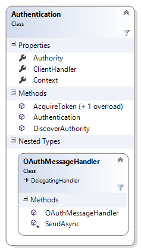

# Web API Helper code: Authentication class

Use the `Authentication` class to assist in establishing a validated connection to a Common Data Service for Apps Web service. This class supports two authentication protocols: [Windows Authentication](https://docs.microsoft.com/en-us/windows-server/security/windows-authentication/windows-authentication-overview) for Common Data Service for Apps on-premises or [OAuth 2.0](http://oauth.net/2/) for Common Data Service for Apps (online) or internet-facing deployments (IFDs). This class relies upon the Microsoft Azure Active Directory Authentication Library ([ADAL](https://docs.microsoft.com/en-us/dotnet/api/microsoft.identitymodel.clients.activedirectory?view=azure-dotnet)) to handle the OAuth protocol.  
  
The `Authentication` class is located in the file Authentication.cs in the [CRM SDK Web API Helper Library](https://www.nuget.org/packages/Microsoft.CrmSdk.WebApi.Samples.HelperCode/). It is designed to work in conjunction with the `Configuration` helper class  hierarchy to enable you to establish a secure connection to your Common Data Service for Apps service through an object of type System.Net.Http.[HttpMessageHandler](https://msdn.microsoft.com/library/hh138091\(v=vs.110\).aspx). For more information, see [Use the Common Data Service for Apps Web API Helper Library (C#)](use-microsoft-dynamics-365-web-api-helper-library-csharp.md).  
  
## Authentication processing
 
The mechanism that the `Authentication` class uses to authenticate with a  Common Data Service for Apps service depends upon the information you pass into the constructor with the `Configuration` parameter. It attempts to build a HttpMessageHandler-derived object that you can then use to instantiate a System.Net.Http.[HttpClient](https://msdn.microsoft.com/library/system.net.http.httpclient\(v=vs.110\).aspx) instance to provide a secure, persistent communication session with the Common Data Service for Apps Service.  
  
 irst a brief discovery handshake is performed with the specified Common Data Service for Apps service to determine whether OAuth or Windows native authentication is being used.  
  
- If OAuth is used, then an `OAuthMessageHandler` object is created using the authentication authority that was discovered in the handshake. This class, derived from System.Net.Http.[DelegatingHandler](/dotnet/api/system.net.http.delegatinghandler), refreshes the OAuth access token on every request, so you don’t have to explicitly manage token expiration.  
  
- If Windows authentication is used, and user credentials are supplied, then those credentials are used to construct a [HttpClientHandler](/dotnet/api/system.net.http.httpclienthandler).  
  
- If Windows authentication is used, but user credentials are not supplied, then a HttpClientHandler is constructed using default network credentials.  
  
## Class hierarchy and members  
 The following table shows the public members of the `Authentication` class.  
<!-- TODO:  
|||  
|-|-|  
||**Authentication class**<br /><br /> *Properties:*<br /><br /> `Authority` – the URL of the server that manages OAuth authentication.<br /><br /> `ClientHandler` – the [HttpMessageHandler](https://msdn.microsoft.com/library/hh138091\(v=vs.110\).aspx)-derived object that provides the network credentials or authorization access token for message requests.<br /><br /> `Context` – the [AuthenticationContext](https://msdn.microsoft.com/library/microsoft.identitymodel.clients.activedirectory.authenticationcontext.aspx) for an authentication event.<br /><br /> *Methods:*<br /><br /> `AquireToken` – For OAuth, returns an [AuthenticationResult](https://msdn.microsoft.com/library/microsoft.identitymodel.clients.activedirectory.authenticationresult.aspx),  containing the refresh and access tokens, for the current authentication context.<br /><br /> `Authentication` – Initializes an instance of this class using the `Configuration` parameter.<br /><br /> `DiscoverAuthority` – Discovers the authentication authority of the Common Data Service for Apps web service.<br /><br /> <br /><br /> **OAuthMessageHandler class**<br /><br /> This nested class sets the authorization header for each sent message for Common Data Service for Apps (online) and IFD deployments.|   -->
  
## Usage  
 The `Configuration` and `Authentication` classes are designed to be used in tandem to establish a secure connection to the target Common Data Service for Apps service.  First you create an object of type `Configuration`, then pass it as the single parameter to the `Authentication` constructor.  After successful creation, you can use the `ClientHandler` property to construct a secure, authenticated, persistent HTTP client connection to the Common Data Service for Apps service.  
  
 One common way to accomplish this operation, which is used by most of the Web API C# samples, is to use the derived class `FileConfiguration` to read connection information from properly authored application configuration files, as demonstrated in the following lines.  
  
```csharp  
  
FileConfiguration config = new FileConfiguration(null);  
Authentication auth = new Authentication(config);  
httpClient = new HttpClient(auth.ClientHandler, true);  
  
```  
  
 For more information on this manner of use, see the section [FileConfiguration connection settings](web-api-helper-code-configuration-classes.md#bkmk_FileConfigconnectionsettings). Although the `Authentication` class contains several other public properties and methods, these are primarily provided to support the creation of the `ClientHandler` property, and would rarely be directly accessed by most client applications.  
  
## Class listing  

The most current source for this class is found in the [CRM SDK Web API Helper Library](https://www.nuget.org/packages/Microsoft.CrmSdk.WebApi.Samples.HelperCode) NuGet package.  
  
```csharp
using Microsoft.IdentityModel.Clients.ActiveDirectory;  
using System;  
using System.Net;  
using System.Net.Http;  
using System.Net.Http.Headers;  
using System.Security;  
using System.Threading.Tasks;  
  
namespace Microsoft.Crm.Sdk.Samples.HelperCode  
{  
    /// <summary>  
    /// Manages user authentication with the Dynamics CRM Web API (OData v4) services. This class uses Microsoft Azure  
    /// Active Directory Authentication Library (ADAL) to handle the OAuth 2.0 protocol.   
    /// </summary>  
    public class Authentication  
    {  
        private Configuration _config = null;  
        private HttpMessageHandler _clientHandler = null;  
        private AuthenticationContext _context = null;  
        private string _authority = null;  
  
        #region Constructors  
        /// <summary>  
        /// Base constructor.  
        /// </summary>  
        public Authentication() { }  
  
        /// <summary>  
        /// Establishes an authentication session for the service.  
        /// </summary>  
        /// <param name="config">A populated configuration object.</param>  
        public Authentication(Configuration config)  
            : base()  
        {  
            if (config == null)  
                throw new Exception("Configuration cannot be null.");  
  
            _config = config;  
  
            SetClientHandler();  
        }  
  
        /// <summary>  
        /// Custom constructor that allows adding an authority determined asynchronously before   
        /// instantiating the Authentication class.  
        /// </summary>  
        /// <remarks>For a WPF application, first call DiscoverAuthorityAsync(), and then call this  
        /// constructor passing in the authority value.</remarks>  
        /// <param name="config">A populated configuration object.</param>  
        /// <param name="authority">The URL of the authority.</param>  
        public Authentication(Configuration config, string authority)  
            : base()  
        {  
            if (config == null)  
                throw new Exception("Configuration cannot be null.");  
  
            _config = config;  
            Authority = authority;  
  
            SetClientHandler();  
        }  
        #endregion Constructors  
  
        #region Properties  
        /// <summary>  
        /// The authentication context.  
        /// </summary>  
        public AuthenticationContext Context  
        {  
            get  
            { return _context; }  
  
            set  
            { _context = value; }  
        }  
  
        /// <summary>  
        /// The HTTP client message handler.  
        /// </summary>  
        public HttpMessageHandler ClientHandler  
        {  
            get  
            { return _clientHandler; }  
  
            set  
            { _clientHandler = value; }  
        }  
  
        /// <summary>  
        /// The URL of the authority to be used for authentication.  
        /// </summary>  
        public string Authority  
        {  
            get  
            {  
                if (_authority == null)  
                    _authority = DiscoverAuthority(_config.ServiceUrl);  
  
                return _authority;  
            }  
  
            set { _authority = value; }  
        }  
        #endregion Properties  
  
        #region Methods  
        /// <summary>  
        /// Returns the authentication result for the configured authentication context.  
        /// </summary>  
        /// <returns>The refreshed access token.</returns>  
        /// <remarks>Refresh the access token before every service call to avoid having to manage token expiration.</remarks>  
        public AuthenticationResult AcquireToken()  
        {  
            if (_config != null && (!string.IsNullOrEmpty(_config.Username) && _config.Password != null))  
            {  
                UserCredential cred = new UserCredential(_config.Username, _config.Password);  
                return _context.AcquireToken(_config.ServiceUrl, _config.ClientId, cred);  
            }  
            return _context.AcquireToken(_config.ServiceUrl, _config.ClientId, new Uri(_config.RedirectUrl),  
                PromptBehavior.Auto);  
        }  
  
        /// <summary>  
        /// Returns the authentication result for the configured authentication context.  
        /// </summary>  
        /// <param name="username">The username of a CRM system user in the target organization. </param>  
        /// <param name="password">The password of a CRM system user in the target organization.</param>  
        /// <returns>The authentication result.</returns>  
        /// <remarks>Setting the username or password parameters to null results in the user being prompted to  
        /// enter log-on credentials. Refresh the access token before every service call to avoid having to manage  
        /// token expiration.</remarks>  
        public AuthenticationResult AcquireToken(string username, SecureString password)  
        {  
  
            try  
            {  
                if (!string.IsNullOrEmpty(username) && password != null)  
                {  
                    UserCredential cred = new UserCredential(username, password);  
                    return _context.AcquireToken(_config.ServiceUrl, _config.ClientId, cred);  
                }  
            }  
            catch (Exception e)  
            {  
                throw new Exception("Authentication failed. Verify the configuration values are correct.", e);  
            }  
            return null;  
        }  
  
        /// <summary>  
        /// Discover the authentication authority.  
        /// </summary>  
        /// <returns>The URL of the authentication authority on the specified endpoint address, or an empty string  
        /// if the authority cannot be discovered.</returns>  
         public static string DiscoverAuthority(string serviceUrl)  
        {  
            try  
            {  
                AuthenticationParameters ap = AuthenticationParameters.CreateFromResourceUrlAsync(  
                    new Uri(serviceUrl + "api/data/")).Result;  
  
                return ap.Authority;  
            }  
            catch (HttpRequestException e)  
            {  
                throw new Exception("An HTTP request exception occurred during authority discovery.", e);  
            }  
            catch (System.Exception e )  
            {  
                // This exception ocurrs when the service is not configured for OAuth.  
                if( e.HResult == -2146233088 )  
                {  
                    return String.Empty;  
                }  
                else  
                {  
                    throw e;  
                }  
            }  
        }  
  
        /// <summary>  
        /// Discover the authentication authority asynchronously.  
        /// </summary>  
        /// <param name="serviceUrl">The specified endpoint address</param>  
        /// <returns>The URL of the authentication authority on the specified endpoint address, or an empty string  
        /// if the authority cannot be discovered.</returns>  
        public static async Task<string> DiscoverAuthorityAsync(string serviceUrl)  
        {  
            try  
            {  
                AuthenticationParameters ap = await AuthenticationParameters.CreateFromResourceUrlAsync(  
                    new Uri(serviceUrl + "api/data/"));  
  
                return ap.Authority;  
            }  
            catch (HttpRequestException e)  
            {  
                throw new Exception("An HTTP request exception occurred during authority discovery.", e);  
            }  
            catch (Exception e)  
            {  
                // These exceptions ocurr when the service is not configured for OAuth.  
  
                // -2147024809 message: Invalid authenticate header format Parameter name: authenticateHeader  
                if (e.HResult == -2146233088 || e.HResult == -2147024809)  
                {  
                    return String.Empty;  
                }  
                else  
                {  
                    throw e;  
                }  
            }  
        }  
  
        /// <summary>  
        /// Sets the client message handler as appropriate for the type of authentication  
        /// in use on the web service endpoint.  
        /// </summary>  
        private void SetClientHandler()  
        {  
            // Check the Authority to determine if OAuth authentication is used.  
            if (String.IsNullOrEmpty(Authority))  
            {  
                if (_config.Username != String.Empty)  
                {  
                    _clientHandler = new HttpClientHandler()  
                    { Credentials = new NetworkCredential(_config.Username, _config.Password, _config.Domain) };  
                }  
                else  
                // No username is provided, so try to use the default domain credentials.  
                {  
                    _clientHandler = new HttpClientHandler()  
                    { UseDefaultCredentials = true };  
                }  
            }  
            else  
            {  
                _clientHandler = new OAuthMessageHandler(this, new HttpClientHandler());  
                _context = new AuthenticationContext(Authority, false);  
            }  
        }  
        #endregion Methods  
  
        /// <summary>  
        /// Custom HTTP client handler that adds the Authorization header to message requests. This  
        /// is required for IFD and Online deployments.  
        /// </summary>  
        class OAuthMessageHandler : DelegatingHandler  
        {  
            Authentication _auth = null;  
  
            public OAuthMessageHandler( Authentication auth, HttpMessageHandler innerHandler )  
                : base(innerHandler)  
            {  
                _auth = auth;  
            }  
  
            protected override Task<HttpResponseMessage> SendAsync(  
                HttpRequestMessage request, System.Threading.CancellationToken cancellationToken)  
            {  
                // It is a best practice to refresh the access token before every message request is sent. Doing so  
                // avoids having to check the expiration date/time of the token. This operation is quick.  
                request.Headers.Authorization = new AuthenticationHeaderValue("Bearer", _auth.AcquireToken().AccessToken);  
  
                return base.SendAsync(request, cancellationToken);  
            }  
        }  
    }  
}  
```  
  
### See also  

[Get Started with the Web API (C#)](get-started-dynamics-365-web-api-csharp.md)<br />
[Start a Web API project in Visual Studio (C#)](start-web-api-project-visual-studio-csharp.md)<br />
[Use the Common Data Service for Apps Web API Helper Library (C#)](use-microsoft-dynamics-365-web-api-helper-library-csharp.md)<br />
[Helper code: Configuration class](web-api-helper-code-configuration-classes.md)<br />
[Helper code: CrmHttpResponseException class](web-api-helper-code-crmhttpresponseexception-class.md)
