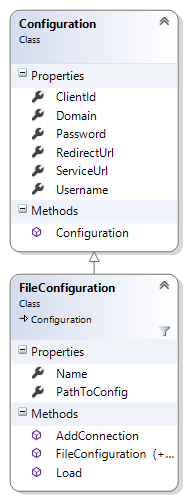

# Web API Helper code: Configuration classes

Use the configuration class hierarchy to specify the required connection data for accessing Common Data Service for Apps web services from your application. You can supply this connection data either by setting values directly in your code, possibly from user input, using the `Configuration` base class. More typically, you supply this information in settings stored in your application configuration file, using the derived class, `FileConfiguration`.  
  
The source code for the configuration class hierarchy is located in the file Configuration.cs in the [CRM SDK Web API Helper Library](https://www.nuget.org/packages/Microsoft.CrmSdk.WebApi.Samples.HelperCode/). The configuration class hierarchy is designed to work in conjunction with the `Authentication`class to enable you to establish a secure connection to your Common Data Service for Apps service. For more information, see             [Use the Common Data Service for Apps Web API Helper Library (C#)](use-microsoft-dynamics-365-web-api-helper-library-csharp.md).  
  
<a name="bkmk_Connectiondata"></a>

## Connection data

The `Configuration`class reads and parses the application configuration file to obtain the following connection data.  
  
|Connection data|Deployments|Description|  
|---------------------|-----------------|-----------------|  
|Service URL|All|The base URL to the Common Data Service for Apps service|  
|Username|All|The user name registered in Dynamics 365|  
|Password|All|The password for that user|  
|Domain|All|The domain of the Common Data Service for Apps service for Active Directory authentication|  
|Client ID|Online and IFD only|The client ID of the application as it was registered with Azure AD for Common Data Service for Apps|  
|Redirect URL|Online and IFD only|A callback URI for the current application.|  
  
<!-- TODO:
For more information on obtaining a client ID and a redirection URL for an application, see [Walkthrough: Register a Common Data Service for Apps app with Azure Active Directory](../walkthrough-register-dynamics-365-app-azure-active-directory.md).  
   -->
<a name="bkmk_FileConfigconnectionsettings"></a>

### FileConfiguration connection settings

Most of the Common Data Service for Apps Web API samples use the derived class, `FileConfiguration`, to extract the connection data from the application configuration file, App.config. This file has several application settings that apply to the different Common Data Service for Apps Server deployment modes. The `connectionString` setting contains the service URL and user name. Additionally, the `ClientId`and `RedirectUrl` settings are required for online or Internet-facing deployments (IFD). The following lines, excerpted from the default App.config file provided with most of the Web API samples, contain this connection data as placeholder values. You must replace these placeholders with values specific to the current user, your Common Data Service for Apps server, and your client application.  
  
```xml  
<connectionStrings> 
    <add name="default" connectionString="Url=http://myserver/myorg/; Username=name; Password=password; Domain=domain" /> 
</connectionStrings> 
<appSettings> 
    <add key="ClientId" value="e5cf0024-a66a-4f16-85ce-99ba97a24bb2" /> 
    <add key="RedirectUrl" value="http://localhost/SdkSample" /> 
</appSettings>  
```  
  
The full contents of the default configuration file are provided in [Default configuration file listing](#bkmk_Defaultconfigurationfilelisting).  
  
<a name="bkmk_Classhierarchyandmembers"></a>
 
## Class hierarchy and members

The following diagram shows the public members of the configuration class hierarchy.  
  
 <!-- TODO:
   -->
  
 **Configuration class**  
  
 *Properties:*  
  
 All properties map directly to the corresponding connection data detailed in the previous section.  
  
 *Methods*:  
  
 The default constructor leaves all properties uninitialized (null).  
  
 **FileConfiguration Class**  
  
 *Properties:*  
  
 `Name`is the name of the connection string setting entry.  
  
 `PathToConfig`is the full or relative path to the application configuration file.  
  
 *Methods*:  
  
 The default constructor leaves all properties uninitialized (null).  
  
 The non-default constructor takes a single string parameter that specifies the named connection string. An empty string or null string value results in the first connection string entry being used.  
  
 The `Load`method opens, reads, and parses the specified configuration file. It is used by the non-default constructor.  
  
<a name="bkmk_usage"></a>

## Usage

 The `FileConfiguration` and `Authentication` classes are designed to be used in tandem to read the connection information in App.config and to then establish a secure connection to the target Common Data Service for Apps service. This can be implemented with the following statements.  
  
```csharp  
FileConfiguration config = new FileConfiguration(null); Authentication auth = new Authentication(config); httpClient = new HttpClient(auth.ClientHandler, true);  
```  
  
 The non-default constructor in the `Configuration` class enables the use of a named connection string, for example:  
  
```csharp  
Configuration config = new FileConfiguration(“TestServer”);  
```  
  
 If a null or empty connection string name is passed to the `FileConfiguration` class constructor, the first connection string from the top of the configuration file is used.  
  
 Furthermore, the SDK samples support a run-time command parameter, representing the name of the desired connection string, to be passed to the constructor. This option is implemented by the following code:  
  
```csharp  
if (cmdargs.Length > 0) { config = new FileConfiguration(cmdargs[0]); } else { config = new FileConfiguration(null); }  
```  
  
<a name="bkmk_Configurationsearchorder"></a>

### Configuration search order

 Whether using the default or a custom application configuration file, the optional `AlternateConfig` application setting can be supplied within the file to specify an alternative configuration file. If this file exists, its connection settings will be used instead.  
  
```xml  
<add key="AlternateConfig" value="C:\Temp\crmsample.exe.config"/>  
```  
  
 One common use of this setting is to supply a global configuration file to be shared among multiple applications, instead of editing each application’s App.config file. This is especially useful for sharing configuration and registration information among                         multiple applications moving through the development and testing stages. Then only for production would you provide unique configuration and registration information for each application.  
  
<a name="bkmk_Defaultconfigurationfilelisting"></a>

## Default configuration file listing

 The file App.config, provided with most Common Data Service for Apps Web API samples, contains placeholder connection values that must be edited by the developer or site administrator.  
  
```xml  
<?xml version="1.0" encoding="UTF-8"?>
<configuration>
   <startup>
      <supportedRuntime version="v4.0" sku=".NETFramework,Version=v4.5.2" />
   </startup>
   <connectionStrings>
      <clear />
      <!-- When providing a password, make  
                sure to set the app.config file's security so that only you can read it. -->
      <add name="default" connectionString="Url=http://myserver/myorg/; Username=name; Password=password; Domain=domain" />
      <add name="CrmOnline" connectionString="Url=https://mydomain.crm.dynamics.com/;                   Username=someone@mydomain.onmicrosoft.com; Password=password" />
   </connectionStrings>
   <appSettings>
      <!--For information on how to register an app and obtain the ClientId and RedirectUrl values see https://msdn.microsoft.com/dynamics/crm/mt149065  
                -->
      <!--Active Directory application registration. -->
      <!--These are dummy values and should be replaced with your actual app registration values.-->
      <add key="ClientId" value="e5cf0024-a66a-4f16-85ce-99ba97a24bb2" />
      <add key="RedirectUrl" value="http://localhost/SdkSample" />
      <!-- Use an alternate configuration file for connection string and setting values. This optional setting enables use of an app.config file shared among multiple applications. If the specified file does not exist,  
                this setting is ignored.-->
      <add key="AlternateConfig" value="C:\Temp\crmsample.exe.config" />
   </appSettings>
</configuration>  
```  
  
## Class listing

 The most current source for this class is found in the [CRM SDK Web API Helper Library](https://www.nuget.org/packages/Microsoft.CrmSdk.WebApi.Samples.HelperCode) NuGet package.  
  
```csharp  
using System;
using System.IO;
using System.Security;
using System.Configuration;

namespace Microsoft.Crm.Sdk.Samples.HelperCode
{
    /// <summary>
    /// An application configuration containing user logon, application, and web service information
    /// as required for CRM Web API authentication.
    /// </summary>
    public class Configuration
    {
        #region Properties
        /// <summary>
        /// The root address of the Dynamics CRM service.
        /// </summary>
        /// <example>https://myorg.crm.dynamics.com</example>
        public string ServiceUrl { get; set; }

        /// <summary>
        /// The redirect address provided when the application was registered in Microsoft Azure
        /// Active Directory or AD FS.
        /// </summary>
        /// <remarks>Required only with a web service configured for OAuth authentication.</remarks>
        /// <seealso cref="https://msdn.microsoft.com/library/dn531010.aspx#bkmk_redirect"/>
        public string RedirectUrl { get; set; }

        /// <summary>
        /// The client ID that was generated when the application was registered in Microsoft Azure
        /// Active Directory or AD FS.
        /// </summary>
        /// <remarks>Required only with a web service configured for OAuth authentication.</remarks>
        public string ClientId { get; set; }

        /// <summary>
        /// The user name of the logged on user or null.
        /// </summary>
        public string Username { get; set; }

        /// <summary>
        ///  The password of the logged on user or null.
        /// </summary>
        public SecureString Password { get; set; }

        /// <summary>
        ///  The domain of the logged on user account or null.
        /// </summary>
        /// <remarks>Required only with a web service configured for Active Directory authentication.</remarks>
        public string Domain { get; set; }

        #endregion Properties

        #region Constructors

        /// <summary>
        /// Constructs a configuration object.
        /// </summary>
        public Configuration() { }

        #endregion Constructors
    }

    /// <summary>
    /// A configuration that is persisted to file storage.
    /// </summary>
    /// <remarks>This implementation defaults to using an app.config file. However, you
    /// can derive a subclass and override the virtual methods to make use of other
    /// file formats.
    /// 
    /// One set of application registration settings and multiple named connection strings are supported.</remarks>
    public class FileConfiguration : Configuration
    {
        #region Properties
        /// <summary>
        /// The full or relative path to the application's configuration file.
        /// </summary>
        /// <remarks>The file name is in the format <appname>.exe.config.</appname></remarks>
        public string PathToConfig { get; set; }

        /// <summary>
        /// The name of the connection.
        /// </summary>
        public string Name { get; set; }

        #endregion Properties

        #region Constructors
        /// <summary>
        /// Constructs a file configuration.
        /// </summary>
        public FileConfiguration()
            : base()
        { }

        /// <summary>
        /// Loads a named connection string and application settings from persistent file storage.
        /// The configuration file must have the same name as the application and be located in the 
        /// run-time folder.
        /// </summary>
        /// <param name="name">The name of the target connection string. An empty or null string value 
        /// results in the first named configuration being used.</param>
        /// <remarks>The app.config file must exist in the run-time folder and have the name
        /// <appname>.exe.config. To specify an app.config file path, use the Load() method.</remarks>
        public FileConfiguration(string name)
            : base()
        {
            var path = System.IO.Path.Combine(Directory.GetCurrentDirectory(), Environment.GetCommandLineArgs()[0]);

            Load(name, String.Concat(path, ".config"));
        }

        #endregion Constructors

        #region Methods
        /// <summary>
        /// Loads server connection information and application settings from persistent file storage.
        /// </summary>
        /// <remarks>A setting named OverrideConfig can optionally be added. If a config file that this setting
        /// refers to exists, that config file is read instead of the config file specified in the path parameter.
        /// This allows for an alternate config file, for example a global config file shared by multiple applications.
        /// </summary>
        /// <param name="connectionName">The name of the connection string in the configuration file to use. 
        /// Each CRM organization can have its own connection string. A value of null or String.Empty results
        /// in the first (top most) connection string being used.</param>
        /// <param name="path">The full or relative pathname of the configuration file.</param>
        public virtual void Load(string connectionName, string path)
        {
            // Check passed parameters.
            if (string.IsNullOrEmpty(path) || !System.IO.File.Exists(path))
                throw new ArgumentException("The specified app.config file path is invalid.", this.ToString());
            else
                PathToConfig = path;

            try
            {
                // Read the app.config file and obtain the app settings.
                System.Configuration.Configuration config = null;
                ExeConfigurationFileMap configFileMap = new ExeConfigurationFileMap();
                configFileMap.ExeConfigFilename = PathToConfig;
                config = ConfigurationManager.OpenMappedExeConfiguration(configFileMap, ConfigurationUserLevel.None);

                var appSettings = config.AppSettings.Settings;

                // If an alternate config file exists, load that configuration instead. Note the test
                // for redirectTo.Equals(path) to avoid an infinite loop.
                if (appSettings["AlternateConfig"] != null)
                {
                    var redirectTo = appSettings["AlternateConfig"].Value;
                    if (redirectTo != null && !redirectTo.Equals(path) && System.IO.File.Exists(redirectTo))
                    {
                        Load(connectionName, redirectTo);
                        return;
                    }
                }

                // Get the connection string.
                ConnectionStringSettings connection;
                if (string.IsNullOrEmpty(connectionName))
                {
                    // No connection string name specified, so use the first one in the file.
                    connection = config.ConnectionStrings.ConnectionStrings[0];
                    Name = connection.Name;
                }
                else
                {
                    connection = config.ConnectionStrings.ConnectionStrings[connectionName];
                    Name = connectionName;
                }

                // Get the connection string parameter values.
                if (connection != null)
                {
                    var parameters = connection.ConnectionString.Split(';');
                    foreach (string parameter in parameters)
                    {
                        var trimmedParameter = parameter.Trim();
                        if (trimmedParameter.StartsWith("Url="))
                            ServiceUrl = parameter.Replace("Url=", String.Empty).TrimStart(' ');

                        if (trimmedParameter.StartsWith("Username="))
                            Username = parameters[1].Replace("Username=", String.Empty).TrimStart(' ');

                        if (trimmedParameter.StartsWith("Password="))
                        {
                            var password = parameters[2].Replace("Password=", String.Empty).TrimStart(' ');

                            Password = new SecureString();
                            foreach (char c in password) Password.AppendChar(c);
                        }
                        if (trimmedParameter.StartsWith("Domain="))
                            Domain = parameter.Replace("Domain=", String.Empty).TrimStart(' ');
                    }
                }
                else
                    throw new Exception("The specified connection string could not be found.");

                // Get the Azure Active Directory application registration settings.
                RedirectUrl = appSettings["RedirectUrl"]?.Value;
                ClientId = appSettings["ClientId"]?.Value;
            }
            catch (InvalidOperationException e)
            {
                throw new Exception("Required setting in app.config does not exist or is of the wrong type.", e);
            }
        }

        /// <summary>
        /// Save the current configuration to persistent file storage.
        /// </summary>
        /// <remarks>Any existing configuration is overwritten.</remarks>
        public virtual void Save()
        {
            throw new NotImplementedException();
        }

        /// <summary>
        /// Add a named connection string to persistent file storage.
        /// </summary>
        /// <remarks>A named connection string from the current configuration is added to an existing
        /// configuration file./remarks>
        public virtual void AddConnection()
        {
            throw new NotImplementedException();
        }

        #endregion Methods
    }
} 
```  
  
### See also

[Get Started with the Web API (C#)](get-started-dynamics-365-web-api-csharp.md)<br />
[Start a Web API project in Visual Studio (C#)](start-web-api-project-visual-studio-csharp.md)<br />
[Use the Common Data Service for Apps Web API Helper Library (C#)](use-microsoft-dynamics-365-web-api-helper-library-csharp.md)<br />
[Helper code: Authentication class](web-api-helper-code-authentication-class.md)<br />
[Helper code: CrmHttpResponseException class](web-api-helper-code-crmhttpresponseexception-class.md)<br />
[SDK samples Helper code for Organization Service endpoint](https://www.nuget.org/packages/Microsoft.CrmSdk.Samples.HelperCode-CS)  