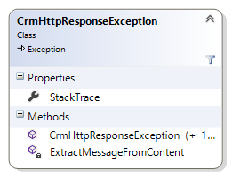

# Web API Helper code: CrmHttpResponseException class

Use the `CrmHttpResponseException` class to represent [HTTP status errors](https://msdn.microsoft.com/library/gg334391.aspx) generated during Common Data Service for Apps Web API calls.  This class is derived from the standard .NET System.[Exception](https://msdn.microsoft.com/library/system.exception.aspx) class to easily integrate with your existing exception-handling mechanisms. For more general information, see [Handling and Throwing Exceptions](https://docs.microsoft.com/en-us/dotnet/standard/exceptions/index).  
  
The `CrmHttpResponseException` class is located in the file Exceptions.cs in the [CRM SDK Web API Helper Library](https://www.nuget.org/packages/Microsoft.CrmSdk.WebApi.Samples.HelperCode/).  It is used extensively in the other helper library classes and C# Web API samples. For more information, see [Use the Common Data Service for Apps Web API Helper Library (C#)](use-microsoft-dynamics-365-web-api-helper-library-csharp.md).  
  
This class utilizes JSON string-handling functionality from the open source [Json.NET](http://www.newtonsoft.com/json) library.  
  
## Class members  

The following table shows the public members of the `CrmHttpResponseException` class.  
  
<!-- TODO:
|||  
|-|-|  
||**CrmHttpResponseException  class**<br /><br /> *Properties:*<br /><br /> `StackTrace` – the string representation of the immediate frames on the Common Data Service for Apps server’s call stack when the exception was thrown, if available.<br /><br /> *Methods*:<br /><br /> The constructors initialize an instance of this class, and require a [HttpContent](https://msdn.microsoft.com/library/hh193687\(v=vs.110\).aspx) parameter and an optional inner exception parameter.<br /><br /> `ExtractMessageFromContent` – this static method extracts the error message from the specified HTTP content parameter.|  
   -->
## Usage  

Typically, you create and throw a `CrmHttpResponseException` object when processing a status error returned with a HTTP response message. For example, the following code throws such an error when the <xref href="Microsoft.Dynamics.CRM.WhoAmI?text=WhoAmI Function" /> call fails.  
  
```csharp  
response = await httpClient.GetAsync("WhoAmI", HttpCompletionOption.ResponseContentRead);  
if (!response.IsSuccessStatusCode)  
{   
    throw new CrmHttpResponseException(response.Content);   
}  
```  
  
 You can catch and process thrown `CrmHttpResponseException` objects similarly to other standard .NET exceptions.  
  
> [!IMPORTANT]
>  If you are using the HttpResponseMessage.[EnsureSuccessStatusCode](/dotnet/api/system.net.http.httpresponsemessage.ensuresuccessstatuscode) method to automatically convert HTTP response errors into thrown [HttpRequestException](/dotnet/api/system.net.http.httprequestexception) objects, then this approach precludes the use of the `CrmHttpResponseException` class. Note that if you use this approach, much of the response message details, including the status code, will not be available during exception handling.  
  
## Class listing

 The most current source for this class is found in the [CRM SDK Web API Helper Library](https://www.nuget.org/packages/Microsoft.CrmSdk.WebApi.Samples.HelperCode) NuGet package.  
  
```csharp  
using System;  
using System.Collections.Generic;  
using System.Linq;  
using System.Text;  
using System.Threading.Tasks;  
using System.Net.Http;  
using Newtonsoft.Json;  
using Newtonsoft.Json.Linq;  
  
namespace Microsoft.Crm.Sdk.Samples.HelperCode  
{  
    /// <summary>  
    /// Produces a populated exception from an error message in the content of an HTTP response.   
    /// </summary>  
    public class CrmHttpResponseException : System.Exception  
    {  
        #region Properties  
        private static string _stackTrace;  
  
        /// <summary>  
        /// Gets a string representation of the immediate frames on the call stack.  
        /// </summary>  
        public override string StackTrace  
        {  
            get { return _stackTrace; }  
        }  
        #endregion Properties  
  
        #region Constructors  
        /// <summary>  
        /// Initializes a new instance of the CrmHttpResponseException class.  
        /// </summary>  
        /// <param name="content">The populated HTTP content in Json format.</param>  
        public CrmHttpResponseException(HttpContent content)  
            : base(ExtractMessageFromContent(content)) { }  
  
        /// <summary>  
        /// Initializes a new instance of the CrmHttpResponseException class.  
        /// </summary>  
        /// <param name="content">The populated HTTP content in Json format.</param>  
        /// <param name="innerexception">The exception that is the cause of the current exception, or a null reference  
        /// if no inner exception is specified.</param>  
        public CrmHttpResponseException(HttpContent content, Exception innerexception)  
            : base(ExtractMessageFromContent(content), innerexception) { }  
  
        #endregion Constructors  
  
        #region Methods  
        /// <summary>  
        /// Extracts the CRM specific error message and stack trace from an HTTP content.   
        /// </summary>  
        /// <param name="content">The HTTP content in Json format.</param>  
        /// <returns>The error message.</returns>  
        private static string ExtractMessageFromContent(HttpContent content)  
        {  
            string message = String.Empty;  
            string downloadedContent = content.ReadAsStringAsync().Result;  
            if (content.Headers.ContentType.MediaType.Equals("text/plain"))  
            {  
                message = downloadedContent;  
            }  
            else if (content.Headers.ContentType.MediaType.Equals("application/json"))  
            {  
                JObject jcontent = (JObject)JsonConvert.DeserializeObject(downloadedContent);  
                IDictionary<string, JToken> d = jcontent;  
  
                // An error message is returned in the content under the 'error' key.   
                if (d.ContainsKey("error"))  
                {  
                    JObject error = (JObject)jcontent.Property("error").Value;  
                    message = (String)error.Property("message").Value;  
                }  
                else if (d.ContainsKey("Message"))  
                    message = (String)jcontent.Property("Message").Value;  
  
                if (d.ContainsKey("StackTrace"))  
                    _stackTrace = (String)jcontent.Property("StackTrace").Value;  
            }  
            else if (content.Headers.ContentType.MediaType.Equals("text/html"))  
            {  
                message = "HTML content that was returned is shown below.";  
                message += "\n\n" + downloadedContent;  
            }  
            else  
            {  
                message = String.Format("No handler is available for content in the {0} format.",    
                    content.Headers.ContentType.MediaType.ToString());  
            }  
            return message;  
            #endregion Methods  
        }  
    }  
}  
  
```  
  
### See also

[Get Started with the Web API (C#)](get-started-dynamics-365-web-api-csharp.md)<br />
[Start a Web API project in Visual Studio (C#)](start-web-api-project-visual-studio-csharp.md)<br />
[Use the Common Data Service for Apps Web API Helper Library (C#)](use-microsoft-dynamics-365-web-api-helper-library-csharp.md)<br />
[Helper code: Authentication class](web-api-helper-code-authentication-class.md)<br />
[Helper code: Configuration class](web-api-helper-code-configuration-classes.md)
