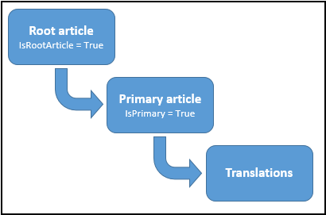

# Work with knowledge articles


<!-- 
No owner
https://docs.microsoft.com/en-us/dynamics365/customer-engagement/developer/work-knowledge-articles -->

The new knowledge articles in Dynamics 365 (online) enable you to create rich knowledge articles along with versioning and translation support. When you create and publish a knowledge article, it become available to users in your Dynamics 365 instance so that they can use information in the articles to effectively service the customers. Use the `KnowledgeArticle` entity to store and manage knowledge natively in Dynamics 365.  
  
 This topic provides information about working with the new native Dynamics 365 knowledge management capabilities.  
  
> [!NOTE]
>  If you’re using the earlier knowledge base article (`KBArticle`) entity model, see [Work with earlier Dynamics 365 knowledge base articles](work-knowledge-articles.md#EarlierKBArticle) later in this topic.  
  
 You can’t programmatically enable the knowledge base management feature for entities in your Dynamics 365 instance; it can only be done using the Dynamics 365 web client. More information: [Set up knowledge management in CRM](http://go.microsoft.com/fwlink/p/?LinkId=691083)  
  
<a name="Create"></a>   
## Create a knowledge article  
 When you create a knowledge article record, Dynamics 365 internally creates a root article for the record. The root article acts as a container for the primary knowledge article created by you along with all the article versions and translations that you might create in future. The following diagram depicts the entity model for the `KnowledgeArticle` entity.  
  
   
  
 When you create a knowledge article record, it’s created in the `Draft` state. Using the new `KnowledgeArticle` entity, you can create an article by specifying its contents and formatting in the HTML format as compared to using the old `KbArticle` entity where you had to associate it with a template that described the sections and formatting for the article. You can specify your own value for the `KnowledgeArticle`.`ArticlePublicNumber` attribute while creating a knowledge article record programmatically; otherwise, the value is automatically generated based on the format you specified in the Dynamics 365 settings area in the web client. The `KnowledgeArticle`.`ArticlePublicNumber` attribute stores the ID exposed to customers, partners, and other external users to reference and look up knowledge articles, and remains the same across knowledge article versions and translations.  
  
 The following sample code shows how you can create a knowledge article record:  
  
```csharp  
KnowledgeArticle newKnowledgeArticle = new KnowledgeArticle  
{  
   Title = "Sample Knowledge Article",  
   Content = "<p>This is the article content.</p>"  
};  
knowledgeArticleId = _serviceProxy.Create(newKnowledgeArticle);  
Console.WriteLine("Created {0}", newKnowledgeArticle.Title);  
```  
  
<a name="Version"></a>   
## Create major and minor versions of a knowledge article  
 When you create a knowledge article record, the major version is automatically set to 1 and minor version to 0. Use the `CreateKnowledgeArticleVersion` message (<xref href="Microsoft.Dynamics.CRM.CreateKnowledgeArticleVersion ?text=CreateKnowledgeArticleVersion Action" /> or <xref:Microsoft.Crm.Sdk.Messages.CreateKnowledgeArticleVersionRequest>) to create a major or minor version of a knowledge article. In the request message, set `IsMajor` to `true` to create a major version; set it to `false` to create a minor version. The new version record that is created uses the:  
  
- `KnowledgeArticle`.`RootArticleId` attribute to maintain the association with the root knowledge article record.  
  
- `KnowledgeArticle`.`PreviousArticleContentId` attribute to point to the previous version of the record.  
  
  The following sample code shows how to create a major version of a knowledge article record using <xref:Microsoft.Crm.Sdk.Messages.CreateKnowledgeArticleVersionRequest>.  
  
```csharp  
CreateKnowledgeArticleVersionRequest versionRequest = new CreateKnowledgeArticleVersionRequest  
{  
   Source = new EntityReference(KnowledgeArticle.EntityLogicalName, knowledgeArticleId),  
   IsMajor = true  
};  
CreateKnowledgeArticleVersionResponse versionResponse = (CreateKnowledgeArticleVersionResponse)_serviceProxy.Execute(versionRequest);  
```  
  
<a name="Translation"></a>   
## Create a knowledge article translation  
 Use <xref href="Microsoft.Dynamics.CRM.CreateKnowledgeArticleTranslation?text=CreateKnowledgeArticleTranslation Action" /> (Web API) or <xref:Microsoft.Crm.Sdk.Messages.CreateKnowledgeArticleTranslationRequest> (organization service) to create a translation for a knowledge article record. You can translate your knowledge article in more than 150 languages, and information about these supported languages is available in the new `LanguageLocale` entity. More information: [LanguageLocale Entity](reference/entities/languagelocale.md)  
  
 Using <xref href="Microsoft.Dynamics.CRM.CreateKnowledgeArticleTranslation?text=CreateKnowledgeArticleTranslation Action" /> (Web API) or <xref:Microsoft.Crm.Sdk.Messages.CreateKnowledgeArticleTranslationRequest> (organization service) creates a new knowledge article record with the title, content, description and keywords copied from the source record to the new record, and the language of the new record set to the one you specified in the request. You also need to specify whether the new record will be a major or minor version. The new record uses the `KnowledgeArticle`.`ParentArticleContentId` attribute to maintain the association with the primary knowledge article record.  
  
 After you execute this message and get a response, retrieve the knowledge article record from the response object, and then update the title, content, description, and keywords to add the translated content.  
  
 The following sample code shows how to create a knowledge article translation using <xref:Microsoft.Crm.Sdk.Messages.CreateKnowledgeArticleTranslationRequest>:  
  
```csharp  
CreateKnowledgeArticleTranslationRequest translationRequest = new CreateKnowledgeArticleTranslationRequest  
{  
   Source = new EntityReference(KnowledgeArticle.EntityLogicalName, knowledgeArticleId),  
   Language = new EntityReference(LanguageLocale.EntityLogicalName, languageLocaleId), //languageLocaleId = GUID of the Primary Key of LanguageLocale record  
   IsMajor = true    // Creating a major version   
};  
CreateKnowledgeArticleTranslationResponse translationResponse = (CreateKnowledgeArticleTranslationResponse)_serviceProxy.Execute(translationRequest);  
  
// Retrieve the new knowledge article record  
KnowledgeArticle respObject = (KnowledgeArticle)_serviceProxy.Retrieve(KnowledgeArticle.EntityLogicalName,   
      translationResponse.CreateKnowledgeArticleTranslation.Id, new ColumnSet(true));  
```  
  
> [!NOTE]
>  The GUID value of the primary key (`LanguageLocaleId`) for each language record in the `LanguageLocale` entity is the same across all Dynamics 365 organizations.  
  
<a name="KnowledgeLifecycle"></a>   
## Knowledge article lifecycle: Change the state of a knowledge article  
 During its lifecycle, a knowledge article can be in the following states:  
  
- 0: Draft (after a knowledge article is created)  
  
- 1: Approved (after a knowledge article is approved)  
  
- 2: Scheduled (after a knowledge article is scheduled to be published)  
  
- 3: Published (after a knowledge article is published)  
  
- 4: Expired (after a knowledge article is expired as per the expiration date specified while publishing)  
  
- 5: Archived (after a knowledge article is archived)  
  
- 6: Discarded (after a knowledge article is discarded)  
  
  To change the state of the article, use the `Update` message on the knowledge article record to update the `KnowledgeArticle.StateCode` attribute. For early bound types, use the `KnowledgeArticleState` enumeration to set the possible states. More information: [Perform specialized operations using Update](org-service/perform-specialized-operations-using-update.md). <!-- Todo: Need to update the link. Page not found-->
  
  The following sample code shows how to publish a knowledge article record.  
  
```csharp  
// Retrieve the knowledge article record  
KnowledgeArticle myKnowledgeArticle = (KnowledgeArticle)_serviceProxy.Retrieve(  
        KnowledgeArticle.EntityLogicalName, knowledgeArticleId, new ColumnSet("statecode"));  
  
// Update the knowledge article record  
myKnowledgeArticle.StateCode = KnowledgeArticleState.Published;  
UpdateRequest updateKnowledgeArticle = new UpdateRequest  
{  
    Target = myKnowledgeArticle  
};  
_serviceProxy.Execute(updateKnowledgeArticle);  
  
```  
  
<a name="Associate"></a>   
## Associate a knowledge article record with a Dynamics 365 entity instance  
 When you enable embedded knowledge search for an entity in Dynamics 365 using the web client, a many-to-many relationship, `msdyn_`***<Entity_Name>***`_knowledgearticle`, is automatically created. You can use this relationship to programmatically associate or link a `KnowledgeArticle` instance with a Dynamics 365 entity instance. When you associate a `KnowledgeArticle` instance with an entity instance, a record for the relationship is created in an intersect entity called `msdyn_`***<Entity_Name>***`_knowledgearticle`. For example, when you associate a `KnowledgeArticle` instance with an `Account` instance for the first time, an intersect entity called `msdyn_account_knowledgearticle` is created, and a record with the association mapping is created in this intersect entity. By default, the `Incident` (Case) entity is enabled for the embedded knowledge search, and when you link a `KnowledgeArticle` record to an `Incident` record, an association record is created in the `KnowledgeArticleIncident` intersect entity.  
  
 The following sample code demonstrates how to associate a `KnowledgeArticle` instance with an `Account` instance:  
  
```csharp  
// Associate the knowledge article record with an account record  
  
// Step 1: Create a collection of knowledge article records that will be   
// associated to the account. In this case, we have only a single  
// knowledge article record to be associated.  
EntityReferenceCollection relatedEntities = new EntityReferenceCollection();  
relatedEntities.Add(new EntityReference(KnowledgeArticle.EntityLogicalName, knowledgeArticleId));  
  
// Step 2: Create an object that defines the relationship between knowledge article record and account record.  
// Use the many-to-many relationship name (msdyn_account_knowledgearticle) between knowledge article  
// record and account record.  
Relationship newRelationship = new Relationship("msdyn_account_knowledgearticle");  
  
// Step 3: Associate the knowledge article record with the account record.  
_serviceProxy.Associate(Account.EntityLogicalName, accountId, newRelationship, relatedEntities);  
  
```  
  
<a name="IncrementViewCount"></a>   
## Increment knowledge article view count  
 Use the <xref:Microsoft.Crm.Sdk.Messages.IncrementKnowledgeArticleViewCountRequest> message to increment the view count of a knowledge article record for a given day in the `KnowledgeArticleViews` entity. If a record doesn’t exist for a knowledge article for a specified day, it will create a record and then set the specified view count value in the `KnowledgeArticleViews`.`KnowledgeArticleView` attribute. If a record already exists for a knowledge article for the specified day, it will just increment the view count in the `KnowledgeArticleViews`.`KnowledgeArticleView` attribute of the existing record.  
  
<a name="Search"></a>   
## Search knowledge articles using full-text search  
 Knowledge articles in Dynamics 365, including their versions and translations, are full-text indexed and support SQL Server full-text search. For more information about full-text search, see [SQL Server: Full-text Search](https://docs.microsoft.com/sql/relational-databases/search/full-text-search).  
  
 Use the <xref:Microsoft.Crm.Sdk.Messages.FullTextSearchKnowledgeArticleRequest> message to search knowledge article from your applications to find the information you are looking for. The <xref:Microsoft.Crm.Sdk.Messages.FullTextSearchKnowledgeArticleRequest> message lets you use inflectional stem matching (allows for a different tense or inflection to be substituted for the search text) and specify query criteria (using FetchXML or QueryExpression to specify filtering, ordering, sorting, and paging) to find knowledge articles with specified text. You can also choose to remove multiple versions of the same articles in the search results and filter on the knowledge article state while searching for a text.  
  
<a name="EarlierKBArticle"></a>   
## Work with earlier Dynamics 365 knowledge base articles  
  
> [!NOTE]
>  This section provides you with information about working with the earlier knowledge base article entity model for knowledge management in Dynamics 365. While the entities mentioned in this section are still available in the current version, you should use the knowledge management entities mentioned earlier to take advantage of the enhanced knowledge management experience.  
  
 During its lifecycle, a knowledge base article can be in the following states:  
  
- 1: Draft (after an article is created)  
  
- 2: Unapproved (during editing)  
  
- 3: Published (after an article is published)  
  
  To change the state of the article, use the <xref:Microsoft.Crm.Sdk.Messages.SetStateRequest> message. For early bound types, use the `KbArticleState` enumeration to set the possible states.  
  
  When you create an article, you have to associate it with a template and a subject. An article template describes the sections and formatting for the article. Subjects are used to organize the articles by business categories that are also used to group cases (incidents), sales literature, and products. A best practice is to create a subject tree hierarchy and all necessary article templates before you create an article.  
  
> [!NOTE]
> [!INCLUDE[pn_microsoftcrm](../includes/pn-microsoftcrm.md)] provides several article templates. They include a standard article, a solution to a problem, a procedure, and other templates. The recommended method of creating article templates is by using the [!INCLUDE[pn_microsoftcrm](../includes/pn-microsoftcrm.md)] web application. If you want to create an article template programmatically, use existing article templates as examples of what information to include and how to format the data.  
  
 To associate an article with a template, use the `KbArticle.KbArticleTemplateId` attribute. To place an article in a specific category by specifying a subject, use the `KbArticle.SubjectId` attribute.  
  
 Specify the title of the article and the keywords that you want to use in the search. To describe an article you can use the `KbArticle.Description` attribute. To add the content for the article, use the `KbArticle.Content` attribute. Use the `Kbarticle.ArticleXml` attribute to add the XML data for article. The `KbArticle.LanguageCode` value is obtained from the template to help you write the queries that sort the articles by the language.  
  
 When an article is created it is saved as a draft. After that, you can change the state of the article from “Draft” to “Unapproved.” You can modify the content of an unapproved article and make it ready for publishing. When the article is ready to be published, change the state from “Unapproved” to “Published.”  
  
 An unpublished article obtains the format settings from a template. If you change a template format, the changes are automatically propagated to articles in the “Draft” and “Unapproved” states.  
  
 After you publish an article, you can add comments (`KbArticleComment`), but you can’t edit it, regardless of your privileges. The comments can be added to the article that is in any of the states.  
  
> [!NOTE]
>  The comments can be added to the article in any state: Draft, Unapproved or Published.  
  
 To revise or update the article, you have to unpublish it. To unpublish an article, change the state of the article from Published to Unapproved. To delete an article from the [!INCLUDE[pn_microsoftcrm](../includes/pn-microsoftcrm.md)] database, change the state of the article from Published to Unapproved or Draft.  
  
> [!NOTE]
>  A knowledge base article cannot be deleted, if it is in the Published state.  
  
 For more information on creating, updating, editing, and locating an article in the knowledge base, see [Use articles in the knowledge base](http://go.microsoft.com/fwlink/p/?LinkId=526812).  
  
### See also  
 [Knowledge Base Entities](knowledge-management-entities.md)    
 [KnowledgeArticle Entity](reference/entities/knowledgearticle.md)   
 [KnowledgeArticleViews Entity](reference/entities/knowledgearticleviews.md)   
 [KnowledgeBaseRecord Entity](reference/entities/knowledgebaserecord.md)   
 [LanguageLocale Entity](reference/entities/languagelocale.md)   
 [KbArticle Entity](reference/entities/kbarticle.md)