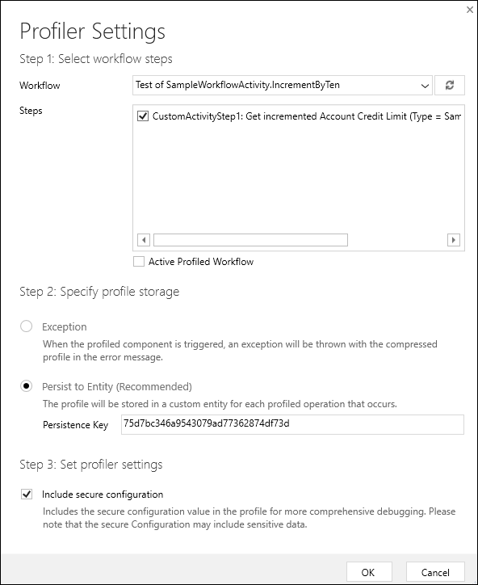

# Debug Workflow Activities

Because custom workflow extensions are .NET Framework assemblies you can debug them using methods very similar to how you debug plug-ins. 

## Use the Plug-in Registration Tool

The Plug-in Registration Tool (PRT) is one of the tools you can download from NuGet. More information: [Download tools from NuGet](../download-tools-nuget.md).

### Install Profiler

From the PRT you can install the Plug-in profiler solution by clicking the **Install Profiler** button.

This solution add the capability to capture the context that is passed to your workflow activity and enables replay that you can use to debug the logic in your code locally.

When the **Plug-in profiler** is installed for your CDS for Apps instance, you will see it at the bottom of the list of **Registered Plugins & Custom Workflow Activities**.

To profile a workflow activity, right-click on the **Plug-in Profiler** and select **Start Profiling Workflow**.

This will open the **Profiler Settings** dialog which will provide the following options:

1. **Workflow**: Select the Workflow or Custom action that contains the workflow activity you want to debug.
1. **Steps**: Select the specific steps within that workflow or custom action that you want to debug
1. **Specify profile storage**: We recommend that you choose **Persist to Entity**.
1. **Set profiler settings**: If your are working with a system where the workflow is being executed frequently, you can reduce performance impact by choosing to limit the number of profiles that are captured.
1. **Include secure configuration**: This provides the option to avoid seeing potentially sensitive data that may be passed as secure configuration.

Click **OK** to save your settings.

### Capture a profile

In an app connected to your CDS for apps instances, or by using the web services, perform an operation that will use the workflow or custom action defined in your profile. This will capture an instance of the plug-in executing and persist it as a profile record in the system.

> [!TIP]
> If your workflow is asynchronous, make sure that it completes before moving on to the next step. Go to Settings > System Jobs and verify that the workflow succeeded.

### Debug your assembly

TODO

## Use tracing

## More information

[Debug Plug-ins](../debug-plug-in.md) 
[Tutorial: Debug a plug-in](../tutorial-debug-plug-in.md)
