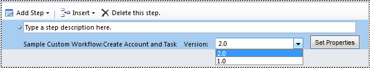

# Update a custom workflow activity using assembly versioning

In Common Data Service for Apps, updates to your custom workflow activity assembly are handled more efficiently because of the improved assembly versioning model.  
  

## Understand the assembly version number

Each custom workflow activity assembly has a version number. This version number is represented as a four-part string in the following format:  
  
 `<major_version>.<minor_version>.<build_number>.<revision>`  
  
 For example, version `1.5.200.5` indicates `1` as the major version, `5` as the minor version, `200` as the build number, and `5` as the revision number.  
  

## Update a custom workflow activity

You might want to update your existing workflow activities to fix some bugs or to make changes in some of the private code implementation. When updating a custom workflow activity, make sure that you do not make significant changes in the public classes or method signatures in the underlying code, such as changing the input parameters, because this might break existing workflow instances that use the custom workflow activity.  
  
1.  Make necessary changes in the underlying code of the custom workflow activity.  
2.  Change the values for `<build_number>` and `<revision>` only in the assembly information of the custom workflow activity, and compile it. For example, change the value of your assembly from “1.0.0.0” to “1.0.10.5”.  
3.  Update your registered custom workflow activity in CDS for Apps with the new assembly.  
    After updating the custom workflow activity in CDS for Apps, all existing running process (workflows and dialogs) instances that are using the custom workflow activity will automatically start using the updated activity without requiring you to update the process definitions.  
  

   
## Upgrade a custom workflow activity

You might want to make significant changes to your custom workflow activity such as adding or removing some actions or changing the input/output parameters. In that case, you should upgrade your custom workflow activity.  
  
1.  Make necessary changes in the underlying code of the custom workflow activity.  
2.  Change the values for `<major_version>` and/or `<minor_version>` in the assembly information of the custom workflow activity, and compile it. For example, change the value of your assembly from “1.0.0.0” to “2.0.0.0”.  
3.  Register the upgraded custom workflow activity as a new assembly. Make sure that the new assembly has the same `Name`,  `PublicKeyToken`, and `Culture` as the existing assembly to be considered as a different version of the same assembly.  
    After you upgrade the custom workflow activity, existing running process instances that are using the custom workflow activity will continue to use the older version of the custom workflow activity assembly. This ensures that your existing running process instances do not break. If you want the process to use the new version of the custom workflow activity, you must modify the process definition to use the new version. CDS for Apps displays all the `<major_version>` and `<minor_version>` combinations for an assembly in a drop-down list for you to select from.  
  
 <!--TODO:
    -->
  
 Optionally, after you have updated all your process definitions to use the newer version, you could also unregister the older versions of the custom workflow activity.  
  
### See also
 
[Custom workflow activities (workflow assemblies)](../custom-workflow-activities-workflow-assemblies.md)   
[Process classes, attributes, and types](process-classes-attributes-and-types.md)
