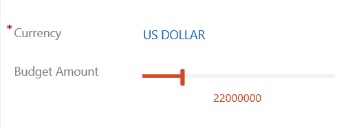
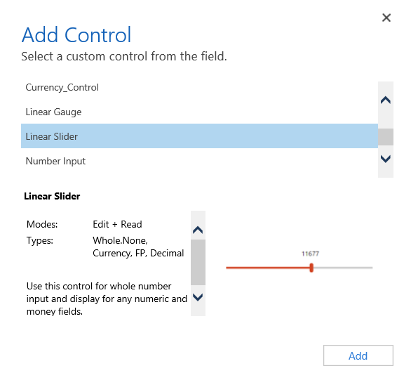
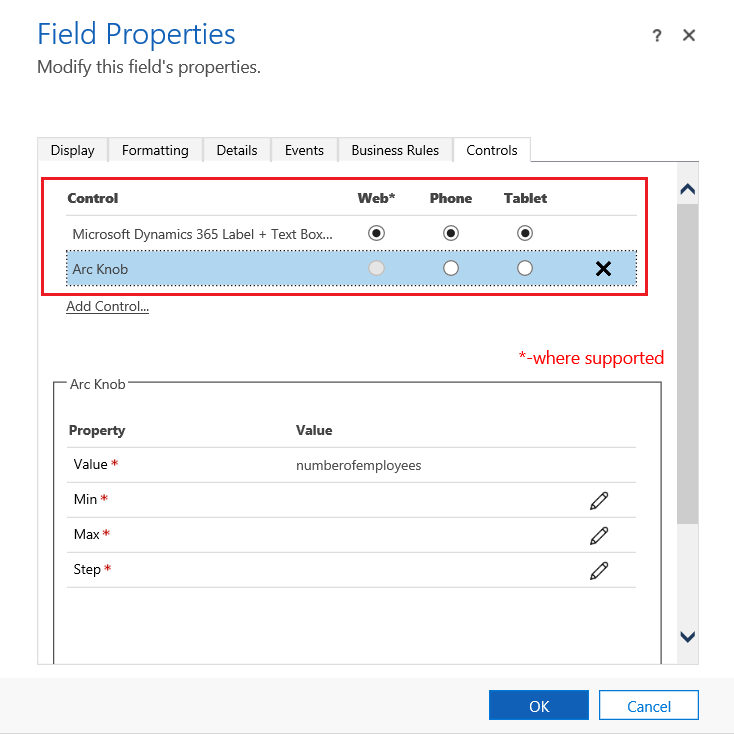
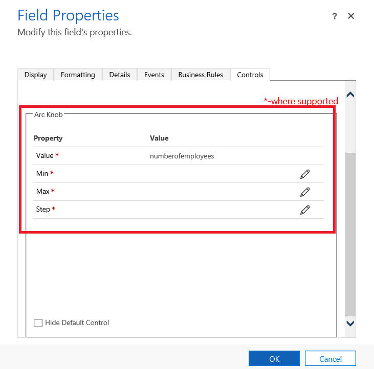

# Add code components to a column or table in model-driven apps

Code components let you transform columns that traditionally contain text into visualizations. Similarly, you can use code components to transform datasets, such as a view, to display in a more visual rendering rather than a list of records. Code components can appear as visualizations on forms, dashboards, views, and homepage grids. 

[!INCLUDE[cc-terminology](../data-platform/includes/cc-terminology.md)]

   > [!div class="mx-imgBorder"] 
   > 

## Add a code component to a column

Following the steps below will change the default label and text box column of the **Budget Amount** column to the slider code component on the Opportunity table. You can use similar steps to replace an existing column with a code component or configure a code component for a custom column.

1. Navigate to **Settings** > **Customizations** > **Customize the System**.

2. Expand **Entities**, expand the table that you want, such as the **Opportunity** table, select **Forms**, and then open a form such as the **Main** form.

3. In the form editor, double-click the column where you want to add a code component, such as the **Budget Amount** column on the opportunity main form. You can also create a custom column.

4. On the **Field Properties** page, select the **Controls** tab, and then select **Add Control**.

5. On the Add Control page, select the component that you want, such as the **Linear Slider** component, and then select **Add**.

   > [!div class="mx-imgBorder"] 
   > 

6. Choose the client where you want the component to appear.

   - **Web**. To make the code component available from any web browser, select the Web option next to the component. Notice that setting the Web option includes rendering the component in web browsers on PCs, Macs, and mobile devices.

   - **Phone**. To make the code component available on phones running Dynamics 365 for phones, select the Phone option next to the component.

   - **Tablet**. To make the code component available on tablet devices running Dynamics 365 for tablets, select the Tablet option next to the component.

   > [!div class="mx-imgBorder"] 
   >  

7. Select the pencil icon next to **Min**, **Max**, and **Step**, set the property option, and then select **OK**.  
   
   > [!div class="mx-imgBorder"] 
   > 

   - **Min**. Set the minimum accepted value. You can bind a static value that you enter or bind the value to an existing column. In this example **Bind to static value** is **Currency** and the minimum value that can be entered is *zero*.  
  
       - **Bind to a static value**. Select the data type, such as a whole number (Whole.None), currency, floating point (FP), or decimal. Next, enter a number that represents the minimum accepted value for the column.  
  
       - **Bind to values on a field**. Select a column from the list that will be used as the minimum accepted value.  
  
   - **Max**. Set the maximum accepted value for the column. Similar to the Min value, you can bind a static value that you enter or bind the value to an existing column as described earlier. In this example, **Bind to static value** is **Currency** and the maximum value that can be entered is **1 billion**.  
  
   - **Step**. This represents the unit to increment or decrement when adding to or subtracting from  the current value. For example, for budget amount you can select 100 dollar increments\decrements.  
  
   - **Hide Default Control**. Hides the component so neither the component nor the data is displayed in any of the clients that don't support the code component.   
  
8. Select **OK**, to close the Field Properties page.  
  
9. To activate the customization, on the table form select **Save**, and then select **Publish**.  
  
10. Select **Save and Close** to close the form editor.  
  
## Add code component to a table

To add a code component like dataset component or simple table component to a grid or view, follow the steps below:

  - Navigate to **Settings > Customizations** and click on **Customize the System**.
  - Click on the arrow next to **Entities** tab a select the table you want to add the code component. 
  - Click on the **Controls** tab and click on **Add a control**.
  - On the Add Control page, select the component that you want, such as Simple Table component and then select **Add**.
  - Choose the client where you want the component to appear.

## See the code component in action  

 Open a record that includes the column with the code component, such as the Opportunity form from the previous example, and view how the column is changed. The column is now rendered as a slider component instead of the text column.  

> [!div class="mx-imgBorder"] 
>   

### See also

[Implementing components in TypeScript](implementing-controls-using-typescript.md) 
[Power Apps component framework API reference](reference/index.md) 
[Power Apps component framework overview](overview.md)

[!INCLUDE[footer-include](../../includes/footer-banner.md)]