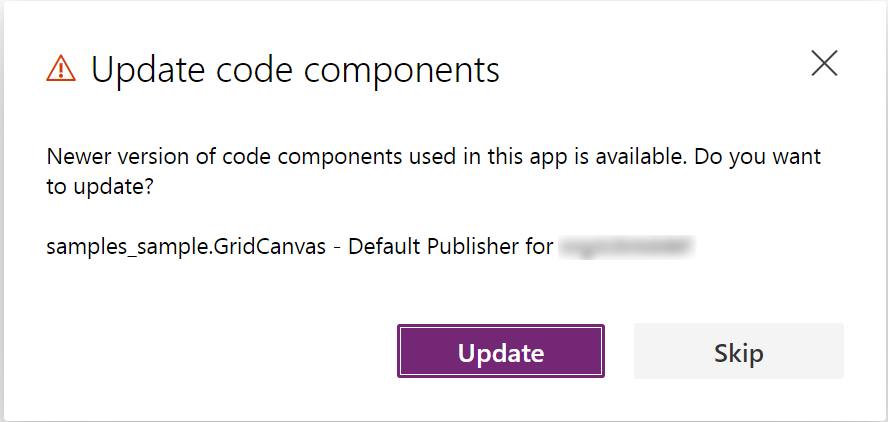

# Code components application lifecycle management (ALM)

ALM is a term used to describe the lifecycle management of software applications, which includes development, maintenance, and governance. More information: [Application lifecycle management (ALM) with Microsoft Power Platform](/power-platform/alm/overview-alm).

This article describes how to manage specific aspects of the lifecycle management from the perspective of code components in Microsoft Dataverse:

1. [Development and debugging ALM considerations](#development-and-debugging-alm-considerations)

2. [Code component solution strategies](#code-component-solution-strategies)

3. [Versioning and deploying updates](#versioning-and-deploying-updates)

4. [Canvas apps ALM considerations](#canvas-apps-alm-considerations)

## Development and debugging ALM considerations

When developing code components, you would be following the steps mentioned below:

1. Create code component project (`pcfproj`) from a template using `pac pcf init`. More information: [Create and build a code component](create-custom-controls-using-pcf.md).
2. Implement code component logic. More information: [Component implementation](control-implementation-library.md).
3. Debug the code component using the local test harness. More information: [Debug code components](debugging-custom-controls.md) for information on debugging techniques and best practices.
4. Create a solution project (`cdsproj`) and add the code component project as a reference. More information: [Package a code component](import-custom-controls.md).
5. Build the code component in **release** mode for distribution and deployment. 

When your code component is ready for testing inside a model-driven app, canvas app or portal, there are two ways to deploy a code component to Dataverse:

1. `pac pcf push`: This deploys the code component to a temporary **PowerAppsTools** solution. This deploys a single code component at a time.

2. Using `pac solution init` and `msbuild` to build a `cdsproj` solution project that has references to one or more code components. Each code component is added to the `cdsproj` using `pac solution add-reference`. A solution project can contain references to multiple code components, whereas code component projects may only contain a single code component.

   The following diagram shows the one-to-many relationship between `cdsproj` and `pcfproj` projects:

    > [!div class="mx-imgBorder"]
    > 

More information: [Package a code component](import-custom-controls.md#package-a-code-component)

## Building pcfproj code component projects

When building `pcfproj` projects, the generated JavaScript depends on the command used to build and the `PcfBuildMode` in the `pcfproj` file.

You don't normally deploy a code component into Microsoft Dataverse that has been built in development mode since it can often be too large to import and may result in slower runtime performance. More information: [Debugging after deploying into Microsoft Dataverse using Fiddler](debugging-custom-controls.md#debugging-after-deploying-into-microsoft-dataverse-using-fiddler) 

For `pac pcf push` to result in a release build, the `PcfBuildMode` is set inside the `pcfproj` by adding a new element under the `OutputPath` element as follows:

```xml
<PropertyGroup>
   <Name>my-control</Name>
   <ProjectGuid>6aaf0d27-ec8b-471e-9ed4-7b3bbc35bbab</ProjectGuid>
   <OutputPath>$(MSBuildThisFileDirectory)out\controls</OutputPath>
   <PcfBuildMode>production</PcfBuildMode>
</PropertyGroup>
```

The following table shows which commands result in development vs. release builds:

| Build command used on `pcfproj` | Development Build<br />(debug purposes only)                 | Release Build                                                |
| ------------------------------- | ------------------------------------------------------------ | ------------------------------------------------------------ |
| `npm start watch`               | Always                                                       |                                                              |
| `pac pcf push`                  | Default behavior or when `PcfBuildMode` is set to **development** in the `pcfproj` file  | `PcfBuildMode` is set to **production** in the `pcfproj` file |
| `npm run build`                 | Default behavior                                            | `npm run build -- --buildMode production`                       |

More information: [Package a code component](import-custom-controls.md#package-a-code-component)

## Building .cdsproj solution projects

When building a solution project (`.cdsproj`), you have an option to generate the output as unmanaged or managed solution. Managed solutions are used to deploy to any environment that isn't a development environment for that solution. This includes test, UAT, SIT, and production environments. More information: [Managed and unmanaged solutions](/power-platform/alm/solution-concepts-alm#managed-and-unmanaged-solutions).

The `SolutionPackagerType` is included in the `.cdsproj` file created by `pac solution init,` but initially commented out. Uncomment the section and set to **Managed**, **Unmanaged** or **Both**. 

```xml
 <!-- Solution Packager overrides, un-comment to use: SolutionPackagerType (Managed, Unmanaged, Both) -->
 <PropertyGroup>
    <SolutionPackageType>Managed</SolutionPackageType>
 </PropertyGroup>
```

The following table shows which command and configuration results in development vs. release builds.

| Build command used on  `cdsproj` | `SolutionPackageType` | Output                                              |
| ------------------------------------ | --------------------- | --------------------------------------------------- |
| `msbuild`                            | Managed               | **Development** build inside **Managed** Solution   |
| `msbuild /p:configuration=Release`   | Managed               | **Release** build inside **Managed** Solution       |
| `msbuild`                            | Unmanaged             | **Development** build inside **Unmanaged** Solution |
| `msbuild /p:configuration=Release`   | Unmanaged             | **Release** build inside **Unmanaged** Solution     |

More information: [Package a code component](import-custom-controls.md#package-a-code-component).

## Source code control with code components

When developing code components, it is recommended that you use a source code control provider such as **Azure DevOps** or **GitHub**. When committing changes using git source control the `.gitignore` file provided by the `pac pcf init` template will ensure that some files are not added to the source control, because they are either restored by `npm` or are generated as part of the build process:

```
# dependencies
/node_modules

# generated directory
**/generated

# output directory
/out

# msbuild output directories
/bin
/obj
```

Since the `/out` folder is excluded, the resulting `bundle.js` file (and related resources) built will not be added to source control. When your code components are built manually or as part of an automated build pipeline, the `bundle.js` would be built using the latest code to ensure that all changes are included. 

Additionally, when a solution is built, any association solution zip files would not be committed to source control - instead, the output would be published as binary release artifacts.

## Using Solution Packager with code components

In addition to source controlling the `pcfproj` and `cdsproj`, **[Solution Packager](/power-platform/alm/solution-packager-tool)** may be used to incrementally unpack a solution into its respective parts as a series of XML files that can be committed into source control. This has the advantage of creating a complete picture of your metadata in the human-readable format so that you can track changes using **Pull Requests** or similar. Each time when a change is made to the environment's solution metadata, Solution Packager is used to unpack and the changes can be viewed as a change set. 

> [!NOTE]
> At this time, SolutionPackager differs from using `pac solution clone` in that it can be used incrementally to export changes from a Dataverse solution.

If you are combining code components with other solution elements like tables, model-driven, and canvas apps you would normally not need the `cdsproj` project build, but instead, you would move the built artifacts from the `pcfproj` into the solution package folder before repacking it for import.

Once a solution that contains a code component is unpacked using `SolutionPackager /action: Extract`, it will look similar to:

```
.
├── Controls
│   └── prefix_namespace.ControlName
│       ├── bundle.js *
│       └── css
│       	└── ControlName.css *
│       ├── ControlManifest.xml *
│       └── ControlManifest.xml.data.xml
├── Entities
│   └── Contact
│       ├── FormXml
│       │   └── main
│       │       └── {3d60f361-84c5-eb11-bacc-000d3a9d0f1d}.xml
│       ├── Entity.xml
│       └── RibbonDiff.xml
└── Other
    ├── Customizations.xml
    └── Solution.xml
```

You can see under the `Controls` folder, there are subfolders for each code component included in the solution. The other folders contain additional solution components added to the solution. 

When committing this folder structure to the source control, you would exclude the files marked with an asterix (*) above, because they will be output when the `pcfproj` project is built for the corresponding component.

The only files that are required are the `*.data.xml` files since they contain metadata that describes the resources required by the packaging process. After each code component is built, the files in the `out` folder are copied over into the respective control folder in the Solution Packager folders. Once the build outputs have been added, the package folders contain all the data required to repack into a Dataverse solution using `SolutionPackager /action: Pack`.

More information: [SolutionPackager command-line arguments](/power-platform/alm/solution-packager-tool#solutionpackager-command-line-arguments) .

## Code component solution strategies

Code components are deployed to downstream environments using Dataverse solutions. Once deployed to your development environment they can be deployed in the same way as other solution components. More information: [Solution concepts - Power Platform](/power-platform/alm/solution-concepts-alm)

There are two strategies for deploying code components inside solutions:

1. **Segmented Solutions** - A solution project is created using `pac solution init` and then using `pac solution add-reference` to add one or more code components. This solution can then be exported and imported into downstream environments and other segmented solutions will take a dependency on the code component solution such that it must be deployed into that environment first. This is referred to a solution segmenting because the overall functionality is split between different solution segments and layers, with inter-dependencies being tracked by the solution framework. If using this approach, you will likely need multiple development environments - one for each segmented solution. More information: [Use segmented solutions in Power Apps](/power-platform/alm/segmented-solutions-alm)
2. **Single Solution** - A single solution is created inside a Dataverse environment and then code components are added along with other solution components (such as tables, model-driven, or canvas apps) that in turn reference those code components. This solution can be exported and imported into downstream environments without any inter-solution dependencies. With this approach, code and environment branching become important so that you can deploy an update to one part of the solution without taking changes that are being made in another area. More information: [Branch and merging strategy with Microsoft Power Platform](/power-platform/alm/basics-alm#branching-and-merging-strategy)

Reasons for adopting a segmented solution approach over a mixed single solution approach might be:

1. **Versioning lifecycle** - You want to develop, deploy, and version control your code components on a separate lifecycle to the other parts of your solution. This is a common scenario where you have a 'fusion team', where code components built by developers are being consumed by app makers. Typically, this would also mean that your code components would exist in a different code repository to other solution components.

2. **Shared use** - You want to share your code components between multiple environments and therefore do not want to couple your code components with any other solution components. This could be if you are an ISV or developing a code component for use by different parts of your organization that each has its own environment. 

The following diagram shows an overview of the solution lifecycle for these two approaches:

> [!div class="mx-imgBorder"]
> 

The diagram describes the following points:

1. **Push using PAC CLI** - When the code component is ready for testing inside Dataverse, `pac pcf push` is used to deploy to a development environment. This creates an unmanaged solution named **PowerAppsTools_namespace**, where *namespace* is the namespace prefix of the solution provider you want to use to deploy your code component under. The solution provider should already exists in the target environment must have the same as the namespace prefix you want to use for downstream environments. After deployment, you can add your code component to model-driven or canvas apps for testing. 

   > [!NOTE]
   > As describe above, it is important to configure the code component `cdsproj` for production build so that you deploy the code optimized for production rather than development.

2. **Add existing code components** (after PAC CLI deployment) - If you are using the single solution approach, once deployed, the code component can be added to another solution (that must share the same solution publisher as used by the **PowerAppsTools** solution)
   
   > [!div class="mx-imgBorder"]
   > 
   
3. **Build unmanaged solution project** - If you are using solution `cdsproj` projects, then an unmanaged solution can be built using `msbuild`, and then imported into your development environment.

4. **Add existing code components** (after solution project deployment) - Much in the same way as after `pac pcf push`, code components that are imported from a solution project build may be added to a mixed solution provided the same solution publisher prefix was used.

5. **Export single solution as managed** - The single mixed component solution can then be exported as managed and imported into the downstream environments. Since the code components and other solution components are deployed in the same solution, they all share the same solution and versioning strategy. 

6. **Export code component segmented solution as managed** - If you are using the segmented solution approach, you can export your code component solution project as managed into downstream environments.

7. **Build code component segmented solution as managed** - If you are using segmented solutions and have no need for an unmanaged solution, you can build the solution project directly as a managed solution using `msbuild /p:configuration=Release` . This can then be imported into environments that need to take a dependency on its code components.

8. **Consume segmented code component solution -** Once code components are deployed via a managed segmented solution, other solutions can be built, taking a dependency on the code component solution. The dependencies on code components will be listed in the solution's `MissingDependencies` section of type 66. More information: [Dependency tracking for solution components](/power-platform/alm/dependency-tracking-solution-components).

9. **Deploy code component segmented solution before solutions that use it** - When importing solutions that take dependencies on segmented code component solution, the code component solution must be installed on the target environment before it can be imported.

More information: [Package and distribute extensions using solutions](/powerapps/developer/data-platform/introduction-solutions).

## Code components and automated build pipelines

In addition to manually building and deploying your code component solutions, you can also build and package your code components using automated build pipelines.

- If you are using **Azure DevOps**, you can use the [Microsoft Power Platform Build Tools](https://aka.ms/buildtoolsdoc) for Azure DevOps.
- If you are using **GitHub**, you can use the [Power Platform GitHub Actions](https://aka.ms/PowerActionsDocs).

Some of the advantages using automated build pipelines are:

- **Timely** - removing the manual tasks makes the tasks of building and packaging your component quicker so that it can be done more regularly such as every time a change is checked in.
- **Repeatable** - once the build process is automated, it will be performed the same every time, and therefore not dependent on the member of the team who performs the build.
- **Versioning consistency** - when the build pipeline automatically sets the version of your code component and the solution you can have confidence that when a new build is created, it is versioned consistently relative to previous versions. This facilitates tracking of features, bug fixes, and deployments.
- **Maintainable** - since everything that is needed to build your solution is contained from inside source control, you can always create new branches and development environments by checking out the code. When you are ready to deploy an update, Pull Requests can be merged into downstream branches. More information: [Branch and merging strategy with Microsoft Power Platform](/power-platform/alm/basics-alm#branching-and-merging-strategy).

As described above, there are two approaches to solution management of code components, a segmented solution projects, or a single mixed solution containing other artifacts such as model-driven apps, canvas apps, and tables to which the code components are added.

If you are using the segmented code component solution project, then you can build the project inside a **Azure DevOps Pipeline** (using [Microsoft Power Platform Build Tools](https://marketplace.visualstudio.com/items?itemName=microsoft-IsvExpTools.PowerPlatform-BuildTools)) or **GitHub Pipeline** (using [GitHub Actions for Microsoft Power Platform](/power-platform/alm/devops-github-available-actions)). Each code component `pcfproj` folder is added to source control (excluding the `generated`, `out` and `node_modules` folders), a `cdsproj` project is created and each code component is referenced using `pac solution add-reference` before also adding to source control. The pipeline would then perform the following:

1. Update the solution version in the `Solution.xml` file to match the version of your build. The solution version is held in the `ImportExportXml`/`Version` attribute. See below for details on versioning strategies.
2. Update the code component version in the `ControlManifest.Input.xml` file. The version is stored in the `manifest`/`control`/`version` attribute. This should be done for all of the `pcfproj` projects that are built.
3. Run a `MSBuild` task with the argument`/restore /p:configuration=Release` using a wildcard `*.cdsproj`. This will build all of the `cdsproj` projects and their referenced `pcfproj` projects. 
4. Collect the built solution zip into the pipeline release artifacts. This solution will contain all code components included as references in the `cdsproj`.


If you are using a mixed solution that contains other components in addition to code components, then this would be extracted into Source control using **Solution Packager** as described above. Your pipeline would then perform the following:

1. Update the solution and code component versions in the same way as described above.
2. Install Microsoft Power Platform Build Tools into the build pipeline using the `PowerPlatformToolInstaller` task.
3. Restore `node_modules` using an`Npm` task with the command `ci`. 
4. Build code components in production release mode using an `Npm` task with a `customCommand` parameter of`run build -- --buildMode release`.
5. Copy the output of the build into the solution packager folder for the corresponding control.
6. Package the solution using the Power Platform Build Tools `PowerPlatformPackSolution` task
7. Collect the built solution zip into the pipeline release artifacts.

It is recommended that you commit your unpacked solution metadata to source control in it's unmanaged form to allow the creation of a development environment at any later stage. If only managed solution metadata was committed, it would make it hard to create new development environments. You have two options to do this:

1. Commit both managed and unmanaged using the `/packagetype:Both` option of Solution Packager. This allows packing in either manager or unmanaged mode but has the disadvantage of duplication inside source code such that changes will often appear in multiple xml files - both the managed and unmanaged version.
2. Only commit unmanaged to source control (resulting in cleaner change sets), and then inside the build pipeline import the packaged solution into a build environment so that it can then be exported as managed to convert it into a managed deployment artifact. 

## Versioning and deploying updates

When deploying and updating your code components, it is important to have a consistent versioning strategy so that you can:

1. Track which version is deployed against the features/fixes it contains.
2. Ensure canvas apps can detect that they need to update to the latest version.
3. So that model-driven apps will invalidate their cache and load the new version.

A common versioning strategy is [semantic versioning](https://semver.org/) which has the format: `MAJOR.MINOR.PATCH`.

## Incrementing the PATCH version

The `ControlManifest.Input.xml` stores the code component version in the control element:

```xml
<control namespace="..." constructor="..." version="1.0.0" display-name-key="..." description-key="..." control-type="...">
```

When deploying an update to a code component, the version in the `ControlManifest.Input.xml` must at minimum have its PATH (that is the last part of the version) incremented for the change to be detected. This can be done either manually by editing the version attribute directly or by using the following command to advance the patch version by one:

`pac pcf version --strategy manifest`

Alternatively, to specify an exact value for the patch part (for example, as part of an automated build pipeline) use:

`pac pcf version --patchversion <PATCH VERSION>`

More information: [pac pcf version](/powerapps/developer/data-platform/powerapps-cli#pcf ).

## When to increment the MAJOR and MINOR version

It is recommended that the Major and Minor version of the code component's version are kept in sync with the Dataverse solution it is distributed using. For example:

1. Your deployed code component version is `1.0.0` and your solution version is `1.0.0.0`.
2. You make a small update to your code component and increment the patch version on the code component to `1.0.1` using `pac pcf version --strategy manifest`.
3. When packaging the code component for deployment, the solution version in `Solution.xml` is updated to be 1.0.0.1 - or the version is incremented automatically by manually exporting the solution.
4. You make significant changes to your solution such that you want to increment the major and minor version to 1.1.0.0.
5. In this case, the code component version also can be updated to be 1.1.0.

[Dataverse solutions has four parts](/powerapps/maker/data-platform/update-solutions#understanding-version-numbers-for-updates) and it can be thought of as the following structure:`MAJOR.MINOR.BUILD.REVISION`.

If you are using **AzureDevOps**, you can set your build pipeline versioning using the `Build` and `Rev` environment variables ([Run (build) number - Azure Pipelines](/azure/devops/pipelines/process/run-number?view=azure-devops&tabs=yaml)) and use PowerShell script similar to the approach described in the article [Use PowerShell scripts to customize pipelines](/azure/devops/pipelines/scripts/powershell?view=azure-devops&tabs=yaml#example-powershell-script-version-assemblies).

| Semantic version part | ControlManifest.Input.xml version part<br />`MAJOR.MINOR.PATCH` | Solution.xml version part<br />`MAJOR.MINOR.BUILD.REVISION` | AzureDevOps Build Version                                    |
| --------------------- | ------------------------------------------------------------ | ----------------------------------------------------------- | ------------------------------------------------------------ |
| MAJOR                 | MAJOR                                                        | MAJOR                                                       | Set using Pipeline Variable `$(majorVersion)` or use the value last committed to source control. |
| MINOR                 | MINOR                                                        | MINOR                                                       | Set using Pipeline Variable `$(minorVersion)` or use the value last committed to source control. |
| ---                   | ---                                                          | BUILD                                                       | `$(Build.BuildId)`                                           |
| PATCH                 | PATCH                                                        | REVISION                                                    | `$(Rev:r)`                                                   |

## Canvas apps ALM considerations

Consuming code components in canvas apps is different from model-driven apps that the code component must be explicitly added to the app using **Get more components** located on the **Insert** panel. Once a code component is added to the canvas app, it is included as the content inside the app definition. To update to a new version of a code component after it is deployed (and the control version incremented), the app maker must first open the app in maker studio and select **Update** when prompted on the **Update code components** dialog. The app must be then saved and published for the new version to be used when the app is played by users.

> [!div class="mx-imgBorder"]
> 

If the app is not updated or **Skip** is used, the app will continue to use the older version of the code component even though it does not exist in the environment since it has been overwritten by the newer version. 

Since the app contains a copy of the code component, is therefore possible to have different versions of the code components running side by side in a single environment from inside different canvas apps, however, you cannot have different versions of a code component running side by side in the same app. It is recommended that app makers are encouraged to update their apps to the latest version of code components when a new version is deployed.

> [!NOTE]
> Although at this time you can import a canvas app without the matching code component being deployed to that environment, it is recommended that you always ensure that the apps are updated to use the latest version of the code components and that the same version is deployed to that environment first or as part of the same solution.

### Related articles

[Application lifecycle management (ALM) with Microsoft Power Platform](/power-platform/alm/overview-alm)<br/>
[Power Apps component framework API reference](reference/index.md)<br/>
[Create your first component](implementing-controls-using-typescript.md)<br/>
[Debug code components](debugging-custom-controls.md)<br/>

[!INCLUDE[footer-include](../../includes/footer-banner.md)]
